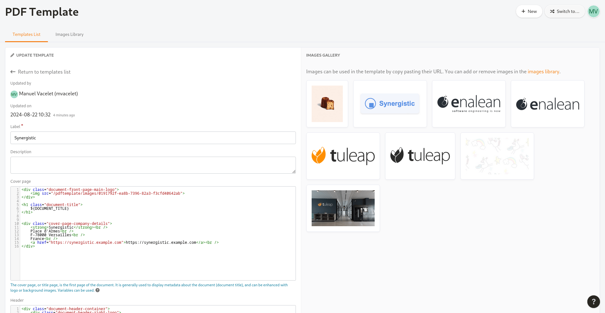

:orphan:

.. _pdf_template:

PDF Template
------------

.. attention::

  This module is part of :ref:`Tuleap Enterprise <tuleap-enterprise>`. It might
  not be available on your installation of Tuleap.

PDF Template plugin allows to export documents to PDF using platform defined templates. Export to PDF is supported for:

* :ref:`Artidoc <artidoc>`

Template definition
===================

The management of templates can be done by site administrator with the "PDF template" link in plugin section of site administration area.

It's also possible to delegate the management of templates to regular users via the :ref:`permission delegation mechanism <permissions_delegation>`. 
However there is not yet a path in the user interface to get access to the page and users must manually type the URL "/pdftemplate/admin".

   Definition of a PDF template

A template defines 4 elements:

* The cover page
* The page header
* The page footer
* The general styling

The 3 first elements are HTML and the last one is CSS.

You can also upload images that will be embedded into the final document (eg. logo for the front page or headers).

There is a preview mechanism on the template definition page to ease the development process.

Templates are available to all projects.

Technical considerations and limitations
========================================

The PDF generation is based on the "Print" capabilities of end users browser. Users are expected to use "Save as PDF" to get their document.

The print capabilities of browsers is not even and difference may happens when you export using chrome or firefox for instance.

Known limitations:

* It's not possible to have page numbers.
* Table of contents has no links in Firefox because links points to the web page instead of inside the document.
* Chrome (edge, brave, vivaldi, etc) sometimes mess-up headers and footers.
