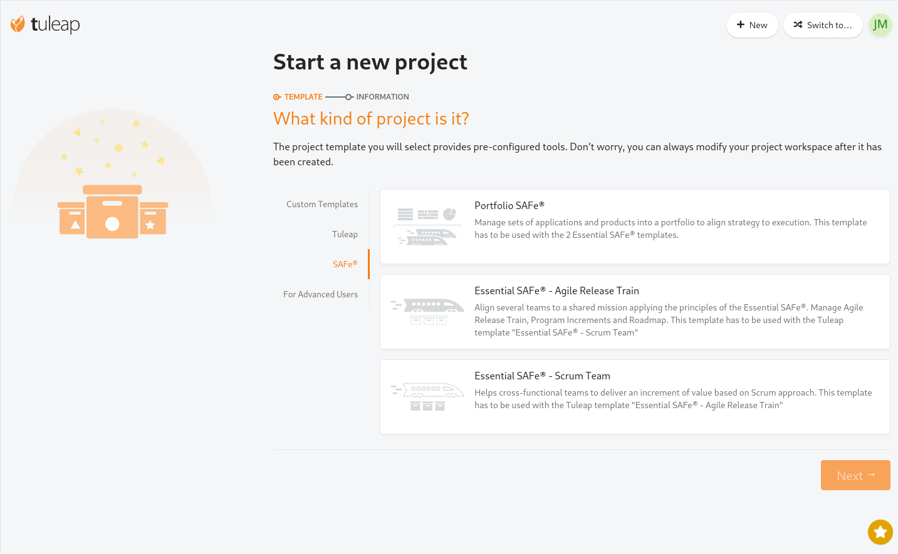
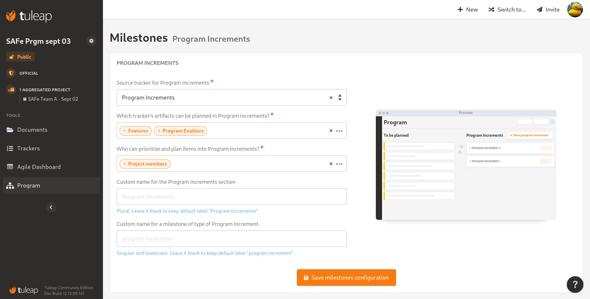

.. _program-management:

Program management
------------------

.. attention::

    This module is part of :ref:`Tuleap Enterprise <tuleap-enterprise>`. It might
    not be available on your installation of Tuleap.

Program Management plugin brings multi project backlog management as well as teams synchronisation. Program Management
can be adapted to any methodology and comes with templates for fast and easy on boarding.

If you are looking for documentation on how to use Program Management, the first part covers the available templates and
how to use them.

The second part, :ref:`program_management_how_it_works`, targets people who need to adapt
projects for their own use case or even create your own templates.

Last introduction words: Program Management plugin is meant to be methodology agnostic. While it has been designed primarily
for implementation of SAFe® it can be used for Scrum of Scrum or "home made not yet fully agile" process.

.. note::

    Program Management requires installation of ``plugin-program_management`` RPM followed by activation of ``program_management``
    plugin at Tuleap site administration level.

Usage of SAFe® templates
========================

`Scaled Agile Framework (SAFe®) <https://scaledagileframework.com/about/>`_ is a process framework for the management
for large scale products and programs.

In the context of Tuleap, that means many different projects (Teams) that work together, synchronised, on a shared backlog.

If you are working in a single team setup, the regular :ref:`Scrum <backlog>` setup is probably enough. However if
your product is big enough to require several Scrum teams that work together, the SAFe® templates might be for you.

Disclaimer: this section contains a lot of SAFe® jargon and is written for people who already know, at least with a high
level view, the framework, the terms & wording.

Overview
########

	Tuleap SAFe® templates

In order to implement SAFe® with Tuleap you will need separated workspace (projects). The easiest way to start is to create
those new workspaces with the provided templates but it's also possible to adapt an existing workspace.

Tuleap provides three types of templates for workspaces:

* Portfolio SAFe®
* Essential SAFe® - Agile Release Train
* Essential SAFe® - Scrum Team

A *Program* is meant to aggregate the work done in several *Scrum Teams*. There is no limits in the number of teams that
can be aggregated to a given *Program*.

This is a two levels setup so it's not possible to aggregate a *Program* in another *Program*.

Agile Release Train (ART)
#########################

Inside an Agile Release Train workspace, the Agile Product Delivery team gathers and consolidates the Backlog of the product.

The Backlog is made of *Features* and *Program Enablers*. It corresponds to two different :ref:`Tuleap Trackers <trackers>` but they behave the
same way so in the following section we will only speak about *Features*.

*Features* will be planned in a *Program Increment* thanks to *Program* service. If you are already familiar with Tuleap
:ref:`Scrum Backlog <backlog>`, it works the same way.

*Features* are broken down in *User Stories*. The *User Stories* are created in their respective *Scrum Team* workspace.

*Program Increment* are automatically replicated in *Scrum Team* workspaces. When the Agile Product Delivery team creates
a new *Program Increment* in the ART Backlog, a new *Program Increment* will be created in each *Scrum Team* attached to the ART.
Those "mirrored" *Program Increment* will share the same name, description, status and dates.

A *Feature* typical lifecycle is:

- To be created for Analysis
- During Analysis phase, each *Scrum Team* involved in the definition of the feature should create, **in their workspace** *User Stories* that corresponds to this *Feature* (must be created as child)
- After Analysis and estimations at *Team* level, Agile Product Delivery team can move the *Feature* to Plan.
- When ready to Plan, the *Feature* appears in Program's Backlog and can be scheduled in a *Program Increment*.
- When the *Feature* is scheduled in a *Program Increment*, the corresponding *User Stories* are scheduled in the "mirrored" *Program Increment* of each *Scrum Team*.

Scrum Team
##########

The *Scrum Team* template is more or less a regular *Scrum* template but with some adaptations to integrate automatically
with *Agile Release Train* template and to use the same SAFe® jargon.

In a *Scrum Team* workspace, the team members will be able to:

- Create the *User stories* and attach them to the *Features* defined in the *Agile Release Train*
- Automatically get the *Program Increments* defined in the *ART*
- Automatically plan their *User Stories* that correspond to the *Features* planned in the *ART Program Increment*

Apart from the *Program Increment* and *Features*, the *Scrum Team* is fully independent from the *Agile Release Train* workspace:

- The team can fully re-organise & adapt it's trackers (User Stories, Program Increment, etc) to its own usage.
- The team can create it's own releases, not linked to a *Program Increment* (useful for a Team that is a service provider).
- Each team can have it's own estimation logic (Fibonacci, T-shirt size, no estimate, etc).

.. note::

    As of Tuleap 13.0, synchronised Iterations between ART and Scrum Teams are still under development. However, you
    can manually create Iterations below *Program Increments* in each *Scrum Team* to plan *User Stories*.

.. _program_management_how_it_works:

How Program Management works?
=============================

At the heart of Program Management is the transparent backlog items and milestones management across projects. Key concepts are:

- Program: the Tuleap project that will coordinate the activities.
- Aggregated Projects: Tuleap projects where the work of each Team is done.
- Milestones: period of time, defined by artifacts of one tracker of Program project (e.g. Program Increment, Releases, etc).
- Backlog Items: high level pieces of work. They come from at least one tracker of Program project (e.g. Features, Themes, Enablers, etc).

The following section details each of those concepts and how they assemble together to make the whole Program Management thing.

Program Projects
################

A Program is a Tuleap Project that has:

- The Program service activated
- At least one other project Aggregated

A project can be aggregated from the Program administration.

There are no limits in the number of projects that can be aggregated nor pre-conditions except:

- the aggregated project cannot be another Program.
- the user who wants to aggregate a project must be Project Administrator of it.
- the aggregated project doesn't have :ref:`backlog` usage. It's actually possible to aggregate it but it won't do anything useful.

A Program project cannot activate the :ref:`backlog` service. Similarly, a project that is using :ref:`backlog` cannot
activate Program service.

Aggregated Projects
###################

A project can be aggregated to any number of Program (except Programs that cannot be aggregated at all). In practice it
only make sense to aggregate project that make usage of :ref:`backlog`.

Each aggregated project is independent from the Program(s) it is aggregated with. That means that teams can customise
their workspace as much as they want as long as they keep the synchronizations elements details in the sections hereafter.

Milestones
##########

A milestone is an artifact from tracker that will define that something is worked on for a period of time. This tracker
should have the following :ref:`semantics <tracker-semantic>`:

- Title
- Description
- Duration
- Status

When a milestone is created or updated in a Program, the milestone is replicated in all aggregated projects. Those replicated
milestones are called Mirrored Milestones.
This means there are a set of constraints on Milestone trackers of aggregated projects:

- The milestone will be created in the higher level Planning defined in :ref:`Scrum Backlog <backlog>` configuration.
- This tracker must have following semantics defined: Title, Description, Duration (with same configuration) and Status (with same status values).
- The user who wants to create the Milestone must have "Submit" permission on the fields associated with the semantics as well as "artifact link" field.

Apart from those constraints, each team can tweak its tracker with team related fields.

Backlog Items
#############

Backlog Items are artifacts from trackers defined to be planned in Milestones in Program configuration. Typically it's
high level kind of requirements like epics, themes, features, etc. Backlog Items are meant to be broken down in smaller pieces,
Children Items, like User Stories, in Aggregated Projects.

Backlog Items will appear in Program's Backlog at some point of their life thanks to "explicit backlog" mechanism:

- either by adding it explicitly with the "Add to backlog" action in the artifact view,
- or by configuring a Workflow transition that will move the artifact in the Backlog when the artifact reaches a given status.

When a user plans a Backlog Item in a Milestone in Program's Backlog, the Children Items in each aggregated projects are
planned in Mirrored Milestones.
