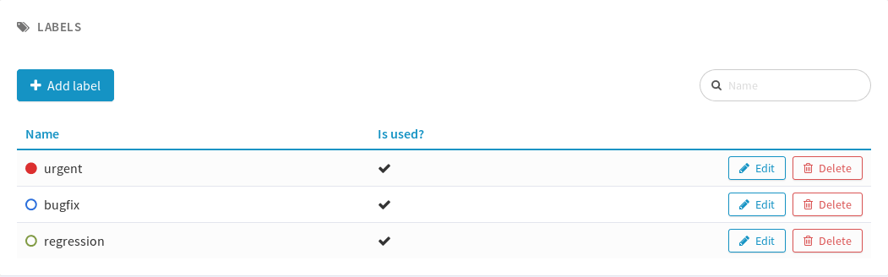

.. _project-administration:

Project Administration
======================

Whenever you enter the Project Dashboard of a given project or any of
its service you'll see a menu item called Admin appears in the project
menu.

Only site or project administrators can access the Project Administration page.
All other Tuleap users are denied access to this part of a project.

Project Details
---------------

This section presents the general information about your project such as its name, its description, its visibility...

.. figure:: ../images/screenshots/project-admin/project-details.png
    :align: center
    :alt: Project administration homepage
    :name: Project administration homepage

.. _project-type:

Project Type
````````````

Tuleap proposes three types of projects, that can be modified only by a site administrator:

-  **Project**: This is the type of standard projects hosted on
   Tuleap.

-  **Template Project**: If you choose this project type new projects
   can reuse this projects service configuration. When registering a new
   project (see :ref:`project-registration`) your template project is listed as available
   template.

-  **Test Project**: If you just need to test what is feasible with
   Tuleap projects use the Test Project type for your
   project. Having defined that type, your project will not appear any
   more in the Tuleap Software Map.

Project Visibility
``````````````````

Site administrator can allow project administrator to change project visibility.

If you have the change visibility permission, you can change your project visibility at any time.
Each time you update it, you must accept the Term Of Service of platform.


Members
-------

Deals with project members administration.

.. figure:: ../images/screenshots/project-admin/members.png
    :align: center
    :alt: Members home page
    :name: Members home page

Add a user
``````````

Use the select box to add a user to the project members list.

Import a list of users
``````````````````````
If the number of users to add is important, you can import a list of users
from a simple text file. In order to do it, click on "Import Members".
Then, select a file containing the list of users you want to import. The file will
host one user per line, by specifying her email address, or her username (login name).

::

    johnd
    steve.robinson@example.com

    bob.johnson@example.com
    smith3
    john.smith@example.com


.. NOTE::
    The import process has two steps. First, it checks if the file is well
    formatted, and it displays the users detected to be imported.
    After a confirmation, the import is done and users are added to the project.
    Users displayed in warning list are not imported.

Set binding directory
`````````````````````
You can bind your members to your enterprise directory group (LDAP, Active directory...).
Once your members are bound to an enterprise directory group, you are
still able to add non lined users to your project with the "Add members" button.

Removing a user
```````````````

To remove a project member, use "Remove from project button".

Revoking membership has absolutely no effect on the history and the data
integrity of the project. In other words all tracker artifacts assigned
or submitted by this person will continue to show up as before in the
project database. Only the ability of this person to perform project
management tasks is affected.

.. _user-groups:

User Groups
-----------

A user group, sometimes called a "ugroup ", is simply a group of
Tuleap users. User groups are used to set specific
permissions to some project data (e.g. software releases and packages -
see :ref:`package-modification`). A user group is always attached to a project, but the users
comprising the group do not necessarily belong to that project.

There are two different kinds of user groups:

Predefined Users groups
```````````````````````
These groups are defined for every project.
-  **Project Admin**: is a project member with absolutely all rights over the project services, project
deliverable and project members. Only Project Admin can access the project members permission page.
-  **Project Admin**: is a project member. He has read/write permissions
(depending on service configuration).
- **Wiki administrators**: has administration privilege over Wiki service
- **News administrators**: has administration privilege over News service
- **News writer**: can write news.

Examples of pre-defined groups: project\_admins, news administrators ...
Those groups are dynamic: if you assign some permission to 'project\_admins', and a new
project administrator is defined, then this new user will automatically
be granted the corresponding permission.
Those groups are not editable or removable, you can only manage their members.

**Custom User Groups** are defined by project administrators. They are
composed of a static list of users. The only requirement is that any
member must be a registered Tuleap user. This list can be
modified at any time, but will not automatically be updated, except if a
member is removed from the project or deleted from the system.

.. figure:: ../images/screenshots/project-admin/ugroup-list.png
    :align: center
    :alt: User group list
    :name: User group list


Creating a User Group
~~~~~~~~~~~~~~~~~~~~~

Click the "+ Add users group" button to add new custom ugroup.

.. NOTE::
    The create from dropdown is a quick way to pre-select group members.
    For instance if you choose Project members, your group will be created with
    all your project members by default.
    If you update your project members, it won't have any incidence
    on the user group you just created.

    Sometimes, you might want to grant some permissions to all project
    members and some other Tuleap users.
    In this case, you might be tempted to build a user group from project
    members and to add the other users to the group.
    It's a bad way to do this: we advise you to use project members group
    and a second group with the non project members you want to grant permission.
    Indeed if you just create a group with all members, it will be painful
    to maintain: new project members won't be automatically added to your
    custom group, each time new member is added to project you will have
    to update your custom group.


Deleting a User Group
~~~~~~~~~~~~~~~~~~~~~

User groups can be deleted. Click on the delete button next to the
group name in the group management page to suppress the user group
from the database. Only custom user groups can be deleted.

    .. IMPORTANT::

       Please note that if a user group was specifically granted some
       permission, deleting the user group might be dangerous. Indeed, if a
       group is the only one allowed to access a package and this group is
       deleted, the permission is also deleted and reset to default, so any
       registered user can access the package.


User Groups Management
``````````````````````

From the users groups list, you can access to details of each group and
can change settings or add/remove members.

- Group details: update group's name and description.
- Permissions delegation: delegate some specific permissions to users.
- Group binding: link the group to another one for easier membership management.
- Group members: add/remove members to this group.
- See permissions: list permissions granted to this group.

.. NOTE:: Only add/remove members is available for predefined users groups.

Permissions delegation
~~~~~~~~~~~~~~~~~~~~~~

You can delegate to a users group several permissions. All the members of this group will
take advantage of these permissions. Only the following permission is currently available:

- **Membership management**: allows members of the current group to add/remove project
  members without having them project admin.

Binding users group between two projects
~~~~~~~~~~~~~~~~~~~~~~~~~~~~~~~~~~~~~~~~
User Group Binding allows non project members who belong to a user group in
another project to be allocated rights without becoming project members
themselves.
To do this, you need to be project admin of both projects.

Let's do this with an example. Say there is the user group 'some_people' in the project called
'my project' and that you wish to give some rights to them in a project called 'my software'.

CLick on "+ Add users group binding", choose your project "my_project", select the users group
you want to be bound and add binding.
You won't be able to manage from 'my software' project, you will have to go in 'py_project' users
group to manage your users


Binding users group to a directory group binding
~~~~~~~~~~~~~~~~~~~~~~~~~~~~~~~~~~~~~~~~~~~~~~~~
You can bind your members to your enterprise directory group (LDAP, Active directory...).
Once your members are bound to an enterprise directory group, you are
still able to add non lined users to your project with the "Add members" button.


Permissions
-----------

When a project member is removed from a project, or quits a project,
they are also automatically removed from all project user groups for
safety reasons.

Similarly, when a user is deleted (not just suspended) by the site
administrator, they are removed from all user groups in all projects.

Permissions for deprecated services
```````````````````````````````````
Those permissions concerns service who are in end of life:

-  **Trackers V3**:

   -  *None*: the user has the same permissions on this tool as a non
      project member.

   -  *Administrator*: tool administrators have full access to the
      administration part of the tools. As an example, they can define
      new artifact categories, new predefined values for artifact
      fields, etc.

-  **SVN**:

   -  *Admin*: administrator of core SVN (single repository)

Permissions per group
`````````````````````
This section enables you to check what can a users group do on your project.
By default it displays the global permissions defined for each service in the project,
if you want to check items permissions (like Git repositories, Packages, Releases ...)
you will have to load them individually.

You can use the filter to verify permissions for a specific users group.

.. figure:: ../images/screenshots/project-admin/permissions-per-group.png
   :align: center
   :alt: Permissions per group screen
   :name: Permissions per group screen

.. _service-configuration:

Service Configuration
---------------------

Services are items listed in the sidebar on each page in the project:
trackers, Git, Agile Dashboard, documentation, etc. A project administrator can
update, enable, disable or even create services.

There are two kinds of services:

-  **System services**: these services are defined by the site
   administrator and are common to all projects. They cannot be
   modified, except for their status (enabled/disabled) and their
   position on the screen (see below).

-  **Project services**: these services can be fully customized or
   deleted by the project administrator.

.. NOTE::

   There is one exception, the **Home Page** service is a system service
   but it can be customized with any URL. Each project hosted on
   Tuleap has its own virtual Web server available on the
   Tuleap site. By default the "Home Page" in the Project
   Service Bar links to this location (see :ref:`project-web-site` for more details). If you want
   the Home Page of your project to link to some other locations on the
   Intranet or on the Web, simply replace the default value with your own
   Web location. Do not confuse your Project Home Page with your Project
   Dashboard. The Project Home Page actually points to real Web Site
   whereas the Project Dashboard page is just an entry point to monitor a
   project progress.

Creating or Updating a Service
``````````````````````````````

When creating or updating a service, one has to fill the following
fields:

**Service Label**: This is the label that will be displayed in the
sidebar. It should be as concise as possible.

**Service Link**: This is the URL of the service, i.e. the address the
user will be redirected to when clicking on the service label.

A few keywords can be inserted into the link: they will be automatically
replaced by their value:

-  **$projectname**: short name of the project

-  **$sys\_default\_domain**: domain of your Tuleap server
   (e.g. "tuleap.example.com")

-  **$group\_id**: project number.

-  **$sys\_default\_protocol**: 'https' if your server is configured in
   secure mode, 'http' otherwise.

**Service Description**: Short description of the service. It will be
displayed as a tooltip when the mouse cursor is over the service label.

**Enabled**: Toggling this check box will simply disable (or enable) the
service. Disabling a service just means that it no longer appears in the
sidebar but all existing data related to this service remains untouched.
In other words, re-enabling the service will restore the service in the
exact same state it was when you first disabled it. See also "Deleting
a Service" below.

**Rank on Screen**: this arbitrary number allows you to define the
position of this service in the sidebar relative to other services.
The services with smaller values will appear first. The rank values
don't have to be consecutive values. It is a good idea to use values
like 10, 20, 30,... so that it is easy for you to insert new services in
the future without having to renumber all the services.

Deleting a Service
``````````````````

Project services can be deleted. They appear with a small trash icon in
the service list. Just click on this icon to suppress the service from
the database. The service data are however preserved.

System services cannot be deleted. However, you can disable them and
they will not appear in the sidebar.


Label
-----
You can administrate here all your project labels:
  - change color badge
  - delete unused or obsolete labels



To see more about project label please see (:ref:`project-labels`) section


Reference Pattern Configuration
-------------------------------

A project administrator can update, enable, disable or even create reference patterns.

.. _reference-overview:

Reference Overview
``````````````````

References are a powerful tool that allow cross-referencing of
Tuleap objects. Based on a text pattern, Tuleap
automatically creates hyperlinks to the desired object.

When typing a follow-up comment or a commit message, any text containing
the pattern "XXX #NNN" will be interpreted as a reference to the object
of type XXX with ID number NNN. For instance, 'artifact #123' is
recognized as a reference to artifact number 123, and Tuleap
automatically creates a hyperlink that directly points to the details of
artifact 123.

You may also reference an object that belongs to another project. In
that case, use either 'XXX #group\_id:NNN' or 'XXX #group\_name:NNN' to
reference object XXX number NNN belonging to project which ID is
'group\_id' or which short name is 'group\_name'. For instance, 'wiki
#myproj:Welcome' is a reference to the 'Welcome' wiki page of the
project 'myproj'.

Some reference patterns may need more than one parameter. In this case,
use '/' as a separator between parameters. For example, 'wiki
#Welcome/2' creates a reference to the wiki page named 'Welcome' at
version '2'.

There are two kinds of reference patterns:

-  **System reference patterns**: these reference patterns are defined
   by the site administrator and are common to all projects. They cannot
   be modified, except for their status (enabled/disabled).

   Most system references are related to a specific service. For
   example, 'artifact', 'doc', 'file' or 'wiki' are respectively related
   to the tracker, document manager, file manager and Wiki services. In
   order to facilitate the usage of such reference patterns, they are
   automatically enabled and disabled when the corresponding service is
   enabled/disabled. Still, it is always possible to enable or disable
   those reference patterns manually.

-  **Project reference patterns**: these reference patterns can be
   created, modified or deleted by the project administrator.

Predefined Reference Patterns
`````````````````````````````

Here is a list of predefined reference patterns:

-  **art #num or artifact #num**: Reference to artifact number 'num'.
   Note that 'num' is a system-wide number and is unique across
   projects. This reference links to the artifact detail/update page. In
   addition to the 'art' and 'artifact' keywords, artifacts may be
   referenced using the related tracker short name. For example, an
   artifact in the bug tracker can be referenced with **bug #NNN**, a
   support request with **sr #NNN**, a task with **task #NNN** and a
   patch with **patch #NNN**. So, when you create a custom tracker, make
   sure that you specify a meaningful tracker short name.

-  **commit #num or git #sha1**: Reference to Git sha1.
   This is a system-wide number. The reference links to the commit
   details page: log message, impacted files, link to diff view, etc.

-  **rev #num or revision #num or svn #num**: Reference to Subversion
   revision number 'num'. This is a project-specific number, so if you
   need to reference a revision belonging to another project, you should
   specify the project in the reference (e.g. 'rev #myproj:123'). The
   reference links to the subversion revision details page: log message,
   impacted files, link to diff view, etc.

-  **wiki #wikipage and wiki #wikipage/num**: Reference to a wiki page
   named 'wikipage'. The second format allows one to specify a wiki page
   version. Wiki pages are project specific, so if you need to reference
   a page belonging to another project, you should specify the project
   in the reference.

-  **doc #num or document #num**: Reference to the document number
   'num'. This is a system-wide number. Document numbers, or IDs, are
   visible in the 'Docs' main page by hovering over a document title
   with the mouse pointer. This reference links to the document itself.

-  **news #num**: Reference to the news item number 'num'. This is a
   system-wide number. The reference links to the news item page, where
   you can add comments.

-  **forum #num and msg #num**: Reference to forum number 'num' or to
   forum message number 'num'. Those are system-wide numbers. The first
   reference links to the forum welcome page, while the second one
   directly links to the message page, where you can view the message
   thread, and post a follow-up message.

-  **file #num**: Reference to file number 'num'. This is a system-wide
   number. This kind of reference allows a direct download of a file
   that is part of a release. File numbers, or IDs, are visible in the
   'Files' main page by hovering over a file name with the mouse
   pointer. This reference links to the file itself, so you might be
   prompted for a location to store the file. You may also have to
   accept the project license before downloading the file.

-  **release #num**: Reference to release number 'num'. This is a
   system-wide number. Release numbers, or IDs, are visible in the
   'Files' main page by hovering over a release name with the mouse
   pointer. This reference links to the project file manager page, where
   the referenced release is highlighted in the list.

Reference Usage
```````````````

While working in the development or the maintenance phase of a software
project, it is vital to keep track of the changes made to the source
code. This is what Version Control systems like Git and Subversion do.
In addition to keeping track of the source code change history it is
often critical to relate the changes to the artifact (a task, a defect
or a support request) that led the developers to make a change in the
code. And conversely, when reading the artifact description it is also
very helpful to immediately see how the change was implemented.

The integration of Git, Subversion and CVS in Tuleap precisely
provide the Tuleap users with this bi-directional
cross-referencing mechanism. This is achieved through the use of
references that are automatically detected by Tuleap in
either the follow-up comments of the project artifacts or in the
messages attached to a CVS or SVN commit.

The system is not limited to artifact and commit references, so you may
also reference the forum message where the bug was found, the
documentation that describes an issue, or the file that fixes it. The
system is flexible enough to allow referencing of items that are not
stored in Tuleap. So you may now create your own reference
pattern to link to an external document manager like DocuShare, or
source code management tool like ClearCase

    .. NOTE::

       It is considered a best practice to always reference a bug, a task
       or a support request in any of the log message attached to a
       Subversion or CVS commit. Similarly when closing the related
       artifact (task, bug,etc.) make sure you mention the revision or
       commit number in the follow-up comment. You will find this extremely
       convenient while trying to keep track of the changes and why they
       were made.

Creating or Updating a Reference Pattern
````````````````````````````````````````

When creating or updating a reference pattern, one has to fill the
following fields:

**Reference Keyword**: This is the keyword that triggers a reference
creation when it is found. It should be concise and meaningful in order
to facilitate readability.

**Reference Description**: Short description of the reference. It is
displayed in a tooltip when the mouse cursor is over an identified
reference.

**Reference Link**: This is the URL pointed by the reference, i.e. the
address the user will be redirected to when clicking on a reference. The
URL does not need to point to the Tuleap server: you may
create references pointing to external pages. The page will be loaded in
the current window.

A few keywords can be inserted into the link: they will be automatically
replaced by their value:

-  **$projname**: short name of the project.

-  **$group\_id**: project number.

-  **$0**: The keyword extracted for this reference.

-  **$1**: The first parameter in the reference.

-  **$2**: The second parameter in the reference.

-  **$3...$9**: Up to nine parameters in the reference.

Examples:

-  **artifact #25**: '$0' is 'artifact', '$1' is '25'

-  **wiki #tuleap:Welcome/1**: '$0' is 'wiki', '$1' is 'Welcome', '$2'
   is '1', '$projname' is 'tuleap'

-  **myref #123:1/23/456**: '$0' is 'myref', '$1' is '1', '$2' is '23',
   '$3' is '456' and '$group\_id' is '123'

-  **google #tuleap/enalean**: '$0' is 'google', '$1' is 'tuleap', '$2'
   is 'enalean'. If you define the reference pattern 'google', with its
   link pointing at **https://www.google.com/search?hl=en&q=$1+$2**,
   clicking on the reference 'google #tuleap/enalean' will create a
   google search for 'tuleap enalean'.

-  **ds #123**: '$0' is 'ds', '$1' is '123'. If you define the reference
   pattern 'ds', with its link pointing at
   **https://docushare/dsweb/Get/Document-$1**, clicking on the reference
   'ds #123' will download document '123' from your local DocuShare
   server.

You should also note that the number of parameters is important: if the
number of parameters used in the text does not match the number of
parameters needed by the reference pattern, the reference will not be
extracted. This allows one to create several reference patterns with the
same keywords but different number of arguments. See for instance the
'wiki' references: 'wiki #Welcome' is a reference with one parameter,
and it links to the wiki page 'Welcome', while 'wiki #Welcome/2' is
another reference with two parameters that links to the wiki page
'Welcome' at version '2'.

**Enabled**: Toggling this check box will simply disable (or enable) the
reference pattern. Disabling a reference pattern just means that it is
no longer extracted from text fields or commit emails. Re-enabling the
reference pattern is possible. See also "Deleting a Reference Pattern"
below.

Deleting a Reference Pattern
````````````````````````````

Project reference patterns can be deleted. They appear with a small
trash icon in the reference pattern list. Just click on this icon to
delete the reference pattern from the database. A deleted reference
pattern must be re-created if you need to use it again.

System reference patterns cannot be deleted. However, you can disable
them so that they will not be extracted.

Categories
----------

In "Categories" tab, you can categorize your project. You can define up to 3
values for each of the criteria used in the Software Map. If you
cannot find any matching value in the predefined list do not hesitate to
contact the Tuleap Team.

.. _project-data-export:

Project Data Export
-------------------

Tuleap is very appealing to many project development teams
because it provides full-featured project development and management
tools. A software project can be managed almost entirely from within
Tuleap. However a project team may need to perform some
additional processing on the project data. It may need to report about
progress made, what goes well or wrong, how far you are from the end
date, derive statistical data, etc.

It is far beyond the scope of Tuleap to provide project
teams with such reporting tools. There are many specialized tools on the
market to generate progress reports and each project team has its
favorite one. In order to satisfy this diversity of needs, the
Tuleap Team has developed a very efficient system that
allows the project team to export the project data outside of
Tuleap for re-use in other tools like MS Access, Excel,
Crystal Report, Open Office, or any other ad-hoc tools.

    .. NOTE::

        This feature is deprecated and should not be used anymore.

Text File Export
````````````````

Text File Export follow the well known CSV (Comma Separated Values)
format, recognized by almost every Office Suite on the market. It can
easily be imported in MS-Access, MS Excel, OpenCalc…

.. _project-history:

Project History
```````````````

The Project History provides project members with Audit capabilities.
Clicking on this menu item shows a list of all the changes that have
taken place in the administration of the project since its creation. The
list of changes reports the nature of the change (e.g. Changed Public
Info, Changed Permissions, Changed Software Map, ...) , what the value
was before it changed (if applicable), who changed it and when.

.. _access-logs:

Access Logs
```````````

Depending on the configuration of the Tuleap site and on the
configuration of each project, source code access, documents and file
release download permissions may be granted to various populations.

The Access Logs provide project members with a complete audit trail of
who accessed what on the project. The page shows the following
information:

-  The downloaded File Releases. It basically reports who downloaded
   what file and when (date and time). The time of download is reported
   in local time relative to the project member time zone.

-  The Tuleap users who used CVS to checkout or update the
   sources on their local desktop machine or who browsed source code via
   the CVS Web interface.

-  The Tuleap users who accessed the source code through the
   Subversion repository or who browsed source code via the CVS Web
   interface.

-  The Tuleap users who downloaded documents, except for
   those documents marked as being accessible to anonymous users in your
   Document Manager.

Access Logs can be filtered out by users to show accesses from all
users, project members or non project members (default). The time window
can also be adjusted to show more or less access log history.

.. figure:: ../images/screenshots/sc_sourcecodeaccesslogs.png
   :align: center
   :alt: Sample Access Log
   :name: Sample Access Log

   Sample Access Log
