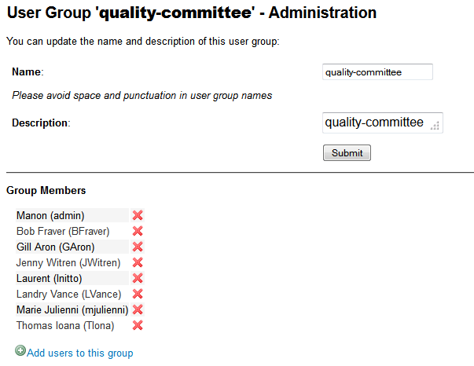

.. |SYSPRODUCTNAME| replace:: Tuleap
.. |SYS_DEFAULT_DOMAIN| replace:: Tuleap.net

.. _project-administration:

Project Administration
======================

Whenever you enter the Project Dashboard of a given project or any of
its service you'll see a menu item called Admin appears in the project
menu.

Only project members can access the Project Administration page. All
other |SYSPRODUCTNAME| users are denied access to this part of a
project.

Project Administration Menu
----------------------------

In addition to the project main menu that was introduced in the
description of the Project Dashboard, the Project Administration page
has its own menu. This menu is not redundant with the page content right
below. Except for 1 or 2 items the menu and the page content give access
to distinct parts of the administration space. So pay attention to both
the Page Admin menu and the Page Admin content. In the following
sections the Location label indicates where to find the corresponding
administrative function.

Adding/Removing Users
----------------------

*Location: Page Admin Content*

User administration in |SYSPRODUCTNAME| is easy. Regarding the number
of users to need to add, you can use one the two following ways:

Add a user
```````````

To add a new member to a project team one of the project administrator
just has to type the login name of the invited member and click on the
"Add User" button. If you don't know the login name of the new project
member you want to add, open a new browser window on |SYSPRODUCTNAME|
and use the search box in the |SYSPRODUCTNAME| Main Menu to search for
the person's real name (first or last name or both) and don't forget to
select "People" in the Search pull-down menu. The result list will show
you the user real name and login name.

Import a list of users
```````````````````````
If the number of users to add is important, one of the project team
member can import a list of users from a simple text file. In order to
do it, just click the link "Import List Of Users". Then, you can browse
your local directory to select a file containing the list of users you
want to import. The file will host one user per line, by specifying her
email address, or her |SYSPRODUCTNAME| username (login name).

::

    johnd
    steve.robinson@company.com

    bob.johnson@company.com
    smith3
    john.smith@company.com

The import process has two steps. First, it checks if the file is well
formed, and it displays the users detected to be imported. After a
confirmation, the import is done and the users are added to the project.
The system doesn't perform the import in case of error (unknown user,
user not recorded in |SYSPRODUCTNAME|, user not active, unknown email
address, etc.) If a user is two times in the file, only one user is
added and there is no error.

Removing a user
````````````````

Removing a project member is even easier. Just click on the trash icon
(|image1|) next to the person's name to revoke his/her membership.
Revoking membership has absolutely no effect on the history and the data
integrity of the project. In other words all tracker artifacts assigned
or submitted by this person will continue to show up as before in the
project database. Only the ability of this person to perform project
management tasks is affected. Also notice that in order to remove a
project administrator from the project member list, another project
administrator must first change the "Project Admin" flag of this user to
"No" in the User Permission table. In other words, a Project
Administrator cannot be removed from the project members as long as she
has administrator privilege.

    **Note**

    You have probably noticed that project member's name on the Project
    Administration page are actually hyperlinks. On this page as well as
    in many other pages throughout |SYSPRODUCTNAME| a click on a login
    name leads you to the user page where you can know more about the
    user (including its location, phone/fax number, etc. extracted from
    the LDAP Directory in real time) and send an e-mail message to this
    person directly via a Web form.

.. figure:: ../images/screenshots/sc_projectadminpage.png
   :align: center
   :alt: A Sample Project Administration Page
   :name: A Sample Project Administration Page

   A Sample Project Administration Page


Project Public Information
---------------------------

*Location: Project Administration Menu*

The "Edit Public Info" item of the Project Administration menu allows a
project administrator to update the Project Description Elements: these
are elements provided during the registration process.

Project Categorization
-----------------------

*Location: Page Admin Content*

This is where you can categorize your project. You can define up to 3
values for each of the 7 criteria used in the Software Map. If you
cannot find any matching value in the predefined list do not hesitate to
contact the |SYSPRODUCTNAME| Team.

.. _project-type:

Project Type
--------------

*Location: Page Admin Content*

|SYSPRODUCTNAME| proposes three types of projects:

-  **Project**: This is the type of standard projects hosted on
   |SYSPRODUCTNAME|.

-  **Template Project**: If you choose this project type new projects
   can reuse this projects service configuration. When registering a new
   project (see :ref:`project-registration`) your template project is listed as available
   template. When choosing your template project then the new project
   will use exactly the same configuration. This includes that

   -  the new project is classified into the same trove categories as
      the template project (see :ref:`software-map-(or Project Tree)`).

   -  the same services are enabled (see `Service Configuration`_). Unavailable services won't
      be present. Disabled services will be disabled by default.

   -  the same reference patterns are defined (see `Reference Pattern Configuration`_).

   -  the same project specific user groups exist (see `User Groups`_).

   -  all trackers with the option "instantiate for new projects" are
      copied with their associated fields, field values, field
      dependencies, reports, and permissions (see ?).

   -  the same forums are created (but the messages are not copied).

   -  the documents, as well as the document tree will be present.

   -  the CVS admin settings are copied (preamble, tracking mode, CVS
      Watch Mode), but the emails and the CVS permissions are not
      copied.

   -  the SVN admin settings are copied (preamble, tracking mode), but
      the emails and the SVN access permissions are not copied.

   -  the file packages and their permissions are copied

-  **Test Project**: If you just need to test what is feasible with
   |SYSPRODUCTNAME| projects use the Test Project type for your
   project. Having defined that type, your project will not appear any
   more in the |SYSPRODUCTNAME| Software Map nor on the
   |SYSPRODUCTNAME| Dashboard.

.. _service-configuration:

Service Configuration
-----------------------

*Location: Project Administration Menu*

The "Service Configuration" item of the Project Administration menu
lists all services available to the project. Services are items listed
in the "Service Bar " on top of each page: trackers, CVS, homepage,
documentation, etc. The Service Configuration page allows a project
administrator to update, enable, disable or even create services.

There are two kinds of services:

-  **System services**: these services are defined by the site
   administrator and are common to all projects. They cannot be
   modified, except for their status (enabled/disabled) and their
   position on the screen (see below).

-  **Project services**: these services can be fully customized or
   deleted by the project administrator.

There is one exception, the **Home Page** service is a system service
but it can be customized with any URL. Each project hosted on
|SYSPRODUCTNAME| has its own virtual Web server available on the
|SYSPRODUCTNAME| site. By default the "Home Page" in the Project
Service Bar links to this location (see :ref:`project-web-site` for more details). If you want
the Home Page of your project to link to some other locations on the
Intranet or on the Web, simply replace the default value with your own
Web location. Do not confuse your Project Home Page with your Project
Dashboard. The Project Home Page actually points to real Web Site
whereas the Project Dashboard page is just an entry point to monitor a
project progress.

Creating or Updating a Service
```````````````````````````````

When creating or updating a service, one has to fill the following
fields:

**Service Label**: This is the label that will be displayed in the
Service Bar. It should be as concise as possible.

**Service Link**: This is the URL of the service, i.e. the address the
user will be redirected to when clicking on the service label in the
Service Bar. It will be loaded in the current window.

A few keywords can be inserted into the link: they will be automatically
replaced by their value:

-  **$projectname**: short name of the project

-  **$sys\_default\_domain**: domain of your |SYSPRODUCTNAME| server
   (e.g. "|SYS_DEFAULT_DOMAIN|")

-  **$group\_id**: project number.

-  **$sys\_default\_protocol**: 'https' if your server is configured in
   secure mode, 'http' otherwise.

**Service Description**: Short description of the service. It will be
displayed as a tooltip when the mouse cursor is over the service label.

**Enabled**: Toggling this check box will simply disable (or enable) the
service. Disabling a service just means that it no longer appears in the
Service Bar and in the Project Dashboard of your project but all
existing data related to this service remains untouched. In other words,
re-enabling the service will restore the service in the exact same state
it was when you first disabled it. See also "Deleting a Service" below.

**Rank on Screen**: this arbitrary number allows you to define the
position of this service in the Service Bar relative to other services.
The services with smaller values will appear first. The rank values
don't have to be consecutive values. It is a good idea to use values
like 10, 20, 30,... so that it is easy for you to insert new services in
the future without having to renumber all the services.

Deleting a Service
```````````````````

Project services can be deleted. They appear with a small trash icon in
the service list. Just click on this icon to suppress the service from
the database. The service data are however preserved.

System services cannot be deleted. However, you can disable them and
they will not appear in the Service Bar.

Services Administration
------------------------

*Location: Project Admin page*

The project administration page gives direct access to the
administration of all services that have been activated for a given
project. This is available in the form of a series of pointers located
on the lower left part of the project administration page. Only project
members with appropriate permission are allowed to access the
|SYSPRODUCTNAME| services administration pages (see `User Permissions`_).

Reference Pattern Configuration
--------------------------------

*Location: Project Administration Menu*

The "Reference Configuration" item of the Project Administration menu
lists all reference patterns available to the project. The "Reference
Configuration" page allows a project administrator to update, enable,
disable or even create reference patterns.

.. _reference-overview:

Reference Overview
```````````````````

References are a powerful tool that allow cross-referencing of
|SYSPRODUCTNAME| objects. Based on a text pattern, |SYSPRODUCTNAME|
automatically creates hyperlinks to the desired object.

When typing a follow-up comment or a commit message, any text containing
the pattern "XXX #NNN" will be interpreted as a reference to the object
of type XXX with ID number NNN. For instance, 'artifact #123' is
recognized as a reference to artifact number 123, and |SYSPRODUCTNAME|
automatically creates a hyperlink that directly points to the details of
artifact 123.

You may also reference an object that belongs to another project. In
that case, use either 'XXX #group\_id:NNN' or 'XXX #group\_name:NNN' to
reference object XXX number NNN belonging to project which ID is
'group\_id' or which short name is 'group\_name'. For instance, 'wiki
#myproj:Welcome' is a reference to the 'Welcome' wiki page of the
project 'myproj'.

Some reference patterns may need more than one parameter. In this case,
use '/' as a separator between parameters. For example, 'wiki
#Welcome/2' creates a reference to the wiki page named 'Welcome' at
version '2'.

There are two kinds of reference patterns:

-  **System reference patterns**: these reference patterns are defined
   by the site administrator and are common to all projects. They cannot
   be modified, except for their status (enabled/disabled).

   Most system references are related to a specific service. For
   example, 'artifact', 'doc', 'file' or 'wiki' are respectively related
   to the tracker, document manager, file manager and Wiki services. In
   order to facilitate the usage of such reference patterns, they are
   automatically enabled and disabled when the corresponding service is
   enabled/disabled. Still, it is always possible to enable or disable
   those reference patterns manually.

-  **Project reference patterns**: these reference patterns can be
   created, modified or deleted by the project administrator.

Predefined Reference Patterns
``````````````````````````````

Here is a list of predefined reference patterns:

-  **art #num or artifact #num**: Reference to artifact number 'num'.
   Note that 'num' is a system-wide number and is unique across
   projects. This reference links to the artifact detail/update page. In
   addition to the 'art' and 'artifact' keywords, artifacts may be
   referenced using the related tracker short name. For example, an
   artifact in the bug tracker can be referenced with **bug #NNN**, a
   support request with **sr #NNN**, a task with **task #NNN** and a
   patch with **patch #NNN**. So, when you create a custom tracker, make
   sure that you specify a meaningful tracker short name.

-  **commit #num or cvs #num**: Reference to CVS commit number 'num'.
   This is a system-wide number. The reference links to the commit
   details page: log message, impacted files, link to diff view, etc.

-  **rev #num or revision #num or svn #num**: Reference to Subversion
   revision number 'num'. This is a project-specific number, so if you
   need to reference a revision belonging to another project, you should
   specify the project in the reference (e.g. 'rev #myproj:123'). The
   reference links to the subversion revision details page: log message,
   impacted files, link to diff view, etc.

-  **wiki #wikipage and wiki #wikipage/num**: Reference to a wiki page
   named 'wikipage'. The second format allows one to specify a wiki page
   version. Wiki pages are project specific, so if you need to reference
   a page belonging to another project, you should specify the project
   in the reference.

-  **doc #num or document #num**: Reference to the document number
   'num'. This is a system-wide number. Document numbers, or IDs, are
   visible in the 'Docs' main page by hovering over a document title
   with the mouse pointer. This reference links to the document itself.

-  **news #num**: Reference to the news item number 'num'. This is a
   system-wide number. The reference links to the news item page, where
   you can add comments.

-  **forum #num and msg #num**: Reference to forum number 'num' or to
   forum message number 'num'. Those are system-wide numbers. The first
   reference links to the forum welcome page, while the second one
   directly links to the message page, where you can view the message
   thread, and post a follow-up message.

-  **file #num**: Reference to file number 'num'. This is a system-wide
   number. This kind of reference allows a direct download of a file
   that is part of a release. File numbers, or IDs, are visible in the
   'Files' main page by hovering over a file name with the mouse
   pointer. This reference links to the file itself, so you might be
   prompted for a location to store the file. You may also have to
   accept the project license before downloading the file.

-  **release #num**: Reference to release number 'num'. This is a
   system-wide number. Release numbers, or IDs, are visible in the
   'Files' main page by hovering over a release name with the mouse
   pointer. This reference links to the project file manager page, where
   the referenced release is highlighted in the list.

Reference Usage
````````````````

While working in the development or the maintenance phase of a software
project, it is vital to keep track of the changes made to the source
code. This is what Version Control systems like CVS and Subversion do.
In addition to keeping track of the source code change history it is
often critical to relate the changes to the artifact (a task, a defect
or a support request) that led the developers to make a change in the
code. And conversely, when reading the artifact description it is also
very helpful to immediately see how the change was implemented.

The integration of CVS and Subversion in |SYSPRODUCTNAME| precisely
provide the |SYSPRODUCTNAME| users with this bi-directional
cross-referencing mechanism. This is achieved through the use of
references that are automatically detected by |SYSPRODUCTNAME| in
either the follow-up comments of the project artifacts or in the
messages attached to a CVS or SVN commit.

The system is not limited to artifact and commit references, so you may
also reference the forum message where the bug was found, the
documentation that describes an issue, or the file that fixes it. The
system is flexible enough to allow referencing of items that are not
stored in |SYSPRODUCTNAME|. So you may now create your own reference
pattern to link to an external document manager like DocuShare, or
source code management tool like ClearCase

    **Tip**

    It is considered a best practice to always reference a bug, a task
    or a support request in any of the log message attached to a
    Subversion or CVS commit. Similarly when closing the related
    artifact (task, bug,etc.) make sure you mention the revision or
    commit number in the follow-up comment. You will find this extremely
    convenient while trying to keep track of the changes and why they
    were made.

Creating or Updating a Reference Pattern
`````````````````````````````````````````

When creating or updating a reference pattern, one has to fill the
following fields:

**Reference Keyword**: This is the keyword that triggers a reference
creation when it is found. It should be concise and meaningful in order
to facilitate readability.

**Reference Description**: Short description of the reference. It is
displayed in a tooltip when the mouse cursor is over an identified
reference.

**Reference Link**: This is the URL pointed by the reference, i.e. the
address the user will be redirected to when clicking on a reference. The
URL does not need to point to the |SYSPRODUCTNAME| server: you may
create references pointing to external pages. The page will be loaded in
the current window.

A few keywords can be inserted into the link: they will be automatically
replaced by their value:

-  **$projname**: short name of the project.

-  **$group\_id**: project number.

-  **$0**: The keyword extracted for this reference.

-  **$1**: The first parameter in the reference.

-  **$2**: The second parameter in the reference.

-  **$3...$9**: Up to nine parameters in the reference.

Examples:

-  **artifact #25**: '$0' is 'artifact', '$1' is '25'

-  **wiki #tuleap:Welcome/1**: '$0' is 'wiki', '$1' is 'Welcome', '$2'
   is '1', '$projname' is 'tuleap'

-  **myref #123:1/23/456**: '$0' is 'myref', '$1' is '1', '$2' is '23',
   '$3' is '456' and '$group\_id' is '123'

-  **google #tuleap/enalean**: '$0' is 'google', '$1' is 'tuleap', '$2'
   is 'enalean'. If you define the reference pattern 'google', with its
   link pointing at **http://www.google.com/search?hl=en&q=$1+$2**,
   clicking on the reference 'google #tuleap/enalean' will create a
   google search for 'tuleap enalean'.

-  **ds #123**: '$0' is 'ds', '$1' is '123'. If you define the reference
   pattern 'ds', with its link pointing at
   **http://docushare/dsweb/Get/Document-$1**, clicking on the reference
   'ds #123' will download document '123' from your local DocuShare
   server.

You should also note that the number of parameters is important: if the
number of parameters used in the text does not match the number of
parameters needed by the reference pattern, the reference will not be
extracted. This allows one to create several reference patterns with the
same keywords but different number of arguments. See for instance the
'wiki' references: 'wiki #Welcome' is a reference with one parameter,
and it links to the wiki page 'Welcome', while 'wiki #Welcome/2' is
another reference with two parameters that links to the wiki page
'Welcome' at version '2'.

**Enabled**: Toggling this check box will simply disable (or enable) the
reference pattern. Disabling a reference pattern just means that it is
no longer extracted from text fields or commit emails. Re-enabling the
reference pattern is possible. See also "Deleting a Reference Pattern"
below.

Deleting a Reference Pattern
`````````````````````````````

Project reference patterns can be deleted. They appear with a small
trash icon in the reference pattern list. Just click on this icon to
delete the reference pattern from the database. A deleted reference
pattern must be re-created if you need to use it again.

System reference patterns cannot be deleted. However, you can disable
them so that they will not be extracted.

.. _user-permissions:

User Permissions
-----------------

*Location: Page Admin Content*

Project Administrators have the ability to grant different permissions
to different users. As an example, a project member can be granted full
administration rights on the bug tracker and no rights at all on the
Documentation Manager of the project.

.. figure:: ../images/screenshots/sc_userpermissions.png
   :align: center
   :alt: A sample project members permission table
   :name: A sample project members permission table

   A sample project members permission table

`A sample project members permission table`_ shows a sample project members permission table. Each column
represents a service or a user capability and there is one line per
project member. Let's review the column one by one:

-  **Project Admin**: A Yes/No flag stating whether a given project
   member is a project administrator, that is to say a project member
   with absolutely all rights over the project services, project
   deliverables and project members. Only Project Admin can access the
   project members permission page.

-  **CVS Write**: Right now this is always set to Yes. All project
   members have write permission over the CVS [#f1]_ repository and this
   cannot be changed from the current version of the Web interface.
   However we'll see how to deny CVS write permission to project members
   in the CVS chapter (:ref:`version-control-with-CVS`).

-  **Trackers**:

   -  *None*: the user has the same permissions on this tool as a non
      project member.

   -  *Administrator*: tool administrators have full access to the
      administration part of the tools. As an example, they can define
      new artifact categories, new predefined values for artifact
      fields, etc.

-  **Forums, Documentation Manager, File Manager**:

   -  *None*: the user has the same permissions on this tool as a non
      project member.

   -  *Moderator*: (Forums only): A moderator has the ability to
      moderate the Web Discussion forum that is to say create/delete
      discussion forums for the project, delete posted messages and
      update the Forum status (public/private) as well as the Forum
      description

   -  *Editor*: (Doc Mgr only): An editor has the ability to review and
      validate a document prior to its publication. S/he can also update
      and delete a document.

   -  *Administrator*: (File Mgr only): A file manager administrator has
      the ability to upload and manage file packages and releases. S/he
      can also set access permissions to user groups on packages and
      releases, even though s/he cannot define or update user groups
      (only a project administrator can).

-  **Member of user groups**: For each individual members, the column
   lists all the project user groups s/he belongs to. See `User Groups`_ for more
   information on user groups.

    **Important**

    Don't forget to click on the "Update User Permissions" button after
    making any changes in the permission table.

.. _user-groups:

User Groups
------------

*Location: Project Administration Menu*

A user group, sometimes called a "ugroup ", is simply a group of
|SYSPRODUCTNAME| users. User groups are used to set specific
permissions to some project data (e.g. software releases and packages -
see :ref:`package-modification`). A user group is always attached to a project, but the users
comprising the group do not necessarily belong to that project.

User Groups Management
```````````````````````

The "User Groups Admin" function of the Project Administration menu
lists all available user groups, and provides a way to create new ones.

.. figure:: ../images/screenshots/sc_usergrouplist.png
   :align: center
   :alt: User Group Management Page
   :name: User Group Management Page

   User Group Management Page

In the list, (see for example `User Group Management Page`_) there are two different kinds of user
groups:

**Pre-defined User Groups**: These groups are defined for every project.
Examples of pre-defined groups are: **project\_members, project\_admins,
registered\_users, nobody, file\_manager\_admin**, etc. These groups are
dynamic: if you assign some permission to 'project\_admins', and a new
project administrator is defined, then this new user will automatically
be granted the corresponding permission.

**Custom User Groups** are defined by project administrators. They are
composed of a static list of users. The only requirement is that any
member must be a registered |SYSPRODUCTNAME| user. This list can be
modified at any time, but will not automatically be updated, except if a
member is removed from the project or deleted from the system.

Creating a User Group
```````````````````````

When creating a user group, one has to provide the following fields:

**Name**: This is the label that will be displayed when selecting user
groups in a permission screen. The group name may not contain space and
punctuation.

**Description**: Short description of the user group. It is only
displayed in the User Group Admin page.

**Create From**: This is a quick way of pre-selecting group members: you
may create a user group from scratch (Empty Group), from all Project
Members or Project Admins, or from an existing user group attached to
this project. The members of the selected group will automatically be
added to the new group. You will be able to add or remove members on the
next screen.



   User Group Edit

In the next page (see `User Group Edit`_), the project administrator may select
individually the members of the new group.

Two columns are displayed: the one on the left contains the list of all
|SYSPRODUCTNAME| registered users, while the one on the right contains
the list of users already admitted to the group. Use the two arrows
between the columns to move users from one column to the other.

The user interface also provides convenient ways of selecting users when
the registered list is very large: you can choose to display only those
users whose login starts with a specific letter, or you may also filter
the list by typing letters in the 'Filter' text box. For instance, if
you type 'john', only users whose name or login contains 'john' will be
displayed.

Once you are done, you may click on the Submit button. The user group is
created.

    **Tip**

    Sometimes, you might want to grant some permissions to all project
    members and some other |SYSPRODUCTNAME| users. In this case, you
    might be tempted to build a user group from the list of project
    members and to add the other users to the group. The issue with this
    solution is that if new members join the project, they will have to
    be manually added to the group. So it is more convenient to create a
    group containing only the users that are not member of the project.
    And then, permissions should be granted to this group and to the
    pre-defined "project members" group.

Updating a User Group
``````````````````````

In order to update an existing user group, simply select it in the user
group list. You will be presented with the same screen as with Group
Creation, where you can update the name, description and composition of
the user group.

Deleting a User Group
```````````````````````

User groups can be deleted. Just click on the trash icon next to the
group name in the group management page (`User Group Management Page`_) to suppress the user group
from the database. Only custom user groups can be deleted.

    **Important**

    Please note that if a user group was specifically granted some
    permission, deleting the user group might be dangerous. Indeed, if a
    group is the only one allowed to access a package and this group is
    deleted, the permission is also deleted and reset to default, so any
    registered user can access the package.

Additional Information on User Groups
``````````````````````````````````````

It is possible to know all user groups one individual project member
belongs to. Simply display the User Permissions page (`User Permissions`_). However,
please note that only user groups belonging to the current project are
displayed. The user might also be a member of additional user groups in
other projects.

The bottom of the User Group Edit page (`User Group Edit`_) also lists all the
permissions granted to this group, e.g. packages and releases this user
group is granted access to.

When a project member is removed from a project, or quits a project,
they are also automatically removed from all project user groups for
safety reasons.

Similarly, when a user is deleted (not just suspended) by the site
administrator, they are removed from all user groups in all projects.

.. _project-data-export:

Project Data Export
-------------------

*Location: Project Administration Menu*

|SYSPRODUCTNAME| is very appealing to many project development teams
because it provides full-featured project development and management
tools. A software project can be managed almost entirely from within
|SYSPRODUCTNAME|. However a project team may need to perform some
additional processing on the project data. It may need to report about
progress made, what goes well or wrong, how far you are from the end
date, derive statistical data, etc.

It is far beyond the scope of |SYSPRODUCTNAME| to provide project
teams with such reporting tools. There are many specialized tools on the
market to generate progress reports and each project team has its
favorite one. In order to satisfy this diversity of needs, the
|SYSPRODUCTNAME| Team has developed a very efficient system that
allows the project team to export the project data outside of
|SYSPRODUCTNAME| for re-use in other tools like MS Access, Excel,
Crystal Report, Open Office, or any other ad-hoc tools.

|SYSPRODUCTNAME| provides you with 2 kinds of Data Export:

-  **Text File Export**: this is a simple text extract of your project
   data. It uses the well known CSV (Comma Separated Value) format. CSV
   is recognized by almost every Office Suite or database tool on the
   market. In case you want to develop your own report application most
   programming languages also come with a standard library that knows
   how to parse CSV format.

-  **Direct Database Connection**: so to speak this is not a Data
   Export. It is rather a direct connection to your project database
   through an ODBC or JDBC driver. If you want to manipulate your
   project data with a database tool (like MS-Access or an ODBC/JDBC
   application) this is certainly the best choice.

Exported Data
``````````````

|SYSPRODUCTNAME| gives access to the following data (details on
exported fields are listed on the |SYSPRODUCTNAME| page):

-  **Tracker**: the artifacts data, the changes history and the
   artifacts dependencies can be exported for each tracker.

-  **Survey Responses**: all responses to all the surveys you have
   created in your project.

Text File Export
`````````````````

Text File Export follow the well known CSV (Comma Separated Values)
format, recognized by almost every Office Suite on the market. It can
easily be imported in MS-Access, MS Excel, OpenCalc…

Importing CSV Files in Excel
~~~~~~~~~~~~~~~~~~~~~~~~~~~~

Clicking on any of the table export link (Bug Export, Task Export,..) on
the Project Data Export page generates and downloads a CSV file that you
can save on your local disk or directly open in Excel or any other
spreadsheet of your choice. No particular setting is required in most
cases. Nevertheless, you can change the CSV separator and the date
format (see :ref:`preferences`) if the default one doesn't correspond with your Excel
version  [#f2]_.

Importing CSV Files in MS-Access
~~~~~~~~~~~~~~~~~~~~~~~~~~~~~~~~

Before you import external data you must first create a new database.
Then go through the following steps:

-  Select ``File Menu -> Get External Data -> Import``

-  Choose the appropriate CSV file that you have just generated and then
   click on the ``Import...`` button. A preview of the imported table
   shows up on the screen

-  Click on the ``Advanced...`` button

-  Set Text Delimiter to " (double quote)

-  Set Date Format to ``YMD``

-  Set Date delimiter to - (dash)

-  Then enter the name and the type of each field in the lower part of
   the dialog box. Remember that this information is available on the
   Project Data Export page.

       **Note**

       **Important Remark**: you can leave the default field name
       (Field1,....FieldN) as well as the default Text type in most
       cases. However long text fields like bug/tasks follow-up comments
       (details field) and original comment must be declared as type
       Memo. Failing to do so will cause MS-Access to corrupt the
       imported data.

       In case you encounter difficulties opening your exported CSV file
       please consult our ?

Once you are done with the specification of the Import, save it by
clicking on the ``Save As...`` button. For future import of the same
table simply click on the Specs... button and reload your Import
specification.

Direct Database Access
```````````````````````

To offer maximum flexibility |SYSPRODUCTNAME| also provides a direct
access to your project data via an ODBC or JDBC database connection.
Once installed on your PC the MySQL ODBC (or JDBC) driver allows a
transparent access to your project specific database tables.

If you use MS-Access to generate your progress or status report then the
'Direct Database Access' is the easiest way to access all of your
project data in no time.

Generating Your Project Database
~~~~~~~~~~~~~~~~~~~~~~~~~~~~~~~~

Before you attempt to access your project data with MS-Access or any
other ODBC/JDBC capable application you must first generate your project
database. Go to the ``Project Admin -> Project Data Export`` and click
on the 'Generate Full Project Database' link at the bottom of the
page.The 'Generate Full Project Database' link generates a snapshot of
your project data. This means you must click on the link again each time
you want the project database to be updated with current data.

If everything goes well your project database will be generated in real
time and a message will tell you about the result of the generation
process and what are the parameters to use to connect to the remote
database from your desktop. Write them down and keep them in a safe
place.

    **Remark**: if your project database contains several thousands of
    records (tasks, bugs,…), the project database generation may take
    several minutes to complete.

Installing and Configuring the MySQL ODBC Driver
~~~~~~~~~~~~~~~~~~~~~~~~~~~~~~~~~~~~~~~~~~~~~~~~

First download the `MySQL ODBC
driver <http://www.mysql.com/downloads/api-myodbc.html>`__ and unzip the
zip archive in a temporary directory of your choice.

Run the setup program and go through the installation
process. \ **Important Remark**: On Windows you must have administrator
rights to install the driver.

Add your project database to Windows Data Sources. For Windows users:

-  Use your normal user account to login.

-  Go to ``Start menu -> Settings -> Control
           Panel -> Administrative Tools -> Data Sources
           (ODBC)``

-  Select the "User DSN" tab and then click on the "Add" button

-  Select the "MySQL" item from the list and then click on the "Finish"
   button

-  A dialog box will pop up asking for the database following
   connections parameters:

   -  *Windows DSN Name*: is your choice of a name for this connection.
      Use "Project X Database" for instance.

   -  *MySQL host (IP or Name)*; |SYS_DEFAULT_DOMAIN|

   -  *MySQL Database Name*: the database name is your project shortname
      prefixed by 'cx\_' as displayed by |SYSPRODUCTNAME| after you
      generated your project database (see above)

   -  *User*: the user name is 'cxuser'.

   -  *Password*: No password (leave blank).

   -  *Port (if not 3306)*: use the default port (leave blank).

   -  *SQL command on connect*: none (leave blank).

Installing and Configuring the MySQL JDBC Driver
~~~~~~~~~~~~~~~~~~~~~~~~~~~~~~~~~~~~~~~~~~~~~~~~

For those using a Java application based on a JDBC driver, the MySQL
JDBC driver and installation instructions are available on the `MySQL
Java Connectivity <http://www.mysql.com/doc/en/Java.html>`__ page.

Using Your Project Database From MS-Access
~~~~~~~~~~~~~~~~~~~~~~~~~~~~~~~~~~~~~~~~~~

Before you use MS-Access to connect to your project database make sure
that the MySQL ODBC driver has been installed on your PC (see `Installing and Configuring the MySQL ODBC Driver`_) and
that you have generated your project database (see `Installing and Configuring the MySQL ODBC Driver`_). Then go through
the following steps:

-  Launch MS-Access and open a new database.

-  In the ``File Menu`` select ``Get External Data -> Import``.

-  In the ``File of Types`` pull down menu select the ``ODBC Databases``
   item.

-  Select the ``Machine Data Source`` tab and click on your project
   database.

-  Select the tables you are interested or simply click on
   ``Select All``.

MS-Access will instantly (according to MS-Access standards :-) import
your project data and you can then process your project data exactly as
you would do for a native MS-Access database.

Tracker Artifact Import
------------------------

*Location: Project Administration Menu*

Please see :ref:`tracker-artifact-import`

.. _project-history:

Project History
----------------

*Location: Project Administration Menu*

The Project History provides project members with Audit capabilities.
Clicking on this menu item shows a list of all the changes that have
taken place in the administration of the project since its creation. The
list of changes reports the nature of the change (e.g. Changed Public
Info, Changed Permissions, Changed Software Map, ...) , what the value
was before it changed (if applicable), who changed it and when.

.. _access-logs:

Access Logs
------------

*Location: Project Administration Menu*

Depending on the configuration of the |SYSPRODUCTNAME| site and on the
configuration of each project, source code access, documents and file
release download permissions may be granted to various populations.

The Access Logs provide project members with a complete audit trail of
who accessed what on the project. The page shows the following
information:

-  The downloaded File Releases. It basically reports who downloaded
   what file and when (date and time). The time of download is reported
   in local time relative to the project member time zone.

-  The |SYSPRODUCTNAME| users who used CVS to checkout or update the
   sources on their local desktop machine or who browsed source code via
   the CVS Web interface.

-  The |SYSPRODUCTNAME| users who accessed the source code through the
   Subversion repository or who browsed source code via the CVS Web
   interface.

-  The |SYSPRODUCTNAME| users who downloaded documents, except for
   those documents marked as being accessible to anonymous users in your
   Document Manager.

Access Logs can be filtered out by users to show accesses from all
users, project members or non project members (default). The time window
can also be adjusted to show more or less access log history.

.. figure:: ../images/screenshots/sc_sourcecodeaccesslogs.png
   :align: center
   :alt: Sample Access Log
   :name: Sample Access Log

   Sample Access Log

.. [#f1]
   CVS stands for Concurrent Versions System. It is one of the source
   code version control system offered on the |SYSPRODUCTNAME| site.
   CVS is used by hundreds of thousands of software projects all over
   the world. See http://www.cvshome.org for more information.

.. [#f2]
   For example, by default, the separator for the french version of
   Excel is the semicolon instead of the comma.

.. |image1| image:: ../images/icons/trash.png
