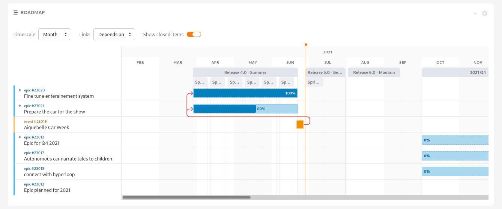
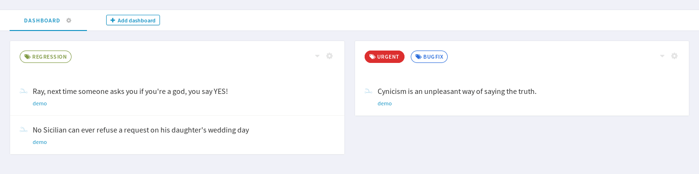

.. _project-administration:

Project Management
==================

Creating a New Project
----------------------

So - you are a freshly registered Tuleap user and you want
to make your developer or project leader life easier. In other words you
want to:

-  Avoid the pain and cost of creating your own project infrastructure
   (with servers and backup)

-  Avoid paying a premium price for commercial version control, defect
   tracking and task management tools

-  Quickly setup a project environment that you can share with your
   colleagues, your partners, your contractors or your customers where
   ever they are while keeping your information safe and under control.

-  Make your organization globally more productive and efficient by
   possibly letting others re-use your software and build on it.

If any of these points is appealing to you then you should definitely
host your software project on Tuleap. Let's see how you can
do that.

.. _project-registration:

Project Registration
````````````````````

Before you create a new project you must be a registered user (see :ref:`classes-of-citizens`).
You then login and select the item "+ New Project" in the "Projects" dropdown of Tuleap Main Menu.

The project registration is a two steps process:

-  **Choose a template** : Templates are divided in 3 categories:

   -  Your company templates: some companies are proposing predefined templates in order to provide
      templates in compliance with the processes defined in your company

   -  Tuleap templates: ready-to-use templates in order to help you start your project

   -  For Advanced users: if you need to reuse the configuration of one of your project. You need to be project
      administrator of that project to be able to use it.


-  **Project Information**

   Choose the name and the visibility of your project (see :ref:`project-visibility`),
   and add a description if you need. You will be able to add one after the creation.


Some platforms may have more fields to fill. Tuleap offers the possibility to add more project information if you need
(see :ref:`software-map-(or Project Tree)`).

The new project will use exactly the same configuration as the template.
This includes that:

   -  the new project inherits the same dashboards and widget for project home page

   -  the new project is classified into the same trove categories as
      the template project (see :ref:`software-map-(or Project Tree)`).

   -  the same services are enabled (see :ref:`service-configuration`). Unavailable services won't
      be present. Disabled services will be disabled by default.

   -  the same reference patterns are defined (see :ref:`reference-overview`).

   -  the same project specific user groups exist (see :ref:`user-groups`).

   -  all trackers with the option "instantiate for new projects" are
      copied with their associated fields, field values, field
      dependencies, reports, and permissions (see ?).

   -  the test management configuration is copied (This module is part of :ref:`Tuleap Entreprise <tuleap-enterprise>`)

   -  the backlog configuration is copied

   -  the kanban boards are copied

   -  the same forums are created (but the messages are not copied).

   -  the documents, as well as the document tree will be present.

   -  the SVN admin settings are copied but
      the emails and the SVN access permissions are not copied.

   -  the Git admin settings and global permissions are copied, but
      the emails and the Git access permissions are not copied.

   -  the file packages and their permissions are copied

If you create a new project from an archive, the provided archive must contains the project structure only. Data (like artifacts or users) must not be included.
To create an archive with only the project structure see :ref:`project-structure-export`

After you validate the project registration, the Tuleap Team in charge
of your platform reviews the information you submitted and decides
to approve it or not.
Note that some platforms automatically approve new projects.
Shortly after the Tuleap Team approval
you'll receive an e-mail summarizing the characteristics of your project
including a pointer to your new "Project Dashboard" page.

.. _jira-project-importer:

Create project from Jira
````````````````````````

.. attention::

  This feature is provided by package ``tuleap-plugin-jira-import`` it must be installed and activated by a site administrator
  first.

  This module is part of :ref:`Tuleap Enterprise <tuleap-enterprise>`. It might
  not be available on your installation of Tuleap.

It's also possible to create a new project by importing data from a Jira project.

At the moment, this requires a site administrator action on the server because the
feature is only available in tuleap CLI:

.. sourcecode:: shell

    tuleap import-project:from-jira \
        --jira-host JIRA_HOST \
        --jira-user JIRA_USER \
        --import-mode multi-trackers \
        --tuleap-user TULEAP_USER_LOGIN \
        --shortname TULEAP_PROJECT_SHORTNAME

This command works with Jira REST API so Tuleap server must be able to reach the Jira instance (``JIRA_HOST``). In addition to that:

* The Jira user (``JIRA_USER``) used to do the import must be administrator of your Jira project in order to have all the issues and all the content possible.
* When importing from Jira Cloud, the Jira user must first generate a token on the Jira instance (they will be prompted for the token when they launch the command).
* When importing from Jira Server, ``JIRA_USER`` is the regular login used on Jira instance and when prompted for credentials, it's the Jira Server password that should be provided.
* For best conversion, Jira users' email addresses should visible to anyone in the Jira configuration (must be done by each user).
    * if Jira users do not disclose their emails, everything will be owned by a "Tuleap importer" user.

This command will import:

* In ``multi-trackers`` mode:
   - all Jira issue types (as trackers) with all issues (as artifacts) with their comment and history of field change (best effort, more details :ref:`here <tracker-import-from-jira>`),
   - the links between issues with their types (related to, duplicate, etc). This includes sub-tasks as well as epics.
   - all worklog as :ref:`time tracking <timetracking>`,
   - Board and Sprints with associated issues and backlog.
* In ``mono-tracker`` mode:
   - all issues (as artifacts) with their comment and history of field change (best effort, more details :ref:`here <tracker-import-from-jira>`) in a unique ``Issues`` tracker,
   - the links between issues with their types (related to, duplicate, etc). This includes sub-tasks as well as epics.
   - all worklog as :ref:`time tracking <timetracking>`,
   - A simple Kanban will be activated.

.. ATTENTION::
   Issue link types must be created on Tuleap before the import is done, otherwise the link type will not be imported.

A given Jira project can have many Boards with different configurations. There is no equivalent concept in Tuleap
so the importer arbitrarily choose the first declared board.

Jira API doesn't expose what kind of issue type is an Epic so, by default, the importer relies on the naming and will
pick the ``Epic`` issue type. If this label was modified in your project, you can tell the new name to the importer with
``--jira-epic-issue-type`` option.

The project is created and activated as soon as the command ends with ``TULEAP_USER_LOGIN`` as sole project administrator.
By default the project privacy is "private". A ``--visiblity`` option can be used to defined the Tuleap project visiblity at import.

The ``import-mode`` is an optional CLI option to choose how to import Jira data. If not provided, the import is done in ``multi-trackers`` mode by default.

.. note::

    While the import of an entire project is a Tuleap Enterprise feature, the import of a :ref:`single issue type<tracker-import-from-jira>` with issues
    and history is available on all versions of Tuleap.

Post-Registration Configuration
```````````````````````````````

The first thing to do after you receive the confirmation for your
project registration is to visit the "Project Dashboard" page (URL
included in the e-mail) and finish the configuration of your project.
The 2 following actions are the most frequent ones that have to be taken
after a project is registered:

-  **Categorize your project in the Software Map**

   If you haven't done it during the project registration process, you
   should do it now! Your project categorization appears on your
   "Project Dashboard" page. To categorize your project select the
   "categorize it now" link and fill out the category form fields.

-  **Build the project team**

   Once a project is created, the creator is assigned the role of
   project administrator on this project. It is her responsibility to
   define who are the project members and what their permissions are.
   This can be done by accessing the "Project Admin" page, typing the
   names of all the registered users promote as team members and then
   define their permissions.

Project Dashboard
-----------------

The project dashboards are the entry point of a Tuleap hosted
project. And, for any project, they are the only pages you need to know
about. From those pages both ordinary registered users and project
members/administrators can access all project resources and services.
Unlike the project administration page, the dashboards are
public and can be visited by any Tuleap user including
anonymous ones. In some sense the dashboard display the public
face of a project.

.. _project-dashboard-content:

Project Dashboard content
`````````````````````````

A sample project dashboard is available below. The page is split in
several areas:

-  The header with the project name and some indicators (project scope, number of members, …).

-  A navigation bar to access to each dashboard. For project administrators, this is where they can
   add a new dashboard, and edit or delete a dashboard. They can also add widgets to the current dashboard.

-  The various information presented by widgets.

.. figure:: ../images/screenshots/project-dashboards.png
   :align: center
   :alt: An example of project dashboard
   :name: An example of project dashboard

   An example of project dashboard

Tuleap allows project admins to personalize the dashboards. The content
of the page is made of *widgets*. All widgets can be moved, collapsed or
removed. Some of them can provide an rss feed or be edited.

Other users than project admins will see the corresponding static page.
The widgets will be the same, in the same position, but they won't be
able to modify the page.

Some Widgets available on project dashboard
```````````````````````````````````````````

New widgets can be added through the dropdown entry "Add widget". Here is an
example of available widgets for the project dashboard:

-  **Public Areas**: this is an iconic list of all available services
   for this project along with some information next to it. Click on any
   of this item to access a service. The role of this area is pretty
   much equivalent to the sidebar except that it shows additional information
   about each of the service (e.g. list of trackers, …)

-  **Heartbeat**: the list of latest items updated in this project. This
   is helpful to have an overview of the activity of the project. Please note
   that not all services can push information in this widget; as of today
   Artifacts and Git activities are listed. Permissions apply, it means that
   the content of hearbeat will change from one user to another according to
   their permissions.

-  **RSS Reader** allows project admins to include public rss (or atom)
   feeds. For example the reader can display a feed published by
   external tools used by the project (like continuous integration).

Some widgets have documentation to explain how to configure and use them:

- :ref:`Kanban <kanban>` add a Kanban in your project dashboard.
- :ref:`Hudson/Jenkins <continuous-integration-with-Hudson/Jenkins>` permits to display many widgets for Continuous Integration.
- :ref:`Project Milestones <project-milestones>` displays a Scrum Backlog in project dashboard.
- :ref:`Label widget <label_widget>` to track your items.
- :ref:`Cross-Tracker Search <xts>`.
- :ref:`Roadmap <roadmap>`.

Whenever you enter the Project Dashboard of a given project or any of
its service you'll see a menu item called Admin appears in the project
menu.

Only site or project administrators can access the Project Administration page.
All other Tuleap users are denied access to this part of a project.

.. _xts:

Cross-Tracker Search
````````````````````

.. attention::

  This module is part of :ref:`Tuleap Entreprise <tuleap-enterprise>`. It might
  not be available on your installation of Tuleap.

You may want to perform a search based on several trackers and several projects.
A widget "Cross-Tracker Search" enables you to do that.

.. figure:: ../images/screenshots/widget/crosstracker-widget.png
  :alt: Example of cross-tracker widget

  Example of cross-tracker widget

There are two modes on this widget: a Default mode and an Expert mode.

Default mode
++++++++++++

This is the mode in which the widget is created. It allows you to choose a list of trackers coming from different projects and to filter artifacts from those trackers according to some criteria.

You can optionally write a query using :ref:`Tuleap Query Language <tql_xts>` If you don't write a query, it will by default search all "Open" artifacts in the selected projects. If you use the query, the retrieved artifacts will match the query and not only the "Open" ones. See the dedicated page for details on how to write a query: :ref:`TQL in Cross-Tracker Search <tql_xts>`.

The search respects Tuleap's permissions model: you can choose only projects you are member of and trackers you can read.
If you can't read all trackers or all columns needed by the query, an error message will be displayed.

After selecting trackers and/or entering a query, you will be able to Save the report. Once saved, all users who can access this dashboard will see the widget with your saved tracker selection and query.

Expert mode
+++++++++++

The Cross-Tracker Search widget has a second mode called "Expert mode" allowing you to search even more specifically on your whole platform.
You can switch between modes by using the ``Expert mode`` button on the widget.

.. figure:: ../images/screenshots/widget/crosstracker-widget-change-mode.png
  :alt: Change the mode of the widget

  Change the mode of the widget

In this mode, the choice of columns to display, the selection of trackers and projects and the selection of artifacts are all expressed in :ref:`Tuleap Query Language <xts_expert_mode>` only. Writing a TQL query is mandatory. See the dedicated page for details on how to write a query: :ref:`TQL in Cross-Tracker Search Expert mode <xts_expert_mode>`

After writing a query, you can save the report, then all users who have access to this dashboard will see the widget and the selected artifacts and columns.

CSV Export
++++++++++

.. note:: CSV Export in not available in Expert mode, only in Default mode.

Once a report is saved, an "Export CSV" button will appear. Click it to download a CSV file representing all the artifacts you can see on the widget.

.. figure:: ../images/screenshots/widget/crosstracker-widget-export-csv.png
  :alt: CSV Export button

  CSV Export button

.. note:: The CSV file contains more information than you can see on the widget. It will export Tracker Semantics and match fields based on their types and names.

The following information will be exported for all artifacts and will always be filled:

- Artifact Id
- Project label
- Tracker label
- Submitted by (Who submitted the artifact)
- Submitted on (Date of submission)
- Last update by (Who updated the artifact)
- Last update date

:ref:`Tracker Semantics <status-semantic>` will be exported when defined in the tracker:

- Title semantic
- Description semantic
- Status semantic

When any of those semantic is not defined in a tracker, it will have an "empty" value in the CSV file.

Then, the following rules will be used to find similar fields in the selected trackers:

	* When two fields have the same short name (not Label, See :ref:`Tracker Administration<tracker-admin-field-edition>` for details), the same type and are bound to the same kind of values, then they will be considered as similar fields and will be exported in the same column of the CSV file.
	* Fields that are not considered similar with another field are skipped and won't be exported in the CSV file. That means that fields that are only present in one tracker will be skipped.
	* Fields that are selected as a Semantic will be skipped so that they are not exported twice.

For example, let's consider that we have selected a "User story" tracker in project "Alpha" and another "User story" tracker in project "Beta". I will name them "User story Alpha" and "User story Beta" to simplify things.

- Tracker "User story Alpha" has an **integer** field named "hours_spent" and Tracker "User story Beta" also has an **integer** field named "hours_spent". Both fields will be considered as similar and will be exported in the same column.
- Tracker "User story Alpha" has an **integer** field named "total_effort" and Tracker "User story Beta" has a **float** field named "total_effort". Both fields do not have the same type and will be skipped.
- Tracker "User story Alpha" has a selectbox field named "notify" bound to **User groups** and Tracker "User story Beta" has a selectbox field named "notify" bound to **Users**. Both fields have the same name and type, but are not bound on the same kind of value. They will be skipped.

.. attention::

	Only some field types can be exported as CSV in Cross-tracker reports. Here is the list of supported field types:

	- String field
	- Text field
	- Integer field
	- Float field
	- Date field (with or without time displayed)
	- Selectbox field (but **not Multi Select Box**)
	- Radio button field

	All other fields are not supported yet and will be skipped.

Special cases
~~~~~~~~~~~~~

- Tracker "User story Alpha" has a text field named "details" which is defined as Description Semantic.
- Tracker "User story Beta" has two text fields named "details" and "description". The "description" field is defined as Description Semantic.
- The "details" field will be skipped because it is selected as a semantic in tracker "User story Alpha".

.. _roadmap:

Roadmap
```````

.. attention::

  This module is part of :ref:`Tuleap Entreprise <tuleap-enterprise>`. It might
  not be available on your installation of Tuleap.

This displays the roadmap of a project in the project dashboard. It shows the progress of artifacts with:

* :ref:`semantic Title<semantic-title>`
* :ref:`semantic Timeframe<semantic-timeframe>`

Artifacts of selected trackers will be displayed in the widget as a Gantt chart as soon as:

* they have at least a start date or a end date
* the end date (if set) is greater than the start date

The percentage of progression will be displayed on tasks only if the :ref:`semantic Progress<semantic-progress>` is defined in the tracker (if no semantic Progress, then a plain bar is displayed instead).



.. NOTE::
  The widget filters out artifacts:

  * That are closed since more than one year
  * That are closed with end date older than one year

If artifact has only start date, only end date, or start date equals to end date, then it is displayed as Gantt milestone.

User can choose:

* The timescale: Week, Month, Quarter
* To display :ref:`links<types-artifact-links>` between artifacts: no links (aka "None") or a given type of links.
* To display children if any (as soon as they can be displayed in the widget, see aforementionned conditions)
* To hide closed items (to not clutter too much the Gantt chart when there are a lot of artifacts)

In order to give context about artifacts being displayed, the widget can be configured to display iterations on top of the Gantt chart.
For example we may want to track the progress of Epic in the context of Releases. Or in the context of Releases and their Sprints.

It should be noted that:

* The trackers for iterations can be chosen in the widget configuration, under the Timeframe ribbons section.
* You can choose up to two levels of ribbons. Tracker of level 2 is expected to be a sub-division of tracker of level 1 (e.g Sprints vs Releases, or Iterations vs Program Increments).
* Selected trackers must have :ref:`Title<semantic-title>` and :ref:`Timeframe<semantic-timeframe>` semantics.
* Artifacts of selected trackers are expected to have continuous time. I.e. artifacts timeframe do not overlap, if it is the case the widget will not know how to display them and they will be omitted.
* Old artifacts (the ones that end before the first task displayed in the Gantt) are not displayed.


Project Details
---------------

This section presents the general information about your project such as its name, its description, its visibility...

.. figure:: ../images/screenshots/project-admin/project-details.png
    :align: center
    :alt: Project administration homepage
    :name: Project administration homepage

.. _project-type:

Project Type
````````````

Tuleap proposes three types of projects, that can be modified only by a site administrator:

-  **Project**: This is the type of standard projects hosted on
   Tuleap.

-  **Template Project**: If you choose this project type new projects
   can reuse this projects service configuration. When registering a new
   project (see :ref:`project-registration`) your template project is listed as available
   template.

-  **Test Project**: If you just need to test what is feasible with
   Tuleap projects use the Test Project type for your
   project. Having defined that type, your project will not appear any
   more in the Tuleap Software Map.

Project Visibility
``````````````````

Site administrator can allow project administrator to change project visibility.

If you have the change visibility permission, you can change your project visibility at any time.
Each time you update it, you must accept the Term Of Service of platform.


Members
-------

Deals with project members administration.

.. figure:: ../images/screenshots/project-admin/members.png
    :align: center
    :alt: Members home page
    :name: Members home page

Add a user
``````````

Use the select box to add a user to the project members list.

Import a list of users
``````````````````````
If the number of users to add is important, you can import a list of users
from a simple text file. In order to do it, click on "Import Members".
Then, select a file containing the list of users you want to import. The file will
host one user per line, by specifying her email address, or her username (login name).

::

    johnd
    steve.robinson@example.com

    bob.johnson@example.com
    smith3
    john.smith@example.com


.. NOTE::
    The import process has two steps. First, it checks if the file is well
    formatted, and it displays the users detected to be imported.
    After a confirmation, the import is done and users are added to the project.
    Users displayed in warning list are not imported.

Set binding directory
`````````````````````
You can bind your members to your enterprise directory group (LDAP, Active directory...).
Once your members are bound to an enterprise directory group, you are
still able to add non lined users to your project with the "Add members" button.

Removing a user
```````````````

To remove a project member, use "Remove from project button".

Revoking membership has absolutely no effect on the history and the data
integrity of the project. In other words all tracker artifacts assigned
or submitted by this person will continue to show up as before in the
project database. Only the ability of this person to perform project
management tasks is affected.

.. _user-groups:

User Groups
-----------

A user group, sometimes called a "ugroup ", is simply a group of
Tuleap users. User groups are used to set specific
permissions to some project data (e.g. software releases and packages -
see :ref:`package-modification`). A user group is always attached to a project, but the users
comprising the group do not necessarily belong to that project.

There are two different kinds of user groups:

* System groups
* Custom groups

**System groups** are defined by Tuleap and comes as a dependency of some services (like the group of people allowed to
write News). They cannot be deleted. Those system groups are less and less used in favor of custom groups. There is only one mandatory System Group:
Project administrators.

A Project Administrator is a project member with absolutely all rights over the project services, project
deliverable and project members. Only Project Admin can access the project members permission page.

**Custom User Groups** are defined by project administrators. They are
composed of a static list of users. The only requirement is that any
member must be a registered Tuleap user. This list can be
modified at any time, but will not automatically be updated, except if a
member is removed from the project or deleted from the system.

.. figure:: ../images/screenshots/project-admin/ugroup-list.png
    :align: center
    :alt: User group list
    :name: User group list

Synchronized project membership management
``````````````````````````````````````````

.. NOTE::

   This section applies starting Tuleap 11.4

The relationship between "Project Members" and "User groups Member" depends on visibility of the project.

When a project is Private (Only project members can see it), then adding a user as member of any Custom user group will
transparently make it member of the project if the user is not already.

When a project is Public, by default, adding someone as member of any Custom user group **will not** make it member of
the project. However, as a project administrator, you can opt-in for this behaviour (same as for Private projects) by
toggling "Activate synchronized project membership management" option.

.. warning::

    The "synchronized project membership management" doesn't apply for groups that are defined outside the project (see
    Binding below). When users become members of a Custom user group via a Binding propagation or LDAP synchronization,
    they are not automatically added as project members.

Please note that:

* Platform Administrators are excluded from the automated synchronization. They are considered being project administrator
  of all projects even when they are not explicitly member of.
* Project Administrators cannot be removed from User Group and Project in one operation (as you can do with non project administrators).
  You explicitly un-grant project administration capabilities first.

Creating a User Group
`````````````````````

Click the "+ Add users group" button to add new custom ugroup.

The create from dropdown is a quick way to pre-select group members.
For instance if you choose Project members, your group will be created with
all your project members by default.
If you update your project members, it won't have any incidence
on the user group you just created.

Sometimes, you might want to grant some permissions to all project
members and some other Tuleap users.
In this case, you might be tempted to build a user group from project
members and to add the other users to the group.
It's a bad way to do this: we advise you to use project members group
and a second group with the non project members you want to grant permission.
Indeed if you just create a group with all members, it will be painful
to maintain: new project members won't be automatically added to your
custom group, each time new member is added to project you will have
to update your custom group.


Deleting a User Group
`````````````````````

User groups can be deleted. Click on the delete button next to the
group name in the group management page to suppress the user group
from the database. Only custom user groups can be deleted.

.. warning::

       Please note that if a user group was specifically granted some
       permission, deleting the user group might be dangerous. Indeed, if a
       group is the only one allowed to access a package and this group is
       deleted, the permission is also deleted and reset to default, so any
       registered user can access the package.


User Groups Management
``````````````````````

From the users groups list, you can access to details of each group and
can change settings or add/remove members.

- Group details: update group's name and description.
- Permissions delegation: delegate some specific permissions to users.
- Group binding: link the group to another one for easier membership management.
- Group members: add/remove members to this group.
- See permissions: list permissions granted to this group.

.. NOTE:: Only add/remove members is available for predefined users groups.

Permissions delegation
``````````````````````

You can delegate to a users group several permissions. All the members of this group will
take advantage of these permissions. Only the following permission is currently available:

- **Membership management**: allows members of the current group to add/remove project
  members without having them project admin.

Binding users group between two projects
````````````````````````````````````````
User Group Binding allows non project members who belong to a user group in
another project to be allocated rights without becoming project members
themselves.
To do this, you need to be project admin of both projects.

Let's do this with an example. Say there is the user group 'some_people' in the project called
'my project' and that you wish to give some rights to them in a project called 'my software'.

CLick on "+ Add users group binding", choose your project "my_project", select the users group
you want to be bound and add binding.
You won't be able to manage from 'my software' project, you will have to go in 'py_project' users
group to manage your users


Binding users group to a directory group binding
````````````````````````````````````````````````
You can bind your members to your enterprise directory group (LDAP, Active directory...).
Once your members are bound to an enterprise directory group, you are
still able to add non lined users to your project with the "Add members" button.


Permissions
-----------

When a project member is removed from a project, or quits a project,
they are also automatically removed from all project user groups for
safety reasons.

Similarly, when a user is deleted (not just suspended) by the site
administrator, they are removed from all user groups in all projects.

Permissions for deprecated services
```````````````````````````````````
Those permissions concerns service who are in end of life:

-  **Trackers V3**:

   -  *None*: the user has the same permissions on this tool as a non
      project member.

   -  *Administrator*: tool administrators have full access to the
      administration part of the tools. As an example, they can define
      new artifact categories, new predefined values for artifact
      fields, etc.

-  **SVN**:

   -  *Admin*: administrator of core SVN (single repository)

Permissions per group
`````````````````````
This section enables you to check what can a users group do on your project.
By default it displays the global permissions defined for each service in the project,
if you want to check items permissions (like Git repositories, Packages, Releases ...)
you will have to load them individually.

You can use the filter to verify permissions for a specific users group.


.. _service-configuration:

Service Configuration
---------------------

Services are items listed in the sidebar on each page in the project:
trackers, Git, Backlog, Kanban, documentation, etc. A project administrator can
update, enable, disable or even create services.

There are two kinds of services:

-  **System services**: these services are defined by the site
   administrator and are common to all projects. They cannot be
   modified, except for their status (enabled/disabled) and their
   position on the screen (see below).

-  **Project services**: these services can be fully customized or
   deleted by the project administrator.

Creating or Updating a Service
``````````````````````````````

When creating or updating a service, one has to fill the following
fields:

**Service Label**: This is the label that will be displayed in the
sidebar. It should be as concise as possible.
For **System services**, there are special values that become translated
strings. Here is the list of these special values:

====================== ===================================== =======================================
Service                Service label                         Service description
====================== ===================================== =======================================
Summary                service_summary_lbl_key               service_summary_desc_key
Administration         service_admin_lbl_key                 service_admin_desc_key
Forums                 service_forum_lbl_key                 service_forum_desc_key
Mails                  service_mail_lbl_key                  service_mail_desc_key
News                   service_news_lbl_key                  service_news_desc_key
File                   service_file_lbl_key                  service_file_desc_key
Wiki                   service_wiki_lbl_key                  service_wiki_desc_key
Legacy Trackers        service_tracker_lbl_key               service_tracker_desc_key
Legacy SVN             service_svn_lbl_key                   service_svn_desc_key
Legacy homepage        service_homepage_lbl_key              service_homepage_desc_key
Baseline               plugin_baseline:service_lbl_key       plugin_baseline:service_desc_key
Docman                 plugin_docman:service_lbl_key         plugin_docman:service_desc_key
Git                    plugin_git:service_lbl_key            plugin_git:service_desc_key
Continuous Integration plugin_hudson:service_lbl_key         plugin_hudson:service_desc_key
Mediawiki              plugin_mediawiki:service_lbl_key      plugin_mediawiki:service_desc_key
SVN Plugin             plugin_svn:service_lbl_key            plugin_svn:service_desc_key
TestManagement         plugin_testmanagement:service_lbl_key plugin_testmanagement:service_desc_key
Trackers               plugin_tracker:service_lbl_key        plugin_tracker:service_desc_key
====================== ===================================== =======================================

**Service Link**: This is the URL of the service, i.e. the address the
user will be redirected to when clicking on the service label.

A few keywords can be inserted into the link: they will be automatically
replaced by their value:

-  **$projectname**: short name of the project

-  **$sys\_default\_domain**: domain of your Tuleap server
   (e.g. "tuleap.example.com")

-  **$group\_id**: project number.

**Service Description**: Short description of the service. It will be
displayed as a tooltip when the mouse cursor is over the service label.
For **System services**, there are special values that become translated
strings. See the table above.

**Enabled**: Toggling this check box will simply disable (or enable) the
service. Disabling a service just means that it no longer appears in the
sidebar but all existing data related to this service remains untouched.
In other words, re-enabling the service will restore the service in the
exact same state it was when you first disabled it. See also "Deleting
a Service" below.

**Rank on Screen**: this arbitrary number allows you to define the
position of this service in the sidebar relative to other services.
The services with smaller values will appear first. The rank values
don't have to be consecutive values. It is a good idea to use values
like 10, 20, 30,... so that it is easy for you to insert new services in
the future without having to renumber all the services.

Deleting a Service
``````````````````

Project services can be deleted. They appear with a small trash icon in
the service list. Just click on this icon to suppress the service from
the database. The service data are however preserved.

System services cannot be deleted. However, you can disable them and
they will not appear in the sidebar.


Project Labels
--------------

Projects labels enables you to add labels on items.
With the associate widget you can see all items corresponding to given labels.

.. NOTE::

    For now labels are only available for pullrequest service

Add a label
```````````

You can add labels on items by click on the "+" icon.
If label does not exists in project, it will be automatically created.
The input will suggest you existing project labels.

.. figure:: ../images/screenshots/widget/add-label.png
    :align: center
    :alt: Example of adding a label in pull request
    :name: Example of adding a label in pull request

Remove a label
``````````````
You can remove a label by clicking on the cross in label badge.

Administration of labels
````````````````````````

If your project can use the Git pullrequest feature, the administration of labels is available for project administrators.
This administration panel allows project administrators to:

* Update label
* Add color for a label
* Remove a label
* Create a new label


.. _label_widget:

Label widget
````````````

.. attention::

  This module is part of :ref:`Tuleap Entreprise <tuleap-enterprise>`. It might
  not be available on your installation of Tuleap.

In your project dashboard, you can add several widgets to track your items:




Reference Pattern Configuration
-------------------------------

If you are looking for how to use references, check :ref:`how to use references <writing-in-tuleap-references>`.

A project administrator can update, enable, disable or even create reference patterns.

.. _reference-overview:

Reference Overview
``````````````````

There are two kinds of reference patterns:

-  **System reference patterns**: these reference patterns are defined
   by the site administrator and are common to all projects. They cannot
   be modified, except for their status (enabled/disabled).

   Most system references are related to a specific service. For
   example, 'artifact', 'doc', 'file' or 'wiki' are respectively related
   to the tracker, document manager, file manager and Wiki services. In
   order to facilitate the usage of such reference patterns, they are
   automatically enabled and disabled when the corresponding service is
   enabled/disabled. Still, it is always possible to enable or disable
   those reference patterns manually.

-  **Project reference patterns**: these reference patterns can be
   created, modified or deleted by the project administrator.

Predefined Reference Patterns
`````````````````````````````

Here is a list of predefined reference patterns:

-  **art #num or artifact #num**: Reference to artifact number 'num'.
   Note that 'num' is a system-wide number and is unique across
   projects. This reference links to the artifact detail/update page. In
   addition to the 'art' and 'artifact' keywords, artifacts may be
   referenced using the related tracker short name. For example, an
   artifact in the bug tracker can be referenced with **bug #NNN**, a
   support request with **sr #NNN**, a task with **task #NNN** and a
   patch with **patch #NNN**. So, when you create a custom tracker, make
   sure that you specify a meaningful tracker short name.

-  **commit #num or git #sha1**: Reference to Git sha1.
   This is a system-wide number. The reference links to the commit
   details page: log message, impacted files, link to diff view, etc.

-  **rev #num or revision #num or svn #num**: Reference to Subversion
   revision number 'num'. This is a project-specific number, so if you
   need to reference a revision belonging to another project, you should
   specify the project in the reference (e.g. 'rev #myproj:123'). The
   reference links to the subversion revision details page: log message,
   impacted files, link to diff view, etc.

-  **svn #repo_name/num**: Reference to Subversion plugin repository named 'repo_name'
   revision number 'num'.

-  **wiki #wikipage and wiki #wikipage/num**: Reference to a wiki page
   named 'wikipage'. The second format allows one to specify a wiki page
   version. Wiki pages are project specific, so if you need to reference
   a page belonging to another project, you should specify the project
   in the reference.

-  **doc #num or document #num**: Reference to the document number
   'num'. This is a system-wide number. Document numbers, or IDs, are
   visible in the 'Docs' main page by hovering over a document title
   with the mouse pointer. This reference links to the document itself.

-  **news #num**: Reference to the news item number 'num'. This is a
   system-wide number. The reference links to the news item page, where
   you can add comments.

-  **forum #num and msg #num**: Reference to forum number 'num' or to
   forum message number 'num'. Those are system-wide numbers. The first
   reference links to the forum welcome page, while the second one
   directly links to the message page, where you can view the message
   thread, and post a follow-up message.

-  **file #num**: Reference to file number 'num'. This is a system-wide
   number. This kind of reference allows a direct download of a file
   that is part of a release. File numbers, or IDs, are visible in the
   'Files' main page by hovering over a file name with the mouse
   pointer. This reference links to the file itself, so you might be
   prompted for a location to store the file. You may also have to
   accept the project license before downloading the file.

-  **release #num**: Reference to release number 'num'. This is a
   system-wide number. Release numbers, or IDs, are visible in the
   'Files' main page by hovering over a release name with the mouse
   pointer. This reference links to the project file manager page, where
   the referenced release is highlighted in the list.

Creating or Updating a Reference Pattern
````````````````````````````````````````

When creating or updating a reference pattern, one has to fill the
following fields:

**Reference Keyword**: This is the keyword that triggers a reference
creation when it is found. It should be concise and meaningful in order
to facilitate readability.

**Reference Description**: Short description of the reference. It is
displayed in a tooltip when the mouse cursor is over an identified
reference.

**Reference Link**: This is the URL pointed by the reference, i.e. the
address the user will be redirected to when clicking on a reference. The
URL does not need to point to the Tuleap server: you may
create references pointing to external pages. The page will be loaded in
the current window.

A few keywords can be inserted into the link: they will be automatically
replaced by their value:

-  **$projname**: short name of the project.

-  **$group\_id**: project number.

-  **$0**: The keyword extracted for this reference.

-  **$1**: The first parameter in the reference.

-  **$2**: The second parameter in the reference.

-  **$3...$9**: Up to nine parameters in the reference.

Examples:

-  **artifact #25**: '$0' is 'artifact', '$1' is '25'

-  **wiki #tuleap:Welcome/1**: '$0' is 'wiki', '$1' is 'Welcome', '$2'
   is '1', '$projname' is 'tuleap'

-  **myref #123:1/23/456**: '$0' is 'myref', '$1' is '1', '$2' is '23',
   '$3' is '456' and '$group\_id' is '123'

-  **google #tuleap/enalean**: '$0' is 'google', '$1' is 'tuleap', '$2'
   is 'enalean'. If you define the reference pattern 'google', with its
   link pointing at **https://www.google.com/search?hl=en&q=$1+$2**,
   clicking on the reference 'google #tuleap/enalean' will create a
   google search for 'tuleap enalean'.

-  **ds #123**: '$0' is 'ds', '$1' is '123'. If you define the reference
   pattern 'ds', with its link pointing at
   **https://docushare/dsweb/Get/Document-$1**, clicking on the reference
   'ds #123' will download document '123' from your local DocuShare
   server.

You should also note that the number of parameters is important: if the
number of parameters used in the text does not match the number of
parameters needed by the reference pattern, the reference will not be
extracted. This allows one to create several reference patterns with the
same keywords but different number of arguments. See for instance the
'wiki' references: 'wiki #Welcome' is a reference with one parameter,
and it links to the wiki page 'Welcome', while 'wiki #Welcome/2' is
another reference with two parameters that links to the wiki page
'Welcome' at version '2'.

**Enabled**: Toggling this check box will simply disable (or enable) the
reference pattern. Disabling a reference pattern just means that it is
no longer extracted from text fields or commit emails. Re-enabling the
reference pattern is possible. See also "Deleting a Reference Pattern"
below.

Deleting a Reference Pattern
````````````````````````````

Project reference patterns can be deleted. They appear with a small
trash icon in the reference pattern list. Just click on this icon to
delete the reference pattern from the database. A deleted reference
pattern must be re-created if you need to use it again.

System reference patterns cannot be deleted. However, you can disable
them so that they will not be extracted.


.. _software-map-(or Project Tree):

Categories
----------

In "Categories" tab, you can categorize your project. You can define up to 3
values for each of the criteria used in the Software Map. If you
cannot find any matching value in the predefined list do not hesitate to
contact the Tuleap Team.

Software map will allow users to find your project with the chosen categories.

.. figure:: ../images/screenshots/sc_softwaremap.png
   :align: center
   :alt: Software Map sample browsing
   :name: Software Map sample browsing

.. _project-structure-export:

Project Structure Export
------------------------

In "Project XML export" menu you can export the project structure as a zip archive. Data are not exported.


If you want to export project with data, please see :ref:`project-export-import`

.. _project-data-export:

Project Data Export
-------------------

Tuleap is very appealing to many project development teams
because it provides full-featured project development and management
tools. A software project can be managed almost entirely from within
Tuleap. However a project team may need to perform some
additional processing on the project data. It may need to report about
progress made, what goes well or wrong, how far you are from the end
date, derive statistical data, etc.

It is far beyond the scope of Tuleap to provide project
teams with such reporting tools. There are many specialized tools on the
market to generate progress reports and each project team has its
favorite one. In order to satisfy this diversity of needs, the
Tuleap Team has developed a very efficient system that
allows the project team to export the project data outside of
Tuleap for re-use in other tools like MS Access, Excel,
Crystal Report, Open Office, or any other ad-hoc tools.

    .. NOTE::

        This feature is deprecated and should not be used anymore.

Text File Export
````````````````

Text File Export follow the well known CSV (Comma Separated Values)
format, recognized by almost every Office Suite on the market. It can
easily be imported in MS-Access, MS Excel, OpenCalc…

.. _project-history:

Project History
```````````````

The Project History provides project members with Audit capabilities.
Clicking on this menu item shows a list of all the changes that have
taken place in the administration of the project since its creation. The
list of changes reports the nature of the change (e.g. Changed Public
Info, Changed Permissions, Changed Software Map, ...) , what the value
was before it changed (if applicable), who changed it and when.

.. _access-logs:

Access Logs
```````````

Depending on the configuration of the Tuleap site and on the
configuration of each project, source code access, documents and file
release download permissions may be granted to various populations.

The Access Logs provide project members with a complete audit trail of
who accessed what on the project. The page shows the following
information:

-  The downloaded File Releases. It basically reports who downloaded
   what file and when (date and time). The time of download is reported
   in local time relative to the project member time zone.

-  The Tuleap users who accessed the source code through the
   Subversion repository.

-  The Tuleap users who downloaded documents, except for
   those documents marked as being accessible to anonymous users in your
   Document Manager.

Access Logs can be filtered out by users to show accesses from all
users, project members or non project members (default). The time window
can also be adjusted to show more or less access log history.

.. figure:: ../images/screenshots/sc_sourcecodeaccesslogs.png
   :align: center
   :alt: Sample Access Log
   :name: Sample Access Log

   Sample Access Log

Project Links
-------------

Project Links superimpose a structure onto Tuleap project workspaces
making easily visible the relationships between projects, and they can
simplify finding related project. Applications include:

-  Project families so that a parent project workspace can gain easy
   access to its child projects (for example for programme management).
-  Rings of interest, where several projects may decide they have
   sufficient in common that they wish to be related (e.g. projects that
   use the same technology), but none of them is strictly a master, and
   each is free to join or leave the ring.
-  Linking a product-related workspace with a support project that
   covers a number of products - i.e. an easy linkage from the product
   to its support and from generalised support to a specific product
   (note that this is a simplified project family, with each project
   showing the other as a relation).

To create a project relationship, a project first defines a link type
and then assigns that link type to as many projects as it wishes. The
link type is named in any way (except it must be unique within the
project), for example "Sub-projects", "Related projects", "Division",
"Team", "C++ Projects". The main use of the name is as a heading when
the linked projects are listed.

When referring to a relationship link, the project that administers the
link is the owner and the project referenced by the link is the target
of the link. A link type also specifies a reverse name, which is used
when a project lists those of which it is the target. For example
"Children" may be the name of a link type and "Parent" the reverse link
name for that same link type. Projects linked this way would be listed
under "Children" in the owner project, but those projects would see the
(reverse) relationship as "Parent".

To create a "ring of interest", someone must take responsibility to
create (and administer) a ringmaster project (which behaves just as a
parent project in a project family but its only function is to be the
owner project links) - the ring administrator would normally take
responsibility to be the ring animator (the one who makes the ring works
well). To join a ring of interest, a project must request the ring
animator to create a relationship with it in the ringmaster project.

When a new project is created from a template project it inherits a copy
of all the project links (and link types) from the template.
Additionally, any project that references a template as a target will
gain a link to the new project (it means that the project wants all
projects created from the template to be linked as the template is).
Thus a master project may keep tabs on all projects created from a
template, and a ring may automatically expand. There is also a mechanism
that allows projects to resynchronise link types with their template.
Newly created links are highlighted with a faint yellow star - mainly to
highlight those created from template links.

A project shows reverse linkages (those projects for which it is the
link target) on the summary page.

Terms and Definitions
`````````````````````

=====================================   ==========================================
 Term                                   Definition
=====================================   ==========================================
**Data Aggregation**                    The process of collecting data from
                                        related projects for display in a
                                        collated form.

**Link Administrator**                  The users who are allowed to create link
                                        types and to modify project linkages -
                                        project administrators are automatically
                                        link administrators.

 **Link Type**                          The data item that defines the
                                        properties of a project linkage and
                                        gives it a name. They are defined within
                                        a project, and are inherited from a
                                        template.

 **Owner**                              The project that is responsible for
                                        creating and administering a link.

**Project Family**                      A strict hierarchy where there is a
                                        parent project with one or more child
                                        (or sub-) projects.

 **Project Link / Relationship Link**   The data item that joins one project
                                        with another to create related projects
                                        - an instance of a project link type

 **Related Projects**                   Two projects for which there is a link
                                        entry in at least one of them pointing
                                        to the other.

 **Reverse name/linkage**               The name (defined in the owner project)
                                        to be used to describe the relationship
                                        within its target projects' context
                                        (e.g. parent and children).

 **Ring of interest**                   A group of projects that have declared
                                        themselves as having something in common
                                        and are linked together to share
                                        information.

 **Ringmaster**                         A project that exists (only) so that
                                        other projects may reference it to
                                        become members of a ring.

 **Target**                             The project that is the subject of a
                                        link from another project.
=====================================   ==========================================

      Project links terms and definitions

Creating links
``````````````

A project administrator may add new related projects by using the
following procedure:

On the 'Project Links Configuration' page of your master project, first
set up at least one link type (if none already exists) by clicking 'Add
a project link type'.

Then tick the "Create Project links from this project" box and follow
this process:

-  go and find a project you want to link by any means you like (via My
   Personal page, project tree, browsing, favorites, ...)
-  click on the "link to this project" button/icon on the summary page
-  this takes you back to the context of the master project, there you
   select the link type (from the presented list) and "add" the link
-  either go and find another project you want to link to (repeating the
   above steps), or uncheck "link to this project"

Note that "link to this project" is a personal setting, not a project
one, so you can leave it checked all the time if you wish, which leaves
visible in all projects visited the "link to this project" button/icon
on the summary page. Checking it in another project just makes that one
the future master, there's no need to uncheck it first.

Link Administration
```````````````````

Administration of the linkage belongs to the link owner project, the
project to which the link points is called the target project (the link
target).

Project administrator users are automatically link administrators.

On the (link) administration page, the project's link administrator user
may:

-  Add new link types.
-  Modify (including change the link type of) existing relationships
   with target project.
-  Delete individual project relationships (i.e. remove them from the
   list of related projects).
-  Delete relationship types - all referenced projects with that
   relationship are disconnected (i.e. the whole relationship is
   deleted).
-  Refresh link types from the project's template (if it has one, see
   details below)
-  Clone link type: creates an exact copy of a link type (with a
   different name)
-  Modify link types (all attributes)

Note that a project relationship linkage has an explicit direction
(owner project and target project); only the owner project link
administrator can establish and remove project links.

Ring Administration
```````````````````

A ringmaster project is a special type of project that just displays the
list of projects linked to it using a ring-type link.

Template Projects
`````````````````

The following are inherited from a template project at project creation:

-  Project link types
-  Related project

If a template project is the target of a relationship, the new project
is (automatically) added to that linkage at project creation.

When a project is refreshed from its template, the following actions are
proposed to the user for individual confirmation:

-  Link types defined in the template and not present in the target
   project are added (thus types recently added to the template can be
   adopted into the project).
-  Link types sharing a name with the template project are replaced with
   the template ones (i.e. types with the same name in the template and
   project are assumed to be the same; and it is assumed that the
   template is the master, so they are copied from the template
   overwriting the project's version, if confirmed)
-  Linked projects in the template that are not linked to by the project
   are added.
-  Projects that specify the template as target but do not link to the
   project are identified for information only (i.e. if the project were
   being newly created, it would be added automatically to the master
   project's links, but when refreshing we can't be certain that it has
   not been deleted by that project, nor that it is really wanted as a
   link).
-  Ringmaster projects referenced by the template are offered to join
   the ring.

Note: link types that are defined in the target project but not in the
template project are neither modified nor deleted - no proposal is made
to the user; they are listed for information only.

No mechanism is proposed for a template project to force an update upon
its offspring; the template administrator user must ask the project
administrators to do the refresh themselves.
