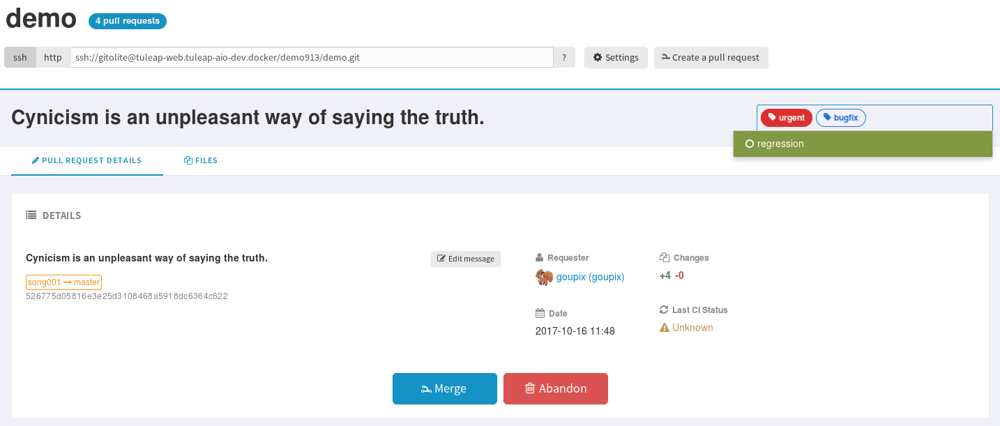

.. _project-labels:

Project Labels
==============

Projects labels enables you to add labels on items.
With the associate widget you can see all items corresponding to given labels.

.. NOTE::

    For now labels are only available for pullrequest service

Add a label
-----------

You can add labels on items by click on the "+" icon.
If label does not exists in project, it will be automatically created.
The input will suggest you existing project labels.

Remove a label
--------------
You can remove a label by clicking on the cross in label badge.

Administration of labels
-------------------------

If your project can use the Git pullrequest feature, the administration of labels is available for project administrators.
This administration panel allows project administrators to:

* Update label
* Add color for a label
* Remove a label
* Create a new label

.. figure:: ../images/screenshots/label/label-administration.png
    :align: center
    :alt: Administration of labels
    :name: Administration of labels

.. _label_widget:

Label widget
------------

.. attention::

  This module is part of :ref:`Tuleap Entreprise <tuleap-enterprise>`. It might
  not be available on your installation of Tuleap.

In your project dashboard, you can add several widgets to track your items:

.. figure:: ../images/screenshots/widget/label-dashboard.png
    :align: center
    :alt: Example of dashboard with labels widgets
    :name: Example of dashboard with labels widgets
