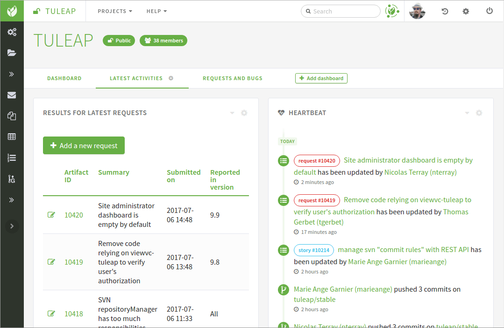

Project Dashboard
=================

The project dashboards are the entry point of a Tuleap hosted
project. And, for any project, they are the only pages you need to know
about. From those pages both ordinary registered users and project
members/administrators can access all project resources and services.
Unlike the project administration page, the dashboards are
public and can be visited by any Tuleap user including
anonymous ones. In some sense the dashboard display the public
face of a project.

.. _project-dashboard-content:

Project Dashboard Content
-------------------------

A sample project dashboard is available below. The page is split in
several areas:

-  The header with the project name and some indicators (project scope, number of members, …).

-  A navigation bar to access to each dashboard. For project administrators, this is where they can
   add a new dashboard, and edit or delete a dashboard. They can also add widgets to the current dashboard.

-  The various information presented by widgets.

   An example of project dashboard

Tuleap allows project admins to personalize the dashboards. The content
of the page is made of *widgets*. All widgets can be moved, collapsed or
removed. Some of them can provide an rss feed or be edited.

Other users than project admins will see the corresponding static page.
The widgets will be the same, in the same position, but they won't be
able to modify the page.

New widgets can be added through the dropdown entry "Add widget". Here is an
example of available widgets for the project dashboard:

-  **Public Areas**: this is an iconic list of all available services
   for this project along with some information next to it. Click on any
   of this item to access a service. The role of this area is pretty
   much equivalent to the sidebar except that it shows additional information
   about each of the service (e.g. list of trackers, …)

-  **Heartbeat**: the list of latest items updated in this project. This
   is helpful to have an overview of the activity of the project. Please note
   that not all services can push information in this widget; as of today
   Artifacts and Git activities are listed. Permissions apply, it means that
   the content of hearbeat will change from one user to another according to
   their permissions.

-  **RSS Reader** allows project admins to include public rss (or atom)
   feeds. For example the reader can display a feed published by
   external tools used by the project (like continuous integration).
