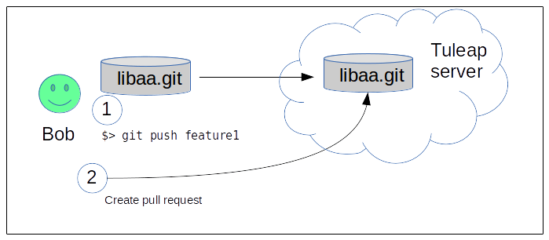

.. _code-review-with-pullrequest:

Code review with Tuleap Pull requests
=====================================

Tuleap pull requests are built on top of Git. They provide an easy way to do
code review and integration workflow.

Tuleap also support code review with :ref:`Gerrit <code-review-with-gerrit>`.

Features supported by Pullrequests:

* Create requests across branches in the same repository
* Create requests from a :ref:`personal forks <git-personal-fork>`
* Comment requests inline
* Comment requests globaly
* (cross)-reference requests from any point of Tuleap
* Integrate with Jenkins to know if the code to integrate pass the tests

Ways of working
---------------

There is not a single way to use pullrequests. The way you will use it depends
on the size of your team, the knowlege team members have with git and the workflow
you are already use to.

In this documentation we will present two possible workflows that will allow to
demonstrate all supported features. Keep in mind that you can define your own.

Simple workflow
---------------

The simple workflow doesn't require specific setup or to do advanced command with
git. It's suited for a small team or for git beginners.

We have 2 developers, Alice and Bob. Bob is a contributor that want to push a
new feature into the repository and Alice is the integrator who will review and
eventually merge the code produced by Bob

Bob got a local working copy of libaa and made a new contrib "feature 1". He thinks
the feature is ready to be integrated inside the public repository.

.. figure:: ../images/screenshots/pullrequest/simple_step1.png
   :align: center
   :alt: Local development
   :name: Local development

Create a pull request
'''''''''''''''''''''

Bob need to push his development to the Tuleap server and then, generate a pull
request

Once the code is on the server, Bob goes to the Tuleap web interface, in the
repository (git service).

From there he can create a pull request by selecting the source and target branches.

.. figure:: ../images/screenshots/pullrequest/simple_step3.png
   :align: center
   :alt: Create the pull request
   :name: Create the pull request

Source branch is where the work was done, target is where it should be integrated.

.. figure:: ../images/screenshots/pullrequest/simple_step4.png
      :align: center
      :alt: Select branches
      :name: Select branches

Bob is redirected on the pull request screen where he can quickly see the major
informations about his work.

The PR summary is automatically extracted from the first line of the first commit
message in the branch. The description is the rest of the commit message.

Those informations can be edited directly from the web browser.

.. figure:: ../images/screenshots/pullrequest/simple_step5.png
      :align: center
      :alt: Pull request screen
      :name: Pull request screen

Review the code
'''''''''''''''

Update a pull request
'''''''''''''''''''''

Merge the request
'''''''''''''''''

Advanced workflow
-----------------

To be done...

Integrate with Jenkins
----------------------

.. sourcecode:: bash

    mytuleap="https://my.tuleap.tld"
    repo_id=1
    rev=$(git rev-parse HEAD)
    branch="${GIT_BRANCH#*/}"
    token="generated token"

    if [ -f testpass ]; then
        status="S"
    else
        status="F"
    fi

    curl "https://$mytuleap/api/git/$repo_id/build_status" \
        -H 'Content-Type: application/json' \
        -H 'Accept: application/json' \
         --data-binary "{ \"status\": \"$status\", \"branch\": \"$branch\", \"commit_reference\": \"$rev\", \"token\": \"$token\"}"
