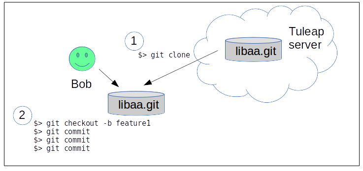
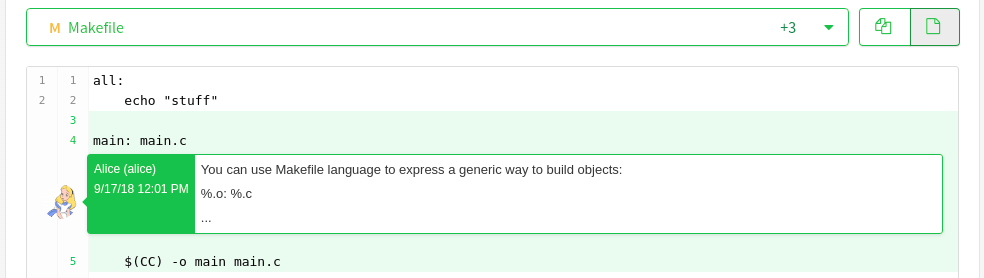
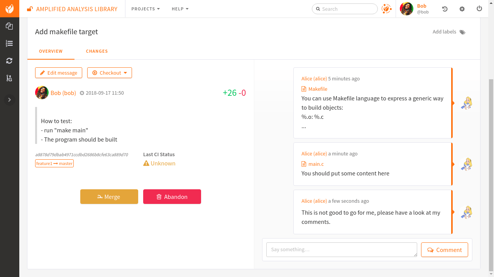
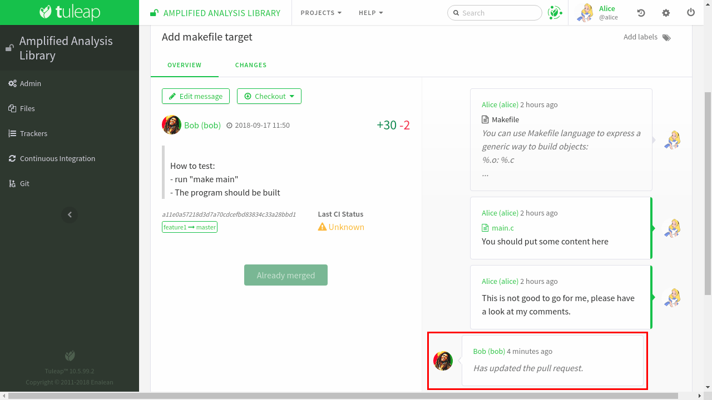
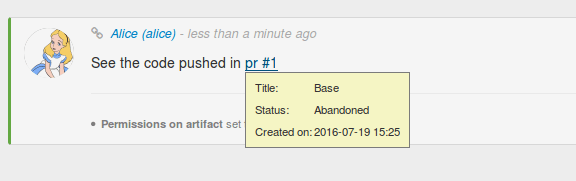

.. _code-review-with-pullrequest:

Code review with Tuleap Pull requests
=====================================

Tuleap pull requests are built on top of Git. They provide an easy way to do
code review and integration workflow.

Tuleap also support code review with :ref:`Gerrit <code-review-with-gerrit>`.

Features supported by Pullrequests:

* Create requests across branches in the same repository
* Create requests from :ref:`personal forks <git-personal-fork>`
* Comment requests inline
* Comment requests globaly
* (cross)-reference requests from any point of Tuleap
* Integrate with Jenkins to know if the code to integrate pass the tests

Ways of working
---------------

There is not a single way to use pullrequests. The way you will use it depends
on the size of your team, the knowlege team members have with git and the workflow
you are already use to.

In this documentation we will present two possible workflows that will allow to
demonstrate all supported features. Keep in mind that you can define your own.

Simple workflow
~~~~~~~~~~~~~~~

The simple workflow doesn't require specific setup or to do advanced command with
git. It's suited for a small team or for git beginners.

We have 2 developers, Alice and Bob. Bob is a contributor that want to push a
new feature into the repository and Alice is the integrator who will review and
eventually merge the code produced by Bob

Bob got a local working copy of libaa and made a new contrib "feature 1". He thinks
the feature is ready to be integrated inside the public repository.

Create a pull request
'''''''''''''''''''''

Bob need to push his development to the Tuleap server and then, generate a pull
request

.. figure:: ../images/screenshots/pullrequest/simple_step2.png
   :align: center
   :alt: Push code and create PR
   :name: Push code and create PR

Once the code is on the server, Bob goes to the Tuleap web interface, in the
repository (git service).

From there he can create a pull request by selecting the source and target branches.

.. figure:: ../images/screenshots/pullrequest/simple_step3.png
   :align: center
   :alt: Create the pull request
   :name: Create the pull request

Source branch is where the work was done, target is where it should be integrated.

.. figure:: ../images/screenshots/pullrequest/simple_step4.png
      :align: center
      :alt: Select branches
      :name: Select branches

Bob is redirected on the pull request screen where he can quickly see the major
informations about his work.

The PR summary is automatically extracted from the first line of the first commit
message in the branch. The description is the rest of the commit message.

Those informations can be edited directly from the web browser.

.. figure:: ../images/screenshots/pullrequest/simple_step5.png
      :align: center
      :alt: Pull request screen
      :name: Pull request screen

Review the code
'''''''''''''''

Once Bob has created the pull request, Alice can review it. The majority of the
work is available in the "Files" tab.

.. figure:: ../images/screenshots/pullrequest/simple_step6.png
      :align: center
      :alt: View files
      :name: View files

.. attention:: Important about diff

    The diff is generated between the latest commit and the base of the branch
    (common anscestor).

    If master evolved in the mean time, you won't see those changes (and potential
    conflicts) in this view.

    To propose an accurate review, you should rebase your work locally with the
    tip of the branch you want to push in before creating the pull request.

Alice can then comment inline the diff by clicking on the line number.

Update a pull request
'''''''''''''''''''''

Bob can see all the comments of Alice from the discussion view.

Then he should go back to work and update the branch, the pull request will be
automatically updated.

.. note::

    You can notice that Alice comments are greyed out. We can see that she placed
    a comment but we can no longer see it in the diff nor we can accessing the
    line from the comment.

    This is a known limitation when lines moves from one diff to another. The
    comment was placed on Makefile L4 at the first review but in the second
    review L4 was changed (the 2 first lines of the Makefile were removed).

    .. figure:: ../images/screenshots/pullrequest/simple_step10.png
          :align: center
          :alt: Diff detail
          :name: Diff detail

Merge the request
'''''''''''''''''

The work is now done, Alice can click on the "Merge" button and the code will be
integrated inside master.

.. figure:: ../images/screenshots/pullrequest/simple_step11.png
      :align: center
      :alt: After merge in master
      :name: After merge in master

Alice can also merge "by hand" in her own working copy and then push to the repository
the result will be the same.

Advanced workflow
~~~~~~~~~~~~~~~

To be done...

Reference pull requests
-----------------------

One of the key feature of Tuleap is to be able to reference anything from anywhere
and having a back reference automatically created on the other end. Pull requests
make no exceptions and follow this pattern.

From the PR, either in description, in global comments or directly within the diff
you can reference any Tuleap element (artifact, document, file release, ...). The
example below is a reference to an artifact in PR description:

.. figure:: ../images/screenshots/pullrequest/xref-to-tracker.png
      :align: center
      :alt: Cross reference from pull request
      :name: Cross reference from pull request

Note: in this example, the bug n°1, automatically got a link back to pull request:

.. figure:: ../images/screenshots/pullrequest/xref-backlink.png
      :align: center
      :alt: Cross reference backlink
      :name: Cross reference backlink

From any element in Tuleap, you can reference the pull request using ``pr`` or
``pullrequest`` keywords:

Integrate with Jenkins
----------------------

A good pullrequest is a pullrequest that doesn't break master.

Hence, before reviewing a PR, the team can ensure that the proposed code has the
green light from Jenkins.

The integration is a two step process:

* first you need to configure your repository to trigger builds on Jenkins whenever
  there is a commit in your repository
* then, in the jenkins job definition, you must add an extra step to feed tuleap
  back with job status (success or failure).

Configure Tuleap to Jenkins trigger
~~~~~~~~~~~~~~~~~~~~~~~~~~~~~~~~~~~

You need to configure Jenkins webhook as describe in the  :ref:`git documentation section<git-jenkins-webhook>`.

.. note::

    The continuous integration status is associated with the branch at the origin
    of the pull request so if you are using PR across repositories, you must
    ensure that the CI job is properly configured in source repo.

Configure Jenkins to Tuleap feedback
~~~~~~~~~~~~~~~~~~~~~~~~~~~~~~~~~~~~

There is no Tuleap jenkins plugin yet so you will need to add the quick snippet of
shell code at the end of your job to send the status of your build to Tuleap server.

Beforehand deploying the script you will need a special, secret, token to ensure
that it's your jenkins job that recored build status. To do so, go into repository
settings > API token:

.. figure:: ../images/screenshots/pullrequest/ci-token.png
      :align: center
      :alt: CI token
      :name: CI token

Then deploy the snippet bellow after having tailored the ``Configure`` arguments
to your context:

.. sourcecode:: bash

    # Configure: Tuleap server URL
    mytuleap="https://my.tuleap.tld"
    # Configure: id of your repository
    repo_id=1
    # Configure: paste the token generated in repository admin
    token="356c8877fee88a6951a6081026702e2b3420c5cbccfa85195246873861023f68"

    # following is the test to send either "Success" (S) or "Failure" (F) to
    # Tuleap server
    if [ -f testpass ]; then
        status="S"
    else
        status="F"
    fi

    # REST call, you shouldn't need to modify this
    rev=$(git rev-parse HEAD)
    branch="${GIT_BRANCH#*/}"
    curl "https://$mytuleap/api/git/$repo_id/build_status" \
        -H 'Content-Type: application/json' \
        -H 'Accept: application/json' \
         --data-binary "{ \"status\": \"$status\", \"branch\": \"$branch\", \"commit_reference\": \"$rev\", \"token\": \"$token\"}"
