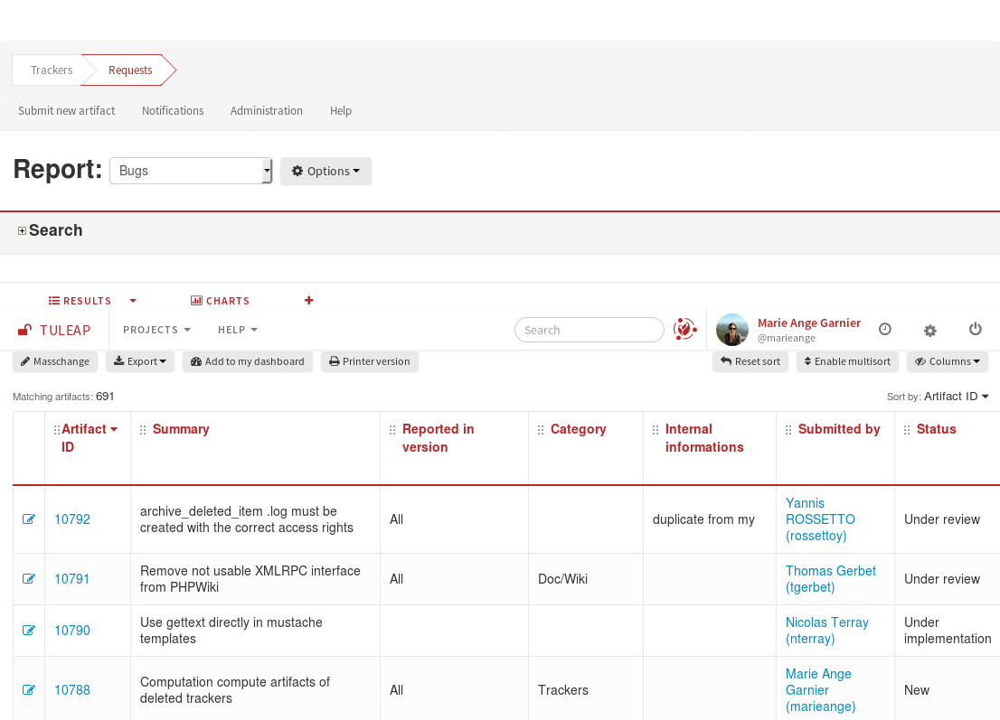

==============================
Search for existing artifacts
==============================

::

  MyTuleapProject > Trackers > MyTracker

Tuleap offers the ability to browse the artifact database
according to a variable set of criteria.

.. _services_trackers_a-tracker-browsing-screen:



   A Tracker browsing screen

Selection Criteria
``````````````````

The upper part of the artifact browsing screen is devoted to the
selection criteria. `A Tracker browsing screen`_ shows the default set of selection criteria that
is available when a new tracker is created. You can select bugs by
Category (the module in which the bug occurred), Group (nature of the
bug like Crash, Documentation Typo, ...), Status (e.g. Open, Closed,
...) and Assignee (the person in charge of the bug). But you may also
add or remove criteria by using the "Toggle criteria" link.(for more
details, see :doc:`../tracker-search-results/tracker-report-management`)

How selection criteria are filled out depend on their field type. The
Tracker Service currently has several types of fields used as search
criteria:

Select Box Field and Multiple Select Box Field
``````````````````````````````````````````````

A select box field can take its value in a set of predefined values. By
default, only one value can be selected at a time. If you want to select
multiple values at once, use the Advanced Search facility by clicking on
the + icon. A multi select box appears and allows the user to select
multiple values for the same field.

There might be 2 specific values in the list of choices: "Any" matches
any value in the list and "None" matches the items where no value has
been assigned yet.

Text Field
``````````

A Text field can contain any kind of text. There are two ways to query a
text field:

-  *Keyword search*: you can type a series of space separated keywords
   that will ALL be searched for in the text field (including as
   substring in words)

-  *Regular expression*: You can also specify a `MySQL Extended Regular
   Expression <https://dev.mysql.com/doc/refman/5.7/en/regexp.html>`_ as
   a matching criteria (mind the surrounding /.../ !)

   Examples:

   -  /^[Aa]ddition/ : matches any text field starting with either
      "addition"or "Addition"

   -  /foo\|bar\|dim/ : matches text fields containing the string "foo",
      "bar" or "dim"

Date Field
``````````

A date criteria follows the following pattern: YYYY-MM-DD where YYYY is
the year number, MM is the month number and DD is the day number.

Examples: 2015-03-21 is March 21st, 2015, 2017-12-05 is Dec 5th, 2017.

You can search an exact date (using = in the operator select box), all
dates before a certain date (using <) or all dates after (using >).

By cliking the + icon, you can use the advance search and search for
dates between two specific dates.

Integer Field
`````````````

An integer field can take positive or (possibly) negative values and has
no decimal part.

`Examples: 0, 1, +2, -100…`

There are several ways to query an integer field. Here are the values
you can specify in a integer query field:

-  *Single Integer*: if you type a single integer the field will be
   matched against this value (e.g. 610)

-  *Inequality*: if you use >, <, >= or =< followed by an integer the
   search will look for integer values which are greater, lesser,
   greater or equal, lesser or equal to the integer value (e.g. > 120 ,
   < -30)

-  *Range*: if you use the "integer1-integer2" notation the search
   engine will look for all values greater or equal to integer1 and
   lesser or equal to integer2 (e.g. 800 - 900 for integers between 800
   and 900, -45 - 12 for integers between -45 and +12)

-  *Regular expression*: `MySQL Extended Regular
   Expression <https://dev.mysql.com/doc/refman/5.7/en/regexp.html>`_ can
   also be used as a matching criteria (e.g. /^4.\*8$/ will look for all
   integer values starting with a "4", ending with an "8" with any
   number of digits in between.

Floating Point Number Field
```````````````````````````

A floating point number field can take positive or (possibly) negative
values, may have a decimal part or use the exponential notation for
large values.. .

`Examples: 0, 1.23, -2.456, 122.45E+12…`

There are several ways to query an floating point number field. Here are
the values you can specify in such a field:

-  *Single Number*: if you type a single number the field will be
   matched against this value (e.g. 2.35)

-  *Inequality*: if you use >, <, >= or =< followed by a number the
   search will look for all values which are greater, lesser, greater or
   equal, lesser or equal to the integer value (e.g. > 120.3 , <
   -3.3456E-2)

-  *Range*: if you use the "number1-number2" notation the search engine
   will look for all values greater or equal to integer1 and lesser or
   equal to integer2 (e.g. -1.2 - 4.5 for numbers greater than or equal
   to -1.2 and lesser than or equal to 4.5)

-  *Regular expression*: `MySQL Extended Regular
   Expression <https://dev.mysql.com/doc/refman/5.7/en/regexp.html>`_ can
   also be used as a matching criteria (e.g. /^4.\*8$/ will look for all
   values starting with a "4", ending with an "8" with any number of
   characters in between including the decimal point.

Comment Criterion
``````````````````

Starting Tuleap 9.18, it's possible to filter artifatcs by follow-up comments.
A new search option called ``comment`` is now always displayed.
It allows users to search artifacts that have at least one comment that contains the provided content.

.. attention::

 When searching in comments, you should be aware of some limitations:
  * Searches are done for words longer than 3 characters
  * Some words are not taken in account because they are too common (like ``the``, ``a``, ``please`` …)
