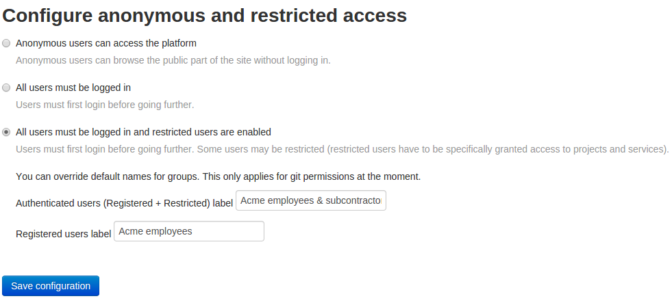

Permissions model
=================

Tuleap permission model is first defined by the platform configuration.
This configuration is done by site administrator in ``Admin > Configure anonymous and restricted access``
section.

   Admin of site access

As a site admin you decide whether:

* Anonymous users can access the platform (Anonymous)
* All users must be logged in (Registered)
* All users must be logged in and restricted users are enabled (Registered + Restricted)

Depending of the site setup, users can be in various meta-groups:

+----------------------+----------------------+-------------------------+
| Anonymous            | Registered           | Registered + Restricted |
+======================+======================+=========================+
| * Anonymous          | * Registered user    | * Authenticated users   |
| * Registered user    | * Project members    | * Registered user       |
| * Project members    | * Project admins     | * Project members       |
| * Project admins     | * *project's groups* | * Project admins        |
| * *project's groups* |                      | * *project's groups*    |
+----------------------+----------------------+-------------------------+

Please note that, in ``Registered + Restricted`` mode, site admin can customize the name
of the two meta-groups ``Authenticated users`` as well as ``Registered users``.

In most configurations, ``Registered + Restricted`` is used to separate ``Registered`` *regular* users
that are employees of the company from ``Restricted`` users that are subcontractors. Hence an "Acme" company
might want to rename the groups:

* ``Authenticated users`` -> ``ACME employees & subco``
* ``Registered users``    -> ``ACME employees``

Then the list of available groups would be:

+--------------------------+
| Registered + Restricted  |
+==========================+
| * ACME employees & subco |
| * ACME employees         |
| * Project members        |
| * Project admins         |
| * *project's groups*     |
+--------------------------+

Complete table

+-----------------------+---------------------------------------------+---------------------------------------------+-----------------------------------------------------------------------+
|   Site configuration  |                 Anonymous                   |                 Registered                  |                      Registered + Restricted                          |
+-----------------------+----------------------+----------------------+----------------------+----------------------+-------------------------+----------------------+----------------------+
| Project configuration |         Public       |       Private        |         Public       |       Private        | Public incl. Restricted |       Public         |         Private      |
+=======================+======================+======================+======================+======================+=========================+======================+======================+
|   Available groups    | * Anonymous          | * Project members    | * Registered user    | * Project members    | * Authenticated users   | * Registered user    | * Project members    |
|                       | * Registered user    | * Project admins     | * Project members    | * Project admins     | * Registered user       | * Project members    | * Project admins     |
|                       | * Project members    | * *project's groups* | * Project admins     | * *project's groups* | * Project members       | * Project admins     | * *project's groups* |
|                       | * Project admins     |                      | * *project's groups* |                      | * Project admins        | * *project's groups* |                      |
|                       | * *project's groups* |                      |                      |                      | * *project's groups*    |                      |                      |
+-----------------------+----------------------+----------------------+----------------------+----------------------+-------------------------+----------------------+----------------------+
