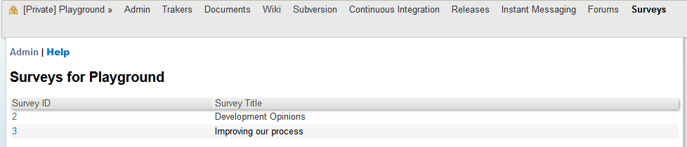
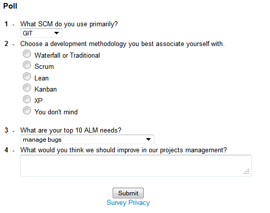
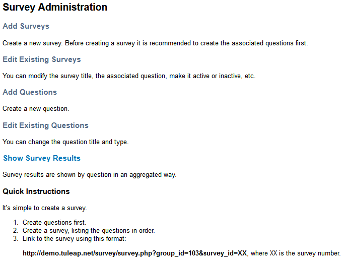
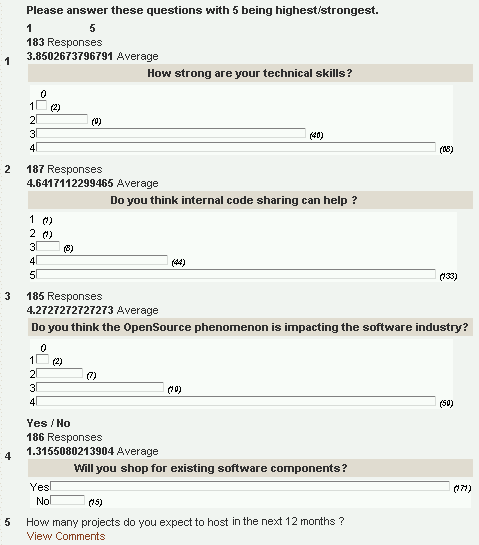

Survey Manager
==============

The Survey Manager allows a project team to create surveys. Providing a
survey service in an environment where most services are related to
software development activities may seem a bit strange at first glance.
However if you remember that Tuleap is about source code
sharing and community building, you'll soon realize that part of the
game in building a strong community is to listen to the community
feedback and make it happy.

Listening to your community can be done in various ways on
Tuleap:

-  through your project mailing lists and web forums,

-  from the feedback received when you post a piece of news on your
   Project Dashboard

-  or by analyzing the profile of the submitted Support Requests over a
   period of time.

All these communication channels allow Tuleap users to push
spontaneous feedback on a topic that they wholeheartedly cherish. But
what if you want to collect the opinion of your community on a precise
number of subjects and you want the answers to be taken from a set of
possible choices defined by the project team? This is precisely what the
Survey Manager is for. It allows you to:

-  formulate a precise a list of questions

-  define the set of possible answers for easy statistical analysis

-  make the survey accessible to virtually anybody via the Intranet

-  review the results to identify the dominant trends in your community
   of users.



   Survey Manager Welcome screen

Publishing a Survey
--------------------

*Audience: project members*

You have been working hard to produce this perfectly polished survey and
now you want to reach the broadest possible audience. With
Tuleap you can make your survey visible in a number of ways:

**Through the Survey Manager itself**: as soon as a survey is created it
is visible in your Survey Manager Welcome screen (see `Survey Manager Welcome screen`_). So any
Tuleap user visiting your Project Dashboard will see that
surveys are available in the "Public Area" (survey count not null) and
by clicking on "Surveys" she will be able to take whatever survey is
available.

**Project News Service**: when you have your new survey ready, make sure
you publish a piece of news about this survey: why you did it, who is
expected to take it and type the Web location corresponding to the
survey (see below). By publishing a piece of news you also have a chance
to see it on the Tuleap front page if the Tuleap
Team decides so.

**E-mail**: the survey you have created can be accessed directly via a
Web pointer (URL) on the Tuleap site. As a consequence you
can push your survey to virtually anybody in the Corporation simply by
referencing the survey Web pointer in an e-mail message, a web page or
any kind of office document. Even non Tuleap Users will be
able to take the survey.

All surveys created on Tuleap can be accessed through the
following Web pointer (URL):

::

    http://SYS_DEFAULT_DOMAIN/survey/survey.php?group_id=N&survey_id=X

where N is your project ID number and X is the survey ID number as shown
in the survey list displayed on the Survey Manager welcome screen. Your
project ID number N is visible on the Survey Manager Administration
screen (see `Survey Manager Welcome screen`_)

Taking a survey is just a matter of accessing the survey by one of the
previously mentioned method, answer the questions and click on the
"Submit" button at the bottom of the page. A sample survey is shown on
`A sample survey taken from the Tuleap project`_.

    **Tip**

    The information collected in these surveys are strictly internal to
    SYS\_ORG\_NAME. This information is being gathered to build a
    profile of the projects and developers being surveyed. The identity
    of those who answer surveys are suppressed and not viewable by
    project administrators or the public or third parties. The
    information gathered is used only in aggregate form, not to single
    out specific users or developers.



   A sample survey taken from the Tuleap project

Administering Surveys
----------------------

*Audience: project members*

Administrative functions of the Survey Manager can only be used by the
project members. The Administration module allows you to:

-  Create or modify a survey

-  Create or modify questions

-  Review the survey results

To access administrative functions of the Survey , go to your Project
Dashboard and click on the "Survey" item in the Project Main menu at the
top of the screen, then select the "Admin" item in the Survey Manager
menu (see `Survey Manager Welcome screen`_). From there you have access to all the Survey
Administrative functions (see `Survey Manager Administration screen`_).



   Survey Manager Administration screen

Survey Structure
`````````````````

In order to understand the survey creation and update process you must
first understand that the Survey module manages two distinct pools of
entities: a pool of surveys and a pool of questions. As a consequence of
this organization, creating a survey is a 2-step process:

First you create a set of questions along with the related set of
possible answers. All questions for all surveys are stored in a common
pool.

Then you create a survey mostly by giving it a title and attaching a
series of previously defined questions to it.

One of the interest of managing questions and surveys separately is that
you can create distinct surveys and re-use the same questions in several
of them if need be.

Creating or Editing Questions
```````````````````````````````

First thing first: if you want to collect people's opinion you must
first define a set of questions and the possible answers for each of
them. Designing a good survey is not an easy task and it requires a fair
amount of work: the value derived from the survey results depends
directly on the quality of your questions. A couple of advices: do not
put too many questions in a survey, questions must be short, clear,
unambiguous and non overlapping. So take some time to think about it
with your project team.

To create questions click on the "Add Questions" item either in the
Survey Manager Administration menu or in the content of the page itself.
Defining a question is simply a matter of typing the question itself and
then choosing a response type. There are 5 types of possible responses
(see `A sample survey taken from the Tuleap project`_ for some sample questions):

-  **Radio Buttons 1-5**: this response type will force the user to give
   an answer to the question on a scale from 1 to 5 using 5 radio
   buttons.

-  **Radio Buttons Yes/No**: this is a variant of the previous one for
   questions calling for a Yes or No answer.

-  **Custom Radio Buttons**: this response type allows the project
   administrator to define a set of answers from which the user may
   choose one. The possible answers are displayed as radio buttons.

-  **Select Box**: this response type allows the project administrator
   to define a set of answers from which the user may choose one. The
   possible answers are displayed in a select box.

-  **Text Field**: questions for which you want a short free text answer
   (one line)

-  **Text Area**: same as above but the user can enter multiple lines of
   text. This is when you want to have a detailed answer to the question

-  **Comment**: this is not really a question. It's a convenient way to
   insert comments in your list of questions.

-  **None**: Assigning this type to a question will result in the
   de-activation of the question. This question will disappear from all
   the surveys using it. As usual in Tuleap the question is
   not deleted and all the answers collected so far in the various
   survey where this question is used remain untouched.

At any moment in the creation phase you can display the list of existing
questions by clicking on the "Show Existing Questions" button at the
bottom of the screen

Editing questions is also possible. To do so, click on the "Edit
Existing Questions" item in the Survey Manager Administration menu or in
the content of the page itself (see `Survey Manager Administration screen`_). You are then presented with the
list of questions that are currently available in your question pool.
Clicking on the question identifier number in the leftmost column allows
you to change the question properties.

*Remark*: changing a question after responses have already been
collected is a bad idea especially when changing the question type. In
this case collected data will become inconsistent with the new question
type. On the other hand, correcting a typo in the question or making the
question clearer is perfectly OK and doesn't impact the existing set of
answers.

Creating or Editing a Survey
``````````````````````````````

Once you have created questions in the common question pool, you can
create a survey and attach questions to it.

To create a survey click on the "Add Surveys" item either in the Survey
Manager Administration menu or in the content of the page itself (see
`Survey Manager Administration screen`_). Then enter the following information:

-  The name of the survey (give it a short title)

-  The list of questions attached to the survey. This is a comma
   separated list of question identifiers (IDs) that you want to use for
   this survey. To see question IDs in a separate window, click on the
   "Show Existing Questions" and choose the appropriate question IDs
   from the list. The questions will appear in the survey in the same
   order as in the list.

-  The status of the survey: you can make it active or not. As long as a
   survey is inactive it doesn't show up in the welcome screen of the
   Survey Manager meaning that it is not visible to Tuleap
   users. Similarly accessing the survey directly via its Web location
   will not work either.

-  If you allow anonymous answer or not. Allowing anonymous answers give
   the opportunity to unregistered people (or not-logged ones) to answer
   the survey. If you don't allow anonymous answers, only registered
   (and logged in) users will be able to answer the survey.

At the bottom of the screen is a list of all the surveys defined for
your project. You can edit any of the survey by clicking on the survey
ID in the leftmost column. Editing a survey can be also be done by
clicking on the "Edit Existing Surveys" item in the Survey Manager
Administration menu and then choosing the survey to edit at the bottom
of the screen. While editing a survey you can change the list of
questions or the order of the questions without impacting the current
result set. If you remove a question from the survey, you won't be able
to view the existing set of responses. However it does not mean they are
lost. Re-inserting the question ID in the survey list allows you to view
the set of responses again (see next section).

Reviewing Survey Results
`````````````````````````

*Audience: project members*

At any point in the life of the survey, project members can have a look
at the existing set of answers that have already been given by the users
who took the survey. To review the results of a given survey click on
the "Show Results" item in the Survey Manager Administration menu and
then click on the Survey ID number you are interested in.



   Survey Results

A list of all the questions attached to this survey will show up on the
screen. Next to each question is an aggregate view of the existing
answers. For questions of type "text field" or "text area" you can
review the full list of answers. For radio buttons, the Survey Manager
compute the total number of answers, the average value as well as the
value distribution for radio button answers.

    **Tip**

    If you want to further massage the results of your surveys remember
    that Tuleap allows project administrators to export
    project data including survey results. For more details see :ref:`project-data-export`