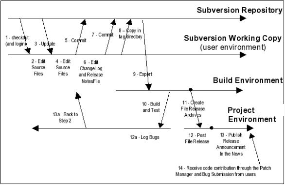

.. |SYSPRODUCTNAMES| replace:: *Tuleap*

.. _version-control-with-subversion:

Version Control with Subversion
===============================

This chapter is not a Subversion Tutorial. It focuses on the integration
of Subversion with Tuleap and how to use it in an optimal
way in this context. If you are not familiar with Subversion we warmly
advise you to first read some of the documents listed in the references
section (see `Subversion References`_).

It is important to note that a version control tool like Subversion is
just a part of the overall configuration management activity. Therefore,
Subversion alone does not constitute a complete configuration management
solution for your project. Depending on the maturity of a project, the
project may have specific policies regarding the use of the software
baseline or the integration of bug fixes, etc. The Subversion tool may
allow you to enforce some of these mechanisms but project managers
should make sure that these policies are documented, maintained and well
understood by all project members.

For example, a project may wish both to commit changes daily to avoid
loss of work, and to also insure that the baseline is always unit tested
code. Since the end of the day may arrive before the code or unit tests
are complete, a single baseline cannot accommodate both uses, so the
project may opt to use Subversion branches. Don't worry if you do not
initially know enough to write the final configuration management policy
for your project - this always tends to evolve as the project matures -
but do communicate regularly with the project members and improve your
configuration management plan on a regular basis.

Subversion: The Next Generation CVS
-----------------------------------

Subversion is an Open Source version control system that manages your
files and directories history over time. The Subversion effort started
in early 2000 under the leadership of Karl Fogel, a recognized guru of
CVS and author of the so-called 'CVS Black Book'(see `Subversion References`_). Like millions
of developers in the world, Karl had used CVS for years and acknowledged
the fact that, in spite of its merits, it had a number of shortfalls
that would be nice to fix.

From the very beginning the Subversion team, sponsored by the CollabNet
company, clearly stated that the goal was not to produce a revolutionary
version control system but rather to build on the strengths of CVS and
wipe out all of its weaknesses. As a result, like CVS, Subversion
belongs to the family of concurrent version control system. It means
that a team of multiple developers can concurrently manage their own
version of the same source code and gracefully merge the changes brought
to the software by the various team players.

But Subversion also comes with a number of enhancements over CVS:

-  **Directory versioning**: because CVS relies on the native file
   system of the machine it runs on it has been impossible to implement
   the versioning of directories. Subversion implements a "virtual"
   filesystem stored in a database that tracks changes to the entire
   directory and file tree.

-  **True version history**: moving and renaming files in a CVS
   repository has some limitations mainly due to the fact that
   versioning is attached to individual files. With Subversion you can
   add, delete, rename and copy files or entire directories without
   doing any compromise on the file naming or the file history.

-  **Atomic commits**: although Tuleap provides an
   additional layer on top of CVS which gives an atomic view of the
   commits, CVS itself has no notion of the fact that you may have
   committed a dozen file at the same time to fix a single bug.
   Subversion on the contrary stamps the entire tree with a new revision
   number each time you make a change.

-  **Versioned metadata**: Subversion can attach any number of
   properties (in the form of key/value pairs) to files and directories.
   Properties are themselves versioned like the files and directories
   they are attached to.

-  **Various access protocols**: Like CVS, Subversion offers a choice of
   network protocols to access a subversion repository. It can be a
   local file system access or a network access through the Subversion
   own's lightweight protocol (svnserve) or a secured remote access
   through SSH. Additionally and more importantly, Subversion can be
   accessed through the WebDAV protocol which is an extension of the
   HTTP protocol. This has a number of advantages like the ability to
   run all transactions through secure HTTP, go through firewalls and
   take advantage of the HTTP authentication methods.

-  **Efficient diff'ing**: when you create a working copy on your
   desktop machine, a complete version of the original file is kept on
   your disk which allows developers to perform ``status`` and ``diff``
   operations even when working offline.

-  **Efficient branching and tagging**: in Subversion these 2 operations
   are performed by literally copying (all or part of) the repository.
   The copy is virtual in the sense that the virtual filesystem
   establishes hard links to indicate from which revision the copy comes
   from. As a result branching and tagging takes a very small amount of
   disk space and, above all, it takes a constant amount of time
   regardless of the repository size.

-  **Fine grain access control**: in its Tuleap incarnation,
   your Subversion repository operates on top of the HTTP (or HTTPS)
   protocol and it therefore take advantage of the rich HTTP
   authentication mechanism. As a result Tuleap allows you
   to fine tune who has access to which part of your Subversion
   repository whether for read, write or no access at all.

-  **Extensibility**: like CVS, Subversion comes with a number of
   facility to hook custom processing at the various stage of a commit
   operation (pre-check, post-check,etc.). Unlike CVS, Subversion comes
   with well documented library APIs with bindings available for several
   languages like C/C++, Java, Python and Perl.

Subversion Clients
``````````````````

Subversion has a client-server architecture. In other words,
Tuleap developers who want to interact with the Subversion
repository of their project must have Subversion installed on their
desktop machine, hereafter called client. The Tuleap server
permanently runs a Subversion server in the background to which
Subversion clients talk to to act upon the Subversion repository.
Subversion clients come in various flavors for all sorts of platforms
(Windows and all Unix): command line interface, graphical based
interface and web based interface.

Command Line Interface
~~~~~~~~~~~~~~~~~~~~~~

Subversion comes with a command line interface that can be used on
virtually any platform (Linux/Unix, MS Windows, Mac...). Even though
Subversion has multiple command line options, most commands that you
normally use have one or two command-line options and are very easy to
remember and look a lot like cvs commands. Refer to `Subversion References`_ for more
information about how to use the Subversion command line.

Graphical Front-ends
~~~~~~~~~~~~~~~~~~~~

Subversion already has a number of graphical front-ends. rapidSVN is
part of the standard Subversion package and runs on Linux and Windows.
TortoiseSVN is another option for MS Windows users. jSVN is a Java based
client that can run on any platform. As time goes the list of graphical
front-ends will certainly grow. Refer to `Subversion References`_ for more information about
those graphical clients.

Setting up rapidSVN for Tuleap
~~~~~~~~~~~~~~~~~~~~~~~~~~~~~~

As mentioned above, rapidSVN is the graphical user interface that comes
with Subversion for Linux and Windows. Below are all the instructions
needed to get rapidSVN running on a Tuleap project. In the
instructions below, "username" is the Tuleap user login
name, and "projectname" is the Tuleap short project name the
user is working on.

-  Download rapidSVN from the Subversion Web site and install it on your
   PC.

-  Launch the rapidSVN application.

-  Create a new bookmark for your Subversion repository:
   ``Bookmarks->Add Repository...``

   When prompted enter the URL to your repository:
   ``http://svn.projectname.tuleap.example.com/svnroot/projectname``

-  Click on the new bookmark corresponding to your repository and type
   you Tuleap user name and password when asked to. You
   should now be able to browse the repository and see the file status
   and revision history.

-  To create your own working copy use the menu item
   ``Repository->Checkout...``

   When the dialog box pops up, type the same URL as above and choose
   where you want your working copy to be created.

-  A second bookmark corresponding to the new working copy should now
   appear in the bookmark pane on the left hand side of the screen. On
   the right hand side appears the list of files and directories of your
   working copy along with their revision number and status. From there
   use your favorite editor to modify the source code, hit the refresh
   button in rapidSVN to see modified files and commit your changes when
   your are done.

Subversion References
`````````````````````

As stated earlier in this chapter, this document is not a Subversion
Tutorial. If you want to learn more about Subversion refer to the
following documents:

-  The Subversion Book. See
   `http://svnbook.red-bean.com <http://svnbook.red-bean.com/>`__).

-  The Official Subversion Web Site. See http://subversion.tigris.org/
   This is where you'll find the subversion software including the
   rapidSVN client.

-  TortoiseSVN. A graphical MS Windows and Linux graphical client. See
   http://tortoisesvn.tigris.org/.

-  jSVN. A graphical 100% Java graphical client. See
   http://jsvn.alternatecomputing.com/.

Subversion Integration in Tuleap
--------------------------------

The Subversion Repository
`````````````````````````

Whenever a new project is hosted on Tuleap, a new Subversion
repository is automatically created and properly initialized. Each
project has its own Subversion repository as opposed to what happens in
most Subversion servers, where several projects share the same
repository. Having its own repository has a certain number of
advantages: the Subversion logs, history files, and all administrative
files (e.g. hook scripts) are unique to each project repository. This
allows you to fully customize the behavior of Subversion for a given
project without impacting the others.

    **Note**

    All interactions with a Subversion repository should normally happen
    through a Subversion client. However if need be and if this feature
    is available on your Tuleap server, you can get access
    to your Subversion repository via your Tuleap shell
    account (see :ref:`shell-account`). Once the shell session is active you'll find your
    subversion repository under ``/svnroot/projectname`` you should
    never do that unless you know exactly what you are doing.

The Subversion Repository Structure
```````````````````````````````````

When a new Tuleap project is created, it comes with a virgin
subversion repository that the project team must populate. Due to the
fact that Subversion manages branching and tagging through its virtual
filesystem (and not through labels attached to individual files as in
CVS) there is a recommended way to organize your repository. The layout
suggested below can be considered as a de-facto standard and we highly
recommend that you follow this best practice.

If you expect your Tuleap project to manage only one project
deliverable then you can create the following top-level directories in
your repository:

::

    /trunk
    /branches
    /tags


where ``/trunk`` contains the main line of development, ``/branches``
contains branch copies and ``/tags`` contains tag copies of your source
code that generally correspond to a given release.

If you expect your Tuleap project to manage several software
deliverables that are managed independently one from each other, then it
is often a good idea to first create top-level directories that carry
the name of the sub-project and under each of these directories repeat
the same structure as above. Assuming you have two subprojects named
``engine`` and ``client``, the initial layout of your repository should
look like this:

::

    /engine/trunk
    /engine/branches
    /engine/tags
    /client/trunk
    /client/branches
    /client/tags


More on the repository layout is available in the Subversion book listed
in `Subversion References`_.

The Subversion Browsing Interface
---------------------------------

Tuleap offers a number a facilities that allow you to
interact with your Subversion repository through the Web interface. The
Subversion Web interface does not intend to replace the Subversion
client that you should normally use on your desktop computer. It rather
focuses on providing you with additional features not found in
Subversion clients.

The Subversion Web interface can be accessed via the "Subversion" item
in the Project Main Menu or via the Subversion service listed in the
Public Area (see :ref:`an-example-of-project-dashboard`). The Subversion Web interface provides the following
features to end-users:

-  **Accessing the Subversion repository**: The welcome page of the
   Tuleap Subversion service gives you all the information
   you need to access the Subversion repository from your Subversion
   client. Among other things it tells you what the Subversion root path
   is and how to checkout the source code. This page may also be
   customized to display project specific instructions (see `Subversion Administration Interface`_).

-  **Browsing the Subversion repository**: this feature allows you to
   browse the Subversion repository even if you don't have a Subversion
   client installed on your desktop machine.

-  **Querying Subversion**: If the Subversion tracking feature has been
   activated for your project all Subversion events (commit, file
   addition or deletion) are tracked down in the Tuleap
   database. This audit trail can be searched using several criteria.

-  **Subversion Administration**: this service allows project
   administrator to perform the most common Subversion administration
   and configuration tasks from the Tuleap Web interface
   (for more details see `Subversion Administration Interface`_).

Let's review some of these features in more details.

Browsing The Subversion Repository
``````````````````````````````````

In order to interact with the Subversion repository of any
Tuleap-hosted project, you normally need to have Subversion
installed on your machine. However Tuleap also offers a
built-in Web browsing interface to the Subversion repository which
allows you to navigate in the source code, download it, view a file
history or compare two revisions of the same file.

.. figure:: ../images/screenshots/SVN_Web_Session.png
   :align: center
   :alt: Browsing the Subversion repository - A sample session
   :name: Browsing the Subversion repository - A sample session

   Browsing the Subversion repository - A sample session

Querying Subversion
```````````````````

If a project has the Subversion Tracking feature activated (see `Subversion Administration Interface`_), the
Subversion Web interface will bring very useful features to the software
engineers:

-  **Atomic Subversion commit and unique commit ID**: all changes (file
   modification, addition or removal) that are committed in one go from
   your Subversion client are assigned a unique commit ID also known as
   a Subversion revision number.

-  **Commit cross-referencing**: the unique commit ID (or revision
   number) generated at each commit can be referenced in future commits,
   or in the follow-up comments of project artifacts like
   bugs/tasks/support requests simply by using the pattern
   ``commit #XXXX``, or ``revision #XXXX`` or even ``rev #XXXX`` (where XXXX is the unique commit ID).
   Any reference of that kind will be automatically transformed into an hyperlink to the
   Subversion tracking database. This mechanism makes it very easy to go
   from project artifacts like bugs, support requests or tasks to source
   code changes and vice-versa (more on this mechanism at `Cross-Referencing Artifacts and Subversion Commits`_).

-  **Commit search**: another side benefit of the Subversion Tracking
   database is that you can use various search criteria to query the
   Subversion tracking database. You can search code changes by authors
   (who made the change), by revision number, by file path or by
   keywords to be found in the log message. Results can also be sorted
   by clicking on the headers of the search results (see `Querying the Subversion tracking database of a given project`_).

   A click on one of the selected commit ID brings you to a complete
   description of the change, the files that were impacted and the
   nature of the change with a direct link into the Subversion
   repository if you want to browse the file or look at the code
   modification (see `The detail of an atomic Subversion commit`_).

.. figure:: ../images/screenshots/sc_svnsearch.png
   :align: center
   :alt: Querying the Subversion tracking database of a given project
   :name: Querying the Subversion tracking database of a given project

   Querying the Subversion tracking database of a given project

Cross-Referencing Artifacts and Subversion Commits
``````````````````````````````````````````````````

While working in the development or the maintenance phase of a software
project, it is vital to keep track of the changes made to the source
code. This is what Version Control systems like Subversion do. In
addition to keeping track of the source code change history it is often
critical to relate the changes to the artifact (a task, a defect or a
support request) that led the developers to make a change in the code.
And conversely, when reading the artifact description it is also very
helpful to immediately see how the change was implemented.

The integration of Subversion in Tuleap precisely provides
Tuleap users with this bi-directional cross-referencing
mechanism. This is achieved through the use of reference patterns that
are automatically detected by Tuleap in either the follow-up
comments of the project artifacts or in the messages attached to a
Subversion commit.

The text patterns to type in a commit message or a follow-up comment are
as follows:

-  **XXX #NNN**: this pattern refers to the artifact XXX number NNN,
   where NNN is the unique artifact ID, and XXX is the tracker short
   name (e.g. "bug #123", "task #321", "req #12", etc.). If you don't
   know the tracker short name or don't want to specify it, you may
   simply use "art #NNN". When browsing a message containing this
   pattern anywhere in Tuleap, the pattern will be
   automatically transformed into an hyperlink to the artifact
   description.

-  **revision #YYY or rev #YYY**: this pattern refers to the commit YYY
   where YYY is the commit revision number. When browsing a message
   containing this pattern anywhere in Tuleap, the pattern
   will be automatically transformed into an hyperlink to the commit
   description which include log messages, impacted files, versions and
   author of the change(see `The detail of an atomic Subversion commit`_) .

-  The Tuleap reference mechanism allows cross-referencing
   with any Tuleap object: artifacts, documents, files, etc.
   Please refer to :ref:`reference-overview` for more details on References.

    .. figure:: ../images/screenshots/sc_svnshowcommit.png
       :align: center
       :alt: The detail of an atomic Subversion commit
       :name: The detail of an atomic Subversion commit

       The detail of an atomic Subversion commit

    **Tip**

    It is considered a best practice to always reference a bug, a task
    or a support request in any of the log message attached to a
    Subversion commit. Similarly when closing the related artifact
    (task, bug,etc.) make sure you mention the revision number in the
    follow-up comment. You will find this extremely convenient while
    trying to keep track of the changes and why they were made.

Subversion Administration Interface
-----------------------------------

Through the Tuleap Web interface, project administrators can
perform the most common administration and configuration tasks on their
Subversion repository. The administration functions can be accessed
through the ``SVN Admin`` menu item in the Subversion menu bar.

General Settings
````````````````

-  **Subversion Tracking**: Being a version control system Subversion
   is, of course, natively taking care of all your file history and is
   able to tell you what changes were made by whom and at what date. The
   file history is something you can look at either through your
   Subversion client or through the Subversion Web Browsing interface.

   If you activate the Subversion tracking (default) for your project
   Tuleap will also keep track of all the code changes in
   the Tuleap database. This will give you extra
   capabilities on your Subversion repository as explained in `Querying Subversion`_.

-  **Subversion Preamble**: In some cases (e.g. when your project
   already has its own subversion server in place), the project
   Subversion repository might not be hosted by the Tuleap
   server. In this case, the Subversion information displayed in the
   welcome page of the Tuleap Subversion service are
   inadequate. Fortunately, the project administrator can customize the
   Subversion Information page here.

Subversion Access Control
`````````````````````````

Default Access Permissions
~~~~~~~~~~~~~~~~~~~~~~~~~~

Subversion access permission depends upon the project status (private or
public) and the class of citizen a user belongs to (see :ref:`classes-of-citizens`).

Regarding private projects, only project members have access to the
Subversion repository. By default they all have read and write access.
This can be modified by customizing access permissions as explained
below.

With respect to the public projects, the default access permissions are
as follows:

-  **Anonymous Users**: users who have not registered with
   Tuleap (or are not logged in) have *no access at all* to
   the Subversion repositories.

-  **Registered Users**: have read-only access to Subversion
   repositories. In other words they can checkout a working copy of the
   software but they are not allowed to commit any changes they have
   made to the source code. Source code contributions (bug fix,
   enhancements…) from this class of user must return to the project
   team via the Patch Tracker (see ? ).

       **Note**: if the "restricted users" mode is on (See :ref:`classes-of-citizens`), then
       there is no access for non project members by default.

       **Note**: all source code accesses are recorded by
       Tuleap. Project administrators always have access to
       the list of people who accessed the source code (see :ref:`access-logs`).

-  **Project Members**: members of a Tuleap hosted project
   are granted a password protected read/write access. As mentioned
   above in the section about private projects, it is also possible to
   grant read-only access to the project members.

-  **Project Administrators**: same as project members.

Customized Access Permissions
~~~~~~~~~~~~~~~~~~~~~~~~~~~~~

Thanks to the integration of Subversion in the Tuleap
environment, project administrators can redefine access permissions for
some or all Tuleap users.

This can be achieved by specifying access permission rules that will
complement or even override the default settings. The syntax of the
access permission rules follows the following pattern:

::

    [path]
    name = permission


where:

-  ``path`` is the path to the directory or to the filename (relative to
   ``/svnroot/projectname``) in your repository for which you want to
   redefine access permissions.

-  ``name`` is either a Tuleap login name or group name. The
   name \* (star) means any registered user.

   If it is a group name it must be preceded with the @ character. The
   line ``name = permission`` can be repeated as many times as necessary
   for a given path. To define groups of users use the following block
   statement:

   ::

       [groups]
       groupname = username1,username2,...


   All project defined user groups (see :ref:`user-groups`) are also defined in the
   Tuleap default permissions settings and ready to use if
   you wish to redefine access permissions.

-  ``permission`` is either ``r`` for read-only access, ``rw`` for
   read-write access or blank if access is forbidden.

As an illustration, the default permission settings of a
Tuleap repository as explained in the previous section are
expressed through the following set of rules:

::

    [groups]
    members = member1,member2,...,memberN

    [/]
    * = r
    @members = rw


where ``member1,member2,...,memberN`` are the Tuleap login
name of the Tuleap project members.

Additionally, all existing user groups defined in this project are
listed in this section.

Note that if the user group is not defined neither in the default
permission settings nor defined by the user, each permission definition
for that group will be commented.

Attributing permissions to a specific user or to manually defined groups could
cause security issues. It is recommended that you only use Tuleap user groups to
define permissions.

These default permission settings are automatically generated, and
cannot be edited. You should consider this section as the beginning of
the Subversion permission file: project administrators can then edit
additional permissions that will be added below the automatic section.

Please note that it is not possible to restrict permissions already
granted on the same directory.

For instance, a public project has the default permission file detailed
above; it is useless to add a stricter rule on the root directory. For
instance, adding:

::

    [/]
    * =


will not prevent registered users to access the repository, since the
default rule already grants this permission. However, it is possible to
restrict permissions on a subfolder:

::

    [/secret]
    * =
    @members = rw


will indeed prevent registered users from reading the '/secret'
directory.

For more information about the format of this file you should refer to
the Subversion Book (see `Subversion References`_).

Subversion Email Notification
`````````````````````````````

In addition to tracking the changes in the Tuleap database,
Tuleap can also send a nicely formatted email message to
individual email addresses or mailing lists each time there is a change
in the source code. The email message contains the log message, the
author of the change, the list of impacted files and pointers to the
Subversion repository showing what changes were made.

Project Administrators can configure the following settings for email
notification:

-  **Subject Header**: is a piece of text that will appear as a trailer
   in the Subject of all the email notifications sent to the addressees.
   This trailer is supposed to help the addressee to quickly spot the
   messages in their Inbox or to put filters in place to route the email
   notification to a given folder.

-  **Path**: subversion path on which notification will be sent.

-  **Email addresses**: a comma separated list of email addresses of
   people to whom the email notification must be sent can be given. If
   you want to notify a large group of people then we strongly advise
   you to create a mailing list first (see below).

    **Tip**

    If you intend to generate email notification for the changes made in
    your Subversion repository or a specific path, it is a good practice
    to create a specific mailing list called ``projectname-svnevents``.
    By doing so, Tuleap users and project members interested
    in receiving the email notification just need to subscribe to the
    mailing list. In addition, the Tuleap mailing list
    manager will archive all the email messages which can prove very
    useful for future reference. See :ref:`mailing-lists` for mailing list creation.


Subversion Immutable tags
`````````````````````````

Thanks to the integration of Subversion in Tuleap, SVN Administrators
can define immutable tag paths.
An immutable tag is a path where contributors won't have right to
update or delete exiting files.

**Immutable Tags:**

Given the following structure :
::

 - /repository_name/tags
 - /repository_name/tags/README.txt

And given an immutable tag define on /repository_name/tags :
::

 - I cannot update or delete README.txt
 - I can create a new file like /repository_name/tags/new_file.txt

**Whitelist:**

It is possible to define folders where you can enhance this rule
and add new content by defining paths in immutable tags whitelist.

Given the following structure :
::

 - /moduleA/trunks
 - /moduleB/trunks
 - /tags


Given an immutable tag define on /tags
and a global whitelist defined on /tags/module*
::

 - I can add content in /tags/moduleA or /tags/moduleB
 - I cannot update or delete content in /tags/moduleA or /tags/moduleB
 - I still cannot update or delete /tags/moduleA/README.txt or /tags/moduleB/README.txt
 - I still can add new file like /tags/moduleA/new_file.txt or /tags/new_file.txt

.. figure:: ../images/screenshots/immutable_tags.png
   :align: center
   :alt: Immutable tags Tuleap interface
   :name: Immutable tags Tuleap interface

   Immutable tags Tuleap interface


A Typical Subversion Life Cycle
-------------------------------

As stated earlier, the intent of this chapter is not to give a formal
Subversion training but rather to explain what are the steps a project
team typically goes through when using Subversion and, more generally,
all the Tuleap tools involved in a Software release process.

It also deals with the problem of contributing source code when you are
not part of a project team. In this section all examples are given in
the form of Subversion command lines but transposing them to graphical
front-ends should be relatively straightforward.

.. _a-typical-software-development-life-cycle-on-Tuleap:



   A Typical Software Development Life Cycle on Tuleap

Logging In
``````````

*Audience: all* |SYSPRODUCTNAMES| *users*

Unlike CVS when used with the pserver protocol there is no explicit
login command to issue to start working with a Subversion repository.
Subversion will ask for your login name and password only when
performing an operation (e.g. commit) that requires authentication.

Access SVN with username/token instead of username/password
```````````````````````````````````````````````````````````

If the project allows it, you can use a token instead of your password when using SVN.

1) Generate a token

   First, you need to generate a token for your account. Go to you account preferences, generate a new SVN token. **There's no way to retrieve this token so don't forget it**. You can generate as many tokens as you want so if you loose one of your tokens, just delete it from you account preferences and generate another one.

   .. image:: ../images/screenshots/svn-token.gif
      :scale: 50 %

2) Use your token

   If the project can manage SVN tokens, just use your token instead of your password when using SVN.

Importing Existing Source Code
```````````````````````````````

*Audience: project members*

As the happy administrator of a new Tuleap project, the
first thing to do is to populate your freshly brewed Subversion
repository with your project source code. To do so, first create a new
directory ``topdirectory`` on your workstation and populate this top
level directory with the recommended directory layout documented earlier
(see `The Subversion Repository Structure`_).

Place yourself into the ``topdirectory`` and type the following command
(in one line):

::

    svn --username loginname import .
    http://svn.projectname.tuleap.example.com/svnroot/projectname
    --message "Initial repository version"


Where:

-  ``projectname`` is the project short name

-  ``loginname`` is your Tuleap login (all lowercase). The
   --username option is only needed if your Tuleap login
   name is different from the Unix or Windows login name you are
   currently working with.

    **Note**

    If your Subversion server is configured in secure mode, note that
    you should use ``https://tuleap.example.com/svnroot/projectname``
    instead of
    ``http://svn.projectname.tuleap.example.com/svnroot/projectname`` in
    all the examples given on these pages.

   **Tip**

   It is not unusual to make a mistake when importing your source code
   into a fresh Subversion repository especially for new users. Typical
   mistakes are directories placed at the wrong level or with the wrong
   name. Nothing to fear though... If you want to start again from a
   fresh Subversion repository contact the Tuleap Team to
   get your Subversion repository reinitialized. Alternatively you can
   easily delete or move directories and files with any subversion
   client afterwards.

    **Note**

    Note that if you already have a Subversion repository available, the
    Tuleap Team can help you migrate this repository on
    Tuleap and preserve all of your project history. We just
    need a dump of your Subversion tree generated with the
    ``svnadmin dump`` command. With this dump the Tuleap
    Team will re-install everything for you on the Tuleap
    server. Contact us for more information.

Checking Code Out
`````````````````

*Audience: all* |SYSPRODUCTNAMES| *users*

Once a Subversion repository has been populated other Tuleap
users can checkout the source code and place it on their own
workstation. The result is called a working copy in the Subversion
jargon. Note that 'checkout' in the Subversion world does not mean that
the user has acquired any sort of lock on the file. The Subversion
paradigm is: anyone (with the right permissions) can retrieve a working
copy for editing; changes are reconciled or flagged for conflict
resolution when the file is committed. Unlike other tools (RCS, SCCS,
ClearCase...) Subversion is a concurrent version control system.

A working copy is NOT an image of the Subversion repository. It is
rather a snapshot of the source tree at some point in time and, by
default, it's the latest version at the time the working copy is created
or updated. One of the interesting features of a working copy is that it
is a self-contained entity. In other words, a working copy contains all
the necessary information for Subversion to know exactly which
Subversion server and repository it is coming from and the corresponding
moment in the history of the source tree . This is also why you won't
see the URL option pointing to the Subversion repository in all
subsequent Subversion commands presented here. These commands run from
within a working copy, so Subversion knows exactly where the Subversion
repository is.

To create a working copy of the entire project type the following
command:

::

    svn checkout http://svn.projectname.tuleap.example.com/svnroot/projectname

Where:

-  ``projectname`` is the project short name

Updating the Source Code
````````````````````````

*Audience: all* |SYSPRODUCTNAMES| *users*

Running an update command from within a working copy has the effect of
updating the working copy (or a subpart of it) with the latest version
of each source file from the repository. To update a working copy type:

::

    svn update


Examining your Changes
``````````````````````

If you want to know which files have been modified in your own working
copy since your last update, run the following command:

::

    svn status


Or wich files have changed on the Subversion repository since your last
update :

::

    svn status -u


The output will show you a list of files which undergo some changes
either because they were modified, added or deleted.

To compare your locally modified version of a file with the original
version in the Subversion repository, you can use the diff command:

::

    svn diff filename


If no ``filename`` is specified the diff operation is applied
recursively on all the files and sub-directories.

Committing your Changes (project team)
``````````````````````````````````````

*Audience: project members*

Project members involved in development activities will likely want to
contribute the changes made in their own working copy back to the
Subversion repository. In Subversion terminology this is called a commit
operation.

To commit changes you have made in your working copy, type the following
command:

::

    svn commit -m"Explain the nature of the change here..." filenames


Where:

-  The -m option is followed by a text message explaining what changes
   you have made.

-  The *filenames* argument is optional. It can be individual files or
   directories. If there isn't any files mentioned Subversion will
   automatically commit all the modified files in the directory where
   you are located and all sub-directories recursively.

    **Tip**

    In the ideal world, all modifications made to the source code of a
    project should be related to either a bug logged or to a task assign
    to a developer. If your project team lives in this wonderful world
    :-) then don't forget to include the related bug or task ID number
    at the beginning or at the end of your commit message. The
    Subversion hook scripts can help you enforce this rule by checking
    the format of all the submitted commit messages and reject them if
    it does not follow the recommended pattern.

    **Tip**

    If you try to commit a modified file that was also modified on the
    Subversion repository in the meantime, the Subversion server will
    refuse to execute the ``svn commit`` command. You must first execute a ``svn update``
    command to bring your own working copy up to date with latest
    version, merge your changes with those from others (Subversion does
    it automatically in most cases) and then only commit your own
    changes back to the Subversion repository. If you want to be immune
    from others' changes then create a Subversion branch and work with
    it in isolation.

.. _contributing-your-changes-(for-other-users):

Contributing your Changes (for other users)
```````````````````````````````````````````

*Audience: all* |SYSPRODUCTNAMES| *users*

This is a variant of the previous section for those of you who do not
have write access to the Subversion repository of a project and,
therefore, cannot commit their modifications to the Subversion
repository.

The variant explained here is actually a method that is universally used
in the Open Source world to contribute source code modification to the
project team. It consists in the generation of a text file containing
the differences between your modified version of the source code and the
original one that you initially checked out. This file is often referred
to as "diff file".

The reason why diff files are so popular is because they follow a
well-documented format. Diff files are sent to the original project team
which, upon reception, is going to use another universal tool called
``patch`` to automatically merge the contributed changes with the master
copy of the source code. This is why, by extension, a diff file is also
often referred to as a *patch*.

Diff files can be generated either with the *diff* tool (part of the GNU
tools) that is available on all platforms including Windows or directly
from within a Subversion working copy.

**The Diff way:**

-  Use the diff way when you obtained the original source code from a
   File Release and not from the project Subversion repository. Let's
   assume the original source file is under the directory
   ``project-0.1/`` and that your modified version is under
   ``project-0.1-new/``

-  You can generate a diff file with the following command (all files in
   subdirectories will be checked recursively for changes)

   ::

       diff -rc project-0.1/ project-0.1-new/

**The Subversion way:**

-  This is the preferred way when you obtained the source code by
   creating your own Subversion working copy. Let's assume that you are
   at the top level of the working copy.

-  You can generate a diff file between your version and the very latest
   version in the Subversion repository for the entire source tree by
   typing with the following Subversion command:

   ::

       svn diff

-  If you want to generate a diff against a specific version of the
   source tree, then specify the revision number in the command line
   (revision #9398 in the example below):

   ::

       svn diff -r 9398

In both cases, you should redirect the output of the diff or svn diff
command in a text file. Compress the output file if it's a large one and
use the Tuleap Patch Tracker (see ?) to submit your patch to
the project team.

And thanks for contributing some code!

Exporting and Packaging
```````````````````````

*Audience: project members*

There is a quick and easy way to release a pre-packaged version of your
source file and make it available to all Tuleap users
through the File Release mechanism (see :ref:`delivery-manager`).

Make sure all the project members involved in software development have
committed the changes that were supposed to appear in this new release.

Update your own working copy with the changes committed by all other
project members with the following command:

::

    svn update

Update the ChangeLog, Release Notes and README file at the top of your
source tree and commit the changes for these 3 files.

Create a tagged copy of your source code from the main development line
with the appropriate version number. Assuming that the name of the
release is ``myproject-1.4`` the creation of the new release is as
follows:

::

    svn copy
    http://svn.projectname.tuleap.example.com/svnroot/projectname/trunk
    http://svn.projectname.tuleap.example.com/svnroot/projectname/tags/myproject-1.4
    -m "Tagging the 1.4 release"

Your software release is now ready. Export a clean image of the release
1.4 (without Subversion specific files) from the Subversion repository
by typing:

::

    svn export
    http://svn.projectname.tuleap.example.com/svnroot/projectname/tags/myproject-1.4

Create a ZIP or tar archive with the entire ``myproject-1.4/`` directory

Deliver this archive through the File Release service (see :ref:`delivery-manager-administration`).

Done! Nice job...Take a break. And remember to announce the availability
of your new version via the Tuleap News service (see :ref:`news-service`).

Subversion for Project Administrators
-------------------------------------

Subversion Hook Scripts
```````````````````````

Tuleap offers an easy to use Web interface to administrate
the common settings of your Subversion repository like access control
and email notification. In case project administrators want to go deeper
in customizing the behavior of their Tuleap repository, they
can get access to the Subversion hook scripts.

In order to access those hook scripts, you must be granted the right to
log into the Tuleap server with your Shell Account (see
:ref:`shell-account`) [#f1]_.


Once logged in, type the following commands at the shell prompt:

-  ``newgrp projectname`` (where ``projectname`` is the short project
   name)

-  ``cd /svnroot/projectname/hooks``

-  If the hook scripts you want to customize does not yet exist in the
   ``hooks`` directory, first create them by copying the corresponding
   template file provided by Subversion (``.tmpl`` extension). Then edit
   the hook scripts in place.

-  ``exit`` (Logout)

    **Tip**

    If you decide to customize the Subversion hook scripts for your
    repository make sure to preserve the statements that could have been
    inserted by Tuleap in the first place. The
    Tuleap statements are clearly marked with a recognizable
    header and trailer.

.. [#f1]
   The Shell Account may have been deactivated by your
   Tuleap site administrators.
