.. _testmgmt:

Test Management
===============

.. attention::

  This module is part of :ref:`Tuleap Entreprise <tuleap-enterprise>`. It might
  not be available on your installation of Tuleap.

The Test Management plugin of Tuleap aims at providing a simple and easy way to deal with
test campaigns.

Test Management features:

* Create and maintain test case definitions
* Create test campaigns as a collection of test cases
* Follow test executions (Not run, passed, failed, blocked)
* Realtime update for concurrent test execution by team

Overview
--------

Here are the main concepts with Tuleap Test Management:

* Test Case: it's the description of something to test. The definition is meant to be re-used
* Test Campaign: a collection of Test Case to run.
* Test Execution: it's the execution of one Test Case in the context of a Test Campaign
* Environment: a given Test Excecution can run in different contexts (Same test but different setup)

Test Case, Test Campaign and Test Execution are 3 different trackers. Environment is a property of "Test execution".

Run a Test Campaign
-------------------

The welcome screen of Test Management lists all active Test Campaigns with a quick
overview of the overall progress and the ability to access the test list.

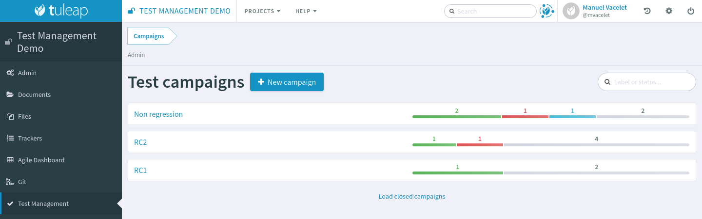

By hitting "Test list" you will see the list of tests proposed in the given campaign.

In the following figure, the user selected a test that "Passed".

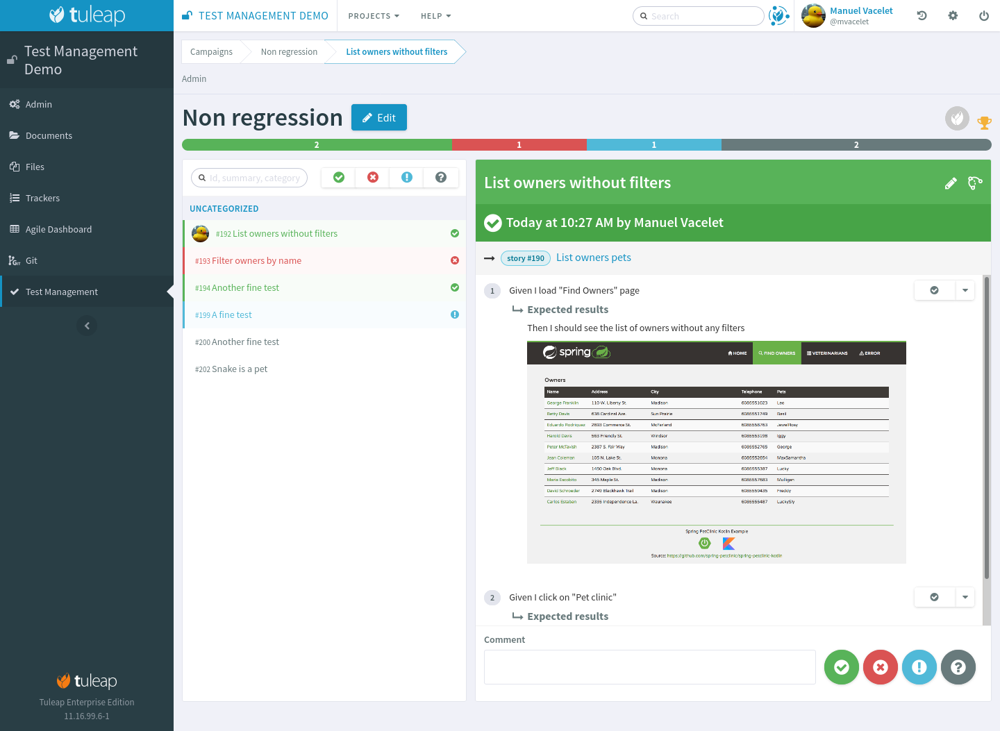

Tests can have following status:

* Not run, this is the default
* Passed, the test was successful
* Failed, the test lead to an error
* Blocked, the test cannot be run

One can switch from one state to another (a test can be "Not run" then "Passed",
re-switched to "Not run" because tester didn't get what was described to finish by "Faild").

Tuleap will record the time taken for each test. It works this way:

* It starts as soon as you load the test definition.
* It ends when you hit one of the action buttons.

Time is not yet used in the interface, it's only recorded for a future usage. You
can see the value and make your own computation from the "Test Execution" tracker.

Example of test failure:

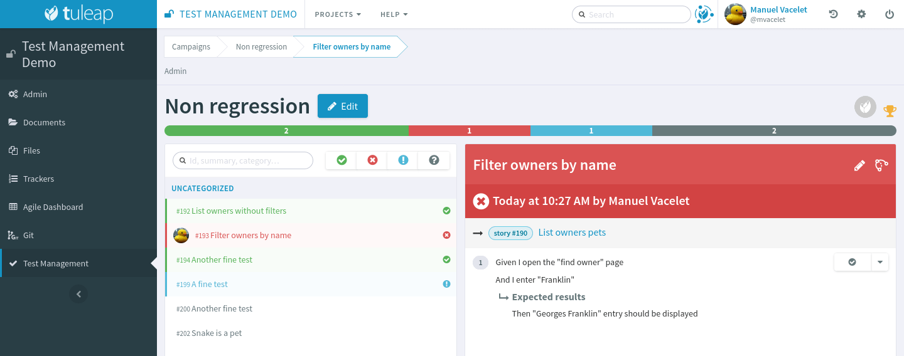

Modify or create tests
~~~~~~~~~~~~~~~~~~~~~~

You can create tests directly inside the "Test Case" tracker, it means that you
benefit of all tracker power for artifact creation:

* Create one after another
* Import from CSV
* Import via REST
* Import via XML

You can also directly create tests in campaigns, this is convenient if you don't
already have a base of tests or if you want to create test.

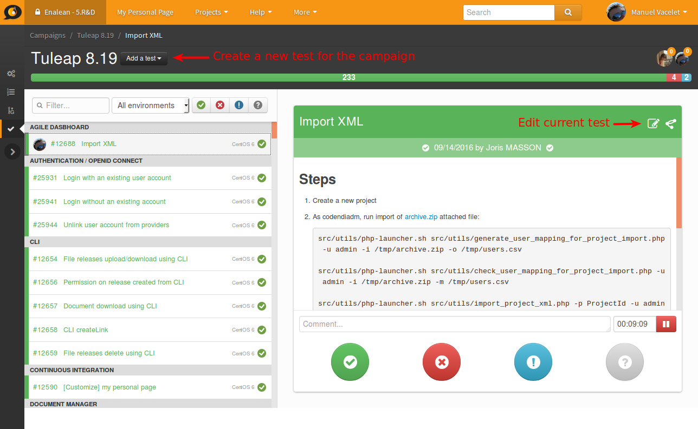

You can also edit the test directly from the interface.

The test you create or you edit are automatically updated in the test campaign
and will be re-usable in a following campaign.

Test steps
----------

Starting Tuleap 10.3, a test case can be divided into steps. Each step have to be run in the campaign.

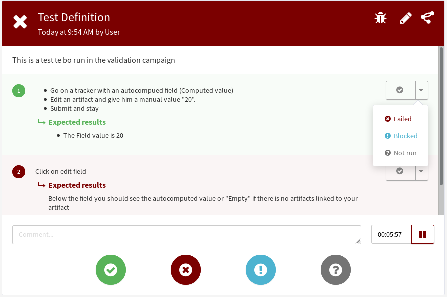

These steps provide a global result for the tests:

* All steps are done -> test done
* At least one step failed -> test fail
* At least one step is blocked -> test blocked
* At lest one step is not run -> test not run

Create or modify steps for your tests
~~~~~~~~~~~~~~~~~~~~~~~~~~~~~~~~~~~~~~

There are two new fields to add in your testmanagement trackers to be able to defined your steps:

* Field ``step definition`` into Test definition tracker
* Field ``step execution`` into Test execution tracker.

If one of this field is missing, steps cannot be run. In addition, these fields can only be added in the Test definition tracker
and Test exec tracker defined in your testmanagement configuration.

To have working steps, these 2 fields must have a specific shortname:

* Field ``step definition`` must have the shortname ``steps``
* Field ``step execution`` must have the shortname ``steps_results``

Once these fields added, you can defined your step in your test case by editing the artifact:

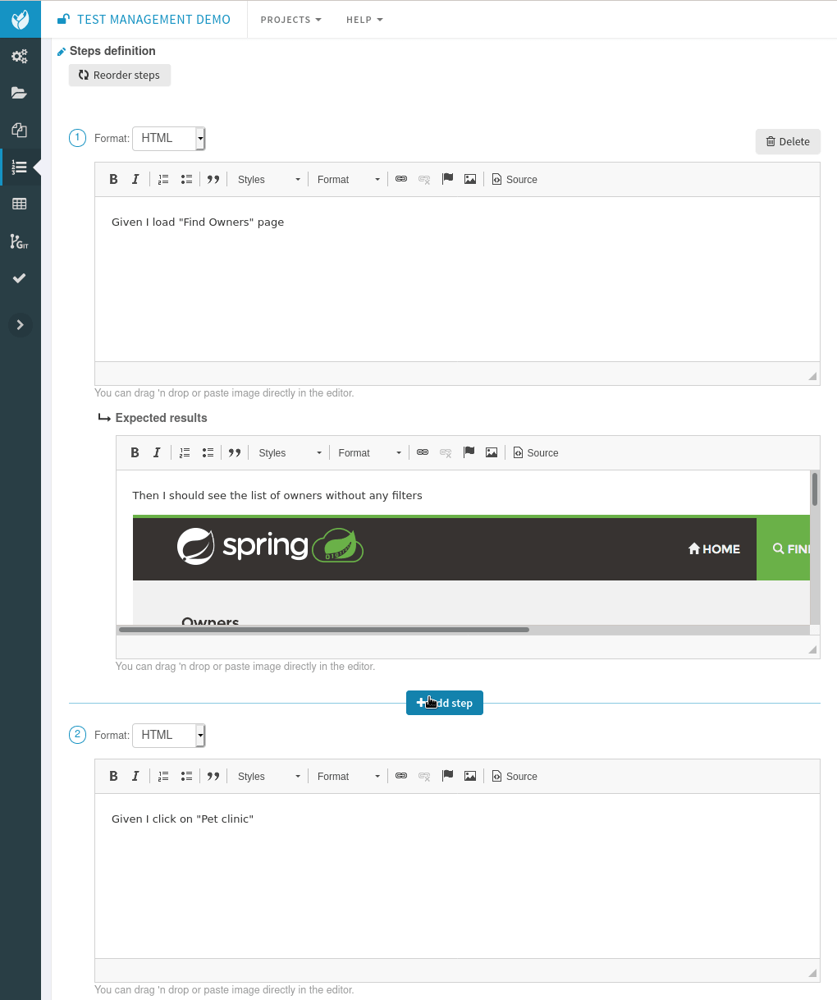

Create a Test Campaign
----------------------

From the home page of the service, there is "New campaign" button that will open
the Campaign creation screen.

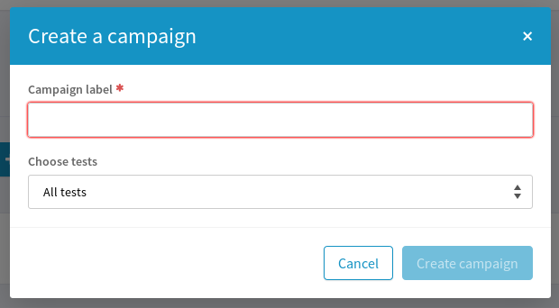

You need to give a name to your campaign and select which tests you want to execute
during your validation campaign.

Adding Tests to a Campaign
--------------------------

Once the validation has started you might want add some new tests to your campaign.
Open your campaign by clicking on "Details button".

Then click on the "Edit" button.

A new modal will enable you to look for existing artifacts or to create directly a new one.

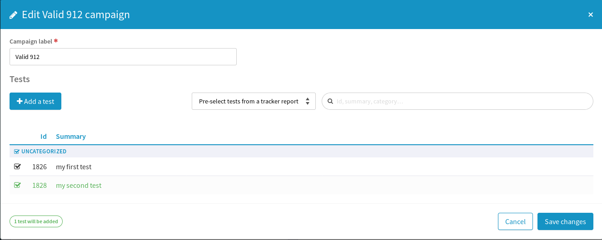

Link tests with requirements / user stories
-------------------------------------------

.. warning::

    This feature is under development. This covers what's available in Tuleap 11.16 release. Shall you want to know
    what's cooking for next release, please have a look at `Test Plan Epic <https://tuleap.net/plugins/tracker/?aid=14871>`_.

If your project also uses the Scrum backlog of Agile Dashboard service, a "Tests" tab will be added to milestones.

This tab shows the test plan and campaigns of the milestone.

.. figure:: ../images/screenshots/testmanagement/testplan.png
   :align: center
   :alt: Test plan over a release
   :name: Test plan over a release

The *Test* tab allows:

- to define how the feature that are being developed will be tested
- to build the test campaigns along the release progress
- to see the actual coverage of each backlog item (user stories, bugs, requirements, ...) with a traceability matrix

Test plan
~~~~~~~~~

The left hand side of the screen displays the backlog items of the milestone and their associated tests. This allows you to see how the
content of the milestone is covered by tests, and to add new tests for each items.

You need to have the permission to update the artifact links of the backlog item as well as the permission of creating test case in order to add new tests.

When you click on "Create a new test" you go in "Artifact creation" view of the test case tracker. On "Submit" you will be redirected to the
test plan you where. You can create several tests at once by choosing "Submit and continue".

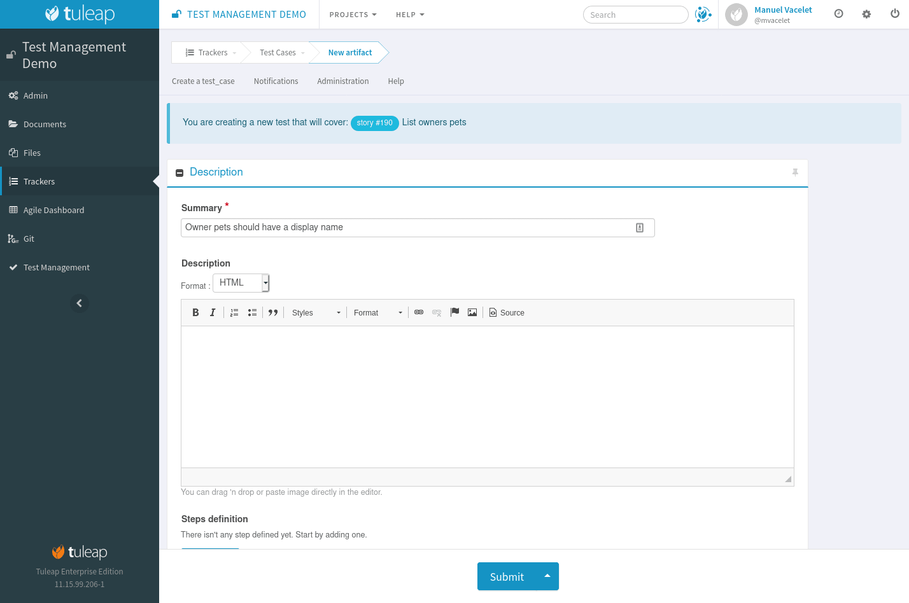

If a test has been executed in at least one of the campaign of the milestone, then its status is displayed on the right hand side of the test case (Passed, Failed, Blocked, or Not run).

The status comes from the last execution of the test in any campaign of the milestone. In following screenshot, "Filter owners by name" status is "Failed" because the test *failed*
in "RC2" campaign but it might have *passed* in RC1 campaign.

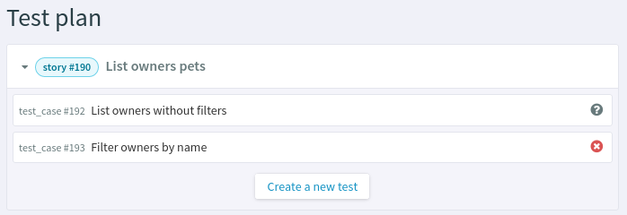

Tests can be either manual or automated (see :ref:`Test Automation <testmgmt_automation>` section below)

Test campaigns
~~~~~~~~~~~~~~

The right hand side of the screen displays all campaigns that are linked to the milestone and their tests progression.

From here the creation of new campaigns is available. When a campaign is created from this screen it's automatically linked to the milestone.

A campaign can be created with an initial set of tests:

* No tests: the campaign won't have any tests
* All tests: all test cases will be added to the campaign
* **All tests in <milestone>**: (this is the default) only test cases that are linked to a backlog item of the milestone will be added to the campaign
* From tracker reports: only test cases that matches a given report's criteria will be added to the campaign

Test strategies
~~~~~~~~~~~~~~~

When creating a campaign from a milestone, Tuleap encourage to pick-up the tests of the milestones. That's great to ensure
that the feature you built works as expected.

However you might also need to guaranty some kind of non regression on feature previously delivered. How to do it ?

By default, you can create two non regression test suites. Each test case has a "Test Suite" field with 2 possible values:
*Simple* and *Full*. A test can be in either tests suites, both or none.

Once you have made some tests available in one
of those test suites, you will be able to create a non regression campaign in your release with either *Test Suite Complete* or
*Test Suite Light* as shown below:

.. figure:: ../images/screenshots/testmanagement/testplan-nonreg-create.png
   :align: center
   :alt: Create a non regression test suite
   :name: Create a non regression test suite

The Tuleap best practice for tests is to have at least 2 campaigns per milestones:

- the campaign that validates the **new** features,
- the campaign that ensures the **non regression**.

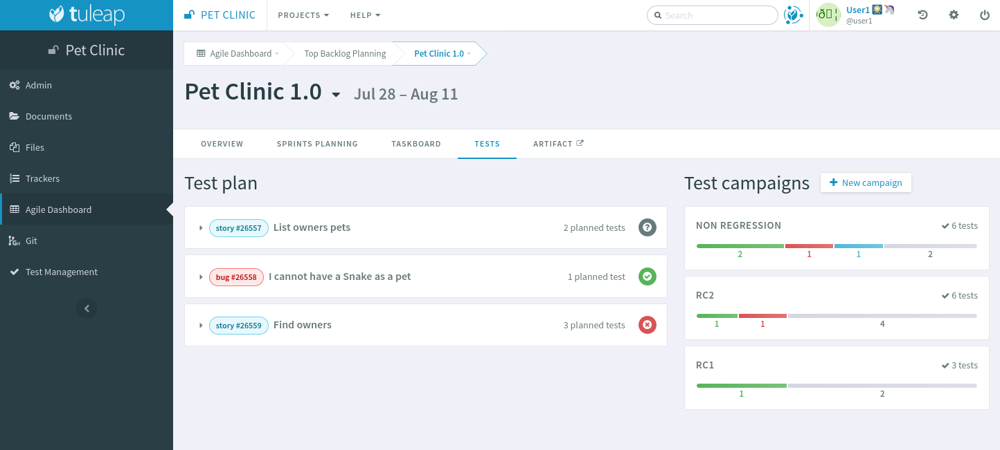

This way of working also encourage continuous testing as you can create tests and campaigns at any time during your release
progress. You could decide to have weekly test campaigns or having test campaigns as soon as a feature development is
completed for instance.

Behind the scenes, you can customize at will how those predefined campaigns are made, the one thing you need is to have
a test case tracker report that filters the test you want to include. By default it's made with a "Test suite" field with
*Simple* and *Full* values but you can define your own field and have whatever values make sense to you.

.. _testmgmt_automation:

Test automation
---------------

.. note::

   As of Tuleap 11.15 the REST API is able to process junit files directly making the ``ttm`` CLI tool deprecated. This documentation
   makes use of the Jq_ tool to format JSON payload but you obviously can run your own solution to format it.

.. _jq: https://stedolan.github.io/jq

TTM is able to consolidate automated test results inside its campaign. This way you can have a mixed campaign with both
manual and automated tests. The key principles are:

* TTM relies on an external tool like Jenkins to execute tests. Any CI tool can be used.
* Test automation itself is not TTM business, you can use whatever tool you want (robot framework, cypress, selenium, etc) as long as it produces a junit XML output with results.
* Automated tests are stored in a SCM (git or subversion)
* The link between TTM and test results is done by associating TTM Test Definitions and Junit Test Suite
* One Test Definition can be linked to one Test Suite at max
* One Test Suite can be linked to one Test Definition at max

In the next sections we will describe how to setup TTM with Jenkins.

This assumes a couple of things:

* The server where Tuleap is installed is located at ``https://tuleap.example.com``
* The project where TTM is enabled is called 'test-automation-demo' (its shortname)

Users and credentials
~~~~~~~~~~~~~~~~~~~~~

First you need to create a new Tuleap user that will be used by Jenkins to report test results. This user must be configured
Tuleap side with the appropriate permissions to update "Test Executions" and read "Test Definitions". We recommend using
a dedicated user with limited permissions to reduce risks of credentials leaking.

At Jenkins side, you need to register this Tuleap user in the "Credentials" section. Create a new entry for "username and
password" and give it a descriptive id like ``jenkins-tuleap-bot``.

Configure TTM
~~~~~~~~~~~~~

The "Test Definitions" tracker must have one string or text field with name ``automated_tests``. We recommend to add it
close to "Description". You can set whatever label you want, only the name is meaningful.

.. note::

  Starting from Tuleap 9.19 the ``automated_tests`` field is part of the default Test Management tracker templates.

Associate automated tests results and test definitions
~~~~~~~~~~~~~~~~~~~~~~~~~~~~~~~~~~~~~~~~~~~~~~~~~~~~~~

You need to associate ``testsuite`` from your junit test results and Test Definitions artifacts.

At this point you've got everything you need to report test results. You can test it by yourself by creating a new test
campaign "Test automated" with the selected test definitions and call the API by hand:

.. sourcecode:: bash

    $> make tests
    $> ( for i in *.xml ; do cat $i ; echo 'JQ-SEPARATOR-JQ' ; done ) | \
    jq -aRs 'rtrimstr("\n") | rtrimstr("JQ-SEPARATOR-JQ") | split("JQ-SEPARATOR-JQ") | {automated_tests_results: {build_url: "https://jenkins.example.com", junit_contents: .}} | \
    curl -X PATCH --data-binary @- --header 'Content-type: application/json' --header 'X-Auth-AccessKey: tlp-k1-29.a3ba...' https://tuleap.example.com/api/testmanagement_campaigns/<YourCampaignId> '

Then check the status of your campaign in Test Management.

Configure Jenkins job
~~~~~~~~~~~~~~~~~~~~~

First of all you will need an Access Key to access Tuleap API. Generate one for your user and then create a new credential in Jenkins selecting "Secret text" as "Kind" and giving it an ID or
copying the one generated by Jenkins. For this example we'll consider that you chose ``tuleap-access-token`` as the ID.

Create a new Jenkins job "Pipeline" and point it to your SCM repository (you might want to use ``jenkins-tuleap-bot``
credentials to access the repo). You should also allow it to be triggered remotely. Check the "Trigger builds remotely" checkbox in the "Build Triggers" section and provide a secret Authentication token.

Here is an example Jenkinsfile using Jq and calling the API:

.. sourcecode:: groovy

   pipeline {
      agent any
      parameters {
         string(name: 'campaign', defaultValue: '', description: 'ID of the campaign')
      }
      stages {
         stage('Reporting') {
            steps {
               echo 'Report to Tuleap'
               withCredentials([string(credentialsId:'tuleap-access-token', variable: 'ACCESS_TOKEN')]) {
                  sh """
                     ( for i in *.xml ; do cat \$i ; echo 'JQ-SEPARATOR-JQ' ; done ) | jq -aRs --arg BUILD_URL ${env.BUILD_URL} 'rtrimstr(\"\n\") | rtrimstr(\"JQ-SEPARATOR-JQ\") | split(\"JQ-SEPARATOR-JQ\") | {automated_tests_results: {build_url: \$BUILD_URL, junit_contents: .}}' | curl -X PATCH --data-binary @- --header 'Content-type: application/json' --header 'X-Auth-AccessKey: $ACCESS_TOKEN' https://tuleap-web.tuleap-aio-dev.docker/api/testmanagement_campaigns/${params.campaign}
                  """
               }
            }
         }
      }
   }

Launch automated tests from the Test Management campaign
~~~~~~~~~~~~~~~~~~~~~~~~~~~~~~~~~~~~~~~~~~~~~~~~~~~~~~~~

Edit your Campaign in Test Management and fill in the Jenkins job URL for the job you have just configured. Also fill
in the Authentication token defined in the step before.

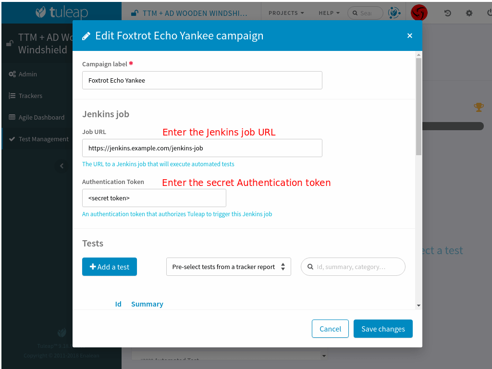

Once the campaign is configured, a button will appear in the Campaign details next to the Edit button: "Launch automated tests"
The button lets you trigger the Jenkins job which will run the automated tests and set the corresponding Test executions to "Passed"!

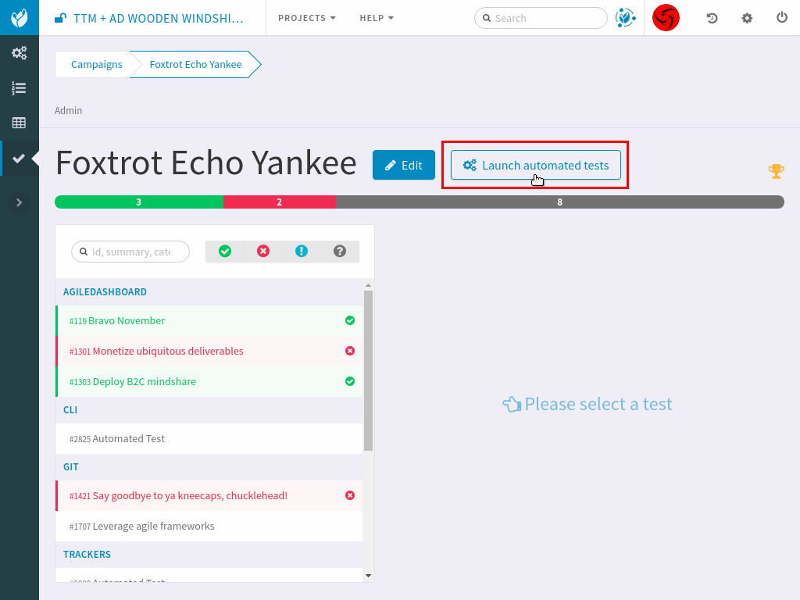
