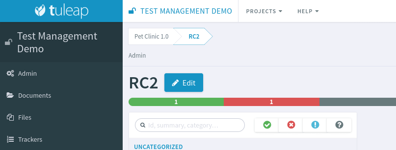
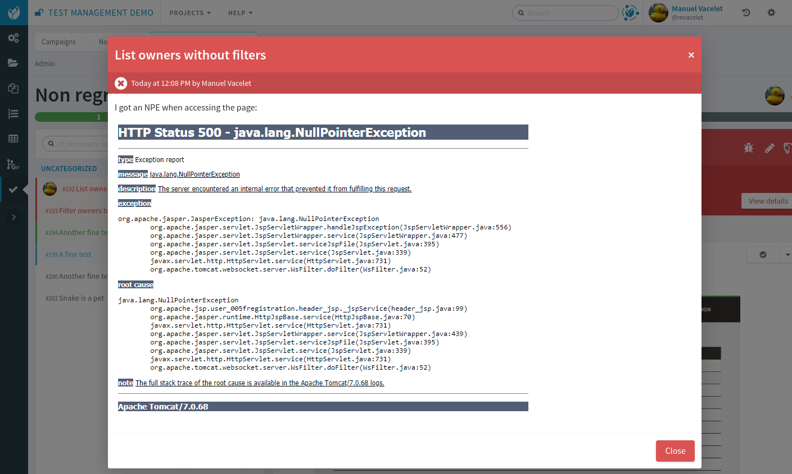
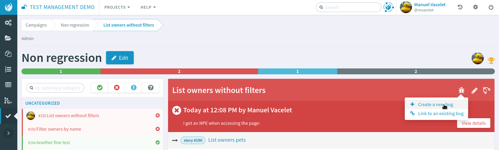
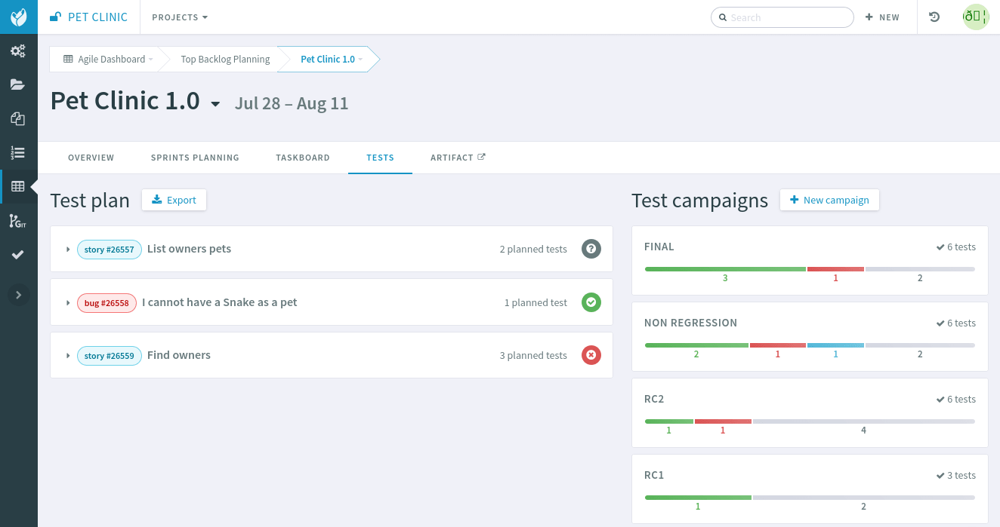
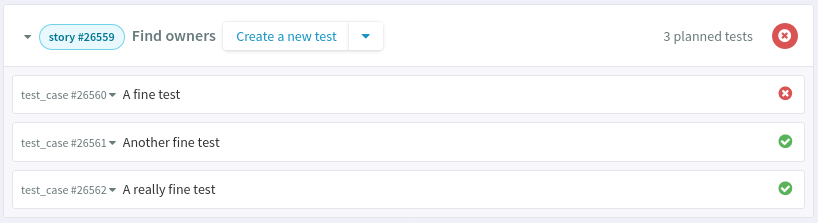
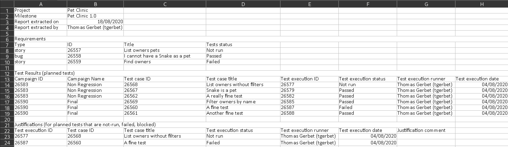
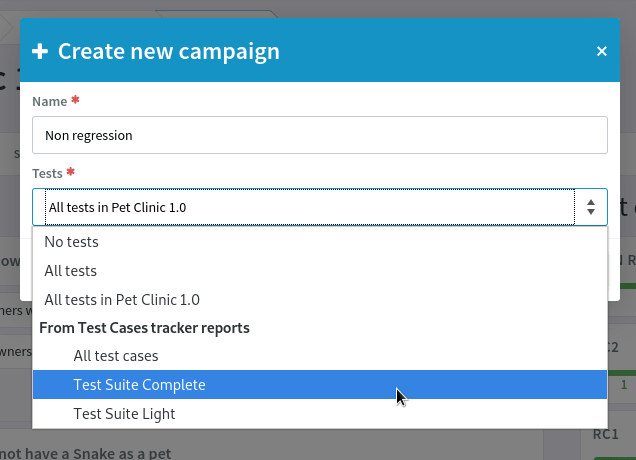

.. _testmgmt:

Test Management
===============

.. attention::

  This module is part of :ref:`Tuleap Entreprise <tuleap-enterprise>`. It might
  not be available on your installation of Tuleap.

The Tuleap Test Management plugin (aka **TTM**) aims at providing a straightforward way to deal with
test campaigns.

Test Management features:

* Create and maintain test case definitions
* Create test campaigns as a collection of test cases (manual or automated)
* Follow test executions (Not run, passed, failed, blocked), with creation of bugs when a test fails
* Realtime update for concurrent test execution by team
* Link with requirements managed by Agile Dashboard

Overview
--------

Here are the main concepts with Tuleap Test Management:

* Test Case: it's the description of something to test. The definition is meant to be re-used
* Test Campaign: a collection of Test Case to run.
* Test Execution: it's the execution of one Test Case in the context of a Test Campaign

Test Case, Test Campaign and Test Execution are 3 different trackers.

When you click on Test management service in a project, you land on TTM home page that lists all active test campaigns
and allows to create new ones.

Create a test campaign
----------------------

From the home page of the service, there is "New campaign" button that will open
the Campaign creation screen.

You need to give a name to your campaign and select which tests you want to execute
during your validation campaign.

Adding tests to a campaign
~~~~~~~~~~~~~~~~~~~~~~~~~~

Within a campaign, you can create add tests with a click on "Edit" button.

A new modal will enable you to look for existing artifacts or to create directly a new one.

Modify or create tests
~~~~~~~~~~~~~~~~~~~~~~

You can create tests directly inside the "Test Case" tracker, it means that you
benefit of all tracker power for artifact creation:

* Create one after another
* Import from CSV
* Import via REST
* Import via XML

You can also directly create tests in campaigns via the [Edit] button next to campaign title.

You can also edit the test directly from the Test Management interface.

The test you create or you edit are automatically updated in the test campaign
and will be re-usable in a following campaign.

.. _testmanagement_test_steps:

Test steps
~~~~~~~~~~

.. IMPORTANT::

    You should manage steps in the Test Case tracker directly. Steps cannot be seen or defined from the Test Management
    interface.

In the artifact view of the test case you can:

- Create new steps, at any place in the step list
- Delete steps
- Reorder existing steps

Each step is made of two text boxes:

- In first place, Actions: should hold a list of things to do.
- Then Expected Results: what you are expected to get after having done the Actions.

Both areas support HTML and Markdown formatting as well as images (copy/paste, drag'n drop, ...).

Those steps are displayed in the test management view, in the campaign.

These steps provide a global result for the tests:

* All steps are done -> test done
* At least one step failed -> test fail
* At least one step is blocked -> test blocked
* At lest one step is not run -> test not run

Run a test campaign, execute tests
----------------------------------

Within a campaign, you will see the list of tests proposed in the given campaign.

In the following figure, the user selected a test that "Passed".

Tests can have following status:

* Not run, this is the default
* Passed, the test was successful
* Failed, the test lead to an error
* Blocked, the test cannot be run

One can switch from one state to another (a test can be "Not run" then "Passed",
re-switched to "Not run" because tester didn't get what was described to finish by "Failed").

Example of test failure:

On failure, testers can give context and comments about it. In the comment section they can use inline HTML as well as
paste images:

Sometimes a failed test should lead to the creation of bug report. Testers can click on the bug icon in the test toolbar
to either create a new bug or link to an existing one:

Linked bugs are then showed in the same "Bug" menu:

.. figure:: ../images/screenshots/testmanagement/fail_linkedbug.png
   :align: center
   :alt: See bugs linked to failed tests
   :name: See bugs linked to failed tests

Test snapshot
~~~~~~~~~~~~~

When a test is selected for a campaign, Tuleap makes a snapshot of it. It means that if the test evolves later on, the
campaign will still display the old version of the test. This allows to keep campaign consistent with the status of the
project at a given point in the past.

When you modify a test in the Test Case tracker, the campaigns that were already created with this test will show the
previous version of the test. To be precise, each campaign will the state of the test at the time ot the campaign creation.

When you modify a test within a given campaign (with the Edit button) the test content in **this campaign** will be **automatically updated**.

.. _testmgmt_link_tests_requirements:

Link tests with requirements / user stories
-------------------------------------------

.. note::

    Tuleap administrators must install and activate ``TestPlan`` plugin beforehand.

If your project also uses the Scrum backlog of Agile Dashboard service, a "Tests" tab will be added to milestones.

This tab shows the test plan and campaigns of the milestone.

The *Test* tab allows:

- to define how the feature that are being developed will be tested
- to build the test campaigns along the release progress
- to see the actual coverage of each backlog item (user stories, bugs, requirements, ...) with a traceability matrix
- to export a report in the XLSX format (Office Open XML) including the coverage of each backlog item with the traceability elements

Test plan
~~~~~~~~~

The left hand side of the screen displays the backlog items of the milestone and their associated tests. This allows you to see how the
content of the milestone is covered by tests, and to add new tests for each items.

You need to have the permission to update the artifact links of the backlog item as well as the permission of creating test case in order to add new tests.

When you click on "Create a new test" you go in "Artifact creation" view of the test case tracker. On "Submit" you will be redirected to the
test plan you where. You can create several tests at once by choosing "Submit and continue".

If a test has been executed in at least one of the campaign of the milestone, then its status is displayed on the right hand side of the test case (Passed, Failed, Blocked, or Not run).

The status comes from the last execution of the test in any campaign of the milestone. In following screenshot, "Filter owners by name" status is "Failed" because the test *failed*
in "RC2" campaign but it might have *passed* in RC1 campaign.

The backlog item status is computed out of the tests that cover it as shown in the screenshot above. The rules are (order matters):

#. If there are no planned tests, there is no status associated to the backlog item.
#. If at least one test final status is **failed**, the backlog item status is **failed**.
#. If no failure but at least one test final status is **blocked**, the backlog item status is **blocked**.
#. If no failure and no blocked but at least one test final status is **not run**, the backlog item status is **not run**.
#. If all tests final status are **passed**, the backlog item status is **passed**.

.. note::

    In this context as test **not planned** means that the test was created or linked to the backlog item but no campaigns
    exists with this test yet.

Tests can be either manual or automated (see :ref:`Test Automation <testmgmt_automation>` section below)

Test campaigns
~~~~~~~~~~~~~~

The right hand side of the screen displays all campaigns that are linked to the milestone and their tests progression.

From here the creation of new campaigns is available. When a campaign is created from this screen it's automatically linked to the milestone.

A campaign can be created with an initial set of tests:

* No tests: the campaign won't have any tests
* All tests: all test cases will be added to the campaign
* **All tests in <milestone>**: (this is the default) only test cases that are linked to a backlog item of the milestone will be added to the campaign
* From tracker reports: only test cases that matches a given report's criteria will be added to the campaign

Export
~~~~~~

For traceability and audit (ISO, SOX, compliance…), you can export a report in the XSLX format (Office Open XML).

This document includes the list of requirements of the milestone with the associated tests and their respective results.
It allows you to determine when a specific test has been executed and by whom.

Test failures are highlighted in a dedicated section with a zone to justify the failure.

Test strategies
~~~~~~~~~~~~~~~

When creating a campaign from a milestone, Tuleap encourages to pick-up the tests of the milestones. That's great to ensure
that the feature you built works as expected.

However you might also need to guaranty some kind of non regression on feature previously delivered. How to do it?

By default, you can create two non regression test suites. Each test case has a "Test Suite" field with 2 possible values:
*Simple* and *Full*. A test can be in either test suites, both or none.

Once you have made some tests available in one
of those test suites, you will be able to create a non regression campaign in your release with either *Test Suite Complete* or
*Test Suite Light* as shown below:

The Tuleap best practice for tests is to have at least 2 campaigns per milestones:

- the campaign that validates the **new** features,
- the campaign that ensures the **non regression**.

This way of working also encourages continuous testing as you can create tests and campaigns at any time during your release
progress. You could decide to have weekly test campaigns or having test campaigns as soon as a feature development is
completed for instance.

Behind the scenes, you can customize at will how those predefined campaigns are made, the one thing you need is to have
a test case tracker report that filters the test you want to include. By default, it's made with a "Test suite" field with
*Simple* and *Full* values but you can define your own field and have whatever values make sense to you.

.. _testmgmt_automation:

Test automation
---------------

.. note::

   As of Tuleap 11.15 the REST API is able to process junit files directly making the ``ttm`` CLI tool deprecated. This documentation
   makes use of the Jq_ tool to format JSON payload but you obviously can run your own solution to format it.

.. _jq: https://stedolan.github.io/jq

TTM is able to consolidate automated test results inside its campaign. This way you can have a mixed campaign with both
manual and automated tests. The key principles are:

* TTM relies on an external tool like Jenkins to execute tests. Any CI tool can be used.
* Test automation itself is not TTM business, you can use whatever tool you want (robot framework, cypress, selenium, etc) as long as it produces a junit XML output with results.
* Automated tests are stored in a SCM (git or subversion)
* The link between TTM and test results is done by associating TTM Test Definitions and Junit Test Suite
* One Test Definition can be linked to one Test Suite at max
* One Test Suite can be linked to one Test Definition at max

In the next sections we will describe how to setup TTM with Jenkins.

This assumes a couple of things:

* The server where Tuleap is installed is located at ``https://tuleap.example.com``
* The project where TTM is enabled is called 'test-automation-demo' (its shortname)

Users and credentials
~~~~~~~~~~~~~~~~~~~~~

First you need to create a new Tuleap user that will be used by Jenkins to report test results. This user must be configured
Tuleap side with the appropriate permissions to update "Test Executions" and read "Test Definitions". We recommend using
a dedicated user with limited permissions to reduce risks of credentials leaking.

At Jenkins side, you need to register this Tuleap user in the "Credentials" section. Create a new entry for "username and
password" and give it a descriptive id like ``jenkins-tuleap-bot``.

Configure TTM
~~~~~~~~~~~~~

The "Test Definitions" tracker must have one string or text field with name ``automated_tests``. We recommend to add it
close to "Description". You can set whatever label you want, only the name is meaningful.

.. note::

  Starting from Tuleap 9.19 the ``automated_tests`` field is part of the default Test Management tracker templates.

Associate automated tests results and test definitions
~~~~~~~~~~~~~~~~~~~~~~~~~~~~~~~~~~~~~~~~~~~~~~~~~~~~~~

You need to associate ``testsuite`` from your junit test results and Test Definitions artifacts.

At this point you've got everything you need to report test results. You can test it by yourself by creating a new test
campaign "Test automated" with the selected test definitions and call the API by hand:

.. sourcecode:: bash

    $> make tests
    $> ( for i in *.xml ; do cat $i ; echo 'JQ-SEPARATOR-JQ' ; done ) | \
    jq -aRs 'rtrimstr("\n") | rtrimstr("JQ-SEPARATOR-JQ") | split("JQ-SEPARATOR-JQ") | {automated_tests_results: {build_url: "https://jenkins.example.com", junit_contents: .}} | \
    curl -X PATCH --data-binary @- --header 'Content-type: application/json' --header 'X-Auth-AccessKey: tlp-k1-29.a3ba...' https://tuleap.example.com/api/testmanagement_campaigns/<YourCampaignId> '

Then check the status of your campaign in Test Management.

Configure Jenkins job
~~~~~~~~~~~~~~~~~~~~~

The configuration is done by using the `Tuleap API <https://plugins.jenkins.io/tuleap-api/>`_ plugin.

See :ref:`Jenkins configuration for test automation <jenkins_configuration_for_test_automation>` to configure the Jenkins part.

Launch automated tests from the Test Management campaign
~~~~~~~~~~~~~~~~~~~~~~~~~~~~~~~~~~~~~~~~~~~~~~~~~~~~~~~~

Edit your Campaign in Test Management and fill in the Jenkins job URL for the job you have just configured. Also fill
in the Authentication token defined in the step before.

Once the campaign is configured, a button will appear in the Campaign details next to the Edit button: "Launch automated tests"
The button lets you trigger the Jenkins job which will run the automated tests and set the corresponding Test executions to "Passed"!

Configuration of TTM
--------------------

This section is for project administrators that want to customize / adapt TTM to better fit their usage.

Steps are missing in Test Case
~~~~~~~~~~~~~~~~~~~~~~~~~~~~~~

Steps are parts of all templates but if you are using TTM since a long time you might not have them in you tracker yet.

This section covers how to activate steps in TTM when they are not present.

There are two new fields to add in your testmanagement trackers to be able to defined your steps:

* Field ``step definition`` into Test definition tracker
* Field ``step execution`` into Test execution tracker.

If one of this field is missing, steps cannot be run. In addition, these fields can only be added in the Test definition tracker
and Test exec tracker defined in your testmanagement configuration.

To have working steps, these 2 fields must have a specific shortname:

* Field ``step definition`` must have the shortname ``steps``
* Field ``step execution`` must have the shortname ``steps_results``
