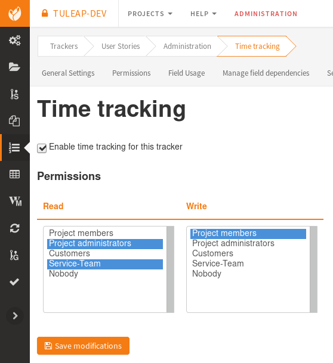
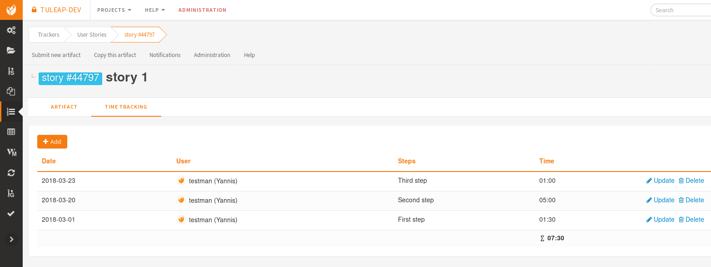
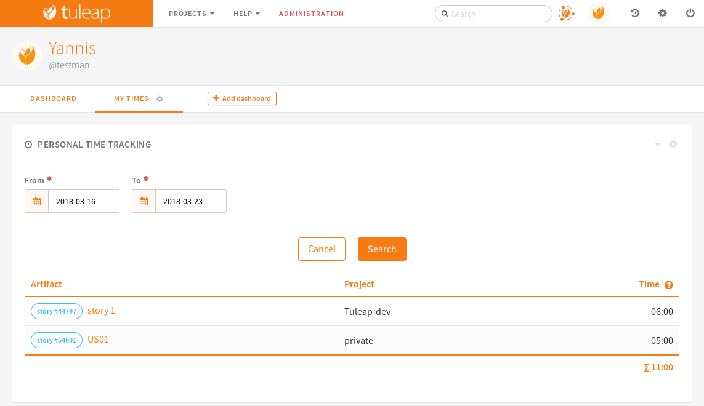

.. _timetracking:

Timetracking
============

.. attention::

  This module is part of :ref:`Tuleap Entreprise <tuleap-enterprise>`. It might
  not be available on your installation of Tuleap.

The Timetracking plugin of Tuleap aims at providing a simple and easy way to deal with
artifact time tracking and time reporting for users.

Timetracking features:

* Add (update and delete) a time per artifact
* Display our personal times in a user widget

Activate the time tracking
---------------------------

The time tracking feature must be enabled per tracker. Once activated, ``writers`` users will be able to add times per artifact.
By default, a writer will only see its own times. The ``readers`` are users that will be able to see an aggregated view of times
(all times saved per artifacts)

Add a time
-----------

Writers users will be able to add times per artifact in a dedicated tab in the artifact view.
This table will contain all the times added and be displayed according to the permissions defined.

.. attention::

   There a some limitations for now:

   * Only one time per day
   * The format to add a time is hh:mm

User widget
------------

Timetracking plugin also provides a user widget. This widget allows users to filter and display times added in the whole
platform during the time periode provided. By default, the search is done for the last week.

If multiple times are added in the same artifact in this time period, the widget will only show one entry per artifact
displaying the total time for this period.

