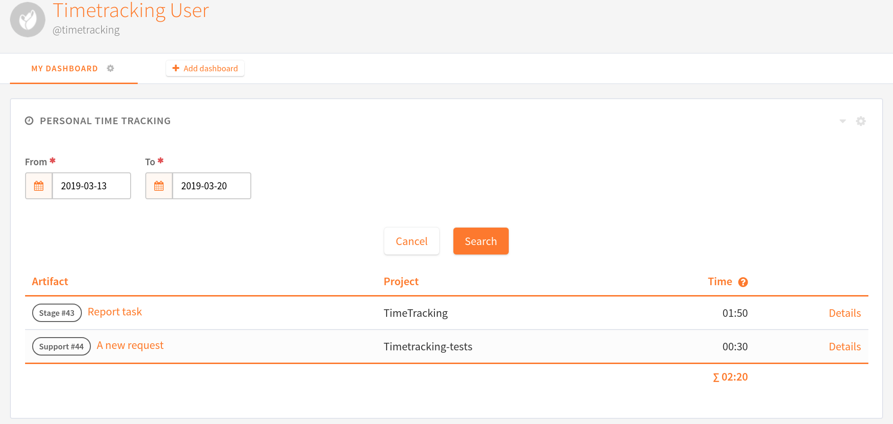
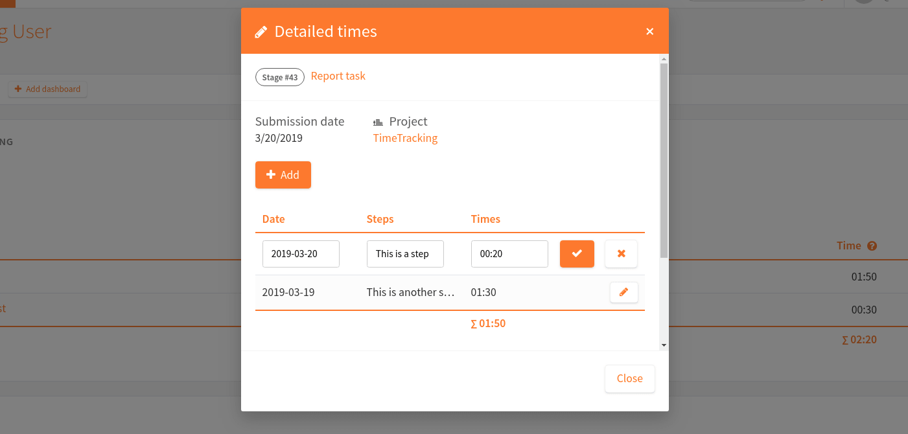
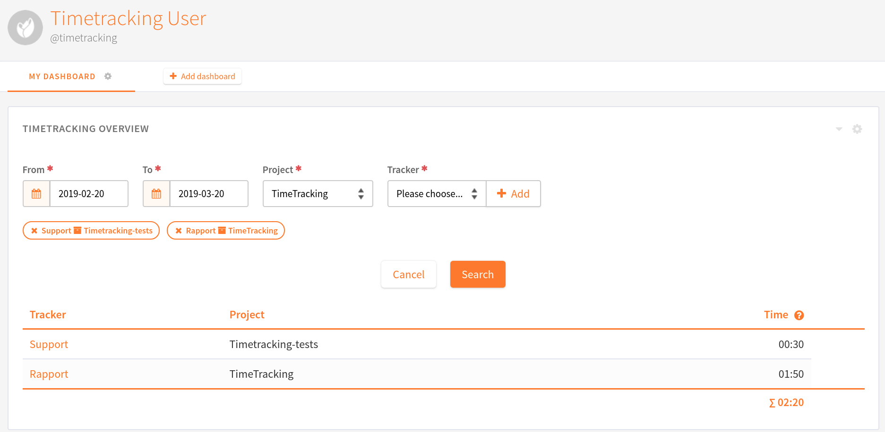

.. _timetracking:

Timetracking
============

.. attention::

  This module is part of :ref:`Tuleap Enterprise <tuleap-enterprise>`. It might
  not be available on your installation of Tuleap.

The Timetracking plugin of Tuleap aims at providing a simple and easy way to deal with
artifact time tracking and time reporting for users.

Timetracking features:

* Add (update and delete) a time per artifact
* Display our personal times in a user widget

Activate the time tracking
---------------------------

The time tracking feature must be enabled per tracker. Once activated, ``writers`` users will be able to add times per artifact.
By default, a writer will only see their own times. Members of the ``readers`` user group can see an aggregated view of submitted times.

.. figure:: ../images/screenshots/timetracking/timetracking-admin-tracker.png
   :align: center
   :alt: Timetracking administration
   :name: Timetracking administration

Add a time
-----------

Writers users will be able to add times per artifact in a dedicated tab in the artifact view.
This table will contain all the times added and be displayed according to the permissions defined.

.. figure:: ../images/screenshots/timetracking/timetracking-artifact-times.png
   :align: center
   :alt: Timetracking artifact times view
   :name: Timetracking artifact times view

.. attention::
   The format to add a time is hh:mm

User widgets
------------

Timetracking plugin also provides user widgets :

* :ref:`personal_time_tracking`
* :ref:`timetracking_overview`

.. _personal_time_tracking:

Personal Time Tracking
~~~~~~~~~~~~~~~~~~~~~~

Timetracking plugin also provides a user widget. This widget allows users to filter and display times added in the whole
platform during the time period provided. By default, the search is done for the last week.

If multiple times are added in the same artifact in this time period, the widget will only show one entry per artifact
summing the total time for this period.

Detailed times modal
''''''''''''''''''''

Artifact's data are displayed on the top of the modal. Artifact's times of the given period are displayed on the table.
It's possible to add and edit times on this modal.

.. _timetracking_overview:

Timetracking Overview
~~~~~~~~~~~~~~~~~~~~~~

This widget allows users to filter and display times added in the selected trackers in the time period provided. By default, the search is done for the last month.
Times are grouped by trackers. You must be able to access a tracker to select it. The sum of selected trackers' times is displayed.

