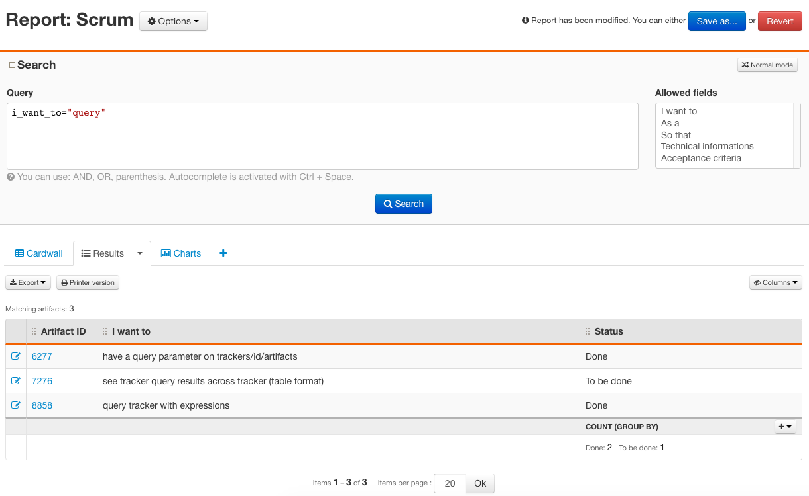
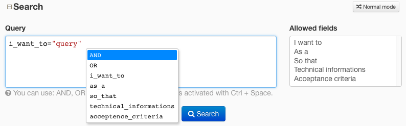
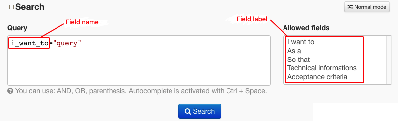
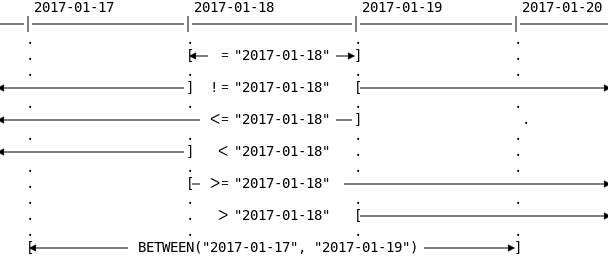
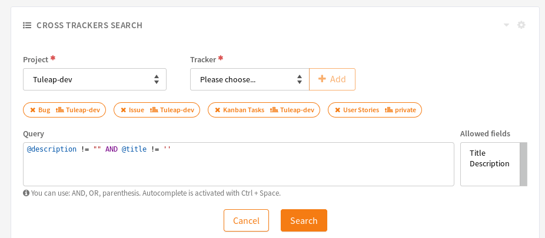

.. _tql:

Tuleap Query Language (TQL)
===========================

The Tuleap Query Language is a pseudo-language to search items in the platform. As of today
only artifacts in trackers can be retrieved.

TQL on reports
--------------

TQL can be used in "Expert" mode on tracker's reports in the search area.
The saving of the query matches the usual saving of the report.

   Tuleap Query Language on reports

Queries
-------

Currently, the language supports:

- Logical operators: ``AND``, ``OR``
- Parenthesis to force precedence

Comparison operators
''''''''''''''''''''

* For string, text, files, and @comments: ``=``, ``!=``
* For date, integer and float fields: ``=``, ``!=``, ``<``, ``<=``, ``>``, ``>=``, ``BETWEEN()``
* For list fields: ``=``, ``!=``, ``IN()``, ``NOT IN()``

Comparison values
'''''''''''''''''

* For string, text, and files fields: ``string``
* For integer fields: ``string`` convertible to integer, ``integer``
* For float fields: ``string`` convertible to float,  ``integer``, ``float``
* For date fields: ``string`` convertible to date, ``NOW()``
* For list fields: ``all`` matching list bind values
* For list fields bound to users: ``string`` using user names, ``MYSELF()``
* For list fields bound to user groups: ``string`` matching either the name of a user-defined ("Static") user group (e.g. ``"Customers"``) or matching the translated system-defined ("Dynamic") user group name (e.g. ``"Project members"``).
* For @comments: ``string``

Dynamic value for date fields: ``NOW()``
''''''''''''''''''''''''''''''''''''''''

* ``start_date > NOW()`` matches all artifacts where start_date is greater than the current time (time when the query
  is displayed).
* You can use interval periods with NOW(), for example ``submitted_on > NOW() - 1m`` will matches
  all artifacts that have been created during the last month. The supported specificators are:

  * years (``y``)
  * months (``m``)
  * weeks (``w``)
  * days (``d``)

Dynamic value for list fields bound to users: ``MYSELF()``
''''''''''''''''''''''''''''''''''''''''''''''''''''''''''

``assigned_to = MYSELF()`` matches all artifacts where assigned_to is equal to the current user.

Search in comments
''''''''''''''''''

* ``@comments = 'Lorem ipsum'`` matches all artifacts where at least one follow-up comment contains the string ``lorem ipsum``
* ``@comments = ''`` returns the list of artifacts without any comments
* ``@comments != ''`` returns the list of artifacts with at least one comment

When searching in comments, you should be aware of some limitations:

    * Searches are done for words longer than 3 characters
    * Some words are not taken in account because they are too common (like ``the``, ``a``, …)

Search in files
'''''''''''''''

  * ``attachment = 'minutes'`` matches all artifacts where there is at least one attached file with the filename "Minutes-20180101.docx" or the description "Minutes of last meeting" contains the string ``minutes``
  * ``attachment != 'minutes'`` matches all artifacts where there isn't any attached files with filename or description containing ``minutes``.
  * ``attachment = ''`` matches all artifacts without any attached files
  * ``attachment != ''`` matches all artifacts that have at least one attached file

.. include:: tql-artlink.rst

Query construction
------------------

To construct a query you can combine all these elements.

Query example:

.. code-block:: sql

    (summary = "soap" OR summary = "rest")
      AND description = "documentation" AND story_points BETWEEN(3, 8)

.. NOTE:: Be careful, you must use the name of fields and not the label to construct queries.

Sending the query to the server can throw the following errors:

- The query syntax is incorrect (e.g. if you forget a closing quote)
- The name doesn't match any existing field name
- The value is not defined for the list field (e.g. ``assigned_to = "non_existent_user"``)
- The dynamic value is not supported for this field (e.g. ``text_field = NOW()``)
- The comparison operator is not supported for this field (e.g. ``list_field >= 3``)
- The empty value is not allowed for this comparison (e.g. ``date_field BETWEEN("", "2017-01-18")``)
- The query uses MYSELF() and the current user is not logged in (when browsing a Tuleap platform as an anonymous user)
- The field type is unsupported
- The query is too complex

.. IMPORTANT:: The query is too complex when it exceeds a limit. This limit is defined by SiteAdministrators on SiteAdmin > Tracker > Report.

Pro-tips
--------

For a better usability in building query there is a syntax highlighting
and an auto-completion (``ctrl+space`` on field names).

   Highlighting and auto-completion

Moreover to know allowed fields there is a select box with all usable
fields. If you click on one of them the field's name is introduced in
the query.

   Allowed fields

Date operators
--------------

When searching on date fields using TQL, you should be aware of the sometimes subtle differences between the various operators. We have found this diagram helpful. Here, we use all available operators supporting date fields and a given date ("2017-01-18") and represent the period that will be selected as a result. For example, ``date_field > "2017-01-18"`` means ``date_field`` is later than 2017-01-18 23:59:59, while ``date_field >= "2017-01-18"`` means ``date_field`` is later than or equal to 2017-01-18 00:00:00

   Explanation of date operators

TQL on cross-tracker search
----------------------------

.. attention::

  This module is part of :ref:`Tuleap Enterprise <tuleap-enterprise>`. It might
  not be available on your installation of Tuleap.

TQL can also be used in the cross-tracker widget, in the search area.

   TQL on cross-tracker search

Semantics and some dynamic fields such as the Submission date ("Submitted On") can be used to search on multiple trackers. The following keywords are supported:

String/Text semantics:
 * ``@title``: the "Title" semantic. It behaves like a string field.
 * ``@description``: the "Description" semantic. It behaves like a text field.

Integer:
 * ``@id``: the "Artifact id" dynamic field. It contains the unique id of the artifact, a strictly positive integer.

Dates:
 * ``@submitted_on``: the "Submitted On" dynamic field. It behaves like a date field, but the empty string ``''`` is not allowed (this field cannot be empty).
 * ``@last_update_date``: the "Last Update Date" dynamic field. It behaves like a date field, but the empty string ``''`` is not allowed (this field cannot be empty).

Lists:
 * ``@status``: the "Status" semantic. It behaves like a list, but can only be compared to ``OPEN()``

Lists bound to users:
 * ``@submitted_by``: the "Submitted By" dynamic field. It behaves like a list and can have only a single value at a time.
 * ``@last_update_by``: the "Last Updated by" dynamic field. It behaves like a list and can have only a single value at a time.
 * ``@assigned_to``: the "Contributor/assignee" semantic. It behaves like a list and can have multiple values at a time (multiple users assigned to an artifact).

.. _tql_duck_typing:

Searching on similar fields
'''''''''''''''''''''''''''

You can also search on any custom field with its name as long as there is at least one Tracker with a compatible definition. We consider that 2 fields from 2 Trackers are compatible if:
 * You can see both fields
 * They have the same name
 * Their types are compatible

Compatible field types:
 * Numerics: integer and float
 * Lists with same bind (user, user group, static)
 * String and text
 * Date
 * Date time

TQL behavior to search on these fields is the same as for classic single tracker search.

Preconditions for multi-tracker search
--------------------------------------

When you use a semantic, at least one of the selected trackers must have it configured and the field linked to the semantic must be readable by the current user.

For example, if you run an expert query containing ``@status``, at least one of the selected trackers **must** have defined a "Status" semantic and the "Status" field **must** be readable by the user viewing the widget.
If **none** of the trackers defines the "Status" semantic, it will cause an error to be shown. The same is true for permissions: if **none** of the "Status" fields are readable by the current user, it will raise an error.

When you use a dynamic field, it must exist in at least one of the selected trackers and it must be readable by the current user.

Supported dynamic fields are the following:
  * "Submitted On": The creation date and time of the artifact.
  * "Submitted By": The user who first created the artifact.
  * "Last Updated Date": The date and time of the last change to the artifact.
  * "Last Updated By": The user who made the last change to the artifact.
  * "Artifact id": The unique id of the artifact.

For example, if you run an expert query containing ``@last_update_date``, at least one of the selected trackers **must** have a "Last update date" field and that field **must** be readable by the user viewing the widget.
If **none** of the trackers has a "Last update date" field, it will cause an error to be shown. The same is true for permissions: if **none** of the "Last update date" fields are readable by the current user, it will raise an error.

If only part of the selected trackers match these preconditions, the query will be performed only on those.

Queries
-------

Currently, the query supports:

- Logical operators: ``AND``, ``OR``
- Parenthesis to force precedence

Supported comparisons
'''''''''''''''''''''

  * For @title and @description: ``=``, ``!=``
  * For @status: ``= OPEN()``, ``!= OPEN()``. ``OPEN()`` is the only supported value.
  * For @submitted_on, @last_update_date and @id: ``=``, ``!=``, ``<``, ``<=``, ``>``, ``>=``, ``BETWEEN()``.
  * For @submitted_by, @last_update_by and @assigned_to: ``=``, ``!=``, ``IN()``, ``NOT IN()``.

Comparison values
'''''''''''''''''

  * For @title and @description: ``string``
  * For @status: ``OPEN()`` is the only supported value
  * For @submitted_on and @last_update_date: ``string`` convertible to date, ``NOW()`` and dynamic values based on ``NOW()``. For example: ``NOW() -1m``, ``NOW() -6w``, ...
  * For @submitted_on and @last_update_date: the empty string ``''`` cannot be used. Those fields always have a value, therefore the comparison to "empty" is not useful.
  * For @submitted_by, @last_update_by and @assigned_to: ``string`` matching a user, ``MYSELF()``
  * For @id: ``integer``.

.. include:: tql-artlink.rst

Example
-------

::

    @title = 'documentation' AND @status = OPEN() AND @last_update_date > NOW() - 1w
    //Returns all open artifacts with 'documentation' in the title that have been
    //updated during the last week.

    @title = 'documentation' AND @submitted_by = 'alice' AND @assigned_to IN (MYSELF(), 'charles')
    //Returns all artifacts with 'documentation' in the title that have been submitted
    //by user 'alice' and are assigned to the viewing user (for example 'bob')
    //or user 'charles'.

Expert mode
-----------

.. attention::

  This part is still work in progress, future releases may break your report.
  You can follow advancement in `epic #37567 SuperTableau - Full TQL mode <https://tuleap.net/plugins/tracker/?aid=37567>`_

Cross-tracker search widget is also available in expert mode allowing you to use extended syntax of TQL.

In this extended syntax of TQL you can choose which fields you want to display on the widget through ``SELECT`` syntax, and also on which tracker to perform the query with ``FROM``:

::

    SELECT @pretty_title, @status, open_date FROM @project = 'self' AND @tracker.name IN('release', 'sprint') WHERE @assigned_to = MYSELF()
    // Returns all artifacts from current project release and sprint trackers assigned to me and display their title, status and opening date.

When using Cross-tracker search expert mode, you must use ``SELECT`` syntax with at least one field, ``FROM`` with at least one condition, and a condition after the ``WHERE``.

TQL ``SELECT`` syntax allow you to select on the same fields allowed for the condition plus some special fields:

Semantics and always there fields:
 * ``@id`` Artifact id.
 * ``@submitted_on`` The creation date and time of the artifact.
 * ``@last_update_date`` The date and time of the last change to the artifact.
 * ``@submitted_by`` The user who first created the artifact.
 * ``@last_update_by`` The user who made the last change to the artifact.
 * ``@title`` Artifact title semantic.
 * ``@description`` Artifact description semantic.
 * ``@status`` Artifact status semantic.
 * ``@assigned_to`` Artifact assignee/contributor semantic.

Fields short name:
 * Same as for condition (see :ref:`Duck-typed fields rules <tql_duck_typing>`)
 * Note that in ``SELECT`` date and datetime fields are considered compatible

Special fields:
 * ``@project.name`` The name and icon of the project that the artifact belongs to.
 * ``@tracker.name`` The name and color of the tracker the artifact belongs to.
 * ``@pretty_title`` It's equivalent to the Artifact column of classic Cross-tracker search widget (or the title of the artifact view).

TQL ``FROM`` syntax allow you to select on which tracker to perform the query by filtering projects and trackers. You can use only one condition of each type joined by ``AND``:

Project condition:
 * ``@project = 'self'`` get current project. Works only in a project dashboard.
 * ``@project = 'aggregated'`` get project aggregated to the current one. Works only in a :ref:`program <program-management>` project dashboard.
 * ``@project.name`` either with ``= 'project_name'`` or ``IN('project_name', 'another_project')``, get all projects with the corresponding short name.
 * ``@project.category = 'Topic::Hardware'`` get all projects with corresponding category or sub category. A category is specified by its full path (root category to current one) with ``::`` as delimiter.
 * ``@project.category IN('Topic::Hardware', 'License::Open Source')`` get all projects with corresponding category.

Tracker condition:
 * ``@tracker.name`` either with ``= 'release'`` or ``IN('release', 'sprint')``, get all trackers with corresponding short name.

You must provide 1 or 2 condition of different kind. If only the project condition is provided then it gets all trackers from corresponding projects.
If only the tracker condition is provided, then match the trackers from current project. It means that in a personal dashboard you must provide the project condition.

To provide both condition, you can use ``AND`` between them. There is no restriction for the order of the conditions.

Some example you can take inspiration from:

::

    SELECT @pretty_title, @status, @submitted_by, @last_update_date 
    FROM @project.name = 'support' AND @tracker.name = 'ticket' 
    WHERE @status = OPEN() AND @assigned_to = MYSELF()
    // Get tickets assigned to me from support project. Display their title, status, who opened the ticket and the last modification date

    SELECT @title, @status, @project.name
    FROM @project.category = 'Topic::Team' AND @tracker.name IN('epic', 'story')
    WHERE @status = OPEN()
    // Get open epics and stories from project with category Topic::Team (or sub category) 
    // display their title, status and from which project it comes

    SELECT @pretty_title
    FROM @project = 'self'
    WHERE @id >= 1
    // Display title of all artifacts of current project