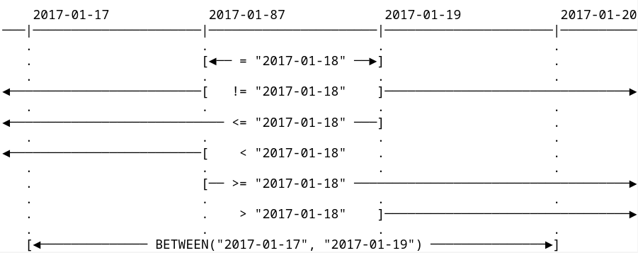

Tuleap Query Language (TQL)
===========================

The Tuleap Query Language is a pseudo-language to search items in the platform. As of today
only artifacts in trackers can be retrieved.

TQL on reports
--------------

TQL can be used in "Expert" mode on tracker's reports in the search area.
The saving of the query matches the usual saving of the report.

.. figure:: ../images/screenshots/tql/expert_query.png
   :align: center
   :alt: Tracker Welcome Screen
   :name: Tracker Welcome Screen

   Tuleap Query Language on reports

Queries
-------

Currently, the language supports:

- Logical operators: ``AND``, ``OR``
- Parenthesis to force precedence
- Comparison operators:

  * For string and text fields: ``=``, ``!=``
  * For date, integer and float fields: ``=``, ``!=``, ``<``, ``<=``, ``=>``, ``>``, ``BETWEEN()``

- Dynamic value for date fields: ``NOW()``.

  * ``start_date > NOW()`` matches all artifacts where start_date is greater than the current time (time when the query
    is displayed).
  * You can use interval periods with NOW(), for example ``submitted_on > NOW() - 1m`` will matches
    all artifacts that have been created during the last month. The supported specificators are: years (``y``),
    months (``m``), weeks (``w``) and days (``d``).

Therefore to construct a query you can combine these elements.

Query example:

.. code-block:: sql

    (summary = "soap" OR summary = "rest")
      AND description = "documentation" AND story_points BETWEEN(3, 8)

.. NOTE:: Be careful, you must use name of fields and not label to construct queries.

Sending the query to the server can throw following errors:

- The query syntax is incorrect (e.g if you forget a closing quote)
- The name doesn't match any existing field name
- The field type is unsupported
- The query is too complex

.. IMPORTANT:: The query is too complex when it exceeds a limit. This limit is defined by SiteAdministrators on SiteAdmin > Tracker > Report.

Pro-tips
--------

For a better usability in building query there is a syntax highlighting
and an auto-completion (``ctrl+space`` on field names).

.. figure:: ../images/screenshots/tql/expert_query_autocompletion.png
   :align: center
   :alt: Tracker Welcome Screen
   :name: Tracker Welcome Screen

   Highlighting and auto-completion

Moreover to know allowed fields there is a selected box with all usable
fields. If you click on one of them the field's name is introduced in
the query.

.. figure:: ../images/screenshots/tql/expert_query_allowed_fields.png
   :align: center
   :alt: Tracker Welcome Screen
   :name: Tracker Welcome Screen

   Allowed fields

Date operators
--------------

When searching on date fields using TQL, you should be aware of the sometimes subtle differences between the various operators. We have found this diagram helpful. Here, we use all available operators supporting date fields and a given date ("2017-01-18") and represent the period that will be selected as a result. For example, ``date_field > "2017-01-18"`` means ``date_field`` is later than 2017-01-18 23:59:59, while ``date_field >= "2017-01-18"`` means ``date_field`` is later than or equal to 2017-01-18 00:00:00

   Explanation of date operators
