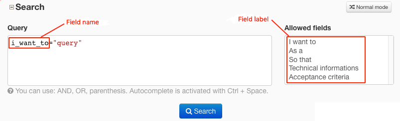

Tracker Query Language (TQL)
==============================

The Tracker Query Language is a pseudo-language to search artifacts in trackers.

TQL on reports
--------------------------------

The Tracker Query Language can be used in "Expert" mode on tracker's reports in the search area.
The saving of the query matches the usual saving of the report.

.. figure:: ../images/screenshots/tql/expert_query.png
   :align: center
   :alt: Tracker Welcome Screen
   :name: Tracker Welcome Screen

   Tracker Query Language on reports

Queries
--------------------------------

Currently, the language supports string and text fields and (), AND, OR operators.
Therefore to construct a query you can combine these elements.
Be careful, you must use name of fields and not label of fields to construct queries.

Query example:

.. code-block:: sql

    (summary="soap" or summary="rest") and description="documentation"

Sending the query to the server can throw following errors:

- The query syntax is incorrect (e.g if you forget a closing quote)
- The name doesn't match any existing field name
- The field type is unsupported
- The query is too complex

.. IMPORTANT:: The query is too complex when it exceeds a limit. This limit is defined by SiteAdministrators on SiteAdmin > Tracker > Report.

Pro-tips
-----------------------------

For a better usability in building query there is a syntax highlighting
and an auto-completion (``ctrl+space`` on field names).

.. figure:: ../images/screenshots/tql/expert_query_autocompletion.png
   :align: center
   :alt: Tracker Welcome Screen
   :name: Tracker Welcome Screen

   Highlighting and auto-completion

Moreover to know allowed fields there is a selected box with all usable
fields labels. If you click on one of them the field's name is introduced in
the query.

   Allowed fields
