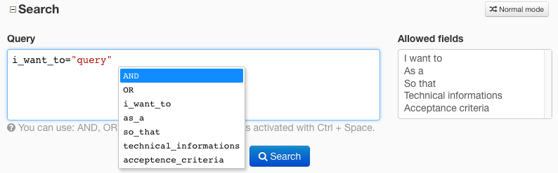

.. _tql_tracker_report:

TQL in tracker reports
======================

You can use TQL syntax in tracker reports "Expert" mode in the search area. Saving a TQL query works the same way as saving a "Normal" mode report.

.. figure:: ../../images/screenshots/tql/expert_query.png
   :align: center
   :alt: Tuleap Query Language in tracker reports
   :name: Tuleap Query Language in tracker reports

   Tuleap Query Language in tracker reports

The goal of TQL is to help you filter very precisely which artifacts you want to see in a tracker report. To achieve this filtering, you can build a query with one or several conditions that artifacts must match in order to be selected. Once selected, artifacts are displayed and you can select which columns you want to see and how to order artifacts with the web user interface, the same way as "Normal" mode reports.

Queries
-------

.. note:: ``SELECT``, ``FROM`` and ``ORDER BY`` syntax is not supported in Tracker reports. Please refer to :ref:`the TQL Limitations table <tql>` for details about the syntax differences.

Comparison operators
''''''''''''''''''''

* For string, text, files, and @comments: ``=``, ``!=``
* For date, integer and float fields: ``=``, ``!=``, ``<``, ``<=``, ``>``, ``>=``, ``BETWEEN()``
* For list fields: ``=``, ``!=``, ``IN()``, ``NOT IN()``

Comparison values
'''''''''''''''''

* For string, text, and files fields: ``string``, for example: ``'text between simple quotes'`` or ``"text between double quotes"``
* For integer fields: ``integer`` (``3``) or ``string`` convertible to integer (for example: ``"3"``)
* For float fields: ``integer`` (``3``), ``float`` (``0.5``) or ``string`` convertible to float (for example: ``'3.6'``)
* For date fields: ``NOW()`` or ``string`` convertible to date (for example: ``"2024-10-07"``)
* For list fields: matching list values (for example: ``"In Review"``, ``"Ongoing"``)
* For list fields bound to users: ``MYSELF()`` or ``string`` user names (for example: ``"jdoe"``, ``"John Doe"``)
* For list fields bound to user groups: ``string`` matching either the name of a user-defined ("Static") user group (for example: ``"Customers"``) or matching the translated system-defined ("Dynamic") user group name (for example: ``"Project members"``).
* For @comments: ``string``

Empty string ``''`` can be used for any field to specify no value.

Dynamic value for date fields: ``NOW()``
''''''''''''''''''''''''''''''''''''''''

* ``start_date > NOW()`` matches all artifacts where the field ``start_date`` is greater (more recent) than the current time (time when the query
  is displayed).
* You can use interval periods with ``NOW()``, for example ``submitted_on > NOW() - 1m`` will matches
  all artifacts that have been created during the last month. The supported specificators are:

  * years (``y``)
  * months (``m``)
  * weeks (``w``)
  * days (``d``)

Dynamic value for list fields bound to users: ``MYSELF()``
''''''''''''''''''''''''''''''''''''''''''''''''''''''''''

``owner = MYSELF()`` matches all artifacts where the field ``owner`` is equal to the current user.

Search in comments
''''''''''''''''''

* ``@comments = 'Lorem ipsum'`` matches all artifacts where at least one follow-up comment contains the string ``lorem ipsum``. The comparison is case-insensitive.
* ``@comments = ''`` returns the list of artifacts without any comments
* ``@comments != ''`` returns the list of artifacts with at least one comment

When searching in comments, you should be aware of some limitations:

    * Searches are done for words longer than 3 characters
    * Some words are not taken into account because they are too common (like ``the``, ``a``, …)

Search in files
'''''''''''''''

  * ``attachment = 'minutes'`` matches all artifacts where there is at least one attached file with the filename containing "minutes" (for example: ``"Minutes-20180101.docx"``)  or the description containing "minutes" (for example: ``"Minutes of last meeting"``). The comparison is case-insensitive.
  * ``attachment != 'minutes'`` matches all artifacts where there isn't any attached files with filename or description containing ``minutes``.
  * ``attachment = ''`` matches all artifacts without any attached files
  * ``attachment != ''`` matches all artifacts that have at least one attached file

.. include:: tql-artlink.rst

Query construction
------------------

You can assemble your different comparisons with logical operators ``AND`` and ``OR`` and use parenthesis ``()`` to force precedence.

Query example:

.. code-block:: tql

    (summary = "soap" OR summary = "rest")
      AND description = "documentation" AND story_points BETWEEN(3, 8)

.. note:: Be careful, you must use the name of fields and not the label to construct queries.

Sending the query to the server can produce the following errors:

- The query syntax is incorrect (for example: if you forget a closing quote ``"``)
- The name used in a comparison doesn't match any existing field name (or there is a mistake in the name)
- The value is not defined for the list field (for example: ``assigned_to = "non_existent_user"``)
- The dynamic value is not supported for this field (for example: ``text_field = NOW()``)
- The comparison operator is not supported for this field (for example: ``list_field >= 3``)
- The empty value is not allowed for this comparison (for example: ``date_field BETWEEN("", "2017-01-18")``)
- The query uses ``MYSELF()`` and the current user is not logged in (for example: when browsing a Tuleap platform as an anonymous user)
- The field type is unsupported
- The query is too complex

.. important:: The query is too complex when it exceeds a limit. This limit is defined by Site Administrators on Site Administration > Tracker > Report.

Pro tips
--------

For a better usability in building query, Tuleap provides syntax highlighting
and auto-completion (``ctrl+space`` on field names).

   Highlighting and auto-completion

Moreover, in order to help you find out which fields you can use for comparisons, there is a select box with all allowed fields. If you click on one of them, the field's name is added to the query.

.. figure:: ../../images/screenshots/tql/expert_query_allowed_fields.png
   :align: center
   :alt: Allowed fields
   :name: Allowed fields

   Allowed fields

Date operators
--------------

When searching on date fields using TQL, you should be aware of the sometimes subtle differences between the various operators. We have found this diagram helpful. Here, we use all available operators supporting date fields and a given date ("2017-01-18") and represent the period that will be selected as a result. For example, ``date_field > "2017-01-18"`` means ``date_field`` is later than 2017-01-18 23:59:59, while ``date_field >= "2017-01-18"`` means ``date_field`` is later than or equal to 2017-01-18 00:00:00

.. figure:: ../../images/diagrams/tql/expert_query_date_operators.png
   :align: center
   :alt: Explanation of date operators
   :name: Explanation of date operators

   Explanation of date operators
