.. _trackers-and-real-time-reports:

Trackers and real-time Reports
==============================

**Disclaimer:** this chapter covers the new generation (aka v5) of
Tracker system. For documentation on the legacy tracker system (v3) see
:ref:`tracker_v3`.

The Tuleap Tracker is one of the most powerful and flexible
service provided by Tuleap. It allows tracking change
management and various artifacts like bugs, tasks, requirements, etc...
. A project can create and customize as many trackers as necessary.

All trackers, whether predefined at the site level or created by a
project, can be fully customized to your processes and business needs.

Terminology and common features
-------------------------------

Before we explain the features of the tracker service, it's worth
spending some time on the terminology used in the tracker service as
well as on some of the features that are shared by all trackers.

As the Tracker Service is meant to track virtually any kind of item, the
generic term "**artifact**\ " will be used throughout this document to
designate items that are being tracked - be it bug, task, support
request, user stories or other such type.

Defining a tracker is just a matter of assigning it a name, choosing the
fields that are going to be used in the tracker, and what values will be
allowed in those fields.

In addition to the project definable fields and field values there is a
**Follow-ups** section that is permanently attached to a tracker
artifact. This one allows you to follow the artifact lifecycle (values
changed and free text comments attached to an artifact and posted by
users). In this section you can also add a **follow-up comment** that
will be added in the follow-ups flow.

Entering the Tracker Service
----------------------------

To enter the Tracker service of a given project, first go to the project
and click on the "Trackers" item in the sidebar.

You will be presented with a list of trackers available for this
particular project.
Select the tracker you are interested in. Entering the tracker will give you access to various tracker functions
depending on the permissions you have with this tracker. You may be able
to submit new artifacts, update existing ones, search and browse the
artifact database or configure the tracker.


Submit an artifact
~~~~~~~~~~~~~~~~~~

To submit a new artifact to a given project you must first access the
appropriate tracker of that project as indicated in the section above
`Entering the Tracker Service`_.

When entering a given tracker you are presented with the artifact
selection and browsing screen (more about this facility in `Search for existing artifacts`_). For now
let's click on the "Submit new artifact" item (or whatever the artifact
name is) from the Tracker Menu Bar in the upper part of the welcome
screen (see `A Tracker browsing screen`_).

.. figure:: ../images/screenshots/tracker/sc_artifactsubmission_new.png
   :align: center
   :alt: A sample artifact submission screen (the artifact is of type "bug" here)
   :name: A sample artifact submission screen

   A sample artifact submission screen (the artifact is of type "bug" here)

`A sample artifact submission screen`_ shows a sample submission screen from one of the Tuleap
public request tracker. Because of the Tuleap Tracker high level of
customizability no two submission screens look alike. Depending on the
project more or less fields may appear on the tracker submission form
and the name of artifact managed by the tracker may change as well.

When submitting a new artifact, make the Summary and the detailed
description as explicit as possible. Do not use a clueless summary like:
"Service X doesn't work" or "Blocking problem in Y". Explain
the exact nature of the artifact by giving an explicit Summary and
Description to the person in charge. A unique ID is automatically
assigned to the submitted artifact.

The values proposed by a field could depend upon other field value. If
javascript is activated in your browser, fields will be filtered
dynamically. Otherwise, Tuleap will ensure that the values
you submit are correct.

As explained above, artifact submission forms vary from one project to
another depending on the fields used by the tracker. The submission form
can also vary according to the permission level.
Depending whether you are a project member or an ordinary registered user the artifact fields
displayed on the screen may differ. As an example, on `A sample artifact submission screen`_, the bug
submitter using the form is probably a project member because giving
access to the "Assigned to" field to an ordinary registered user doesn't
make much sense.
It is very unlikely that users external to the project
team know enough about the project organization to correctly assign the
bug. That's the reason why artifact fields shown to users on the
submission form can be configured in the Tracker Administration module.

In any case don't forget to click on the "Submit" button when you are
finished !

.. NOTE::

    About to sumit a bug or a support request? Before you do that,
    make sure that others haven't yet submitted a similar artifact.

Search for existing artifacts
~~~~~~~~~~~~~~~~~~~~~~~~~~~~~

Tuleap offers the ability to browse the artifact database
according to a variable set of criteria.

.. figure:: ../images/screenshots/tracker/sc_trackerbrowsing.png
   :align: center
   :alt: A Tracker browsing screen
   :name: A Tracker browsing screen

Selection Criteria
``````````````````

The upper part of the artifact browsing screen is devoted to the
selection criteria. `A Tracker browsing screen`_ shows the default set of selection criteria that
is available when a new tracker is created. You can select bugs by
Category (the module in which the bug occurred), Group (nature of the
bug like Crash, Documentation Typo, ...), Status (e.g. Open, Closed,
...) and Assignee (the person in charge of the bug). But you may also
add or remove criteria by using the "Toggle criteria" link.(for more
details, see `Tracker Report Management`_)

How selection criteria are filled out depend on their field type. The
Tracker Service currently has several types of fields used as search
criteria:

Select Box Field and Multiple Select Box Field
``````````````````````````````````````````````

A select box field can take its value in a set of predefined values. By
default, only one value can be selected at a time. If you want to select
multiple values at once, use the Advanced Search facility by clicking on
the + icon. A multi select box appears and allows the user to select
multiple values for the same field.

There might be 2 specific values in the list of choices: "Any" matches
any value in the list and "None" matches the items where no value has
been assigned yet.

Text Field
``````````

A Text field can contain any kind of text. There are two ways to query a
text field:

-  *Keyword search*: you can type a series of space separated keywords
   that will ALL be searched for in the text field (including as
   substring in words)

-  *Regular expression*: You can also specify a `MySQL Extended Regular
   Expression <http://dev.mysql.com/doc/refman/5.0/en/regexp.html>`_ as
   a matching criteria (mind the surrounding /.../ !)

   Examples:

   -  /^[Aa]ddition/ : matches any text field starting with either
      "addition"or "Addition"

   -  /foo\|bar\|dim/ : matches text fields containing the string "foo",
      "bar" or "dim"

Date Field
``````````

A date criteria follows the following pattern: YYYY-MM-DD where YYYY is
the year number, MM is the month number and DD is the day number.

Examples: 2015-03-21 is March 21st, 2015, 2017-12-05 is Dec 5th, 2017.

You can search an exact date (using = in the operator select box), all
dates before a certain date (using <) or all dates after (using >).

By cliking the + icon, you can use the advance search and search for
dates between two specific dates.

Integer Field
`````````````

An integer field can take positive or (possibly) negative values and has
no decimal part.

`Examples: 0, 1, +2, -100…`

There are several ways to query an integer field. Here are the values
you can specify in a integer query field:

-  *Single Integer*: if you type a single integer the field will be
   matched against this value (e.g. 610)

-  *Inequality*: if you use >, <, >= or =< followed by an integer the
   search will look for integer values which are greater, lesser,
   greater or equal, lesser or equal to the integer value (e.g. > 120 ,
   < -30)

-  *Range*: if you use the "integer1-integer2" notation the search
   engine will look for all values greater or equal to integer1 and
   lesser or equal to integer2 (e.g. 800 - 900 for integers between 800
   and 900, -45 - 12 for integers between -45 and +12)

-  *Regular expression*: `MySQL Extended Regular
   Expression <http://dev.mysql.com/doc/refman/5.0/en/regexp.html>`_ can
   also be used as a matching criteria (e.g. /^4.\*8$/ will look for all
   integer values starting with a "4", ending with an "8" with any
   number of digits in between.

Floating Point Number Field
```````````````````````````

A floating point number field can take positive or (possibly) negative
values, may have a decimal part or use the exponential notation for
large values.. .

`Examples: 0, 1.23, -2.456, 122.45E+12…`

There are several ways to query an floating point number field. Here are
the values you can specify in such a field:

-  *Single Number*: if you type a single number the field will be
   matched against this value (e.g. 2.35)

-  *Inequality*: if you use >, <, >= or =< followed by a number the
   search will look for all values which are greater, lesser, greater or
   equal, lesser or equal to the integer value (e.g. > 120.3 , <
   -3.3456E-2)

-  *Range*: if you use the "number1-number2" notation the search engine
   will look for all values greater or equal to integer1 and lesser or
   equal to integer2 (e.g. -1.2 - 4.5 for numbers greater than or equal
   to -1.2 and lesser than or equal to 4.5)

-  *Regular expression*: `MySQL Extended Regular
   Expression <http://dev.mysql.com/doc/refman/5.0/en/regexp.html>`_ can
   also be used as a matching criteria (e.g. /^4.\*8$/ will look for all
   values starting with a "4", ending with an "8" with any number of
   characters in between including the decimal point.

Comment Criterion
``````````````````

Starting Tuleap 9.18, it's possible to filter artifatcs by follow-up comments.
A new search option called ``comment`` is now always displayed.
It allows users to search artifacts that have at least one comment that contains the provided content.

.. attention::

 When searching in comments, you should be aware of some limitations:
  * Searches are done for words longer than 3 characters
  * Some words are not taken in account because they are too common (like ``the``, ``a``, ``please`` …)

Tracker Search Results
----------------------

Based on your selection of search criteria, Tuleap runs a
query against the tracker database, selects the matching artifacts, and
displays them right below the selection criteria. Columns displayed in
the artifact list are entirely configurable by the user. (see `Tracker Report Management`_).

Results are listed by chunks of N artifacts where N is user-definable.
If more than N artifacts are retrieved from the tracker database you are
invited to click on the navigation bar to display the next or previous
chunk of artifacts.

To access a given artifact from the list of results, simply click on the icon or on the id.

Artifact List Sorting
~~~~~~~~~~~~~~~~~~~~~

By default, artifacts are sorted by the chronological order of the
submission on the Tuleap.

The list of artifacts can be sorted by any of the columns displayed on
the screen by clicking on the column heading. Clicking twice on the same
heading toggles the sort order between ascending to descending. The
currently displayed sorting direction is shown by a small up or down
arrow next to the sort criteria right above the artifact list.

For more sophisticated sorting you can also use the multi-column sort.
In this mode sort criteria accumulates as you click on column headings.
So you can for instance click "Severity" first and "Assigned To" second
to see who in the team is assigned critical bugs and how many.At any
point in the multi-column sort process, a click on one of the sort
criteria displayed in the list (criteria 1 > criteria 2 > criteria 3...)
will bring you backward in the sort criteria list. Using this feature
you can easily test various sorting strategies.

Export Tracker Search Results
~~~~~~~~~~~~~~~~~~~~~~~~~~~~~

In the report "options" menu, "Export all report columns" and "Export
all columns" links allow to export all artifacts of your search result
into CSV format. Using this facility you can easily select the tracker
artifacts that you want to process with other tools outside
Tuleap.

CSV File Parsing
````````````````

The CSV format that is accepted as import input is accessible over the
CSV file submission screen. This page allows manual validation of the
tracker field names (shortname), indicating which fields are mandatory
in case of a new artifact submission. In addition, it gives you a sample
CSV file. As for the export feature, you can specify the separator used
in the CSV file you want to import as well as the date format (See :ref:`account-maintenance`).
If you already use the Tracker Artifact Export (see :ref:`project-data-export`) you will notice
that the format of the files to import and the exported files are
exactly the same. This means that if you changed your CSV separator for
exporting data, you must use the same to import those data. You can
refer to the export format especially for the date formats as well as
the format of the follow-up comments (see `Comments`_). The first record in the
CSV import file is always the header row containing all the tracker
field names that will be used in the following artifact records.

Depending on whether you want to import new artifacts or update the ones
that already exist in the tracker you need to provide different
information. Nevertheless, you can mix in one CSV file the submission of
new artifacts and the update of existing ones.

For the artifact creation you need to provide information on all fields
that are specified as mandatory in the CSV import format except the
Artifact ID which must not be specified. You may omit the submitter and
submission date. The artifact submitter is then automatically set to the
user importing the CSV file and the submission date will be the date of
the import.

For the artifact update you need to provide the artifact identifier of
the artifacts to update in the special column 'aid'. Beside this, you
only need to provide the fields you want to update. All fields not
specified in the CSV file will remain unchanged.

The parsing method checks several potential errors in the CSV file:

-  Omission of mandatory fields when submitting new artifacts

-  Not the same number of columns in the header row and an artifact row

-  Unknown tracker field name

-  Field values that do not correspond to the predefined field values of
   a (multi) select box field

-  Unknown artifact identifier

-  Wrong date value

All other potential errors have to be checked manually by looking at the
parse report table.

Graphical visualization
```````````````````````

You can also view graphical results of your search by adding a Charts
tab. There are four types of graphs supported : Pie, Bar and Gantt
charts, but also Burndown charts used in Scrum methodology. Like the
list of artifact (table renderer), the graphical view respond to the
selection criteria. For more details, see `Charts renderer`_.

Tracker Report Management
`````````````````````````

Tracker reports allow the definition of a specific layout of the
artifact search and browsing screen where one can choose the selection
criteria and the renderers, which present the search result.
Tuleap is proposing two kinds of renderers : "Table" and
"Charts". The "Table" renderer presents the list of matching artifacts
using columns. The "Charts" renderer gives a graphical visualization of
the results. The "Cardwall" renderer is an easy-to-understand view of
the results. Users may enjoy the ability to choose from several
graphical tracker renderers available in the renderer tabs section.
Depending on the project, they may also enjoy the ability to choose from
several tracker reports by using the upper pull-down menu of the
artifact browsing screen. If no project or user specific tracker report
has been defined, the Tuleap 'Default' report is the only
one available.

Any Tuleap user with access to the tracker can define his
own personal report, choosing his own search criteria and adding
renderers (tables, charts, cardwall). In this case the report is a
personal one and is only visible to this particular user. On the
contrary, tracker administrators have the ability to define project-wide
graphical reports that all users will be able to use.

Tracker Report Setting
~~~~~~~~~~~~~~~~~~~~~~

The current report is defined at the top left of the report page.
If several reports are available, a select box will allow to change
the current report.

For each report, if you are granted enough to do it, you can either
save, save as, change the visibility from public to private, set the
current as the default tracker report or delete it.

Be careful! When you are a tracker admin, updating a public report will
update the report for every other tracker user. Keep this in mind before
saving your modifications.

Renderer management
```````````````````

Adding a renderer
~~~~~~~~~~~~~~~~~

You can add as many renderers you want in any tracker report. Renderers
are ordered in tabs. Adding a renderer is easy: click on "Save" or "Save as".
Select the kind of
renderer you want to add (either table, charts or cardwall), give the
renderer a name and a description, and select the submit button.

.. NOTE::

    Save button for renderer is displayed only when you have changed your current report.

Table renderer
~~~~~~~~~~~~~~

Table renderer is displayed artifacts matching your search in a table.
Columns of the table are tracker fields and rows of the table are the
artifacts.

You can select the fields of the renderer (using the Toggle columns
link), reorder the fields using drag and drop, sort artifact list by
fields (by clicking on the field name in the table header), browse
artifact list selecting the number of displayed artifacts at once

It is possible to add aggregates functions on table renderer on specific
fields. For int, float, select box and multi select box fields, an icon
is displayed under each column.

Simply click on it to add one or several aggregate functions. Aggregates
functions available are:

-  **Count** (only for int, float, select box and multi select box
   fields)

-  **Count Group By** (only for int, float, select box and multi select
   box fields)

-  **Average** (only for int and float fields)

-  **Maximum** (only for int and float fields)

-  **Minimum** (only for int and float fields)

-  **Std Deviation** (only for int and float fields)

-  **Sum** (only for int and float fields)

You can easily add, remove and move columns you want to display on your
table as well was adding agregate functions at the bottom.

Charts renderer
~~~~~~~~~~~~~~~

Charts renderer allows to add charts in your report. Tuleap
provides four kind of graphs: pie, bar, gantt and burndown charts.

You can add as many graphs as you want in a charts renderer. To add a
graph, click "+ Add a chart" and select the type of chart you want in the drop down.

Available chart:
-  **Pie chart**

-  **Bar chart**

-  **Gantt chart**

-  **Burndown chart**

-  **Cardwall chart**

.. figure:: ../images/screenshots/tracker/sc_chartrenderer.png
   :align: center
   :alt: A renderer with some charts

   A renderer with some charts

.. warning::

    If you're dealing with big projects and your dates spread
    on several years, don't display your Gantt chart by day. The chart
    will be too large. Please change the time scale to week, month or
    year.

Updating/removing a renderer
~~~~~~~~~~~~~~~~~~~~~~~~~~~~

Depending on your permissions, you will be able to update a renderer, by
clicking the down arrow next to the renderer name.

Available actions are title and description update, or renderer
deletion.

.. NOTE::

    Every renderer (either table or charts) can be displayed in your
    dashboard. To do it, select the link "add to my dashboard" or "add
    to project dashboard".

Artifact Update
---------------

Selecting an artifact from the list generated by a search operation will
bring you to a screen with all the artifact details. Depending on the
permissions you have on this tracker, the detailed view is made
of text fields and menus that you can update with new values. If you are
an anonymous user or a registered user who does not belong to the
project team, most of the fields will likely appear as immutable text.
By default, non-project members cannot edit any of the artifact fields.
They can only submit a follow-up comment.

The Artifact Update screen is divided in several parts: **Header and
Comments.**

Header
~~~~~~

The header zone is where you'll find all the fields associated with an
artifact. Many of these fields are assigned a set of
predefined values (Status, Category, Resolution) while some others have
a number format (Effort) or a free text format (Summary). For more
clarity, the fields are grouped in field sets. The set of fields used in
a given tracker, as well as the related set of predefined values and the
field sets can be configured by project members who have administration
permissions on this tracker.

Dynamic Fields
~~~~~~~~~~~~~~

Some fields have a particular behaviour and some explanations seem
necessary.

-  **Automatically edit fields**: Tuleap includes fields
   that are automatically set : "Artifact ID", "Last Update Date",
   "Submitted By", "Submitted On" and "Rank". The users can't edit that fields.

-  **Cross-Reference**: Tuleap offers another dynamic field
   which has the ability to cross-reference any artifact, or any other
   Tuleap object from within a follow-up comment.

   When typing a follow-up comment, any text that follows the pattern
   "XXX #NNN" will be interpreted as a reference to the artifact XXX
   number NNN, where NNN is the unique artifact ID, and XXX is the
   tracker short name (e.g. "bug #123", "task #321", "req #12", etc.).
   If you don't know the tracker short name or don't want to specify it,
   you may simply use "art #NNN". Each time Tuleap displays
   a piece of text that follows this pattern it will auto-magically
   create an hyperlink to the web page showing all the details of the
   artifact.

   Tuleap reference patterns may be used to reference
   artifacts, as well as source code commits, documents, files, etc.
   Please refer to :ref:`reference-overview` for more details on References.

   Furthemore references concerning artifacts, svn revisions and cvs
   commits are stored in the database. They are displayed in the next
   section, ordered by type and initial reference direction.

Comments
````````

As many follow-up comments as needed can be attached to any given
artifact. Follow-up comments are free text fields where virtually any
kind of information or comment can be typed in.

Follow-up comments have several of interesting capabilities and
extensions:

-  **Changeset**: Each follow-up comment has a part dedicated to the
   artifact history. This keeps track of all changes that occurred on
   all artifact fields since the creation of the artifact. The artifact
   history shows what fields changed, what the old value was befor the
   change took place, who changed it and when.

-  **Canned Responses**: it is not infrequent to see the project members
   in charge of the artifact classification and dispatch process to post
   the same follow-up comments again and again. Typical examples of
   repeatedly posted comments are: a thank you message to the
   originator, a request for the originator to provide commonly missing
   information like version numbers or type of machine used, etc. Rather
   than typing the same comments all the time, Tuleap allows
   project members to create a predefined set of responses. Each canned
   response is defined by a name and by the body of the response.

   Posting a canned response is just a matter of selecting the
   appropriate response from the pull down menu in the artifact update
   screen and submitting the changes.

Artifact Link
-------------

Artifact link field provides a very powerful way to link an artifact to
others. Any artifact from any accessible tracker can be linked to the
current edited artifact. Artifact are displayed as a regular tracker
report where each tab is a list of artifact of a given tracker according
to the default renderer of the default selected report.

Linking artifacts
~~~~~~~~~~~~~~~~~

If you know the id of artifact you want to link, just add it in the unput box.
You can add several artifact at once, by separating them with comma '1,2'.
If you don't know the id of artifact to add click on the search button, a modal
will allow you to choose artifacts by trackers.

Creating an artifact
~~~~~~~~~~~~~~~~~~~~

As linking another artifacts to a currently edited one, it is possible to
create a artifact in different tracker (e.g. sub-tasks addition) any
created artifact is set as "to be linked", this means that right after
creating it is added to its tracker tab, and in the input field text.

Managing linked artifacts
~~~~~~~~~~~~~~~~~~~~~~~~~

Linked or "to be linked" artifacts can be managed in the artifact link
tabs view. Not yet linked artifacts are highlighted. All artifacts can
be uncheck (by clicking the cross).

Using typed artifact links
~~~~~~~~~~~~~~~~~~~~~~~~~~

Since Tuleap 9.14, trackers use by default the typed artifact links.
This feature gives to the user the ability to add a type to a link between two artifacts.

Trackers and project administrators are able to deactivate the whole feature or some types for the project.
This can be done in the new tracker global administration section

.. figure:: ../images/screenshots/tracker/global_admin_tracker.png
   :align: center
   :alt: Tracker global administration
   :name: Tracker global administration

Regarding the ``_is_child`` type, it cannot be disabled if a hierarchy exists in the project.
If ``_is_child`` is disabled, a hierarchy cannot be set.

.. attention::

  Some types cannot be disabled because they are used by an active plugin in the project.

Once deactivated:

- A type cannot be used in new links

- Old links using this type still exist

- The type of these links will be cleared after the next artifact update (the link will continue to exist without any type)

E-mail Notification
-------------------

The Tuleap Tracker is equipped with a powerful and flexible
e-mail notification system. Unless otherwise instructed by the project
administrators or the users themselves, the e-mail notification system
follows simple default rules. Whenever an artifact is created or updated
- whether with an additional follow-up comment or a change in any of the
artifact fields - an e-mail message is sent to:

-  The artifact submitter (the person who initially submitted the
   artifact)

-  The artifact assignee (the person to whom the artifact is currently
   assigned if the option "Send notifications to selected people" of the
   field which refers to the assignee has been checked by the tracker
   admin)

-  All users who posted at least one follow-up comment to the artifact.

The e-mail message generated by the Tuleap Tracker first
shows the most recent changes that occurred on the artifact in case of
an update. It is then followed by a complete snapshot of the artifact.
Web pointers are also included in the message to quickly and easily
access the artifact form on Tuleap.

.. figure:: ../images/screenshots/tracker/sc_emailnotification.png
   :align: center
   :alt: Notification by email
   :name: Notification by email

   Notification by email


Artifact Fields
---------------

Standard types
~~~~~~~~~~~~~~
Find below a detailed description of each type:

String
``````
Allows the user to enter free text in a one-line text
field. The summary of a defect or a task is a good example of a
one-line text field.

Text
````
Allows the user to enter free text in a multi-line text area.
The field "Original Submission" that is used to describe in details a
defect, a task, etc. is of type "Text".

Select Box
``````````
A "Select Box" field takes its value from a predefined
list of values defined by the tracker administrator. The predefined
values can either be a:

-  static list of values,
-  a list of users,
-  a list of user groups.

For more details on each possible values, see `bind type
configuration <#TrackerV5ModifyFieldBind>`_.

Depending on the browser you use it may be displayed slightly
differently but it is generally shown as a pull-down menu with the
list of predefined values. At any given time this type of field can
only be assigned one single value.

Multi-Select Box
````````````````
Like the Select Box field described above this
field takes its value from a predefined list of values or users. As
opposed to the Select Box field, the Multi-Select Box can be given
multiple values at once by the end user. As an example, this type of
field can be used to assign several persons to a given task in a task
tracker.

Date*: one-line field that only accept ISO formatted dates
(YYYY-MM-DD). For user convenience, each date field comes with a
calendar.

File upload
```````````
This field allows to add any kind of files. Users can
add several files in the same file updload field. A typical example
of file upload file is an attachment section of defect or bugs
artifacts.

Integer
```````
One-line field that only accept well-formed integral
numbers (e.g 3, -100, 2345…)

Float
`````
One-line field that only accept well-formed floating point
numbers (e.g 3.56, -100.3, 2345, 34E+6…)

Open List
`````````
This field allows to have a list of values, but the
values are not predefined. The list is "open". It means that users
can use an existing value, but can also add a new value. This new
value will be part of the existing ones the next time! Moreover, this
field provides autocompletion (typing the beginning of a word, the
system suggests values starting with the entered text). This fields
accepts multi values.

Like the standard lists, open lists can be linked with static values
or with users.

.. NOTE::

   Former trackers version of Tuleap contained a section
   called CC that was used to notify people of artifact updates.
   This section no more exists, but can be easily replaced by an
   open list field, linked with users. Don't forget to check the
   notify option when defining your field!

Artifact link
`````````````
This field allows to make specific reference or
dependance to other artifacts. A typical use for this kind of field
is a reference from a task to several sub-tasks. This field is multi
valued.

Permissions on artifact
```````````````````````
This field allows to define specific
permissions on an artifact. The artifact submitter can then choose to
restrict the access of the artifact to a group of users.

Computed field
``````````````
In Tuleap, computed fields are special fields that allows you to do the sum of
all your child field in a tracker hierarchy.

A common use case for this field is calculation of remaining effort in release.
Release remaining effort is the sum of sprint remaining effort
and sprint remaining effort is the sum of user stories

Computation rules:
* we never compute twice the same node,
if a user story is linked to two sprints, the release remaining effort add only one time the user story remaining effort
* manual value break the calculation,
* when calculation encounter a manual value we never computed children of node, we keep manual value for computation.
permissions are not taken in account during calculation process, user will see the remaining effort global, even he/she can't see some artifacts.

Example of computation work:

.. figure:: ../images/screenshots/tracker/computed.png
   :align: center
   :alt: Example of computed field calculation

   Example of computed field calculation


   * User story #6 remaining effort is count just once for release, but sprint #2 and #3 reflect correct remaining effort
   * If I manually set remaining effort for Sprint #2 to 10, release remaining effort will be 60 (10+30+20)
   * I am connected as a member who only can see release, I will see 60 as remaining effort

.. _burnup_administration:

Burndown
````````
Burndown is a graphical representation of remaining effort,
and is used to track team progress.
In burndown every dot represent the sum of all linked artifact remaining effort for a given day.

Burnup
``````

Burnup chart represent team progress overtime for a release or a sprint.
It's a new field for Agiledashboard plugin.

.. figure:: ../images/screenshots/tracker/burnup.png
   :align: center
   :alt: A burnup field

   A burnup field

This graph allows you to visualise:
   * Total effort: sum of initial effort to do to complete release
   * Team effort: sum of initial effort already done for the release

Burnup and Burndown mechanisms
``````````````````````````````
Cache for burnup and burndown works the same way.

They are both based on a cache tables:
 * every night yesterday value is computed and cached
 * the value for the day "today" is never cached and calculated at every display
 * if chart has missing day, a system event is triggered to generate the full cache for chart
 * if start date or duration is updated, the full chart cache generation is computed again
 * project admin can force cache generation
 * data are not displayed until the cache is complete

It's possible to use burnup and burndown over different timezones:


Let's imagine your team is split in Montreal and in Tokyo:

========================== =======================
Team A                     Team B
Montreal                   Tokyo
31th July 2017 1:00 AM     1th August 2017 3:00 PM
========================== =======================

With a server located in Paris

========================== =====================
Server time                31th July 2017 8:00AM
Today remaining effort     10
========================== =====================

My team B, update the remaining effort to 9 at 3:00PM,
burndown will reflects following values:

========================== ===============================
in Montreal                value for 31th July will be 9.
in Montreal                value for 1th August will be 9.
in Tokyo                   value for 31th July will be 10.
in Tokyo                   value for 1th August will be 9.
========================== ===============================


Dynamic fields
~~~~~~~~~~~~~~

Find below a detailed description of each type:

Artifact ID
```````````
this is the unique identifier of the artifact. It can
be useful to make reference to the artifact. The artifact Id cannot
be updated and is determined by the system. This is a read only
field.

Last Update Date
````````````````
this field is a read only field and cannot be
updated by the user. This field is automatically set to the date of
the artifact was updated last time. Each artifact modification will
update this field (field update, follow-up comment, etc.). This field
can be useful in a report sorted on this field to follow the activity
of the tracker.

Submitted By
````````````
this field is a read only field and cannot be updated
by the user. This field is automatically set to the user that
submitted the artifact.

Submitted On
````````````
this field is a read only field and cannot be updated
by the user. This field is automatically set to the date of the
artifact was created.

Cross References
````````````````
this field is automatically updated with existing
references from and/or to this artifact. It displays all references
from or to this artifact, grouped by reference type (artifact,
document, wiki, etc.).

Rank
````
this field is automatically updated by the AgileDashboard
plugin. It displays the artifact rank in the context of the milestone.

Structural Elements
~~~~~~~~~~~~~~~~~~~

Find below a detailed description of each type:

Fieldset
````````
This structural element allows to group several fields
together. Fields are stacked one above the other.

Column
``````
This structural element allows to add columns in the
artifact form. Columns are aligned one next to the other. You can use
columns if you want to put several fields on the same row.

Line Break
``````````
This structural element adds an invisible line break in
the artifact form. Use this field to arrange the different elements.

Separator
`````````
This structural element adds a visible line break in the
artifact form. Use this field to arrange the different elements.

Static Text
```````````
This element allows to add static text in the artifact
form. You can use the rich text editor to add color, formatting, etc.
You can use this field to add instructions, ot just for decoration.

.. _trackers-administrator:

Trackers administration
-----------------------

If you are a tracker administrator, a project administrator or a site administrator,
you will be able to create, update or delete trackers.
It means that you can customize tracker as you wish, you will find in this page what you can configure.

Artifact Mass Change
~~~~~~~~~~~~~~~~~~~~

Tracker admins have the ability to update many artifacts at once. This
feature can be convenient to assign all bugs or tasks of a team member
to another if the person is moving on another project for instance.

To do this, select the "mass change" link in the "options" menu of the
tracker report. Please note that only tracker admins have access to that
option.

You will be able to update any kind of field (except the semantic title
field). Number of artifacts to be updated are displayed with their
artifact Ids. By default, all fields have the "value" set to
"unchanged". If you don't want to update a field, please keep the value
unchanged. To update a field for every artifacts, just update it. You
can also add a follow-up comment.

.. NOTE::

   The artifact mass change feature allows to by-pass any workflow on field(s)

.. _tracker-artifact-import:

Tracker Creation
~~~~~~~~~~~~~~~~

Before one can define what fields and field values to use in a tracker,
it must first be created. Tracker creation can be accessed from the
"Create a New Tracker" menu item that is available in the tracker
servide page.


To define a new tracker you must provide the following information:

-  **Name**: this is the name of your tracker. A tracker is typically
   named after the type of artifact it is going to manage. This name
   will be used by Tuleap in the title of the various
   screens of the trackers. Typical examples of tracker names are:
   Action Requests, Support Requests, Requirements, Defects, Bugs…

-  **Description**: A longer description of what this tracker is all
   about and the type of managed artifacts.

-  **Short name**: this is a short name that best describe the type of
   artifact managed in this tracker. This name must be quite short as it
   is used in various screens of the Tuleap Tracker like the
   artifact update form where it appears in the tracker menu and also
   next to the artifact ID. Following the examples given for the Name
   field above, short names can be: AR for Action Request, SR for
   Support Requests, Reqt for Requirements, bug for Bugs…

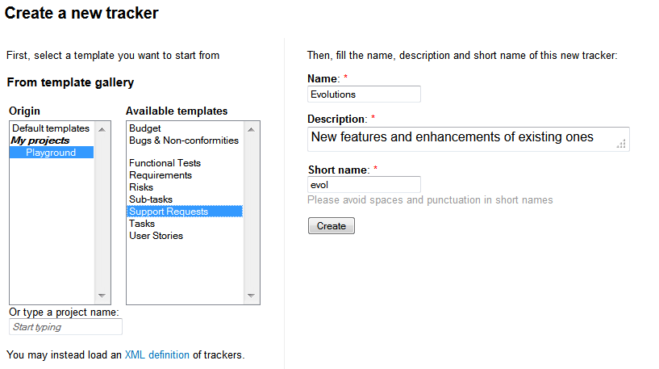

   Create a new tracker

    The next step is to decide upon the set of fields available for this
    tracker. In order to avoid the pain of defining the most common type of
    trackers again and again (e.g. Bug tracker, Support Request tracker,
    etc.) Tuleap offers the ability to create a new tracker from
    a set of templates. Those templates are either Tuleap-wide
    templates (also known as site templates), project specific templates or
    an xml file.

.. NOTE::

   Using a template doesn't mean you have to stick to the list
   of fields and field values defined in this template. You can always add
   or remove fields or fine-tune the field settings afterwards.

-  Tuleap-wide Templates: these are templates that have
   been defined by the administrators of the Tuleap site
   because it is expected that most project needs them. It is also a way
   to ensure a certain level of harmonization across projects that will
   make developers' life easier. The list of available templates may
   vary from one Tuleap site to another but you will
   typically find templates for Bugs, Tasks, etc. A specific tracker
   called "Empty" allows you to create a virgin tracker with no
   predefined fields other than the minimal set of required fields. See
   `Tracker Templates`_ for more explanations on the semantic
   of those templates.

-  **Project Templates**: in case you have already defined a tracker
   that suits your needs or you have seen a tracker from another project
   that you'd like to reuse, you just have to specify the project ID and
   tracker ID either by hand or from the pull down menus and click on
   the create button to create the exact same tracker in your project
   (**Note**: this does not copy the artifacts of the original tracker
   but only the field settings).

-  **XML file**: Tuleap allows you to create trackers from
   XML file. The expected XML file describes the structure of the
   trackers, the fields used, the values of the fields, and the
   permissions. XML schema is available in
   /src/www/tracker/resources/tracker.rnc. Most of the time, you will
   use an XML file coming from a tracker structure export (See `Tracker Structure Export`_). This
   feature is really convenient to copy a tracker from a server to
   another. **Note**: this does not copy the artifacts of the original
   tracker but only the structure).

.. _Tracker Templates:

Tuleap-wide Tracker Templates
~~~~~~~~~~~~~~~~~~~~~~~~~~~~~

The standard trackers provided for each new Tuleap project
are:

-  Bugs

-  Tasks

-  User stories

-  Change Requests

-  Requirements

-  Risks

Each of those templates have predefined fields that correspond to the
specific work processes around bugs, tasks etc. In the following, we
give a short overview of these different work processes. For each of
those templates, the Tuleap Team also tried to maintain a
fair balance between sophistication and ease of use. As a consequence,
fairly simple and straightforward templates are configured by default
for all new hosted projects. Then it is up to the project members to
decide how much information they want to see attached to an artifact and
customize their tracker configuration accordingly.

The Bug Tracker Template
````````````````````````

One of the golden rules in a collaborative project environment is to let
your project community test the software and freely report on any defect
(or bug) they have seen. The Bug template was developed with this
objective in mind.

The template Bug Tracker comes pre-configured with a set of fields (used
or not) that are probably enough for the majority of projects hosted on
Tuleap. You can either decide that the template is lacking
some critical fields that you can create or, on the contrary, switch
some fields to the "Unused" status to make the tracker simpler.

The Task Tracker Template
`````````````````````````

The Tuleap Task tracker is a task manager and not a project
management software like CA-SuperProject, MS-Project or other powerful
and complex desktop products available on the market. The
Tuleap Task Tracker cannot build a Pert chart, it doesn't
have any planning capabilities. It is rather a time sheet tool which
allows project members to track their time and manage other things like
weekly TODO list for instance.

However the Tuleap Task Tracker offer a number of features
that makes it very complementary with the above mentioned project
planning tools:

-  Like all Tuleap tools, the Task Tracker is entirely web
   based. Therefore any project member can update his/her time sheet
   regardless of its physical location.

-  Tasks can be managed by authorized project members.

-  Each project member has its own time sheet showing all open tasks
   assigned to her, their priority, description, start and end dates,
   percentage completion, related tasks, follow-up comments and a full
   audit trail of the past changes.

-  Task data can be collected by the project leader(s) at any point in
   time and exported out of the Tuleap project thanks to the
   Project Data Export facility (see :ref:`project-data-export`). This allows for an easy
   generation of progress reports or project re-planning.

The User Story Template
~~~~~~~~~~~~~~~~~~~~~~~

Tuleap makes it easy to implement the Scrum methodology, by
providing a User Story tracker to each project. You will find a
comprehensive description of Scrum on
`Wikipedia <http://en.wikipedia.org/wiki/Scrum_(development)>`_.

The User Story tracker contains artifacts called "User Stories", that
describe needs expressed by the customers of the project. The tracker
has been customized to capture customer requirements: it is possible to
define the customer value of each story, its acceptance criteria, its
effort, etc.

Other optional fields are available, and of course, each project may
customize the tracker to fit the way it implements the methodology

At the beginning of a Scrum project, each customer user story must be
stored. During the first Sprint Meeting, a few stories are selected by
the team to be implemented in the first iteration. The team then affects
the stories to team members ('Owner') and can start developing.

At the end of the Sprint (after two to four weeks), the team meets for
the new Sprint Meeting. User stories selected in the past Sprint are
updated, and new stories are selected for the next Sprint.

The Change Request Tracker Template
```````````````````````````````````

This tracker allows to submit change requests for your application
adjustment. This is of great importance for change management process
(ITIL, PRINCE2, ...). A change request is declarative, i.e. it states
what needs to be accomplished, but leaves out how the change should be
carried out.

When submitting a change request, you have to provide:

-  The impacted product (Product, version)

-  The approval status (approved by, disposal)

-  The change request description (description, justification, impact if
   no change)

-  The change impact analysis (Objectives, deliverable, risks, schedule,
   budget)

You can set permission to allow only client and project manager groups
to access this tracker. For instance:

-  only client can set the "priority" field

-  only project manager can set the "approved by" and "disposal" fields

-  both can describe impacts fields

As for all trackers, tracker administrator can customize the fields
according to the internal process.

The Requirements Tracker Template
`````````````````````````````````

This tracker helps software engineers to identify a necessary attribute,
capability, characteristic, or quality of a system in order for it to
have value and utility to a user.

All system Requirements are also an important input into the
verification process, since tests should trace back to specific
Requirements. This tracker is really useful for Requirements management
processes such CMMI.

When submitting a Requirement, you have to fulfill:

-  The designed Product (Product, version)

-  The Requirement characteristics (type, nature, complexity, priority)

-  The Requirement description (origin, description, proposed solution)

-  The Requirement state (state, satisfied by)

You then can link (using artifacts references) a requirement to a test
case/result artifact, or other requirements artifacts for
traceability/satisfaction.

You can set permission to allow only client and project manager groups
to access this tracker.

As for all trackers, tracker administrator can customize the fields
according to the internal process.

The Risk Tracker Template
`````````````````````````

This tracker aims to support Risk management. It provides information
for identification, assessment, and prioritization of risks during the
project lifecycle. You can minimize, monitor, and control the
probability and/or impact of unfortunate events or to maximize the
realization of opportunities. Risks may be linked (using artifacts
references) to actions/task/documentation for minimizing likelihood or
impact.

When assessing a Risk, you have to set:

-  Rate of occurrence (likelihood, tendency)

-  Impacts

-  Timescale for Risk occurrence

-  Action for risk reduction (action, responsible)

You may use the query form to filter the risks :

-  select the "likelihood" field value "any" if you wish to get all
   predefined risks

-  select the "likelihood" field value"high", "medium" and "low" if you
   wish to review your assessed risks


Default Tracker Access Permissions
~~~~~~~~~~~~~~~~~~~~~~~~~~~~~~~~~~

Depending on the class of citizen a user belongs to and the level of
permissions granted as a project member, the various features of the
Tuleap Tracker may or may not be accessible. Please note
that the default access permissions listed below may change for a
particular tracker if the tracker administrator modifies the access
permission settings. For more information on how to configure tracker
access permissions see `Permissions Management`_. Default permission settings are summarized in
the table below:

============================================================================================= ===========================================
        Tracker Feature                                                                           Access Permission
============================================================================================= ===========================================
New Artifact Submission                                                                       By default any Tuleap visitor,
                                                                                              whether logged in or not, has the ability
                                                                                              to submit a new artifact to a tracker. The
                                                                                              tracker administrator has the ability to
                                                                                              limit the scope of this feature to
                                                                                              Tuleap registered users
                                                                                              (anonymous users are requested to login
                                                                                              first) or to the project members if the
                                                                                              tracker is made private.
Artifact Browsing                                                                             Searching the Artifact database and
                                                                                              browsing the results is available to all
                                                                                              Tuleap visitors (whether
                                                                                              registered or not) unless the tracker has
                                                                                              been made private by the project
                                                                                              administrator. If so the tracker is only
                                                                                              visible to project members.
Artifact Update                                                                               By default only project members can
                                                                                              update an artifact. Non members have only
                                                                                              limited access and can only add a comment
                                                                                              or attach a file.
Tracker Administration - Artifact Import                                                      Only Project administrators and project
                                                                                              members with Admin. permission can
                                                                                              import data into trackers.
Tracker Creation                                                                              Only available to project administrators.
Tracker Administration - General Settings                                                     Only available to project administrators
                                                                                              and project members with Admin.
                                                                                              permission on this tracker.
Tracker Administration - Field Usage Management                                               Only available to project administrators
                                                                                              and project members with Admin.
                                                                                              permission on this tracker.
Tracker Administration - Semantic Management                                                  Only available to project administrators
                                                                                              and project members with Admin. permission
                                                                                              on this tracker.
Tracker Administration - Workflow Management                                                  Only Project administrators and project
                                                                                              members with Admin. permission can define
                                                                                              and configure workflow.
Tracker Administration - Permissions Management                                               Only Project administrators and project
                                                                                              members with Admin. permission can define
                                                                                              tracker permissions.
Tracker Administration - Canned Responses Management                                          Only Project administrators and project
                                                                                              members with Admin. permission can define
                                                                                              canned responses.
Tracker Administration - Email Notification Settings                                          Only Project administrators can add email
                                                                                              addresses in the global email notification
                                                                                              field. Project members can watch artifacts
                                                                                              of other team members. Any registered
                                                                                              Tuleap user can customize her
                                                                                              notification preferences.
Tracker Administration - Structure Export                                                     Only Project administrators and project
                                                                                              members with Admin. permission can export
                                                                                              tracker structure.
============================================================================================= ===========================================

                                                Default Tracker Access Permissions


As we went through the description of the Tuleap Tracker
features, we referred several times to the flexibility of this system
and how easy it is to customize your own tracker. This can be done
through the Tracker Administration available in the menu bar of each
tracker.

The configuration settings for a given tracker is divided in ten
sections:

-  **General Settings**: name, description and some other general
   purpose parameters are defined in this section.

-  **Permissions Management**: allows you to give different access
   permissions to different users depending on their role.

-  **Manage Field Usage**: this is where you will build the tracker.

-  **Manage Fields Dependencies**: allows you to define how values in
   one field depend upon other field values.

-  **Manage Semantic**: this section allows you to define some fields
   semantic.

-  **Manage Canned Responses**: allows you to create some pre-defined
   follow-up comments that your team is using on a regular basis.

-  **Manage Workflow**: allows you to define a workflow

-  **Email Notification Settings**: fine tuning of the global and
   personal email notification settings.

-  **CSV Import**: allows you to import data (artifacts) in the tracker
   with a CSV format

-  **Export**: allows you to export the tracker in a xml format

-  **Hierarchy**: allows you to configure tracker hierarchy

-  **Delete artifacts**: allows you to delete an artifact

General Configuration Settings
~~~~~~~~~~~~~~~~~~~~~~~~~~~~~~

This module allows you to define a series of properties for your
tracker. Some of those properties have already been defined in the
tracker creation form while some others are only available on this
configuration page. The properties are as follows:

-  **Name**: this is the name of your tracker. More precisely you want
   to name your tracker after the type of artifact that are going to be
   managed in your tracker. This name will be used by Tuleap
   in the title of the various screens of the trackers. Typical example
   of tracker names are: Action Requests, Support Requests,
   Requirements, Defects or Bugs…

-  **Description**: A longer description of what this tracker is all
   about and the type of artifact that it manages.

-  **Short name**: this is a short name that best describe the type of
   artifact managed in this tracker. This name must be quite short as it
   is used in various screens of the Tuleap Tracker like the
   artifact update form next to the artifact ID. Following the examples
   given for the Name field above, short names can be: AR for Action
   Request, SR for Support Requests, Reqt for Requirements, bug for
   Bugs…

-  **Instantiate for new projects**: This parameter is only displayed
   when working on a "template" type of project (see :ref:`project-type`). If the
   parameter is selected, then projects created from this template
   project will have this tracker created. If not selected, the tracker
   will not be available in the new project.

-  **Submit instructions**: an introductory message that displays at the
   top of the artifact submission form. This is a convenient way to give
   directions and recommendations to the submitter. The text must use
   HTML tags for formatting which gives a great flexibility to shape the
   content of this preamble (you can use bold, italic, colors, embedded
   URL…)

-  **Browse instructions**: an introductory message that displays at the
   top of the artifact searching and browsing screen. The text must use
   HTML tags for formatting which gives a great flexibility to shape the
   content of this preamble (you can use bold, italic, colors, embedded
   URL…)

Permissions Management
~~~~~~~~~~~~~~~~~~~~~~

This module is used to give different access permissions to different
users depending on their role.

Access permissions to a tracker can be defined at two levels:

-  **Tracker level**: at this level, you can define the group of users
   who have access or not to the tracker.

-  **Field level**: this is a more fine-grained level, where access
   permissions can be defined field by field. Using this feature you can
   specify which groups has read-only permission on a field, which ones
   can modify it or which ones do not have access to it at all.

All access permissions are defined for groups of users rather than
individuals. See :ref:`user-groups` for more information on how project administrators
can define and manage groups of users.

Tracker Permissions Management
~~~~~~~~~~~~~~~~~~~~~~~~~~~~~~

When entering this module, a list of user groups appears along with
their access permissions. The user group list first shows groups of
users defined at the system level like all\_users, registered\_users,
project\_members, etc. These are groups that Tuleap manages
for you so you don't have to keep them up to date when new users
subscribe to the site or become member of your project. The second part
of the user group list shows all groups of users defined at the project
level (see :ref:`user-groups` for more information on how to define and manage groups of
users).

Each group can be associated with the following access permissions:

-  **HYPHEN**: this level of permission that displays as a hyphen means
   that the group has no specific permission.

-  **access to all artifacts**: when granted this permission a user
   group has access to all the artifacts of the tracker.

-  **access to artifacts assigned to group**: when granted this
   permission a group of users can only see those artifacts that have
   been assigned to one or several members of this group.

-  **access to artifacts submitted by group**: when granted this
   permission a group of users can only see those artifacts that have
   been submitted by one or several members of this group.

-  **access to artifacts assigned to or submitted by group**: when
   granted this permission a group of users can only see those artifacts
   that have been submitted by or assigned to one or several members of
   this group.


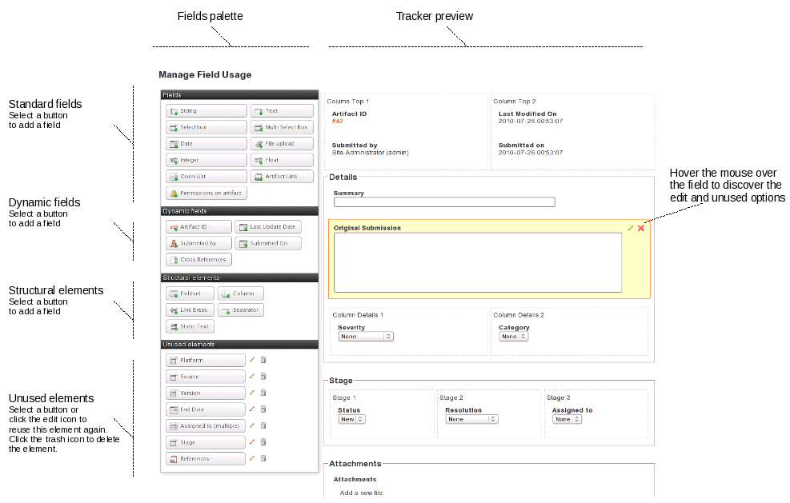


Field Permissions Management
~~~~~~~~~~~~~~~~~~~~~~~~~~~~

Beside defining access permissions for the tracker and its artifacts
(see `Tracker Permissions Management`_) it is sometimes necessary to restrict access to certain fields
of the tracker to a given population. As an example if you share a
defect tracking system with your customers you may want to hide some
fields from the view of your customer or prevent them from modifying
certain fields. This is precisely what this module is meant for.

When using this configuration module, you can toggle the display between
two different views: you can either view all user groups permissions for
a given field OR for a given user group you can view all the field
permissions defined for it. The experience shows that the view by field
is often the preferred one when you configure a tracker for the first
time whereas the view by group of users is more convenient to adjust the
permission settings later on (see :ref:`user-groups` for more information on how to
define and manage groups of users).

Each group of users can be granted the following permissions for a given
field:

-  **Can submit**: this permission determines whether a group of users
   can define the initial value of a field when an artifact is first
   submitted. If not checked, this field will not be visible on the
   submission screen for this user group.

-  **Read-only**: if granted read-only permission a group of users only
   has read access to a field. In other words the users see the value of
   the field but cannot modify it.

-  **Update**: if granted update permission, a group of users can see
   the current value of a field and also modify it.

-  **-**: this level of permission that displays as a hyphen means that
   the group has no specific permission, like in tracker permissions.

**Important Note**: the permissions associated with a field apply in
many areas of a tracker. For instance if a group of users has no access
to a given field, this field becomes invisible on the initial submission
form, on the artifact search form as well as in the table of results
returned by the search, in the artifact update form, in the history of
changes associated with each artifact and finally in the email
notification sent to this group of users.

Field Usage Management
``````````````````````

When a tracker is first created, it comes pre-configured with a set of
fields inherited from the template that was used to create it. For the
majority of projects hosted on Tuleap it is very likely that
the standard Tracker templates (e.g Bugs, Tasks, User strories) will
cover most of the needs.

However Tuleap gives you the ability to customize your
trackers. It can be a variation on an existing template with some fields
or structural elements addition or removal or it can be an entirely new
tracker created from an empty template.

The Field Usage Manager is divided in two parts : a fields palette on
the left and a tracker visualization on the right (see `Tracker Admin Field Usage Overview`_)

Tracker Fields Palette
``````````````````````

The palette allows the user to choose the elements he wants to add to
his tracker. The field usage manager palette consists of 4 groups:

-  *Fields*: These are regular fields (int, float, list, etc.) that the
   user will be able to update. These fields have no special behaviour.

-  *Dynamic Fields*: These fields have a special behaviour. Their value
   cannot be updated by the user. The value is determined dynamically
   (e.g. the user that submitted the artifact, the Id of the artifact,
   the artifact submission date, etc.).

-  *Structural Elements*: These elements are not real fields. There are
   really useful to enhance the artifact presentation. They can be
   containers (fieldset, columns) or decorative elements (line break,
   text).

-  *Unused Fields*: In this section, you will find all the fields that
   are not used in the tracker definition. If you remove a used field
   from your tracker definition, it won't be deleted but placed in this
   unused field section. It will then be easier to use it again. If you
   really want to delete it, delete it from the unused field section.
   Unused fields are also used in tracker template definition. You can
   find here some fields that the team didn't decide to introduce in the
   template but that makes sense however. It is easy then to add such a
   field whereas creating from scratch.


Creation and Modification of a Tracker Field
~~~~~~~~~~~~~~~~~~~~~~~~~~~~~~~~~~~~~~~~~~~~

Add a field to a tracker
````````````````````````

To add a field to a tracker, you just have to choose a field type on the
fields palette. Simply click on it, and a property field form will
appear instead of the palette!

Depending on the fields, the properties can change. But, here is the
properties that can be tuned :

-  **Label**: this is the name of the field. Although you are entirely
   free to change the name of a field, we recommend that you only change
   it for a new name with a similar meaning. If you want to change the
   name for something radically different then we recommend that you
   create an entirely new field and you leave the existing field in the
   list of unused fields.

-  **Description**: a longer description of the purpose of this field.

-  **Size**: this property allows you to define how much space a field
   is going to take on the screen. It has a different meaning and a
   different format depending on the field type.

   -  *Multi-Select Box*: the display size is made of a single number
      which indicates how many of the values associated with this field
      are visible at once. A reasonable value for the size of
      multi-select box is between 2 and 5.

   -  *String, Integer Float Fields*: "maxchars" and "size" can be
      filled where "size" is the number of character visible at once in
      the field display window and "maxchars" is the maximum number of
      characters that can be typed for this field. If "Size" is less
      than "Maxchars" then the text will shift in the visible window as
      more text is entered. The maximum value of "Size" is 255.

   -  *Date Field*: A date always follows the same pattern (YYYY-MM-DD)
      and therefore it always has a fixed length of 10 characters.

   -  *Text*: for text areas, "rows" and "cols" can be filled, where
      "cols" is the number of columns in the text area (the width in
      number of characters) and "rows" is the number of rows or lines of
      text. Note that the number of lines is not limited to "rows". If
      the text typed in the field has more than "rows" lines then a
      scrollbar will show up to navigate through the text.

-  **Rank**: this is the position of the field on the form. Positions
   are relatives one against another.

-  **Required**: determines whether leaving the field blank in the
   artifact submission or update form is allowed or not. If checked the
   tracker won't accept the form unless the field is given a value. The
   fields that must be filled out are marked with a red start on the
   submission and modification forms

-  **Default value**: This applies to one-line fields with no restricted
   set of values. For those the default value can be defined. It is the
   value which will be displayed at the artifact submission.

-  **Values**: This applies to "Select Box", "Multi-Select Box" and
   "Text Box List" type of fields where the list of values you are going
   to choose will show up in the pull-down menus when an artifact is
   submitted or updated.

   You can bind those fields to :

   -  **Add the values**: To configure values simply add values in the
      text area (one per row). Check "alphabetically sort values" will
      sort automatically your values.

      Tuleap allows to add what we call "decorator" to each
      value but only on edition mode (see `Edit the field of a tracker`_)

   -  **Binding a field to a list of users**: the Trackers offers the
      ability to associate "Select Box", "Multi-Select Box" and "Text
      Box List" type of fields with a list of predefined values that is
      actually dynamically generated by the platform. A typical example
      of this is when one would like to create a new select box showing
      the list of project members. Instead of creating and maintaining
      the list of values manually, you can re-use a list already defined
      elsewhere.

      Note that if you decide to bind a select box to a list of
      dynamically generated values you can no longer create your own
      values. The following lists are currently available (others may be
      added in the future):

      -  **Project Members** : list of people belonging to the project.

      -  **Project Administrators** : project members who have been
         granted the status of project administrators.

      -  **Artifact Submitters**: the full list of people who once
         submitted an artifact to the tracker.

      -  **Project Defined User Groups**: you can bind a select box to
         any of the user groups that are defined by the project. To see
         how to define such user groups refer to :ref:`user-groups`.

      On the following picture, we can see that people in "Assigned to"
      field are automatically populated from "SupportTeam" user group.

.. figure:: ../images/screenshots/tracker/sc_conf_vs_end_user.png
   :align: center
   :alt: Select box bound to a list of users
   :name: Select box bound to a list of users

   Select box bound to a list of users

   -  **Binding a field to a list of user groups**: It's an extension of
      "binding to a list of user" but with user groups. It behaves the same
      way but instead of selecting a user, you will choose a user group among
      a list.

It's useful when you have complex setup and want to have several
people notified at once for an action.

On the following picture, we define a list of support groups that
will be in charge of the artifact according to their
responsabilities:

.. figure:: ../images/screenshots/tracker/sc_conf_vs_end_usergroup.png
   :align: center
   :alt: Select box bound to a list of user groups
   :name: Select box bound to a list of user groups

   Select box bound to a list of user groups


Edit the field of a tracker
```````````````````````````

In order to make some change on a field, you can simply edit it by
clicking on the Edit icon.

The edition mode allows for fields configuration not available at the
creation :

-  **Change the field name**: the field name is different from the field
   label. Field name is an internal name for the field. It is used in
   SOAP API for instance. It must not contain any special characters.
   Only lower case letters and "\_" are authorized.

-  **Add a decorator**: List values can be embellished with a decorator.
   A decorator is a colored square. You can choose the color for each
   value in a large palette of colors. (see `Tracker Admin Field Edition`_). Decorators can be used
   to get a quick visual indicator feedback for the user. For instance,
   the values for the priority of a bug can be given a color with the
   meaning "the darker the more important".

-  **Add values** You can easily add new values to the list by selecting
   the "add new values" link below existing values.

-  **Hide values** You can easily hide existing values by clicking the
   hide icon next to the value. If the eye is open, the value is
   available. If the eye is medium closed, then the value is hidden.
   Just click again to enable the value. Artifact with hidden values
   will still be set to the hidden values. But hidden values won't be
   proposed anymore for new artifacts.

-  **Remove values** You can remove a list value by clicking the cross
   icon next to the value. It is impossible to delete values if there
   are some artifacts with this value. In this case, you can hide the
   value.

-  **Access directly to the field permissions manager** Editing a field,
   you can access the permissions administration of this field selecting
   the "edit permission" link.

-  **Configure notifications**: if the field is a "Select Box", a "Multi
   Select Box" or a "Text Box List" bind to a list of users, a checkbox
   "Send notifications to selected people" will be displayed. If
   checked, all selected users of an artifact will receive a email if
   the artifact is modified.

.. figure:: ../images/screenshots/sc_tracker_admin_field_usage_edition.png
   :align: center
   :alt: Tracker Admin Field Edition
   :name: Tracker Admin Field Edition

   Tracker Admin Field Edition

Delete the field of a tracker
`````````````````````````````

In order to delete a field, simply click on the Delete icon on the
visualization tracker page. The field won't be deleted since it will be
now present in the "Unused Elements" part of the palette.

Please note that you won't be able to remove a field if this field is
used in tracker semantic, or in tracker workflow.

To delete definitively that field, click on the trash icon in the
"Unused Elements" part of the palette.

Field Dependencies
~~~~~~~~~~~~~~~~~~

Field dependencies allow us to link source field values to target field
values. In other words, the values proposed to a final user for a field
will depend upon the value selected for another field.

As an example, if you define a field Operating System(Linux, MacOS X, MS
Windows, NetBSD) and a field Version(2.0, 2.1, 2.2, 2.4, 2.6, 3.0, 10.1,
10.2, 10.3, 10.4 (Tiger), NT, 2000, XP), you can define dependencies in
the tracker administration interface:

1. First, select the source field "Operating System" then the target
   field "Version".

2. To create dependencies between each "Operating System" values and the
   corresponding versions, you just have to check the corresponding box
   in the matrix.

First, you select a source field.

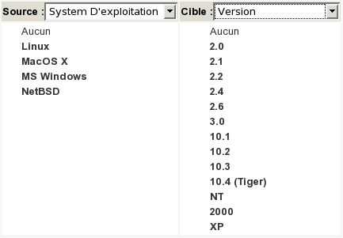

   Once the source field selected (here, "Operating System"), you can
   select the target field.

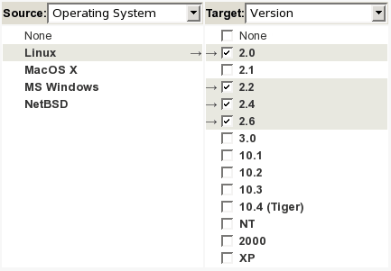

   Then submit, and a matrix with all values is displayed:

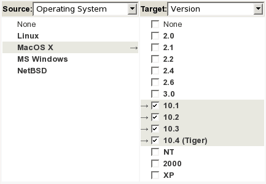

   You can now check the boxes corresponding to the dependencies. In the
   example, if the source field value is "Linux", the corresponding target
   values are "2.0", "2.2", "2.4", "2.6".

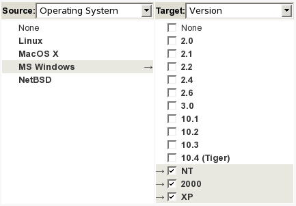

   Once a field dependency has been created, it appeared at the "Choose
   Source/Target" page as a quick link if you need to edit it. Note that to
   delete a field dependency, you need to empty the matrix.

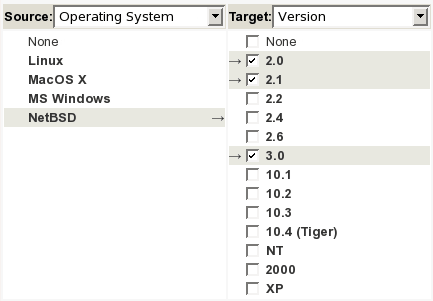

   Once dependencies are defined, the final user (when submitting/updating
   an artifact) will see the Version options filtered according to the
   selection of the Operating System:

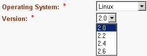

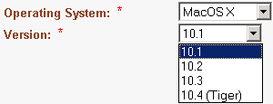

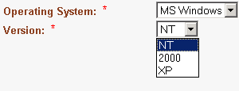

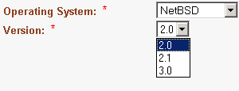

   When you define your dependencies, please be aware of the following
   points:

   -  Only *Select Boxes* and *Multi Select Boxes* can have dependencies,

-  The cyclic dependencies are forbidden (Field 1 => Field 2 => ... =>
   Field 1),

-  A field can depend upon only one field,

-  Javascript must be allowed on the browser to manage dependencies,

-  If a field is not the target of a dependency, then it will propose
   all its values. On the opposite, it will propose only those which
   satisfy the dependencies.

Semantic
````````

As trackers can be fully customized, you may need a way to define what
is the title of your artifacts, when you consider an artifact to be open
or close, or the field used to define the contributor (or assignee) of
an artifact. This feature is provided by the admin section "Semantics".

Most of the trackers you will use already defined a semantic. This is
the case for instance for all tracker templates (see `Tracker Templates`_ ).

To define or update a semantic field, select the pencil icon next to the
semantic property. Semantic admin section lets you define the following
semantic properties:

Title
`````

The title of an artifact is a field that sum up the best the artifact.
For instance, it can be the field **summary** for a bug tracker, the
field **name** for a contact tracker, or the field **I want to** for a
Scrum user story tracker.

You can choose any **text field** as the title of your artifacts.

This semantic information is used in the edition page of an existing
artifact, next to the ID. It is also displayed in **My artifacts**
widget.

Status
``````

The status of an artifact is a field that describes the stage of the
artifact. If you set a semantic for status, please define the values
that mean *open* for this field.

The most commom case is a field **Status** with the value **open** for
open values. All other values will be considered as **closed** values.
But you may want to define any other semantic. You can choose any
**selectbox field** (single or multi) as the status of your artifacts.

This semantic information is used in **My artifacts** widget (this
widget displays only *open* artifacts that belongs to you).

Done (Agile Dashboard)
``````````````````````

The done semantic is used for burnup and velocity chart
computation.

.. _velocity_administration:

Velocity (Agile Dashboard)
``````````````````````````
.. attention::

  This module is part of :ref:`Tuleap Entreprise <tuleap-enterprise>`. It might
  not be available on your installation of Tuleap.

How to add velocity chart in a release:
 1 - You should have a tracker hierarchy between Release and Sprint

.. figure:: ../images/screenshots/tracker/hierarchy.png
   :align: center
   :alt: Example of release hierarchy

Example of release hierarchy


 2 - You should have a velocity semantic at release and child level

.. figure:: ../images/screenshots/tracker/missing_velocity_semantic.png
   :align: center
   :alt: An error is displayed when children tracker does not have the velocity semantic

An error is displayed when children tracker does not have the velocity semantic


 3 - You should have at least one backlog tracker with done and initial effort semantic.
     I some tracker don't have both semantic, its value won't be taken in account during computation.

.. figure:: ../images/screenshots/tracker/missing_backlog_semantic.png
   :align: center
   :alt: A warning is displayed if tracker does not have all needed semantic

A warning is displayed if tracker does not have all needed semantic

Once computation is done, you can manually override the computed value by entering a new one.

Contributor / Assignee
``````````````````````

The contributor of an artifact (or assignee) is a field that is bound to
users. The contributor(s) of an artifact are the person(s) who are
responsible for the work needed to complete the artifact. For instance,
it can be the field **assigned\_to** for a bug tracker, the field
**owner** for a task tracker.

You can choose any **user list field** as the contributor of your
trackers.

This semantic information is used to define specific permissions on a
tracker (for instance restrict tracker access to a group of assignee
people).

Tooltip
```````

The tooltip of an artifact is a piece of information that is displayed
when you hover an artifact reference with your mouse.

You can select all the fields you want to compose the artifact tooltip.

Initial Effort (Agile Dashboard)
````````````````````````````````

The Initial Effort semantic is special in that it only exists if the project
has the Agile Dashboard enabled. In the agile context, it is supposed to
represent the estimated effort for a given task, story, sprint, release...

In order to use this semantic you need to have a numeric field in your tracker
that corresponds to this initial effort notion.

The initial effort is used in the Agile Dashboard **content** and **planning**
views.


Workflow Manager
~~~~~~~~~~~~~~~~

Overview
````````

A Workflow can help you control the artifact lifecycle, ensure that your
teams follow the rule of your company methodology (CMMi, etc.).

Each tracker can have it's own workflow, designed by the tracker
administrator.

For now, a tracker can have only one workflow defined on one field. This
field must be a list field (select box).

N.B. Worflow is not taken into account in artifacts mass change

Add a workflow to a tracker
```````````````````````````

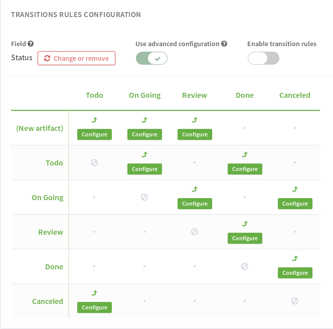

-  **First, select the field**: you choose the field on which applies
   the workflow. A workflow applies on "Select Box" field type (except
   if it's bound to users).

-  **Then, define transitions**: the states the artifact should take
   from it's beginning to it's end.

   By default, no transitions are allowed (it's not possible to change
   the values of selected field). You authorize a transition by clicking
   on the bullet that cross "FROM" row and "TO STATE" Column. Arrow
   icon: the transition can happens, grey bullet: the transition is
   forbidden.

   Once you defined all your transition, click on Submit button to save
   it.

   For instance, in `Add a workflow to a tracker`_, various transitions have been defined: on
   artifact submission, defined by fake state "new artifact", the only
   value available for the field "Status" will be "New". Then, once
   Status is "New", possible changes will be "Unconfirmed", "Verified"
   and "Closed".

To delete the workflow, simply, click on the red cross near to the field
name. Transitions are deleted too.

Define rules on transitions
```````````````````````````

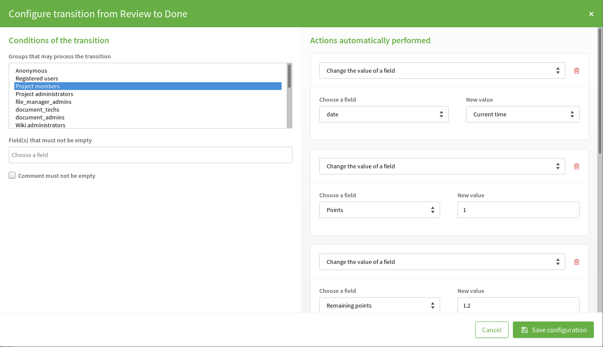

   Define workflow transitions

For a given transition, you can select the people allowed to perform it
and actions exectued after the transition happens (if allowed).

Groups that may make the transition
```````````````````````````````````

Once the transition is defined, you can refine who can make the
transition. To do this, click the "[details]" link next to the
transition. Then, select the group of users you allow to do the
transition (see `Define workflow transitions`_).

Post actions
````````````

You can define a list of actions after the execution of a transition. As
of today, only actions on date fields are available.

For instance, you can set a date field to the date of transaction
execution. It might be used to set automatically the close date of an
artifact (eg. when it's state move from Resolved to Closed).


Canned Responses
~~~~~~~~~~~~~~~~

One frequently sees project members in charge of the artifact
classification and dispatch process posting the same follow-up comments
repeatedly. Typical examples of repeated posted comments are: a thank
you message to the originator, a request for the originator to provide
commonly missing information like version numbers or type of machine
used, etc. (see `Definition of Canned Responses`_)

Rather than repeatedly typing the same follow-up comments,
Tuleap allows project members to create a predefined set of
responses. After these canned responses have been defined, posting a
follow-up comment is just a matter of selecting the appropriate response
from the pull down menu in the artifact update form.

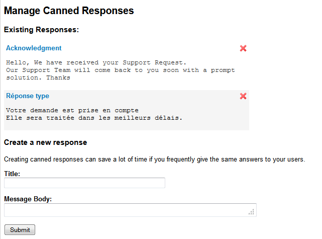

   Definition of Canned Responses

Email Notification Settings
~~~~~~~~~~~~~~~~~~~~~~~~~~~

The Tracker comes with a predefined set of
rules to keep relevant people aware of the artifact life. The default
rules can however be complemented or tuned in a number of ways:

Global Email Notification
`````````````````````````

In addition to the default notification rules, the tracker
administrators have the ability to specify a list of email addresses to
which submissions of new artifacts (and optionally artifact updates)
will be systematically sent. To add an email address, click the "add"
link. You can add as many email addresses as required.

You can choose to disable the permission check for global email
notification. This can be useful if the email address is a mailing list,
because individual permissions can't be checked for each member of the
mailing list. So for mailing lists, if the check box "check permissions"
is checked, the notifications will be send to each member with the
permissions of an anonymous user.

This feature is typically used to send submissions of new artifacts to a
number of well identified persons in the team who are in charge of
qualifying and dispatching the artifacts.

.. NOTE::

    If you want to notify many people at once, we suggest that you use
    the Tuleap Mailing Lists service to create a
    distribution lists (see :ref:`mailing-lists`). Once the Mailing List is up and running
    type the e-mail address in the Global Email Notification field.

    Creating a Mailing List on Tuleap has several
    advantages: first individuals can (un)subscribe by themselves and
    second all messages sent to a Tuleap mailing list are
    kept in an archive that can serve as an audit trail for your
    tracker.

Email subject customisation
```````````````````````````

It is possible to enable a marker "[Assigned to me]" in the subject of email
notifications to easily identify emails concerning artifact assigned to you.
This rely on Contributor/assignee semantic of the tracker.

In addition to the subject of the email, all the assignees are listed in the mail
body with ``=ASSIGNED_TO=<username>``. These markers are not visible but could be
used to create filters in your email client.


Tracker Artifact Import
~~~~~~~~~~~~~~~~~~~~~~~

Project Administrators have the means to import artifacts into
Tuleap trackers using the well known CSV (Comma Separated
Value) format supported by all of the major office productivity suites.
The artifact import functionality greatly facilitates the migration and
integration of external project tracking and management tools into
Tuleap trackers.

The import is divided into three steps:

-  **CSV file submission.** The project administrators can access the
   Import functionality from the tracker administration screen or over
   the Project Administration Menu. Enter/choose the tracker to update
   and specify the CSV file to import. In this step you can also check
   the option to send a mail notification to all users concerned by the
   artifact changes due to the import. If you don't check this option no
   notification will be sent.

-  **CSV file parsing.** If no parse errors were found in the uploaded
   file, a parse report is shown to validate that the information to
   import is correct.

-  **Database update.** Depending on the parsed information new
   artifacts are created or existing ones updated.

When to use the Import
``````````````````````

You will find below a couple of suggestions regarding the use of the
tracker import feature:

-  Initial import from a project management software to your
   Tuleap task tracker.

-  Migration of your legacy defect tracking system into your new
   Tuleap defect tracker.

-  Migration of artifacts from one Tuleap tracker to
   another.


The Database Update
```````````````````

If you import new artifacts, all non-mandatory fields that are omitted
in the CSV file will be initialized to their default value.

The submitter and submission date of an existing artifact is never
changed by an import even if the import file contains relevant
information.

If an error occurs for some artifact during the database update the
following artifacts in the CSV file are not imported any more.

Each import is tracked in the project history (:ref:`project-history`). On the other hand, no
e-mail notification is sent in response to the import.

.. NOTE::

    If a .csv file is opened in Excel, any change to the spreadsheet
    (even something as simple as a column resizing) may cause Excel to
    modify and update the .csv file. Changes that may occur include:
    dates, times and numbers converted to the same format as those used
    by your system's regional settings, single line feeds converted to
    line feed and carriage return, extra commas appended to certain
    lines.

    The updated date format might not be compatible with the
    Tuleap date format and potentially cause troubles when
    importing such updated CSV files back into Tuleap. On
    the other hand Tuleap-exported CSV files might not open
    correctly under Excel in certain Regionals.

    If you have a .csv file that either will not open correctly under
    Excel or was opened in Excel and will not import into
    Tuleap please try the following: Make sure all
    applications are closed. Change your system's regional settings
    (Start > Settings > Control Panel > Regional Options) to use the
    English with the following formats: Date = MM/dd/YYYY Time = hh:mm.
    Using Excel, open the .csv files that don't import, make a column
    width change, save the files and exit Excel. Go back and restore
    your original regional settings. Import the "fixed" .csv file into
    Tuleap.

Tracker Structure Export
~~~~~~~~~~~~~~~~~~~~~~~~

Tuleap allows you to export the structure of the trackers
into an XML file. The Tuleap tracker templates are provided
under the form of such XML files. This feature is also really convenient
to copy a tracker from a Tuleap server to another.

To export the structure of your tracker, please go to the admin part of
your tracker, and select the Export link. This will open a browser
window to choose the location of the exported file.

The exported structure file can be used when you create a new tracker,
see `Tracker Creation`_.

.. NOTE::

    This does not copy the artifacts of the tracker but only the
    structure (general settings, fields, values, workflow, semantic, canned responses and permissions).


Delete artifacts
~~~~~~~~~~~~~~~~

Tuleap allows project and tracker administrators to permanently delete artifacts.
To do so, go to the tracker administration and select "Delete artifacts".

.. NOTE::

    if you are not project or tracker administrator, please contact one administrator.
