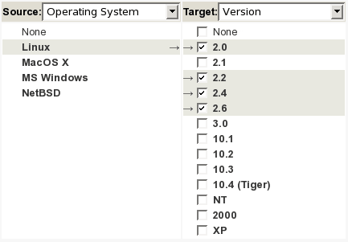
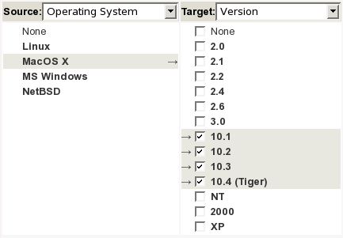
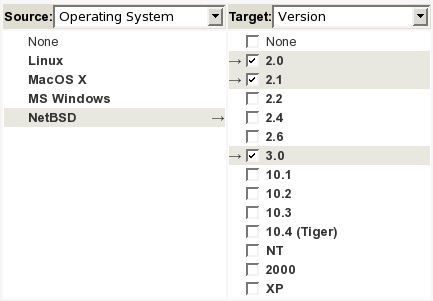
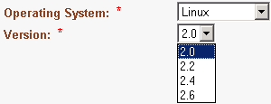
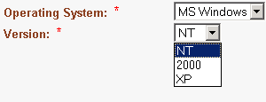
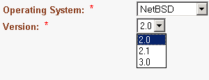

.. _tracker-field-dependencies:

Field Dependencies
==================

Field dependencies allow us to link source field values to target field
values. In other words, the values proposed to a final user for a field
will depend upon the value selected for another field.

As an example, if you define a field Operating System(Linux, MacOS X, MS
Windows, NetBSD) and a field Version(2.0, 2.1, 2.2, 2.4, 2.6, 3.0, 10.1,
10.2, 10.3, 10.4 (Tiger), NT, 2000, XP), you can define dependencies in
the tracker administration interface:

1. First, select the source field "Operating System" then the target
   field "Version".

2. To create dependencies between each "Operating System" values and the
   corresponding versions, you just have to check the corresponding box
   in the matrix.

First, you select a source field.

.. figure:: ../../../../images/screenshots/tracker/sc_trackerfielddependencies_01.png
   :align: center
   :alt:

   Once the source field selected (here, "Operating System"), you can
   select the target field.

   Then submit, and a matrix with all values is displayed:

   You can now check the boxes corresponding to the dependencies. In the
   example, if the source field value is "Linux", the corresponding target
   values are "2.0", "2.2", "2.4", "2.6".

.. figure:: ../../../../images/screenshots/tracker/sc_trackerfielddependencies_04.png
   :align: center
   :alt:

   Once a field dependency has been created, it appeared at the "Choose
   Source/Target" page as a quick link if you need to edit it. Note that to
   delete a field dependency, you need to empty the matrix.

   Once dependencies are defined, the final user (when submitting/updating
   an artifact) will see the Version options filtered according to the
   selection of the Operating System:

.. figure:: ../../../../images/screenshots/tracker/sc_trackerfielddependencies_08.png
   :align: center
   :alt:

   When you define your dependencies, please be aware of the following
   points:

   -  Only *Select Boxes* and *Multi Select Boxes* can have dependencies,

-  The cyclic dependencies are forbidden (Field 1 => Field 2 => ... =>
   Field 1),

-  A field can depend upon only one field,

-  Javascript must be allowed on the browser to manage dependencies,

-  If a field is not the target of a dependency, then it will propose
   all its values. On the opposite, it will propose only those which
   satisfy the dependencies.
