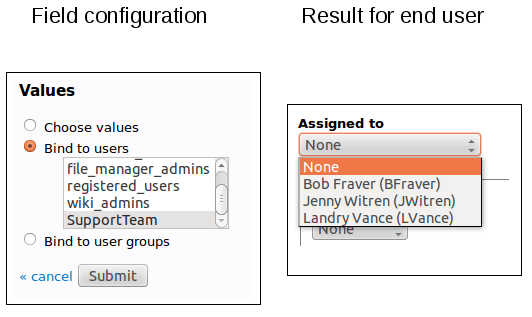
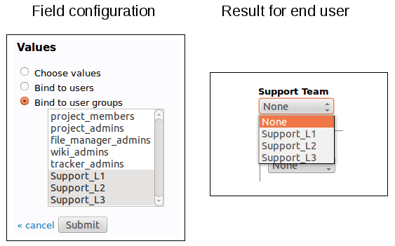
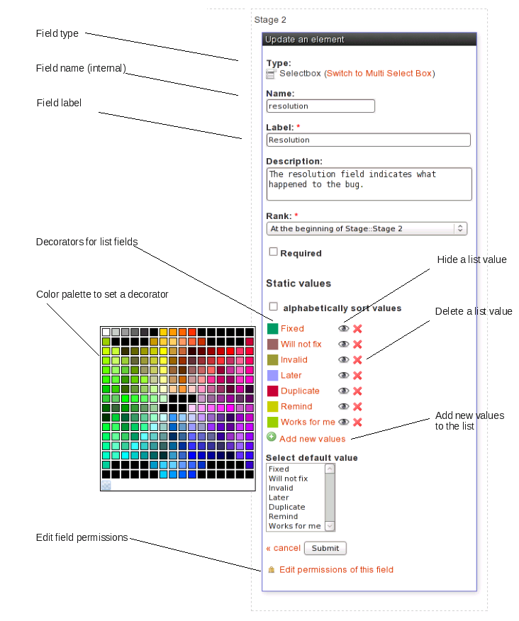
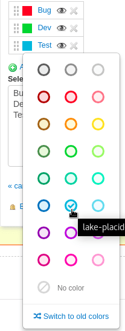

Field Usage Management
======================

When a tracker is first created, it comes pre-configured with a set of
fields inherited from the template that was used to create it. For the
majority of projects hosted on Tuleap it is very likely that
the standard Tracker templates (e.g Bugs, Tasks, User strories) will
cover most of the needs.

However Tuleap gives you the ability to customize your
trackers. It can be a variation on an existing template with some fields
or structural elements addition or removal or it can be an entirely new
tracker created from an empty template.

The Field Usage Manager is divided in two parts : a fields palette on
the left and a tracker visualization on the right.

Tracker Fields Palette
``````````````````````

The palette allows the user to choose the elements he wants to add to
his tracker. The field usage manager palette consists of 4 groups:

-  *Fields*: These are regular fields (int, float, list, etc.) that the
   user will be able to update. These fields have no special behaviour.

-  *Dynamic Fields*: These fields have a special behaviour. Their value
   cannot be updated by the user. The value is determined dynamically
   (e.g. the user that submitted the artifact, the Id of the artifact,
   the artifact submission date, etc.).

-  *Structural Elements*: These elements are not real fields. There are
   really useful to enhance the artifact presentation. They can be
   containers (fieldset, columns) or decorative elements (line break,
   text).

-  *Unused Fields*: In this section, you will find all the fields that
   are not used in the tracker definition. If you remove a used field
   from your tracker definition, it won't be deleted but placed in this
   unused field section. It will then be easier to use it again. If you
   really want to delete it, delete it from the unused field section.
   Unused fields are also used in tracker template definition. You can
   find here some fields that the team didn't decide to introduce in the
   template but that makes sense however. It is easy then to add such a
   field whereas creating from scratch.


Creation and Modification of a Tracker Field
~~~~~~~~~~~~~~~~~~~~~~~~~~~~~~~~~~~~~~~~~~~~

Add a field to a tracker
````````````````````````

To add a field to a tracker, you just have to choose a field type on the
fields palette. Simply click on it, and a property field form will
appear instead of the palette!

Depending on the fields, the properties can change. But, here is the
properties that can be tuned :

-  **Label**: this is the name of the field. Although you are entirely
   free to change the name of a field, we recommend that you only change
   it for a new name with a similar meaning. If you want to change the
   name for something radically different then we recommend that you
   create an entirely new field and you leave the existing field in the
   list of unused fields.

-  **Description**: a longer description of the purpose of this field.

-  **Size**: this property allows you to define how much space a field
   is going to take on the screen. It has a different meaning and a
   different format depending on the field type.

   -  *Multi-Select Box*: the display size is made of a single number
      which indicates how many of the values associated with this field
      are visible at once. A reasonable value for the size of
      multi-select box is between 2 and 5.

   -  *String, Integer Float Fields*: "maxchars" and "size" can be
      filled where "size" is the number of character visible at once in
      the field display window and "maxchars" is the maximum number of
      characters that can be typed for this field. If "Size" is less
      than "Maxchars" then the text will shift in the visible window as
      more text is entered. The maximum value of "Size" is 255.

   -  *Date Field*: A date always follows the same pattern (YYYY-MM-DD)
      and therefore it always has a fixed length of 10 characters.

   -  *Text*: for text areas, "rows" and "cols" can be filled, where
      "cols" is the number of columns in the text area (the width in
      number of characters) and "rows" is the number of rows or lines of
      text. Note that the number of lines is not limited to "rows". If
      the text typed in the field has more than "rows" lines then a
      scrollbar will show up to navigate through the text.

-  **Rank**: this is the position of the field on the form. Positions
   are relatives one against another.

-  **Required**: determines whether leaving the field blank in the
   artifact submission or update form is allowed or not. If checked the
   tracker won't accept the form unless the field is given a value. The
   fields that must be filled out are marked with a red start on the
   submission and modification forms

-  **Default value**: This applies to one-line fields with no restricted
   set of values. For those the default value can be defined. It is the
   value which will be displayed at the artifact submission.

-  **Values**: This applies to "Select Box", "Multi-Select Box" and
   "Text Box List" type of fields where the list of values you are going
   to choose will show up in the pull-down menus when an artifact is
   submitted or updated.

   You can bind those fields to :

   -  **Add the values**: To configure values simply add values in the
      text area (one per row). Check "alphabetically sort values" will
      sort automatically your values.

      Tuleap allows to add what we call "decorator" to each
      value but only on edition mode (see `Edit the field of a tracker`_)

   -  **Binding a field to a list of users**: the Trackers offers the
      ability to associate "Select Box", "Multi-Select Box" and "Text
      Box List" type of fields with a list of predefined values that is
      actually dynamically generated by the platform. A typical example
      of this is when one would like to create a new select box showing
      the list of project members. Instead of creating and maintaining
      the list of values manually, you can re-use a list already defined
      elsewhere.

      Note that if you decide to bind a select box to a list of
      dynamically generated values you can no longer create your own
      values. The following lists are currently available (others may be
      added in the future):

      -  **Project Members** : list of people belonging to the project.

      -  **Project Administrators** : project members who have been
         granted the status of project administrators.

      -  **Artifact Submitters**: the full list of people who once
         submitted an artifact to the tracker.

      -  **Project Defined User Groups**: you can bind a select box to
         any of the user groups that are defined by the project. To see
         how to define such user groups refer to :ref:`user-groups`.

      On the following picture, we can see that people in "Assigned to"
      field are automatically populated from "SupportTeam" user group.



   Select box bound to a list of users

   -  **Binding a field to a list of user groups**: It's an extension of
      "binding to a list of user" but with user groups. It behaves the same
      way but instead of selecting a user, you will choose a user group among
      a list.

It's useful when you have complex setup and want to have several
people notified at once for an action.

On the following picture, we define a list of support groups that
will be in charge of the artifact according to their
responsabilities:



   Select box bound to a list of user groups

.. _tracker-admin-field-edition:

Edit the field of a tracker
```````````````````````````

In order to make some change on a field, you can simply edit it by
clicking on the Edit icon.

The edition mode allows for fields configuration not available at the
creation :

-  **Change the field name**: the field name is different from the field
   label. Field name is an internal name for the field. It must not contain
   any special characters. Only lower case letters and "\_" are authorized.

-  **Add a decorator**: List values can be embellished with a decorator. A
   decorator is a colored square. There are two available color palettes: one
   that uses "named" colors that go well with Tuleap colors. The other lets you
   choose from a larger palette of colors (see `Tracker Admin Field Edition`_).
   Please note that the "old" color palette is deprecated and may be removed in
   future releases.
   You can choose a color for each value of the list. Decorators can be used to
   get a quick visual indicator feedback for the user. For instance, the values
   for the priority of a bug can be given a color with the meaning "the darker
   the more important".

-  **Add values** You can easily add new values to the list by selecting
   the "add new values" link below existing values.

-  **Hide values** You can easily hide existing values by clicking the
   hide icon next to the value. If the eye is open, the value is
   available. If the eye is medium closed, then the value is hidden.
   Just click again to enable the value. Artifact with hidden values
   will still be set to the hidden values. But hidden values won't be
   proposed anymore for new artifacts.

-  **Remove values** You can remove a list value by clicking the cross
   icon next to the value. It is impossible to delete values if there
   are some artifacts with this value. In this case, you can hide the
   value.

-  **Access directly to the field permissions manager** Editing a field,
   you can access the permissions administration of this field selecting
   the "edit permission" link.

-  **Configure notifications**: if the field is a "Select Box", a "Multi
   Select Box" or a "Text Box List" bind to a list of users, a checkbox
   "Send notifications to selected people" will be displayed. If
   checked, all selected users of an artifact will receive a email if
   the artifact is modified.



   Tracker Admin Field Edition



   New color palette with "named" colors

Delete the field of a tracker
`````````````````````````````

In order to delete a field, simply click on the Delete icon on the
visualization tracker page. The field won't be deleted since it will be
now present in the "Unused Elements" part of the palette.

Please note that you won't be able to remove a field if this field is
used in tracker semantic, or in tracker workflow.

To delete definitively that field, click on the trash icon in the
"Unused Elements" part of the palette.
