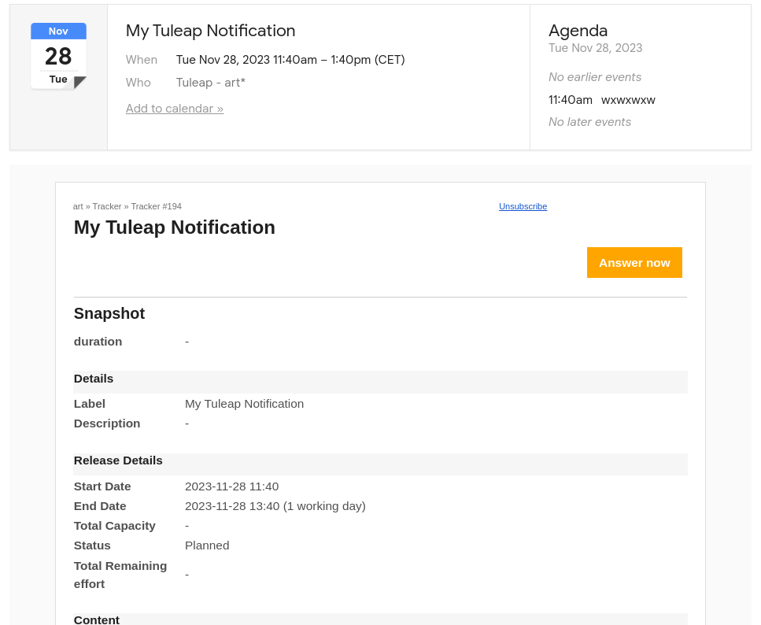

Email Notification Settings
===========================

The Tracker comes with a predefined set of
rules to keep relevant people aware of the artifact life. The default
rules can however be complemented or tuned in a number of ways:

Global Email Notification
`````````````````````````

In addition to the default notification rules, the tracker
administrators have the ability to specify a list of email addresses to
which submissions of new artifacts (and optionally artifact updates)
will be systematically sent. To add an email address, click the "add"
link. You can add as many email addresses as required.

You can choose to disable the permission check for global email
notification. This can be useful if the email address is a mailing list,
because individual permissions can't be checked for each member of the
mailing list. So for mailing lists, if the check box "check permissions"
is checked, the notifications will be send to each member with the
permissions of an anonymous user.

This feature is typically used to send submissions of new artifacts to a
number of well identified persons in the team who are in charge of
qualifying and dispatching the artifacts.

Email subject customisation
```````````````````````````

It is possible to enable a marker "[Assigned to me]" in the subject of email
notifications to easily identify emails concerning artifact assigned to you.
This rely on Contributor/assignee semantic of the tracker.

In addition to the subject of the email, all the assignees are listed in the mail
body with ``=ASSIGNED_TO=<username>``. These markers are not visible but could be
used to create filters in your email client.

Calendar Event
``````````````

You can choose to activate calendar event for your notifications.
If your tracker is configured with a timeframe semantic, a calendar event will be sent



   Backlog: Calendar notification