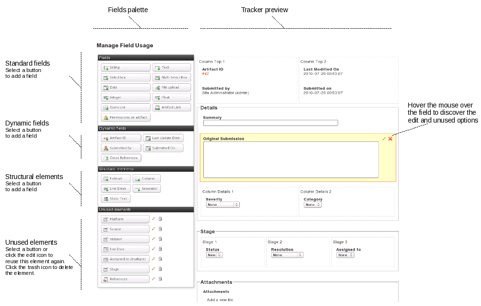

.. _tracker-permissions:

Permissions Management
======================

This module is used to give different access permissions to different
users depending on their role.

Access permissions to a tracker can be defined at two levels:

-  **Tracker level**: at this level, you can define the group of users
   who have access or not to the tracker.

-  **Field level**: this is a more fine-grained level, where access
   permissions can be defined field by field. Using this feature you can
   specify which groups has read-only permission on a field, which ones
   can modify it or which ones do not have access to it at all.

All access permissions are defined for groups of users rather than
individuals. See :ref:`user-groups` for more information on how project administrators
can define and manage groups of users.

Tracker Permissions Management
~~~~~~~~~~~~~~~~~~~~~~~~~~~~~~

When entering this module, a list of user groups appears along with
their access permissions. The user group list first shows groups of
users defined at the system level like all\_users, registered\_users,
project\_members, etc. These are groups that Tuleap manages
for you so you don't have to keep them up to date when new users
subscribe to the site or become member of your project. The second part
of the user group list shows all groups of users defined at the project
level (see :ref:`user-groups` for more information on how to define and manage groups of
users).

Each group can be associated with the following access permissions:

-  **HYPHEN**: this level of permission that displays as a hyphen means
   that the group has no specific permission.

-  **access to all artifacts**: when granted this permission a user
   group has access to all the artifacts of the tracker.

-  **access to artifacts assigned to group**: when granted this
   permission a group of users can only see those artifacts that have
   been assigned to one or several members of this group.

-  **access to artifacts submitted by group**: when granted this
   permission a group of users can only see those artifacts that have
   been submitted by one or several members of this group.

-  **access to artifacts assigned to or submitted by group**: when
   granted this permission a group of users can only see those artifacts
   that have been submitted by or assigned to one or several members of
   this group.

Field Permissions Management
~~~~~~~~~~~~~~~~~~~~~~~~~~~~

Beside defining access permissions for the tracker and its artifacts
(see `Tracker Permissions Management`_) it is sometimes necessary to restrict access to certain fields
of the tracker to a given population. As an example if you share a
defect tracking system with your customers you may want to hide some
fields from the view of your customer or prevent them from modifying
certain fields. This is precisely what this module is meant for.

When using this configuration module, you can toggle the display between
two different views: you can either view all user groups permissions for
a given field OR for a given user group you can view all the field
permissions defined for it. The experience shows that the view by field
is often the preferred one when you configure a tracker for the first
time whereas the view by group of users is more convenient to adjust the
permission settings later on (see :ref:`user-groups` for more information on how to
define and manage groups of users).

Each group of users can be granted the following permissions for a given
field:

-  **Can submit**: this permission determines whether a group of users
   can define the initial value of a field when an artifact is first
   submitted. If not checked, this field will not be visible on the
   submission screen for this user group.

-  **Read-only**: if granted read-only permission a group of users only
   has read access to a field. In other words the users see the value of
   the field but cannot modify it.

-  **Update**: if granted update permission, a group of users can see
   the current value of a field and also modify it.

-  **-**: this level of permission that displays as a hyphen means that
   the group has no specific permission, like in tracker permissions.

**Important Note**: the permissions associated with a field apply in
many areas of a tracker. For instance if a group of users has no access
to a given field, this field becomes invisible on the initial submission
form, on the artifact search form as well as in the table of results
returned by the search, in the artifact update form, in the history of
changes associated with each artifact and finally in the email
notification sent to this group of users.
