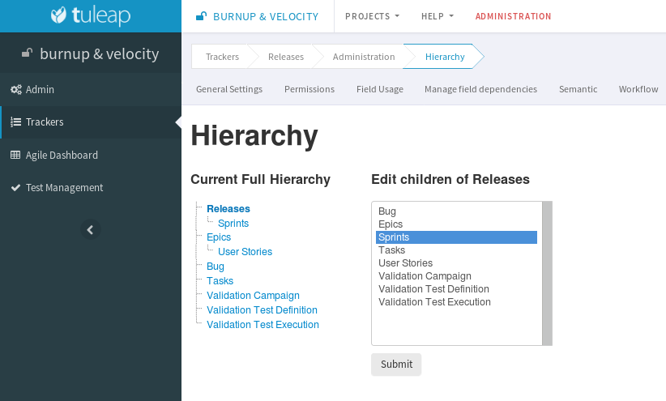
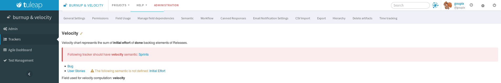
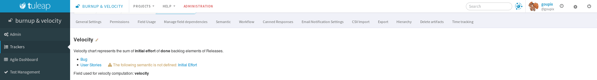

.. _tracker-semantic:

Semantics
=========

As trackers can be fully customized, you may need a way to define what
is the title of your artifacts, when you consider an artifact to be open
or close, or the field used to define the contributor (or assignee) of
an artifact. This feature is provided by the admin section "Semantics".

Most of the trackers you will use already defined a semantic. This is
the case for instance for all tracker templates.

To define or update a semantic field, select the pencil icon next to the
semantic property. Semantic admin section lets you define the following
semantic properties:

.. _semantic-title:

Title
`````

The title of an artifact is a field that sum up the best the artifact.
For instance, it can be the field **summary** for a bug tracker, the
field **name** for a contact tracker, or the field **I want to** for a
Scrum user story tracker.

You can choose any **text field** as the title of your artifacts.

This semantic information is used in the edition page of an existing
artifact, next to the ID. It is also displayed in **My artifacts**
widget.

.. _status-semantic:

Status
``````

The status of an artifact is a field that describes the stage of the
artifact. If you set a semantic for status, please define the values
that mean *open* for this field.

The most commom case is a field **Status** with the value **open** for
open values. All other values will be considered as **closed** values.
But you may want to define any other semantic. You can choose any
**selectbox field** (single or multi) as the status of your artifacts.

This semantic information is used in **My artifacts** widget (this
widget displays only *open* artifacts that belongs to you).

.. _done-semantic:

Done
````

The done semantic is used for burnup and velocity chart
computation. It can also be used by the :ref:`GitLab integration <version-control-with-gitlab>` and the :ref:`Git integration <version-control-with-git>`.

.. _velocity_administration:

Velocity (Backlog)
``````````````````
.. attention::

  This module is part of :ref:`Tuleap Entreprise <tuleap-enterprise>`. It might
  not be available on your installation of Tuleap.

How to add velocity chart in a release:
 1 - You should have a tracker hierarchy between Release and Sprint



Example of release hierarchy


 2 - You should have a velocity semantic at release and child level



An error is displayed when children tracker does not have the velocity semantic


 3 - You should have at least one backlog tracker with done and initial effort semantic.
     I some tracker don't have both semantic, its value won't be taken in account during computation.



A warning is displayed if tracker does not have all needed semantic

Once computation is done, you can manually override the computed value by entering a new one.

.. _assignee_semantic:

Contributor / Assignee
``````````````````````

The contributor of an artifact (or assignee) is a field that is bound to
users. The contributor(s) of an artifact are the person(s) who are
responsible for the work needed to complete the artifact. For instance,
it can be the field **assigned\_to** for a bug tracker, the field
**owner** for a task tracker.

You can choose any **user list field** as the contributor of your
trackers.

This semantic information is used to define specific permissions on a
tracker (for instance restrict tracker access to a group of assignee
people).

Tooltip
```````

The tooltip of an artifact is a piece of information that is displayed
when you hover an artifact reference with your mouse.

You can select all the fields you want to compose the artifact tooltip.

.. _semantic_color:

Cards semantic
``````````````
The cards semantic allows you to add the fields which will be visible in
cardwall, Backlog Planning and Kanban.

The background color semantic allows you to choose the field which will be used
to determine the background color of a card. Only selectbox and radio buttons
bound to static values can be used to determine background color.
It also can only be used when each value has a "named" color. In addition to
the background color, a special pattern is associated to the selected color.
It will be shown for users who have enabled the Accessibility mode user
preference (see :ref:`account-maintenance`).
Patterns have been defined only for "named" colors but not for all possible
colors. Therefore there is a limitation for the fields that can be used as
background color. All their values must have either "transparent" color or a
"named" color. (see :ref:`tracker-admin-field-edition`)

The card preview will show you examples of how your cards will be displayed
in cardwall.

.. figure:: ../../../../images/screenshots/tracker/card_preview.png
   :align: center
   :alt: Card preview
   :name: Card preview

   Card preview

.. attention::

  While you can select the same field as :ref:`Status semantic <status-semantic>`
  for the background color, you should know that this case has a limitation in
  :ref:`Kanban <kanban>`. When drag and dropping cards between columns in Kanban
  (which affects the Status field's value), the Background color will not be
  updated on-the-fly.
  To see the updated background color for the card, you should either change
  status via the artifact modal or refresh the page.

Initial Effort (Backlog)
````````````````````````

The Initial Effort semantic is special in that it only exists if the project
has the :ref:`backlog` enabled. In the agile context, it is supposed to
represent the estimated effort for a given task, story, sprint, release...

In order to use this semantic you need to have a numeric field in your tracker
that corresponds to this initial effort notion.

The initial effort is used in the :ref:`backlog` **content** and **planning**
views.

.. _semantic-timeframe:

Timeframe
`````````

The semantic **Timeframe** represents the period on which the artifact is considered "active".

It is used by various services across Tuleap (Taskboard, Planning, Roadmap, Burndown and Burnup graphs, Project milestones, etc.).

Timeframes based on fields
""""""""""""""""""""""""""

It can be configured in two ways:
    - Start date + end date
    - Start date + a number of days

When set to "Start date + a number of days", the end date is automatically computed, excluding Saturdays and Sundays.

For instance, if an artifact has a start date starting on Monday and has a 6 days period of activity, then it will be supposed to end next Monday.

Timeframes inherited from another tracker
"""""""""""""""""""""""""""""""""""""""""

When set to "Inherited from another tracker", the timeframe of artifacts will be the same as artifacts linking them from the target tracker.

For instance, let's consider that the User Story tracker is configured to inherit its timeframes from the Sprints tracker:
    - A "Sprints" artifact has a timeframe starting on Monday and ending on Tuesday
    - It links a "User Story" artifact
    - The timeframe of the "User Story" artifact will start on Monday and end on Tuesday

.. note::

    To be able to define an inherited semantic timeframe, the following requirements have to be matched:
        - The current tracker and the target tracker must both have artifact links fields
        - The target tracker must have a semantic timeframe based on tracker fields


.. _semantic-progress:

Progress
````````

The semantic **Progress** is used to compute the progression of the ongoing work on artifacts.

It is used in the Roadmap widget at the moment. In the longer term, we plan to use it in the :ref:`backlog` as well.

Two computation methods are available: **based on effort** and **based on artifact links count**.

Effort based computation
""""""""""""""""""""""""

To configure it, you will be asked to provide:
    - a **Total effort** field (type: ``integer``, ``float``, ``computed``) representing the total effort needed to complete the work.
    - a **Remaining effort** field (type: ``integer``, ``float``, ``computed``) representing the remaining effort to complete the work.

The progress of artifacts will be computed by dividing their **remaining efforts** by their **total efforts**.

Artifact links count based computation
""""""""""""""""""""""""""""""""""""""

The progress of artifacts will be computed by dividing the number of artifacts linked using the type ``Child`` by the number
of closed children artifacts.

**Only direct children are taken into account.** It means that children of the children will be ignored during the
computation.
