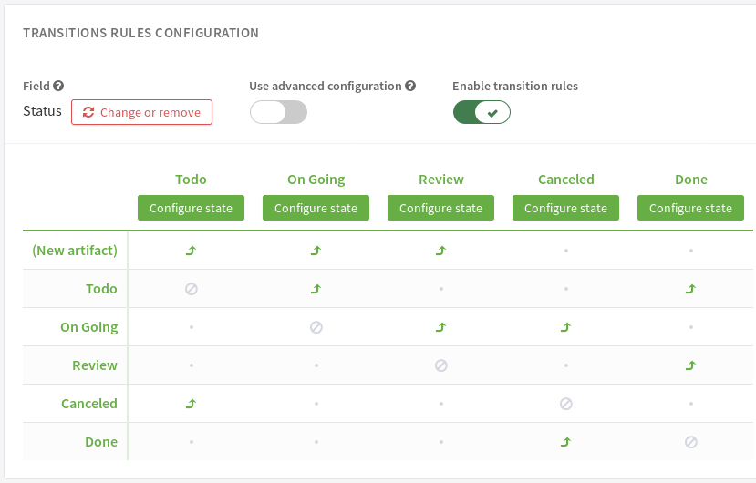
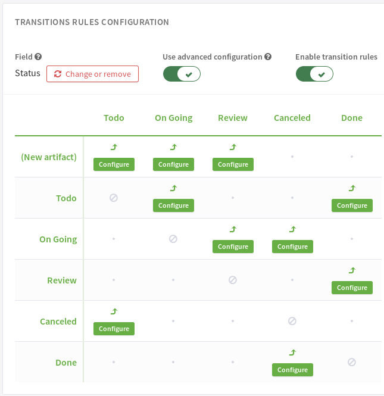

.. _tracker-workflow:

Workflow Manager
================

Overview
````````

A Workflow can help you control the artifact lifecycle, ensure that your
teams follow the rule of your company methodology (CMMi, etc.).

Each tracker can have it's own workflow, designed by the tracker
administrator.

For now, a tracker can have only one workflow defined on one field. This
field must be a list field (select box).

N.B. Worflow is not taken into account in artifacts mass change, during artifact copy and during XML import.

Add a workflow to a tracker
```````````````````````````



-  **First, select the field**: you choose the field on which applies
   the workflow. A workflow applies on "Select Box" field type (except
   if it's bound to users).

-  **Then, define transitions**: the states the artifact should take
   from it's beginning to it's end.

   By default, no transitions are allowed (it's not possible to change
   the values of selected field). You authorize a transition by clicking
   on the bullet that cross "FROM" row and "TO STATE" Column. Arrow
   icon: the transition can happens, grey bullet: the transition is
   forbidden.

   For instance, in `Add a workflow to a tracker`_, various transitions have been defined: on
   artifact submission, defined by fake state "new artifact", values available for the field "Status"
   will be "To do", "On Going" and "Review".
   Then, once Status is "To do", possible changes will be "On Going" and "Done", etc.

To delete the workflow, simply click on the "Change or remove" button near to the field
name. Transitions are deleted too.

Workflow simple and advanced mode
``````````````````````````````````

Each transitions can be configured.
That means that they can have pre-conditions and post actions.

A tracker workflow can uses two modes: simple or advanced.

* In simple mode, pre-conditions and post actions of transitions are configured at target state level.
  This means that all transitions defined at target state level share the same configuration.
* In advanced mode, each transitions are configured individually.
  This means that the administrator has to configure pre-conditions and post actions in each transitions.

By default, a workflow is created in simple mode.

A tracker administrator can change the workflow mode:

* From simple to advanced: Each transitions copy from their target state the configuration and are now editable individually.
* From advanced to simple: Transitions are now editable by target state. For each state, the first transition found is used as a template
  and its configuration is used to configure all transitions defined for this target state.

The workflow presented in `Add a workflow to a tracker`_ is in simple mode.
You can see that the target state can be configured.



This picture above shows the same workflow, but switched to the advanced mode.
You can see that now, each transition is configurable individually.

Define rules on transitions
```````````````````````````

.. figure:: ../../../../images/screenshots/tracker/sc_manage_workflow_transitions.png
   :align: center
   :alt: Define workflow transitions
   :name: Define workflow transitions

   Define workflow transitions

For a given transition, you can select the people allowed to perform it, define fileds and comment not empty
and actions exectued after the transition happens (if allowed).

Groups that may process the transition
^^^^^^^^^^^^^^^^^^^^^^^^^^^^^^^^^^^^^^

Once the transition is defined, you can refine who can make the
transition. To do this, click the "Configure" button.
Then, select the group of users you allow to do the
transition (see `Define workflow transitions`_).

Fields and/or comment not empty
^^^^^^^^^^^^^^^^^^^^^^^^^^^^^^^

A tracker administrator can define a set of fields that must not be empty before processing a workflow transition.
An administrator can also make adding a followup comment mandatory for a transition.
Keep in mind that this condition cannot be configured for transitions from "New artifact", as it is not possible to add a comment when creating a new artifact.

Post actions
^^^^^^^^^^^^

You can define a list of actions after the execution of a transition. The available post actions may vary depending on the configuration mode you are in (Simple or Advanced).

In Simple configuration mode:

* Set a value to a date field
* Set a value to a float field
* Set a value to an integer field
* Process a Jenkins job by providing its URL
* Hide fieldsets in the artifact view
* Freeze fields values so that users can't change them while in this state

In Advanced configuration mode:

* Set a value to a date field
* Set a value to a float field
* Set a value to an integer field
* Process a Jenkins job by providing its URL

For instance, you can set a date field to the date of transaction execution. It might be used to set automatically the close date of an
artifact (eg. when it's state move from Resolved to Closed).

Hide fieldsets will hide them in the artifact view which can be useful when you don't want users to bother with information irrelevant
to the current state of the artifact; they can still press a dedicated button if they want to see them anyway, it is a visualization help,
not an access control option.

Freeze fields values will render the selected fields uneditable for the current state. This can be useful if you want to prevent users from
editing parts of the artifacts data at or past a certain state of your workflow.
