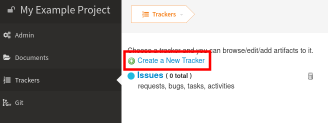
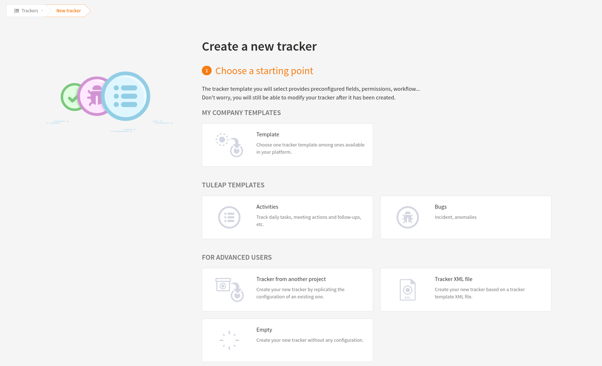
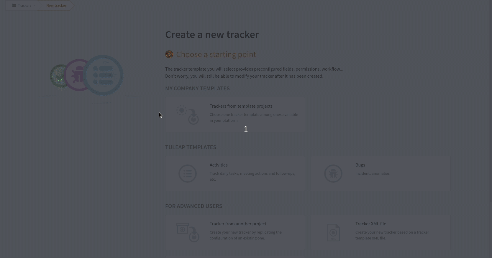
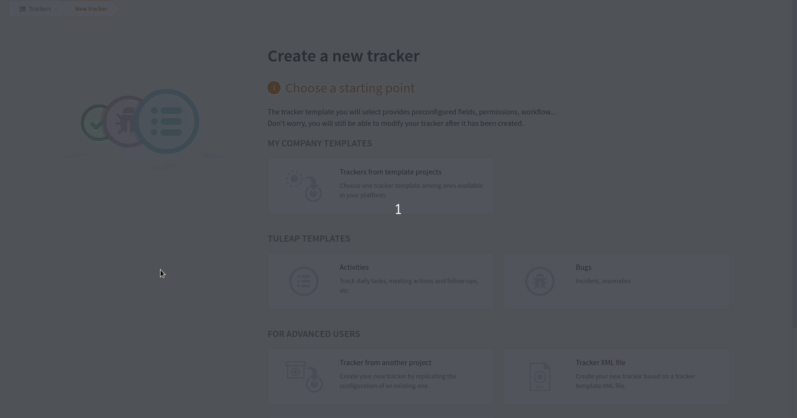
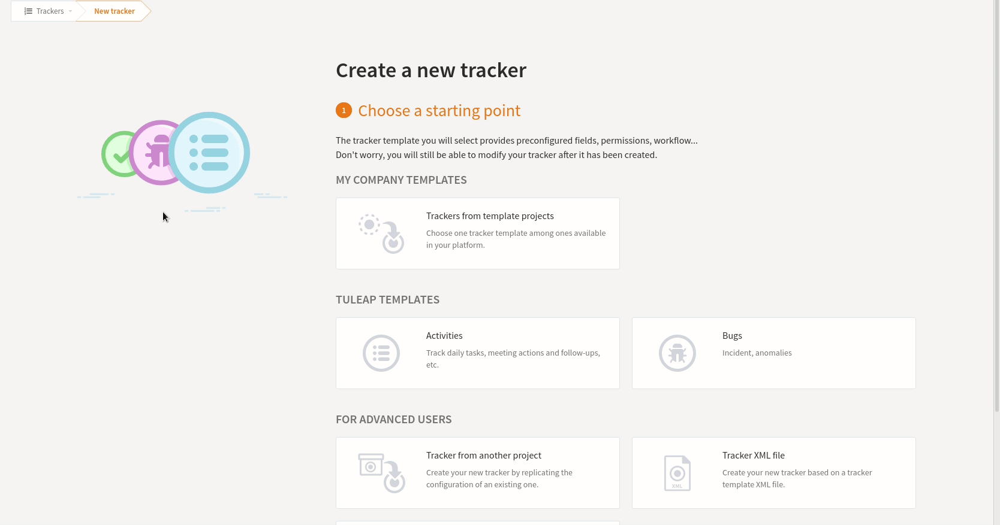
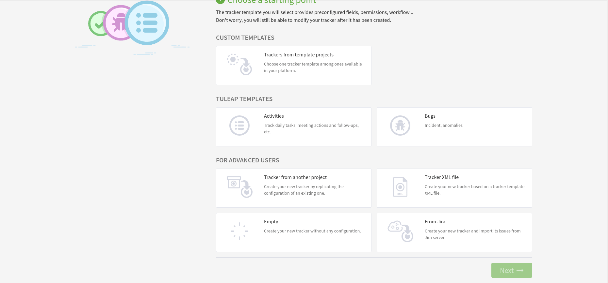
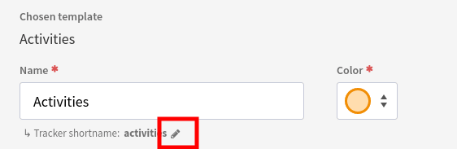
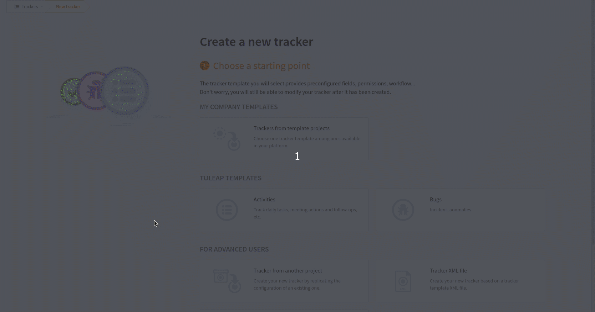

.. _creation-tracker:

Tracker Creation
================

Before one can define what fields and field values to use in a tracker,
it must first be created. Tracker creation can be accessed from the
"Create a New Tracker" menu item that is available in the tracker
service page.



   How to access the tracker creation page

This leads you to a 2 steps tracker creation process:

Choose the tracker template
---------------------------

You have first to choose a tracker template that will be used as a basis.

.. NOTE::

   Using a template doesn't mean you have to stick to the list
   of fields and field values defined in this template. You can always add
   or remove fields or fine-tune the whole configuration settings afterwards.



   Create a new tracker

It is divided in 3 parts:

- Your Company tracker templates
- Tuleap tracker templates
- Advanced user part

Your company templates
~~~~~~~~~~~~~~~~~~~~~~

In this part, you can choose amongst all the trackers that has been designed by your company.
Pick one and click on "Next" at the bottom right of the page.



   Choose a tracker from your company project templates

Tuleap tracker templates
~~~~~~~~~~~~~~~~~~~~~~~~

In this part, you can choose amongst all the trackers that has been designed by Tuleap for you.
Pick one and click on "Next" at the bottom right of the page.



   Choose a tracker amongst Tuleap templates

Advanced user
~~~~~~~~~~~~~

In this part, you can choose to use :

- a tracker from an existing project you're admin of, that is not a template designed by your company.
  That means you can reuse a tracker you have already set to your process.



   Choose a tracker amongst the projects you're admin

.. NOTE::

  This does not copy the artifacts of the original tracker but only the configuration settings.

- an empty tracker: this is useful if you want to create your tracker from scratch

- an XML structure file: if you have an XML structure of a tracker, from another project or another Tuleap platform, you
  can import it. The expected XML file describes the structure of the trackers, the fields used, the values of the fields,
  and the permissions. Most of the time, you will use an XML file coming from a tracker structure export
  (see :ref:`tracker-export-structure`).
  This feature is really convenient to copy a tracker from a server to another.

.. NOTE::

  This does not copy the artifacts of the original tracker but only the configuration settings.

Create from Jira issue
~~~~~~~~~~~~~~~~~~~~~~~

Import prerequisites
`````````````````````

Before doing the Jira issue import, you have to check the following points:

* Users email addresses are visible to anyone in the Jira configuration (must be done by each user)
* The Jira user used to do the import must be administrator of your Jira project in order to have all the issues and all the content possible.

Jira issue import is only done asynchronously. Once finished, you will receive an email with the status and the output of this import.

Process the import 
```````````````````

In this part, you can choose to import a bunch of issues from a Jira instance.



   Import issues from Jira

To import your Jira issues, you have to provide:

* The Jira instance URL
* Your Jira account email
* One of your Jira API token

Then, you are able to select a Jira project and an issue type. Once all selected, the Jira import is queued.

Imported data
`````````````

All the issues of the selected type in the selected project will be imported. The import is able to deal with the following fields:

* Text
* String
* Date
* Date with time
* Selectbox
* Radio button
* Checkbox
* Status field
* Attachments

Comments are also imported. The issue history is recreated.

User mapping
````````````

.. ATTENTION::
   The Jira user email address can only be used if the user allows the address email visibility in the Jira API. More information `here. <https://confluence.atlassian.com/doc/user-email-visibility-138596.html>`_
   If this is not done, the import process will map the Jira user to a default `Tracker Importer` Tuleap user

The Jira import process will try to map the users found in the Jira data with Tuleap users:

* Issue creator
* Issue updater
* Commentator
* File uploader
* Users in field values

To be relevant, the mapping is based on the email address. If the Jira user email address map a Tuleap user email address, then the mapping is done.

All the details about the mapping will be displayed in the Jira import output in the email.

Fill informations about your tracker
------------------------------------

To finalise your tracker creation, you then need to fill some informations:

-  **Name**: this is the name of your tracker. A tracker is typically
   named after the type of artifact it is going to manage. This name
   will be used by Tuleap in the title of the various
   screens of the trackers. It is predefined with the same name of the chosen template

- **Colour**: choose the color of your tracker. It is used in various screen of Tuleap.

-  **Description** (Optional) : A longer description of what this tracker is all
   about and the type of managed artifacts.

-  **Short name** (Predefined): this is a short name that best describe the type of
   artifact managed in this tracker. This name must be quite short as it
   is used in various screens of the Tuleap Tracker like the
   artifact update form where it appears in the tracker menu and also
   next to the artifact ID. Following the examples given for the Name
   field above, short names can be: AR for Action Request, SR for
   Support Requests, Reqt for Requirements, bug for Bugs…

   It is predefined by Tuleap, but you can modify it.



   Choose your own shortname

   If this shortname already exists in your project, you will be invited to choose
   another one.




   How to create a new tracker

Once this second step validated, you will be able to start using your tracker as is, or continue the configuration.


.. NOTE::

  You can modify your tracker configuration at anytime during your tracker life.
