.. _trackers-administrator:

Trackers administration
-----------------------

If you are a tracker administrator, a project administrator or a site administrator,
you will be able to create, update or delete trackers.
It means that you can customize tracker as you wish, you will find in this page what you can configure.

Artifact Mass Change
~~~~~~~~~~~~~~~~~~~~

Tracker admins have the ability to update many artifacts at once. This
feature can be convenient to assign all bugs or tasks of a team member
to another if the person is moving on another project for instance.

To do this, select the "mass change" link in the "options" menu of the
tracker report. Please note that only tracker admins have access to that
option.

You will be able to update any kind of field (except the semantic title
field). Number of artifacts to be updated are displayed with their
artifact Ids. By default, all fields have the "value" set to
"unchanged". If you don't want to update a field, please keep the value
unchanged. To update a field for every artifacts, just update it. You
can also add a follow-up comment.

.. NOTE::

   The artifact mass change feature allows to by-pass any workflow on field(s)

.. _tracker-artifact-import:

Tracker Creation
~~~~~~~~~~~~~~~~

Before one can define what fields and field values to use in a tracker,
it must first be created. Tracker creation can be accessed from the
"Create a New Tracker" menu item that is available in the tracker
servide page.


To define a new tracker you must provide the following information:

-  **Name**: this is the name of your tracker. A tracker is typically
   named after the type of artifact it is going to manage. This name
   will be used by Tuleap in the title of the various
   screens of the trackers. Typical examples of tracker names are:
   Action Requests, Support Requests, Requirements, Defects, Bugs…

-  **Description**: A longer description of what this tracker is all
   about and the type of managed artifacts.

-  **Short name**: this is a short name that best describe the type of
   artifact managed in this tracker. This name must be quite short as it
   is used in various screens of the Tuleap Tracker like the
   artifact update form where it appears in the tracker menu and also
   next to the artifact ID. Following the examples given for the Name
   field above, short names can be: AR for Action Request, SR for
   Support Requests, Reqt for Requirements, bug for Bugs…

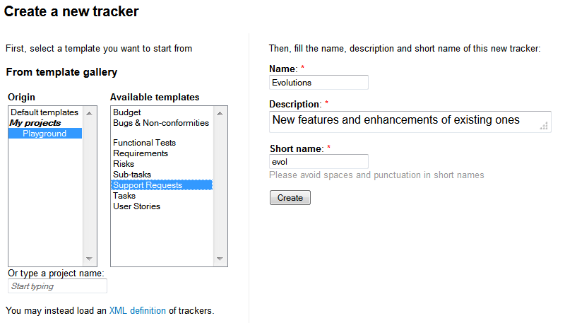

   Create a new tracker

    The next step is to decide upon the set of fields available for this
    tracker. In order to avoid the pain of defining the most common type of
    trackers again and again (e.g. Bug tracker, Support Request tracker,
    etc.) Tuleap offers the ability to create a new tracker from
    a set of templates. Those templates are either Tuleap-wide
    templates (also known as site templates), project specific templates or
    an xml file.

.. NOTE::

   Using a template doesn't mean you have to stick to the list
   of fields and field values defined in this template. You can always add
   or remove fields or fine-tune the field settings afterwards.

-  Tuleap-wide Templates: these are templates that have
   been defined by the administrators of the Tuleap site
   because it is expected that most project needs them. It is also a way
   to ensure a certain level of harmonization across projects that will
   make developers' life easier. The list of available templates may
   vary from one Tuleap site to another but you will
   typically find templates for Bugs, Tasks, etc. A specific tracker
   called "Empty" allows you to create a virgin tracker with no
   predefined fields other than the minimal set of required fields. See
   `Tracker Templates`_ for more explanations on the semantic
   of those templates.

-  **Project Templates**: in case you have already defined a tracker
   that suits your needs or you have seen a tracker from another project
   that you'd like to reuse, you just have to specify the project ID and
   tracker ID either by hand or from the pull down menus and click on
   the create button to create the exact same tracker in your project
   (**Note**: this does not copy the artifacts of the original tracker
   but only the field settings).

-  **XML file**: Tuleap allows you to create trackers from
   XML file. The expected XML file describes the structure of the
   trackers, the fields used, the values of the fields, and the
   permissions. XML schema is available in
   /src/www/tracker/resources/tracker.rnc. Most of the time, you will
   use an XML file coming from a tracker structure export (See `Tracker Structure Export`_). This
   feature is really convenient to copy a tracker from a server to
   another. **Note**: this does not copy the artifacts of the original
   tracker but only the structure).

.. _Tracker Templates:

Tuleap-wide Tracker Templates
~~~~~~~~~~~~~~~~~~~~~~~~~~~~~

The standard trackers provided for each new Tuleap project
are:

-  Bugs

-  Tasks

-  User stories

-  Change Requests

-  Requirements

-  Risks

Each of those templates have predefined fields that correspond to the
specific work processes around bugs, tasks etc. In the following, we
give a short overview of these different work processes. For each of
those templates, the Tuleap Team also tried to maintain a
fair balance between sophistication and ease of use. As a consequence,
fairly simple and straightforward templates are configured by default
for all new hosted projects. Then it is up to the project members to
decide how much information they want to see attached to an artifact and
customize their tracker configuration accordingly.

The Bug Tracker Template
````````````````````````

One of the golden rules in a collaborative project environment is to let
your project community test the software and freely report on any defect
(or bug) they have seen. The Bug template was developed with this
objective in mind.

The template Bug Tracker comes pre-configured with a set of fields (used
or not) that are probably enough for the majority of projects hosted on
Tuleap. You can either decide that the template is lacking
some critical fields that you can create or, on the contrary, switch
some fields to the "Unused" status to make the tracker simpler.

The Task Tracker Template
`````````````````````````

The Tuleap Task tracker is a task manager and not a project
management software like CA-SuperProject, MS-Project or other powerful
and complex desktop products available on the market. The
Tuleap Task Tracker cannot build a Pert chart, it doesn't
have any planning capabilities. It is rather a time sheet tool which
allows project members to track their time and manage other things like
weekly TODO list for instance.

However the Tuleap Task Tracker offer a number of features
that makes it very complementary with the above mentioned project
planning tools:

-  Like all Tuleap tools, the Task Tracker is entirely web
   based. Therefore any project member can update his/her time sheet
   regardless of its physical location.

-  Tasks can be managed by authorized project members.

-  Each project member has its own time sheet showing all open tasks
   assigned to her, their priority, description, start and end dates,
   percentage completion, related tasks, follow-up comments and a full
   audit trail of the past changes.

-  Task data can be collected by the project leader(s) at any point in
   time and exported out of the Tuleap project thanks to the
   Project Data Export facility (see :ref:`project-data-export`). This allows for an easy
   generation of progress reports or project re-planning.

The User Story Template
~~~~~~~~~~~~~~~~~~~~~~~

Tuleap makes it easy to implement the Scrum methodology, by
providing a User Story tracker to each project. You will find a
comprehensive description of Scrum on
`Wikipedia <https://en.wikipedia.org/wiki/Scrum_(development)>`_.

The User Story tracker contains artifacts called "User Stories", that
describe needs expressed by the customers of the project. The tracker
has been customized to capture customer requirements: it is possible to
define the customer value of each story, its acceptance criteria, its
effort, etc.

Other optional fields are available, and of course, each project may
customize the tracker to fit the way it implements the methodology

At the beginning of a Scrum project, each customer user story must be
stored. During the first Sprint Meeting, a few stories are selected by
the team to be implemented in the first iteration. The team then affects
the stories to team members ('Owner') and can start developing.

At the end of the Sprint (after two to four weeks), the team meets for
the new Sprint Meeting. User stories selected in the past Sprint are
updated, and new stories are selected for the next Sprint.

The Change Request Tracker Template
```````````````````````````````````

This tracker allows to submit change requests for your application
adjustment. This is of great importance for change management process
(ITIL, PRINCE2, ...). A change request is declarative, i.e. it states
what needs to be accomplished, but leaves out how the change should be
carried out.

When submitting a change request, you have to provide:

-  The impacted product (Product, version)

-  The approval status (approved by, disposal)

-  The change request description (description, justification, impact if
   no change)

-  The change impact analysis (Objectives, deliverable, risks, schedule,
   budget)

You can set permission to allow only client and project manager groups
to access this tracker. For instance:

-  only client can set the "priority" field

-  only project manager can set the "approved by" and "disposal" fields

-  both can describe impacts fields

As for all trackers, tracker administrator can customize the fields
according to the internal process.

The Requirements Tracker Template
`````````````````````````````````

This tracker helps software engineers to identify a necessary attribute,
capability, characteristic, or quality of a system in order for it to
have value and utility to a user.

All system Requirements are also an important input into the
verification process, since tests should trace back to specific
Requirements. This tracker is really useful for Requirements management
processes such CMMI.

When submitting a Requirement, you have to fulfill:

-  The designed Product (Product, version)

-  The Requirement characteristics (type, nature, complexity, priority)

-  The Requirement description (origin, description, proposed solution)

-  The Requirement state (state, satisfied by)

You then can link (using artifacts references) a requirement to a test
case/result artifact, or other requirements artifacts for
traceability/satisfaction.

You can set permission to allow only client and project manager groups
to access this tracker.

As for all trackers, tracker administrator can customize the fields
according to the internal process.

The Risk Tracker Template
`````````````````````````

This tracker aims to support Risk management. It provides information
for identification, assessment, and prioritization of risks during the
project lifecycle. You can minimize, monitor, and control the
probability and/or impact of unfortunate events or to maximize the
realization of opportunities. Risks may be linked (using artifacts
references) to actions/task/documentation for minimizing likelihood or
impact.

When assessing a Risk, you have to set:

-  Rate of occurrence (likelihood, tendency)

-  Impacts

-  Timescale for Risk occurrence

-  Action for risk reduction (action, responsible)

You may use the query form to filter the risks :

-  select the "likelihood" field value "any" if you wish to get all
   predefined risks

-  select the "likelihood" field value"high", "medium" and "low" if you
   wish to review your assessed risks


Default Tracker Access Permissions
~~~~~~~~~~~~~~~~~~~~~~~~~~~~~~~~~~

Depending on the class of citizen a user belongs to and the level of
permissions granted as a project member, the various features of the
Tuleap Tracker may or may not be accessible. Please note
that the default access permissions listed below may change for a
particular tracker if the tracker administrator modifies the access
permission settings. For more information on how to configure tracker
access permissions see `Permissions Management`_. Default permission settings are summarized in
the table below:

============================================================================================= ===========================================
        Tracker Feature                                                                           Access Permission
============================================================================================= ===========================================
New Artifact Submission                                                                       By default any Tuleap visitor,
                                                                                              whether logged in or not, has the ability
                                                                                              to submit a new artifact to a tracker. The
                                                                                              tracker administrator has the ability to
                                                                                              limit the scope of this feature to
                                                                                              Tuleap registered users
                                                                                              (anonymous users are requested to login
                                                                                              first) or to the project members if the
                                                                                              tracker is made private.
Artifact Browsing                                                                             Searching the Artifact database and
                                                                                              browsing the results is available to all
                                                                                              Tuleap visitors (whether
                                                                                              registered or not) unless the tracker has
                                                                                              been made private by the project
                                                                                              administrator. If so the tracker is only
                                                                                              visible to project members.
Artifact Update                                                                               By default only project members can
                                                                                              update an artifact. Non members have only
                                                                                              limited access and can only add a comment
                                                                                              or attach a file.
Tracker Administration - Artifact Import                                                      Only Project administrators and project
                                                                                              members with Admin. permission can
                                                                                              import data into trackers.
Tracker Creation                                                                              Only available to project administrators.
Tracker Administration - General Settings                                                     Only available to project administrators
                                                                                              and project members with Admin.
                                                                                              permission on this tracker.
Tracker Administration - Field Usage Management                                               Only available to project administrators
                                                                                              and project members with Admin.
                                                                                              permission on this tracker.
Tracker Administration - Semantic Management                                                  Only available to project administrators
                                                                                              and project members with Admin. permission
                                                                                              on this tracker.
Tracker Administration - Workflow Management                                                  Only Project administrators and project
                                                                                              members with Admin. permission can define
                                                                                              and configure workflow.
Tracker Administration - Permissions Management                                               Only Project administrators and project
                                                                                              members with Admin. permission can define
                                                                                              tracker permissions.
Tracker Administration - Canned Responses Management                                          Only Project administrators and project
                                                                                              members with Admin. permission can define
                                                                                              canned responses.
Tracker Administration - Email Notification Settings                                          Only Project administrators can add email
                                                                                              addresses in the global email notification
                                                                                              field. Project members can watch artifacts
                                                                                              of other team members. Any registered
                                                                                              Tuleap user can customize her
                                                                                              notification preferences.
Tracker Administration - Structure Export                                                     Only Project administrators and project
                                                                                              members with Admin. permission can export
                                                                                              tracker structure.
============================================================================================= ===========================================

                                                Default Tracker Access Permissions


As we went through the description of the Tuleap Tracker
features, we referred several times to the flexibility of this system
and how easy it is to customize your own tracker. This can be done
through the Tracker Administration available in the menu bar of each
tracker.

The configuration settings for a given tracker is divided in ten
sections:

-  **General Settings**: name, description and some other general
   purpose parameters are defined in this section.

-  **Permissions Management**: allows you to give different access
   permissions to different users depending on their role.

-  **Manage Field Usage**: this is where you will build the tracker.

-  **Manage Fields Dependencies**: allows you to define how values in
   one field depend upon other field values.

-  **Manage Semantic**: this section allows you to define some fields
   semantic.

-  **Manage Canned Responses**: allows you to create some pre-defined
   follow-up comments that your team is using on a regular basis.

-  **Manage Workflow**: allows you to define a workflow

-  **Email Notification Settings**: fine tuning of the global and
   personal email notification settings.

-  **CSV Import**: allows you to import data (artifacts) in the tracker
   with a CSV format

-  **Export**: allows you to export the tracker in a xml format

-  **Hierarchy**: allows you to configure tracker hierarchy

-  **Delete artifacts**: allows you to delete an artifact

General Configuration Settings
~~~~~~~~~~~~~~~~~~~~~~~~~~~~~~

This module allows you to define a series of properties for your
tracker. Some of those properties have already been defined in the
tracker creation form while some others are only available on this
configuration page. The properties are as follows:

-  **Name**: this is the name of your tracker. More precisely you want
   to name your tracker after the type of artifact that are going to be
   managed in your tracker. This name will be used by Tuleap
   in the title of the various screens of the trackers. Typical example
   of tracker names are: Action Requests, Support Requests,
   Requirements, Defects or Bugs…

-  **Description**: A longer description of what this tracker is all
   about and the type of artifact that it manages.

-  **Short name**: this is a short name that best describe the type of
   artifact managed in this tracker. This name must be quite short as it
   is used in various screens of the Tuleap Tracker like the
   artifact update form next to the artifact ID. Following the examples
   given for the Name field above, short names can be: AR for Action
   Request, SR for Support Requests, Reqt for Requirements, bug for
   Bugs…

-  **Instantiate for new projects**: This parameter is only displayed
   when working on a "template" type of project (see :ref:`project-type`). If the
   parameter is selected, then projects created from this template
   project will have this tracker created. If not selected, the tracker
   will not be available in the new project.

-  **Submit instructions**: an introductory message that displays at the
   top of the artifact submission form. This is a convenient way to give
   directions and recommendations to the submitter. The text must use
   HTML tags for formatting which gives a great flexibility to shape the
   content of this preamble (you can use bold, italic, colors, embedded
   URL…)

-  **Browse instructions**: an introductory message that displays at the
   top of the artifact searching and browsing screen. The text must use
   HTML tags for formatting which gives a great flexibility to shape the
   content of this preamble (you can use bold, italic, colors, embedded
   URL…)

Permissions Management
~~~~~~~~~~~~~~~~~~~~~~

This module is used to give different access permissions to different
users depending on their role.

Access permissions to a tracker can be defined at two levels:

-  **Tracker level**: at this level, you can define the group of users
   who have access or not to the tracker.

-  **Field level**: this is a more fine-grained level, where access
   permissions can be defined field by field. Using this feature you can
   specify which groups has read-only permission on a field, which ones
   can modify it or which ones do not have access to it at all.

All access permissions are defined for groups of users rather than
individuals. See :ref:`user-groups` for more information on how project administrators
can define and manage groups of users.

Tracker Permissions Management
~~~~~~~~~~~~~~~~~~~~~~~~~~~~~~

When entering this module, a list of user groups appears along with
their access permissions. The user group list first shows groups of
users defined at the system level like all\_users, registered\_users,
project\_members, etc. These are groups that Tuleap manages
for you so you don't have to keep them up to date when new users
subscribe to the site or become member of your project. The second part
of the user group list shows all groups of users defined at the project
level (see :ref:`user-groups` for more information on how to define and manage groups of
users).

Each group can be associated with the following access permissions:

-  **HYPHEN**: this level of permission that displays as a hyphen means
   that the group has no specific permission.

-  **access to all artifacts**: when granted this permission a user
   group has access to all the artifacts of the tracker.

-  **access to artifacts assigned to group**: when granted this
   permission a group of users can only see those artifacts that have
   been assigned to one or several members of this group.

-  **access to artifacts submitted by group**: when granted this
   permission a group of users can only see those artifacts that have
   been submitted by one or several members of this group.

-  **access to artifacts assigned to or submitted by group**: when
   granted this permission a group of users can only see those artifacts
   that have been submitted by or assigned to one or several members of
   this group.


.. figure:: ../../../images/screenshots/tracker/sc_tracker_admin_field_usage_overview.png
   :align: center
   :alt: Tracker Admin Field Usage Overview
   :name: Tracker Admin Field Usage Overview


Field Permissions Management
~~~~~~~~~~~~~~~~~~~~~~~~~~~~

Beside defining access permissions for the tracker and its artifacts
(see `Tracker Permissions Management`_) it is sometimes necessary to restrict access to certain fields
of the tracker to a given population. As an example if you share a
defect tracking system with your customers you may want to hide some
fields from the view of your customer or prevent them from modifying
certain fields. This is precisely what this module is meant for.

When using this configuration module, you can toggle the display between
two different views: you can either view all user groups permissions for
a given field OR for a given user group you can view all the field
permissions defined for it. The experience shows that the view by field
is often the preferred one when you configure a tracker for the first
time whereas the view by group of users is more convenient to adjust the
permission settings later on (see :ref:`user-groups` for more information on how to
define and manage groups of users).

Each group of users can be granted the following permissions for a given
field:

-  **Can submit**: this permission determines whether a group of users
   can define the initial value of a field when an artifact is first
   submitted. If not checked, this field will not be visible on the
   submission screen for this user group.

-  **Read-only**: if granted read-only permission a group of users only
   has read access to a field. In other words the users see the value of
   the field but cannot modify it.

-  **Update**: if granted update permission, a group of users can see
   the current value of a field and also modify it.

-  **-**: this level of permission that displays as a hyphen means that
   the group has no specific permission, like in tracker permissions.

**Important Note**: the permissions associated with a field apply in
many areas of a tracker. For instance if a group of users has no access
to a given field, this field becomes invisible on the initial submission
form, on the artifact search form as well as in the table of results
returned by the search, in the artifact update form, in the history of
changes associated with each artifact and finally in the email
notification sent to this group of users.

Field Usage Management
``````````````````````

When a tracker is first created, it comes pre-configured with a set of
fields inherited from the template that was used to create it. For the
majority of projects hosted on Tuleap it is very likely that
the standard Tracker templates (e.g Bugs, Tasks, User strories) will
cover most of the needs.

However Tuleap gives you the ability to customize your
trackers. It can be a variation on an existing template with some fields
or structural elements addition or removal or it can be an entirely new
tracker created from an empty template.

The Field Usage Manager is divided in two parts : a fields palette on
the left and a tracker visualization on the right (see `Tracker Admin Field Usage Overview`_)

Tracker Fields Palette
``````````````````````

The palette allows the user to choose the elements he wants to add to
his tracker. The field usage manager palette consists of 4 groups:

-  *Fields*: These are regular fields (int, float, list, etc.) that the
   user will be able to update. These fields have no special behaviour.

-  *Dynamic Fields*: These fields have a special behaviour. Their value
   cannot be updated by the user. The value is determined dynamically
   (e.g. the user that submitted the artifact, the Id of the artifact,
   the artifact submission date, etc.).

-  *Structural Elements*: These elements are not real fields. There are
   really useful to enhance the artifact presentation. They can be
   containers (fieldset, columns) or decorative elements (line break,
   text).

-  *Unused Fields*: In this section, you will find all the fields that
   are not used in the tracker definition. If you remove a used field
   from your tracker definition, it won't be deleted but placed in this
   unused field section. It will then be easier to use it again. If you
   really want to delete it, delete it from the unused field section.
   Unused fields are also used in tracker template definition. You can
   find here some fields that the team didn't decide to introduce in the
   template but that makes sense however. It is easy then to add such a
   field whereas creating from scratch.


Creation and Modification of a Tracker Field
~~~~~~~~~~~~~~~~~~~~~~~~~~~~~~~~~~~~~~~~~~~~

Add a field to a tracker
````````````````````````

To add a field to a tracker, you just have to choose a field type on the
fields palette. Simply click on it, and a property field form will
appear instead of the palette!

Depending on the fields, the properties can change. But, here is the
properties that can be tuned :

-  **Label**: this is the name of the field. Although you are entirely
   free to change the name of a field, we recommend that you only change
   it for a new name with a similar meaning. If you want to change the
   name for something radically different then we recommend that you
   create an entirely new field and you leave the existing field in the
   list of unused fields.

-  **Description**: a longer description of the purpose of this field.

-  **Size**: this property allows you to define how much space a field
   is going to take on the screen. It has a different meaning and a
   different format depending on the field type.

   -  *Multi-Select Box*: the display size is made of a single number
      which indicates how many of the values associated with this field
      are visible at once. A reasonable value for the size of
      multi-select box is between 2 and 5.

   -  *String, Integer Float Fields*: "maxchars" and "size" can be
      filled where "size" is the number of character visible at once in
      the field display window and "maxchars" is the maximum number of
      characters that can be typed for this field. If "Size" is less
      than "Maxchars" then the text will shift in the visible window as
      more text is entered. The maximum value of "Size" is 255.

   -  *Date Field*: A date always follows the same pattern (YYYY-MM-DD)
      and therefore it always has a fixed length of 10 characters.

   -  *Text*: for text areas, "rows" and "cols" can be filled, where
      "cols" is the number of columns in the text area (the width in
      number of characters) and "rows" is the number of rows or lines of
      text. Note that the number of lines is not limited to "rows". If
      the text typed in the field has more than "rows" lines then a
      scrollbar will show up to navigate through the text.

-  **Rank**: this is the position of the field on the form. Positions
   are relatives one against another.

-  **Required**: determines whether leaving the field blank in the
   artifact submission or update form is allowed or not. If checked the
   tracker won't accept the form unless the field is given a value. The
   fields that must be filled out are marked with a red start on the
   submission and modification forms

-  **Default value**: This applies to one-line fields with no restricted
   set of values. For those the default value can be defined. It is the
   value which will be displayed at the artifact submission.

-  **Values**: This applies to "Select Box", "Multi-Select Box" and
   "Text Box List" type of fields where the list of values you are going
   to choose will show up in the pull-down menus when an artifact is
   submitted or updated.

   You can bind those fields to :

   -  **Add the values**: To configure values simply add values in the
      text area (one per row). Check "alphabetically sort values" will
      sort automatically your values.

      Tuleap allows to add what we call "decorator" to each
      value but only on edition mode (see `Edit the field of a tracker`_)

   -  **Binding a field to a list of users**: the Trackers offers the
      ability to associate "Select Box", "Multi-Select Box" and "Text
      Box List" type of fields with a list of predefined values that is
      actually dynamically generated by the platform. A typical example
      of this is when one would like to create a new select box showing
      the list of project members. Instead of creating and maintaining
      the list of values manually, you can re-use a list already defined
      elsewhere.

      Note that if you decide to bind a select box to a list of
      dynamically generated values you can no longer create your own
      values. The following lists are currently available (others may be
      added in the future):

      -  **Project Members** : list of people belonging to the project.

      -  **Project Administrators** : project members who have been
         granted the status of project administrators.

      -  **Artifact Submitters**: the full list of people who once
         submitted an artifact to the tracker.

      -  **Project Defined User Groups**: you can bind a select box to
         any of the user groups that are defined by the project. To see
         how to define such user groups refer to :ref:`user-groups`.

      On the following picture, we can see that people in "Assigned to"
      field are automatically populated from "SupportTeam" user group.

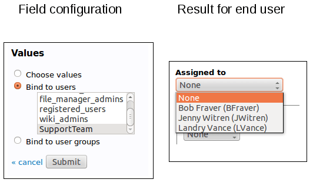

   Select box bound to a list of users

   -  **Binding a field to a list of user groups**: It's an extension of
      "binding to a list of user" but with user groups. It behaves the same
      way but instead of selecting a user, you will choose a user group among
      a list.

It's useful when you have complex setup and want to have several
people notified at once for an action.

On the following picture, we define a list of support groups that
will be in charge of the artifact according to their
responsabilities:

.. figure:: ../../../images/screenshots/tracker/sc_conf_vs_end_usergroup.png
   :align: center
   :alt: Select box bound to a list of user groups
   :name: Select box bound to a list of user groups

   Select box bound to a list of user groups

.. _tracker-admin-field-edition:

Edit the field of a tracker
```````````````````````````

In order to make some change on a field, you can simply edit it by
clicking on the Edit icon.

The edition mode allows for fields configuration not available at the
creation :

-  **Change the field name**: the field name is different from the field
   label. Field name is an internal name for the field. It is used in
   SOAP API for instance. It must not contain any special characters.
   Only lower case letters and "\_" are authorized.

-  **Add a decorator**: List values can be embellished with a decorator. A
   decorator is a colored square. There are two available color palettes: one
   that uses "named" colors that go well with Tuleap colors. The other lets you
   choose from a larger palette of colors (see `Tracker Admin Field Edition`_).
   Please note that the "old" color palette is deprecated and may be removed in
   future releases.
   You can choose a color for each value of the list. Decorators can be used to
   get a quick visual indicator feedback for the user. For instance, the values
   for the priority of a bug can be given a color with the meaning "the darker
   the more important".

-  **Add values** You can easily add new values to the list by selecting
   the "add new values" link below existing values.

-  **Hide values** You can easily hide existing values by clicking the
   hide icon next to the value. If the eye is open, the value is
   available. If the eye is medium closed, then the value is hidden.
   Just click again to enable the value. Artifact with hidden values
   will still be set to the hidden values. But hidden values won't be
   proposed anymore for new artifacts.

-  **Remove values** You can remove a list value by clicking the cross
   icon next to the value. It is impossible to delete values if there
   are some artifacts with this value. In this case, you can hide the
   value.

-  **Access directly to the field permissions manager** Editing a field,
   you can access the permissions administration of this field selecting
   the "edit permission" link.

-  **Configure notifications**: if the field is a "Select Box", a "Multi
   Select Box" or a "Text Box List" bind to a list of users, a checkbox
   "Send notifications to selected people" will be displayed. If
   checked, all selected users of an artifact will receive a email if
   the artifact is modified.

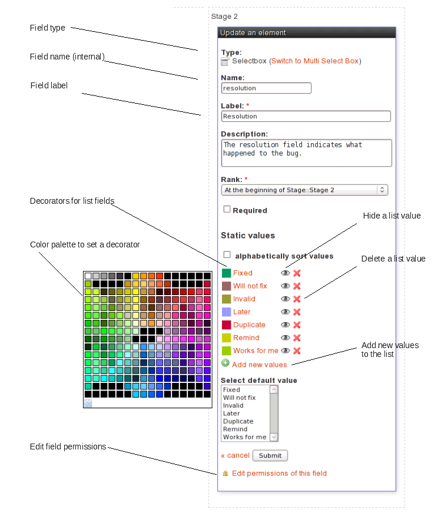

   Tracker Admin Field Edition

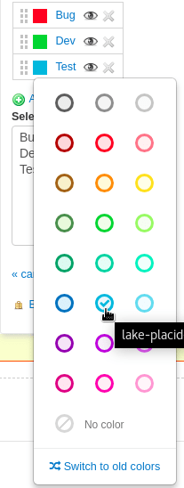

   New color palette with "named" colors

Delete the field of a tracker
`````````````````````````````

In order to delete a field, simply click on the Delete icon on the
visualization tracker page. The field won't be deleted since it will be
now present in the "Unused Elements" part of the palette.

Please note that you won't be able to remove a field if this field is
used in tracker semantic, or in tracker workflow.

To delete definitively that field, click on the trash icon in the
"Unused Elements" part of the palette.

Field Dependencies
~~~~~~~~~~~~~~~~~~

Field dependencies allow us to link source field values to target field
values. In other words, the values proposed to a final user for a field
will depend upon the value selected for another field.

As an example, if you define a field Operating System(Linux, MacOS X, MS
Windows, NetBSD) and a field Version(2.0, 2.1, 2.2, 2.4, 2.6, 3.0, 10.1,
10.2, 10.3, 10.4 (Tiger), NT, 2000, XP), you can define dependencies in
the tracker administration interface:

1. First, select the source field "Operating System" then the target
   field "Version".

2. To create dependencies between each "Operating System" values and the
   corresponding versions, you just have to check the corresponding box
   in the matrix.

First, you select a source field.

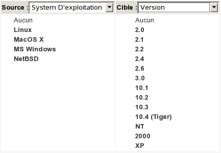

   Once the source field selected (here, "Operating System"), you can
   select the target field.

.. figure:: ../../../images/screenshots/tracker/sc_trackerfielddependencies_02.png
   :align: center
   :alt:

   Then submit, and a matrix with all values is displayed:

.. figure:: ../../../images/screenshots/tracker/sc_trackerfielddependencies_03.png
   :align: center
   :alt:

   You can now check the boxes corresponding to the dependencies. In the
   example, if the source field value is "Linux", the corresponding target
   values are "2.0", "2.2", "2.4", "2.6".

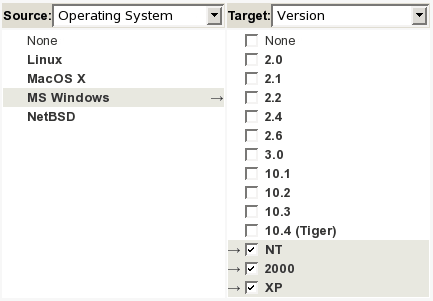

   Once a field dependency has been created, it appeared at the "Choose
   Source/Target" page as a quick link if you need to edit it. Note that to
   delete a field dependency, you need to empty the matrix.

.. figure:: ../../../images/screenshots/tracker/sc_trackerfielddependencies_05.png
   :align: center
   :alt:

   Once dependencies are defined, the final user (when submitting/updating
   an artifact) will see the Version options filtered according to the
   selection of the Operating System:

.. figure:: ../../../images/screenshots/tracker/sc_trackerfielddependencies_07.png
   :align: center
   :alt:

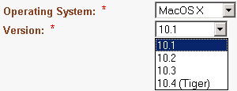

.. figure:: ../../../images/screenshots/tracker/sc_trackerfielddependencies_09.png
   :align: center
   :alt:

.. figure:: ../../../images/screenshots/tracker/sc_trackerfielddependencies_10.png
   :align: center
   :alt:

   When you define your dependencies, please be aware of the following
   points:

   -  Only *Select Boxes* and *Multi Select Boxes* can have dependencies,

-  The cyclic dependencies are forbidden (Field 1 => Field 2 => ... =>
   Field 1),

-  A field can depend upon only one field,

-  Javascript must be allowed on the browser to manage dependencies,

-  If a field is not the target of a dependency, then it will propose
   all its values. On the opposite, it will propose only those which
   satisfy the dependencies.

.. _tracker-semantic:

Semantic
````````

As trackers can be fully customized, you may need a way to define what
is the title of your artifacts, when you consider an artifact to be open
or close, or the field used to define the contributor (or assignee) of
an artifact. This feature is provided by the admin section "Semantics".

Most of the trackers you will use already defined a semantic. This is
the case for instance for all tracker templates (see `Tracker Templates`_ ).

To define or update a semantic field, select the pencil icon next to the
semantic property. Semantic admin section lets you define the following
semantic properties:

Title
`````

The title of an artifact is a field that sum up the best the artifact.
For instance, it can be the field **summary** for a bug tracker, the
field **name** for a contact tracker, or the field **I want to** for a
Scrum user story tracker.

You can choose any **text field** as the title of your artifacts.

This semantic information is used in the edition page of an existing
artifact, next to the ID. It is also displayed in **My artifacts**
widget.

.. _status-semantic:

Status
``````

The status of an artifact is a field that describes the stage of the
artifact. If you set a semantic for status, please define the values
that mean *open* for this field.

The most commom case is a field **Status** with the value **open** for
open values. All other values will be considered as **closed** values.
But you may want to define any other semantic. You can choose any
**selectbox field** (single or multi) as the status of your artifacts.

This semantic information is used in **My artifacts** widget (this
widget displays only *open* artifacts that belongs to you).

Done (Agile Dashboard)
``````````````````````

The done semantic is used for burnup and velocity chart
computation.

.. _velocity_administration:

Velocity (Agile Dashboard)
``````````````````````````
.. attention::

  This module is part of :ref:`Tuleap Entreprise <tuleap-enterprise>`. It might
  not be available on your installation of Tuleap.

How to add velocity chart in a release:
 1 - You should have a tracker hierarchy between Release and Sprint

.. figure:: ../../../images/screenshots/tracker/hierarchy.png
   :align: center
   :alt: Example of release hierarchy

Example of release hierarchy


 2 - You should have a velocity semantic at release and child level

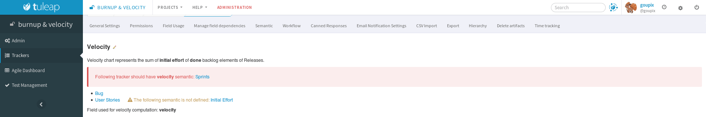

An error is displayed when children tracker does not have the velocity semantic


 3 - You should have at least one backlog tracker with done and initial effort semantic.
     I some tracker don't have both semantic, its value won't be taken in account during computation.

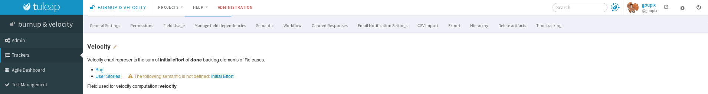

A warning is displayed if tracker does not have all needed semantic

Once computation is done, you can manually override the computed value by entering a new one.

Contributor / Assignee
``````````````````````

The contributor of an artifact (or assignee) is a field that is bound to
users. The contributor(s) of an artifact are the person(s) who are
responsible for the work needed to complete the artifact. For instance,
it can be the field **assigned\_to** for a bug tracker, the field
**owner** for a task tracker.

You can choose any **user list field** as the contributor of your
trackers.

This semantic information is used to define specific permissions on a
tracker (for instance restrict tracker access to a group of assignee
people).

Tooltip
```````

The tooltip of an artifact is a piece of information that is displayed
when you hover an artifact reference with your mouse.

You can select all the fields you want to compose the artifact tooltip.

.. _semantic_color:

Cards semantic
``````````````
The cards semantic allows you to add the fields which will be visible in
cardwall, Agile dashboard Planning and Kanban.

The background color semantic allows you to choose the field which will be used
to determine the background color of a card. Only selectbox and radio buttons
bound to static values can be used to determine background color.
It also can only be used when each value has a "named" color. In addition to
the background color, a special pattern is associated to the selected color.
It will be shown for users who have enabled the Accessibility mode user
preference (see :ref:`account-maintenance`).
Patterns have been defined only for "named" colors but not for all possible
colors. Therefore there is a limitation for the fields that can be used as
background color. All their values must have either "transparent" color or a
"named" color. (see :ref:`tracker-admin-field-edition`)

The card preview will show you examples of how your cards will be displayed
in cardwall.

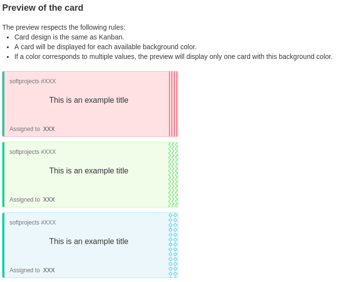

   Card preview

.. attention::

  While you can select the same field as :ref:`Status semantic <status-semantic>`
  for the background color, you should know that this case has a limitation in
  :ref:`Kanban <kanban>`. When drag and dropping cards between columns in Kanban
  (which affects the Status field's value), the Background color will not be
  updated on-the-fly.
  To see the updated background color for the card, you should either change
  status via the artifact modal or refresh the page.

Initial Effort (Agile Dashboard)
````````````````````````````````

The Initial Effort semantic is special in that it only exists if the project
has the Agile Dashboard enabled. In the agile context, it is supposed to
represent the estimated effort for a given task, story, sprint, release...

In order to use this semantic you need to have a numeric field in your tracker
that corresponds to this initial effort notion.

The initial effort is used in the Agile Dashboard **content** and **planning**
views.

.. _tracker-workflow:

Workflow Manager
~~~~~~~~~~~~~~~~

Overview
````````

A Workflow can help you control the artifact lifecycle, ensure that your
teams follow the rule of your company methodology (CMMi, etc.).

Each tracker can have it's own workflow, designed by the tracker
administrator.

For now, a tracker can have only one workflow defined on one field. This
field must be a list field (select box).

N.B. Worflow is not taken into account in artifacts mass change, during artifact copy and during XML import.

Add a workflow to a tracker
```````````````````````````

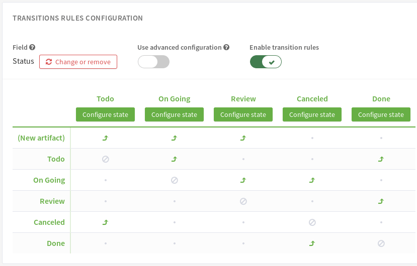

-  **First, select the field**: you choose the field on which applies
   the workflow. A workflow applies on "Select Box" field type (except
   if it's bound to users).

-  **Then, define transitions**: the states the artifact should take
   from it's beginning to it's end.

   By default, no transitions are allowed (it's not possible to change
   the values of selected field). You authorize a transition by clicking
   on the bullet that cross "FROM" row and "TO STATE" Column. Arrow
   icon: the transition can happens, grey bullet: the transition is
   forbidden.

   For instance, in `Add a workflow to a tracker`_, various transitions have been defined: on
   artifact submission, defined by fake state "new artifact", values available for the field "Status"
   will be "To do", "On Going" and "Review".
   Then, once Status is "To do", possible changes will be "On Going" and "Done", etc.

To delete the workflow, simply click on the "Change or remove" button near to the field
name. Transitions are deleted too.

Workflow simple and advanced mode
``````````````````````````````````

Each transitions can be configured.
That means that they can have pre-conditions and post actions.

A tracker workflow can uses two modes: simple or advanced.

* In simple mode, pre-conditions and post actions of transitions are configured at target state level.
  This means that all transitions defined at target state level share the same configuration.
* In advanced mode, each transitions are configured individually.
  This means that the administrator has to configure pre-conditions and post actions in each transitions.

By default, a workflow is created in simple mode.

A tracker administrator can change the workflow mode:

* From simple to advanced: Each transitions copy from their target state the configuration and are now editable individually.
* From advanced to simple: Transitions are now editable by target state. For each state, the first transition found is used as a template
  and its configuration is used to configure all transitions defined for this target state.

The workflow presented in `Add a workflow to a tracker`_ is in simple mode.
You can see that the target state can be configured.

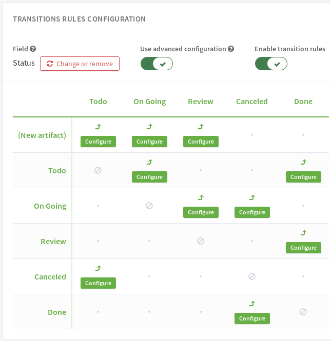

This picture above shows the same workflow, but switched to the advanced mode.
You can see that now, each transition is configurable individually.

Define rules on transitions
```````````````````````````

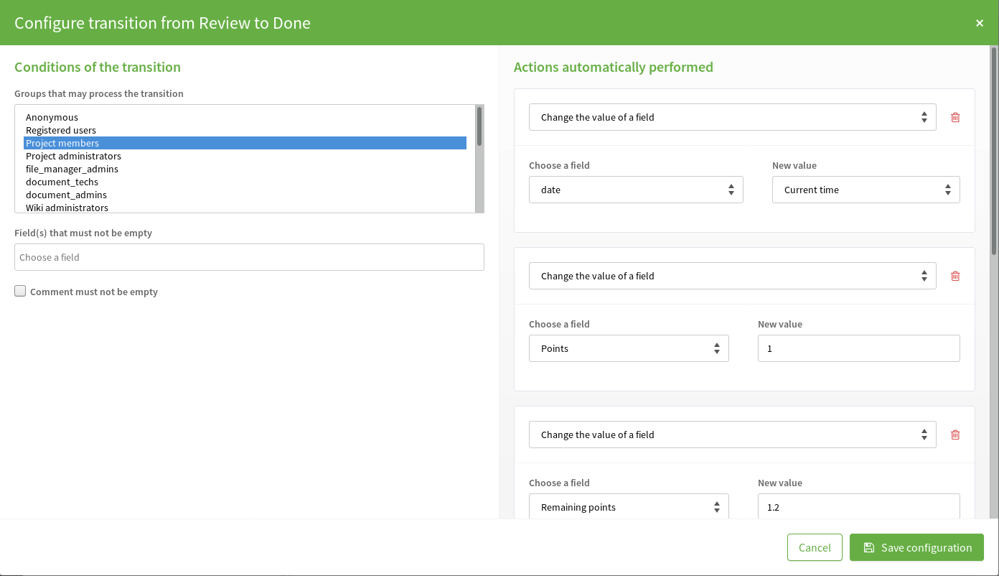

   Define workflow transitions

For a given transition, you can select the people allowed to perform it, define fileds and comment not empty
and actions exectued after the transition happens (if allowed).

Groups that may process the transition
^^^^^^^^^^^^^^^^^^^^^^^^^^^^^^^^^^^^^^

Once the transition is defined, you can refine who can make the
transition. To do this, click the "Configure" button.
Then, select the group of users you allow to do the
transition (see `Define workflow transitions`_).

Fields and/or comment not empty
^^^^^^^^^^^^^^^^^^^^^^^^^^^^^^^

A tracker administrator can define a set of fields that must not be empty before processing a workflow transition.
An administrator can also make adding a followup comment mandatory for a transition.
Keep in mind that this condition cannot be configured for transitions from "New artifact", as it is not possible to add a comment when creating a new artifact.

Post actions
^^^^^^^^^^^^

You can define a list of actions after the execution of a transition. The available post actions may vary depending on the configuration mode you are in (Simple or Advanced).

In Simple configuration mode:

* Set a value to a date field
* Set a value to a float field
* Set a value to an integer field
* Process a Jenkins job by providing its URL
* Hide fieldsets in the artifact view
* Freeze fields values so that users can't change them while in this state

In Advanced configuration mode:

* Set a value to a date field
* Set a value to a float field
* Set a value to an integer field
* Process a Jenkins job by providing its URL

For instance, you can set a date field to the date of transaction execution. It might be used to set automatically the close date of an
artifact (eg. when it's state move from Resolved to Closed).

Hide fieldsets will hide them in the artifact view which can be useful when you don't want users to bother with information irrelevant
to the current state of the artifact; they can still press a dedicated button if they want to see them anyway, it is a visualization help,
not an access control option.

Freeze fields values will render the selected fields uneditable for the current state. This can be useful if you want to prevent users from
editing parts of the artifacts data at or past a certain state of your workflow.

Canned Responses
~~~~~~~~~~~~~~~~

One frequently sees project members in charge of the artifact
classification and dispatch process posting the same follow-up comments
repeatedly. Typical examples of repeated posted comments are: a thank
you message to the originator, a request for the originator to provide
commonly missing information like version numbers or type of machine
used, etc. (see `Definition of Canned Responses`_)

Rather than repeatedly typing the same follow-up comments,
Tuleap allows project members to create a predefined set of
responses. After these canned responses have been defined, posting a
follow-up comment is just a matter of selecting the appropriate response
from the pull down menu in the artifact update form.

.. figure:: ../../../images/screenshots/sc_trackercannedresponses.png
   :align: center
   :alt: Definition of Canned Responses
   :name: Definition of Canned Responses

   Definition of Canned Responses

Email Notification Settings
~~~~~~~~~~~~~~~~~~~~~~~~~~~

The Tracker comes with a predefined set of
rules to keep relevant people aware of the artifact life. The default
rules can however be complemented or tuned in a number of ways:

Global Email Notification
`````````````````````````

In addition to the default notification rules, the tracker
administrators have the ability to specify a list of email addresses to
which submissions of new artifacts (and optionally artifact updates)
will be systematically sent. To add an email address, click the "add"
link. You can add as many email addresses as required.

You can choose to disable the permission check for global email
notification. This can be useful if the email address is a mailing list,
because individual permissions can't be checked for each member of the
mailing list. So for mailing lists, if the check box "check permissions"
is checked, the notifications will be send to each member with the
permissions of an anonymous user.

This feature is typically used to send submissions of new artifacts to a
number of well identified persons in the team who are in charge of
qualifying and dispatching the artifacts.

.. NOTE::

    If you want to notify many people at once, we suggest that you use
    the Tuleap Mailing Lists service to create a
    distribution lists (see :ref:`mailing-lists`). Once the Mailing List is up and running
    type the e-mail address in the Global Email Notification field.

    Creating a Mailing List on Tuleap has several
    advantages: first individuals can (un)subscribe by themselves and
    second all messages sent to a Tuleap mailing list are
    kept in an archive that can serve as an audit trail for your
    tracker.

Email subject customisation
```````````````````````````

It is possible to enable a marker "[Assigned to me]" in the subject of email
notifications to easily identify emails concerning artifact assigned to you.
This rely on Contributor/assignee semantic of the tracker.

In addition to the subject of the email, all the assignees are listed in the mail
body with ``=ASSIGNED_TO=<username>``. These markers are not visible but could be
used to create filters in your email client.


Tracker Artifact Import
~~~~~~~~~~~~~~~~~~~~~~~

Project Administrators have the means to import artifacts into
Tuleap trackers using the well known CSV (Comma Separated
Value) format supported by all of the major office productivity suites.
The artifact import functionality greatly facilitates the migration and
integration of external project tracking and management tools into
Tuleap trackers.

The import is divided into three steps:

-  **CSV file submission.** The project administrators can access the
   Import functionality from the tracker administration screen or over
   the Project Administration Menu. Enter/choose the tracker to update
   and specify the CSV file to import. In this step you can also check
   the option to send a mail notification to all users concerned by the
   artifact changes due to the import. If you don't check this option no
   notification will be sent.

-  **CSV file parsing.** If no parse errors were found in the uploaded
   file, a parse report is shown to validate that the information to
   import is correct.

-  **Database update.** Depending on the parsed information new
   artifacts are created or existing ones updated.

When to use the Import
``````````````````````

You will find below a couple of suggestions regarding the use of the
tracker import feature:

-  Initial import from a project management software to your
   Tuleap task tracker.

-  Migration of your legacy defect tracking system into your new
   Tuleap defect tracker.

-  Migration of artifacts from one Tuleap tracker to
   another.


The Database Update
```````````````````

If you import new artifacts, all non-mandatory fields that are omitted
in the CSV file will be initialized to their default value.

The submitter and submission date of an existing artifact is never
changed by an import even if the import file contains relevant
information.

If an error occurs for some artifact during the database update the
following artifacts in the CSV file are not imported any more.

Each import is tracked in the project history (:ref:`project-history`). On the other hand, no
e-mail notification is sent in response to the import.

.. NOTE::

    If a .csv file is opened in Excel, any change to the spreadsheet
    (even something as simple as a column resizing) may cause Excel to
    modify and update the .csv file. Changes that may occur include:
    dates, times and numbers converted to the same format as those used
    by your system's regional settings, single line feeds converted to
    line feed and carriage return, extra commas appended to certain
    lines.

    The updated date format might not be compatible with the
    Tuleap date format and potentially cause troubles when
    importing such updated CSV files back into Tuleap. On
    the other hand Tuleap-exported CSV files might not open
    correctly under Excel in certain Regionals.

    If you have a .csv file that either will not open correctly under
    Excel or was opened in Excel and will not import into
    Tuleap please try the following: Make sure all
    applications are closed. Change your system's regional settings
    (Start > Settings > Control Panel > Regional Options) to use the
    English with the following formats: Date = MM/dd/YYYY Time = hh:mm.
    Using Excel, open the .csv files that don't import, make a column
    width change, save the files and exit Excel. Go back and restore
    your original regional settings. Import the "fixed" .csv file into
    Tuleap.

Tracker Structure Export
~~~~~~~~~~~~~~~~~~~~~~~~

Tuleap allows you to export the structure of the trackers
into an XML file. The Tuleap tracker templates are provided
under the form of such XML files. This feature is also really convenient
to copy a tracker from a Tuleap server to another.

To export the structure of your tracker, please go to the admin part of
your tracker, and select the Export link. This will open a browser
window to choose the location of the exported file.

The exported structure file can be used when you create a new tracker,
see `Tracker Creation`_.

.. NOTE::

    This does not copy the artifacts of the tracker but only the
    structure (general settings, fields, values, workflow, semantic, canned responses and permissions).

.. |image0| image:: ../images/icons/artifact-arrow.png
.. |image1| image:: ../images/icons/sum--plus.png

Delete artifacts
~~~~~~~~~~~~~~~~

Tuleap allows project and tracker administrators to permanently delete artifacts.
To do so, go to the tracker administration and select "Delete artifacts".

.. NOTE::

    if you are not project or tracker administrator, please contact one administrator.

Webhooks
~~~~~~~~

You can configure your tracker so that each time an artifact ``creation`` or ``update`` is done, a webhook endpoint is called.
To configure your webhooks, please go to the workflow section of the tracker administration.

See the :ref:`webhook-tracker` section in the webhook documentation section.

.. WARNING::

   The payload contains changeset representations. They are sent without any permission checking, so be careful where you send your webhooks.
