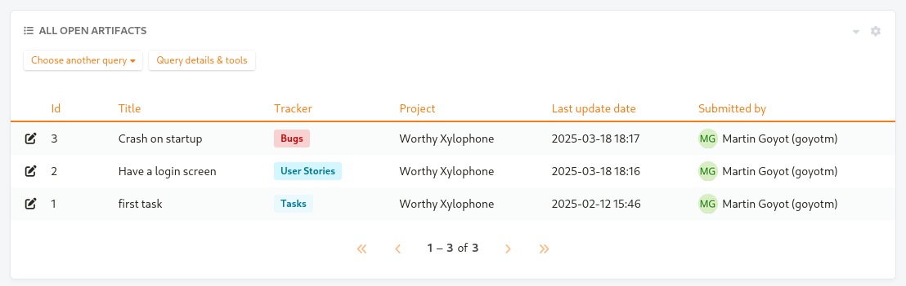
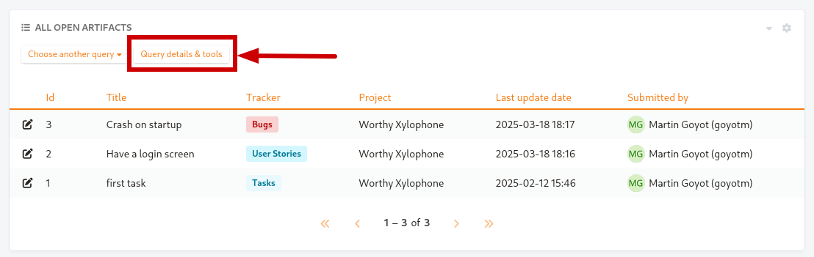
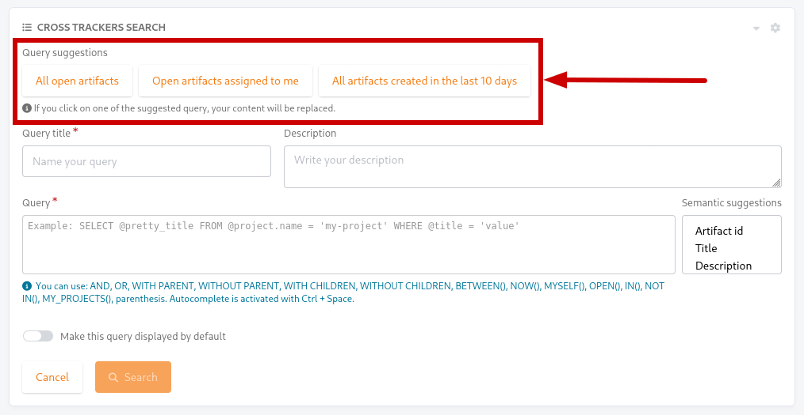
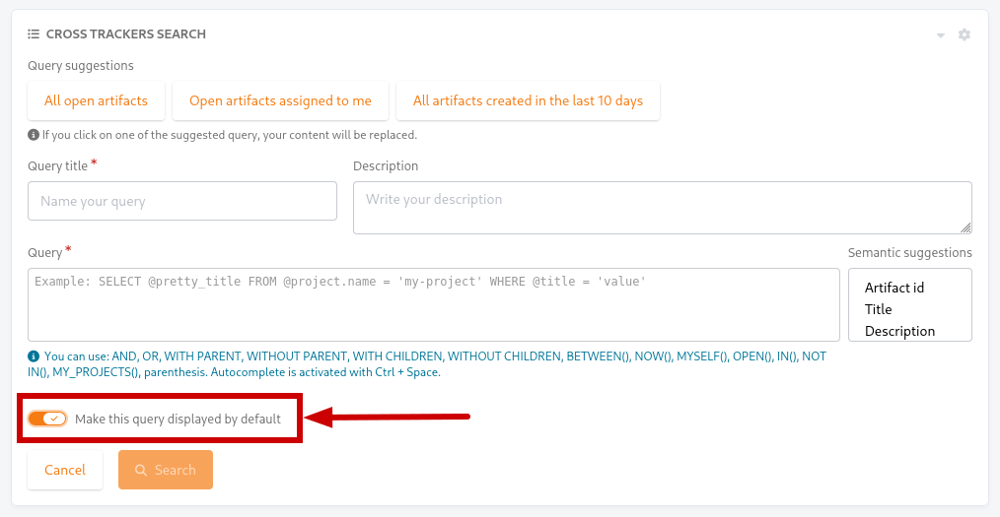
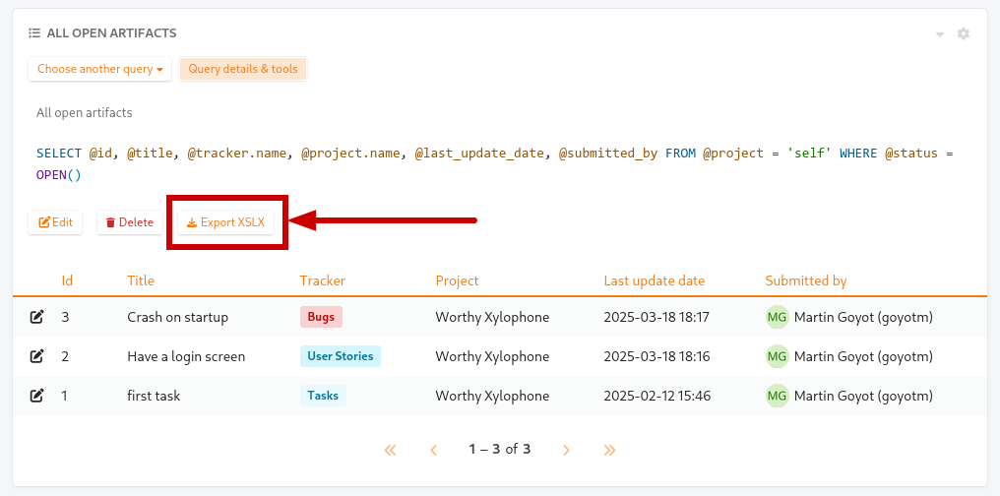

.. _xts:

Cross-Tracker Search
====================

.. attention::

  This module is part of :ref:`Tuleap Entreprise <tuleap-enterprise>`. It might
  not be available on your installation of Tuleap.

You may want to perform a search based on several trackers and several projects.
A widget "Cross-Tracker Search" enables you to do that.

  Example of cross-tracker widget

The choice of columns to display, the selection of trackers and projects and the selection of artifacts are all expressed in :ref:`Tuleap Query Language <tql_xts>` only. Writing a TQL query is mandatory. See the dedicated page for details on how to write a query: :ref:`TQL in Cross-Tracker Search <tql_xts>`

After writing a query, you can save it, then all users who have access to this dashboard will see the widget and the selected artifacts and columns.

Query details & edition
+++++++++++++++++++++++

By default, when arriving on the widget, only the results of the current query will be displayed. In order to access its
details and to edit it, you must click on the “Query details & tools” button.

Once the details opened, you can directly click on the query itself or on the “Edit” to edit it.

Query suggestions
+++++++++++++++++

While creating a new query you will find “Query suggestions”:

  Query suggestions

Those queries are predefined queries suggested by Tuleap. They correspond to basic queries that are often used on Cross-Tracker
Search widgets and can be a great way to get started with building your own.

Upon clicking on one of those you will be presented with a window showing you the details of the chosen query before overriding
your current fields with its values.

Default query
+++++++++++++

The widget supports the registration of multiple queries but you can decide to define one of them to be the default one.
Once a default query is selected, all the users opening the widget will be presented with the result of this query first
before being able to switch to a different one. If no query is selected as the default one, the presented results will be
those of your first query.

In order to set a query as the default one you must click the “Make this query displayed by default” toggle either on the
creation or the edition screen of a query.

  Set query as default

XLSX Export
+++++++++++

Once a report is saved, an "Export XSLX" button will appear. Click it to download an XLSX file representing all the artifacts and fields you can see on the widget.

  XLSX Export button

.. attention::

	Only some field types can be exported as XLSX in Cross-tracker reports. Here is the list of supported field types:

	- String field
	- Text field
	- Integer field
	- Float field
	- Date field (with or without time displayed)
    - List fields but not multi values list (multi-selects and checkboxes)
	- Radio button field

	All other fields are not supported yet and will be skipped.
