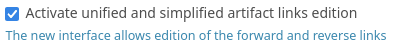
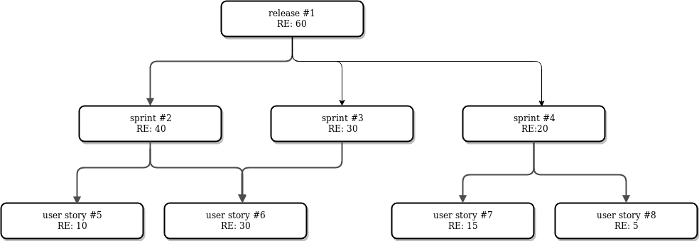
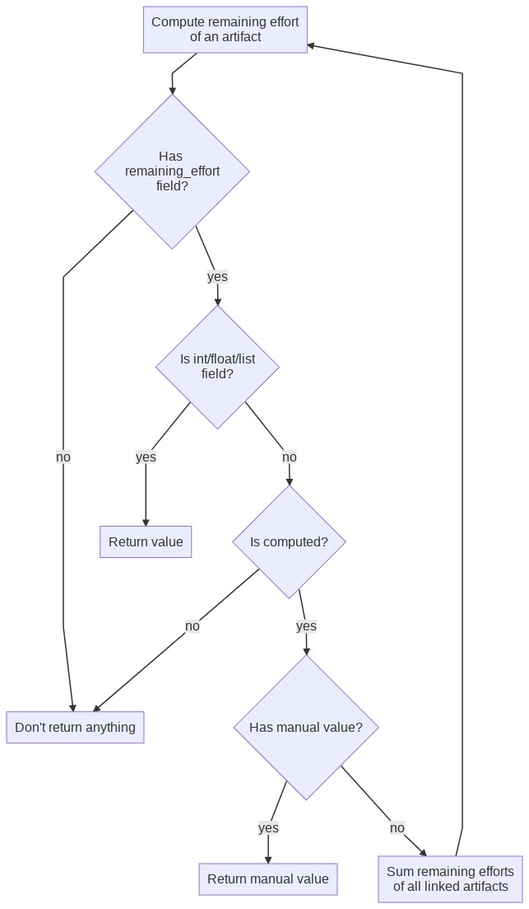
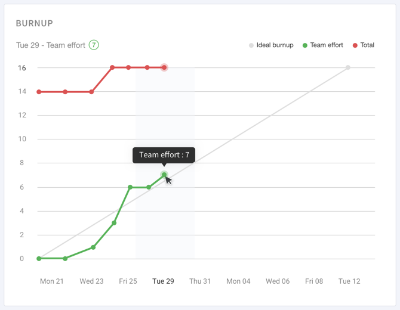

.. _tracker_artifact_fields:

Artifact Fields
---------------

Standard types
~~~~~~~~~~~~~~
Find below a detailed description of each type:

String
``````
Allows the user to enter free text in a one-line text
field. The summary of a defect or a task is a good example of a
one-line text field.

Text
````
Allows the user to enter free text in a multi-line text area.
The field "Original Submission" that is used to describe in details a
defect, a task, etc. is of type "Text".

It can have three formats: "Text", "HTML" or "Markdown".


Select Box
``````````
A "Select Box" field takes its value from a predefined
list of values defined by the tracker administrator. The predefined
values can either be a:

-  static list of values,
-  a list of users,
-  a list of user groups.

For more details on each possible values, see `bind type
configuration <#TrackerV5ModifyFieldBind>`_.

Depending on the browser you use it may be displayed slightly
differently but it is generally shown as a pull-down menu with the
list of predefined values. At any given time this type of field can
only be assigned one single value.

Multi-Select Box
````````````````
Like the Select Box field described above this
field takes its value from a predefined list of values or users. As
opposed to the Select Box field, the Multi-Select Box can be given
multiple values at once by the end user. As an example, this type of
field can be used to assign several persons to a given task in a task
tracker.

Date*: one-line field that only accept ISO formatted dates
(YYYY-MM-DD). For user convenience, each date field comes with a
calendar.


Shared Fields
`````````````
When selectbox values can be shared between multiples tracker and pultiples project you can use `shared field`.
You can add/hide values from original tracker and every tracker sharing the field will be up to date with new values instantly.

File upload
```````````
This field allows to add any kind of files. Users can
add several files in the same file updload field. A typical example
of file upload file is an attachment section of defect or bugs
artifacts.

Integer
```````
One-line field that only accept well-formed integral
numbers (e.g 3, -100, 2345…)

Float
`````
One-line field that only accept well-formed floating point
numbers (e.g 3.56, -100.3, 2345, 34E+6…)

Open List
`````````
This field allows to have a list of values, but the
values are not predefined. The list is "open". It means that users
can use an existing value, but can also add a new value. This new
value will be part of the existing ones the next time! Moreover, this
field provides autocompletion (typing the beginning of a word, the
system suggests values starting with the entered text). This fields
accepts multi values.

Like the standard lists, open lists can be linked with static values
or with users.

.. NOTE::

   Former trackers version of Tuleap contained a section
   called CC that was used to notify people of artifact updates.
   This section no more exists, but can be easily replaced by an
   open list field, linked with users. Don't forget to check the
   notify option when defining your field!

Artifact link
`````````````
This field allows to make specific reference or
dependance to other artifacts. A typical use for this kind of field
is a reference from a task to several sub-tasks. This field is multi
valued.

You can now use the new artifact link field in the artifact view. 
To enable it, you have to check the "Activate unified and simplified artifact links edition" checkbox in tracker fields administration. 



The site administrator can mass activate it for all trackers of the platform in Tracker plugin administration.

Permissions on artifact
```````````````````````
This field allows to define specific
permissions on an artifact. The artifact submitter can then choose to
restrict the access of the artifact to a group of users.

Computed field
``````````````
In Tuleap, computed fields are special fields that allows you to do the sum of
all linked artifact (regardless of link type).
The computation is based on field name, in order to computed value the field doesn't have te be named remaining effort,
but it need to have the same name than linked artifacts.

A common use case for this field is calculation of remaining effort in release.
Release remaining effort is the sum of sprint remaining effort
and sprint remaining effort is the sum of user stories.

Computation rules:
* we never compute twice the same node,
if a user story is linked to two sprints, the release remaining effort add only one time the user story remaining effort
* manual value break the calculation,
* when calculation encounter a manual value we never computed linked artifact of node, we keep manual value for computation.
Permissions are not taken in account during calculation process, user will see the remaining effort global, even he/she can't see some artifacts.

Example of computation work:



   Example of computed field calculation


   * User story #6 remaining effort is count just once for release, but sprint #2 and #3 reflect correct remaining effort
   * If I manually set remaining effort for Sprint #2 to 10, release remaining effort will be 60 (10+30+20)
   * I am connected as a member who only can see release, I will see 60 as remaining effort

A flow chart explain computation mechanisms.



..
    graph TD
        A[Compute remaining effort<br> of an artifact] --> J{Has <br>remaining_effort<br> field?}
        J -->|yes| E{"Is int/float/list<br> field?"}
        J -->|no| F[Don't return anything]
        E -->|no| G{Is computed?}
        G -->|yes| B{Has manual value?}
        D --> A
        B -->|yes| H[Return manual value]
        B -->|no| D[Sum remaining efforts<br> of all linked artifacts]
        E -->|yes| I[Return value]
        G -->|no| F

.. _burnup_administration:

Burndown
````````
Burndown is a graphical representation of remaining effort, and is used to track team progress.
The computation of every dot is based on computed field.
In burndown every dot represent the sum of all linked artifact remaining effort for a given day.

Burnup
``````

Burnup chart represent team progress overtime for a release or a sprint.
It's a new field for :ref:`backlog`.



   A burnup field

This graph allows you to visualise:
   * Total effort: sum of initial effort to do to complete release
   * The effort already achieved using either:

     - Team effort (default): sum of initial effort already done for the release
     - Closed elements: the number of closed items for the release

You can switch between the *Team effort* and the *Closed elements* modes in the administration of :ref:`backlog`.

Burnup and Burndown mechanisms
``````````````````````````````
Cache for burnup and burndown works the same way.

They are both based on a cache tables:
 * every night yesterday value is computed and cached
 * the value for the day "today" is never cached and calculated at every display
 * if chart has missing day, a system event is triggered to generate the full cache for chart
 * if start date or duration is updated, the full chart cache generation is computed again
 * project admin can force cache generation
 * data are not displayed until the cache is complete

It's possible to use burnup and burndown over different timezones:


Let's imagine your team is split in Montreal and in Tokyo:

========================== =======================
Team A                     Team B
Montreal                   Tokyo
31th July 2017 1:00 AM     1th August 2017 3:00 PM
========================== =======================

With a server located in Paris

========================== =====================
Server time                31th July 2017 8:00AM
Today remaining effort     10
========================== =====================

My team B, update the remaining effort to 9 at 3:00PM,
burndown will reflects following values:

========================== ===============================
in Montreal                value for 31th July will be 9.
in Montreal                value for 1th August will be 9.
in Tokyo                   value for 31th July will be 10.
in Tokyo                   value for 1th August will be 9.
========================== ===============================


Dynamic fields
~~~~~~~~~~~~~~

Find below a detailed description of each type:

Artifact ID
```````````
this is the unique identifier of the artifact. It can
be useful to make reference to the artifact. The artifact Id cannot
be updated and is determined by the system. This is a read only
field.

Last Update Date
````````````````
this field is a read only field and cannot be
updated by the user. This field is automatically set to the date of
the artifact was updated last time. Each artifact modification will
update this field (field update, follow-up comment, etc.). This field
can be useful in a report sorted on this field to follow the activity
of the tracker.

Submitted By
````````````
this field is a read only field and cannot be updated
by the user. This field is automatically set to the user that
submitted the artifact.

Submitted On
````````````
this field is a read only field and cannot be updated
by the user. This field is automatically set to the date of the
artifact was created.

Cross References
````````````````
this field is automatically updated with existing
references from and/or to this artifact. It displays all references
from or to this artifact, grouped by reference type (artifact,
document, wiki, etc.).

Rank
````
this field is automatically updated by :ref:`backlog`. It displays the artifact rank in the context of the milestone.

Structural Elements
~~~~~~~~~~~~~~~~~~~

Find below a detailed description of each type:

Fieldset
````````
This structural element allows to group several fields
together. Fields are stacked one above the other.

Column
``````
This structural element allows to add columns in the
artifact form. Columns are aligned one next to the other. You can use
columns if you want to put several fields on the same row.

Line Break
``````````
This structural element adds an invisible line break in
the artifact form. Use this field to arrange the different elements.

Separator
`````````
This structural element adds a visible line break in the
artifact form. Use this field to arrange the different elements.

Static Text
```````````
This element allows to add static text in the artifact
form. You can use the rich text editor to add color, formatting, etc.
You can use this field to add instructions, ot just for decoration.
