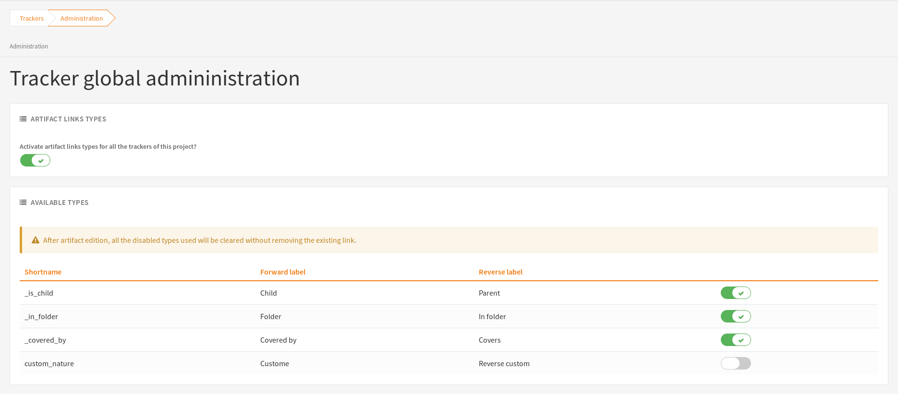

***************
Artifact Update
***************

Selecting an artifact from the list generated by a search operation will
bring you to a screen with all the artifact details. Depending on the
permissions you have on this tracker, the detailed view is made
of text fields and menus that you can update with new values. If you are
an anonymous user or a registered user who does not belong to the
project team, most of the fields will likely appear as immutable text.
By default, non-project members cannot edit any of the artifact fields.
They can only submit a follow-up comment.

The Artifact Update screen is divided in several parts: **Header and Comments.**

Header
======

The header zone is where you'll find all the fields associated with an
artifact. Many of these fields are assigned a set of
predefined values (Status, Category, Resolution) while some others have
a number format (Effort) or a free text format (Summary). For more
clarity, the fields are grouped in field sets. The set of fields used in
a given tracker, as well as the related set of predefined values and the
field sets can be configured by project members who have administration
permissions on this tracker.

Dynamic Fields
==============

Some fields have a particular behaviour and some explanations seem
necessary.

-  **Automatically edited fields**: Tuleap includes fields
   that are automatically set : "Artifact ID", "Last Update Date",
   "Submitted By", "Submitted On" and "Rank". The users can't edit those fields.

-  **Cross-Reference**: Tuleap offers another dynamic field
   which has the ability to cross-reference any artifact, or any other
   Tuleap object from within a follow-up comment.

   When typing a follow-up comment, any text that follows the pattern
   "XXX #NNN" will be interpreted as a reference to the artifact XXX
   number NNN, where NNN is the unique artifact ID, and XXX is the
   tracker short name (e.g. "bug #123", "task #321", "req #12", etc.).
   If you don't know the tracker short name or don't want to specify it,
   you may simply use "art #NNN". Each time Tuleap displays
   a piece of text that follows this pattern it will auto-magically
   create an hyperlink to the web page showing all the details of the
   artifact.

   Tuleap reference patterns may be used to reference
   artifacts, as well as source code commits, documents, files, etc.
   Please refer to :ref:`writing-in-tuleap-references` for more details on References.

   Furthemore references concerning artifacts, svn revisions are stored in the database.
   They are displayed in the next section, ordered by type and initial reference direction.

.. _artifact_comments:

Comments
--------

As many comments as needed can be attached to any given artifact. Comments are
free-text fields where virtually any kind of information or comment can be typed
in.

Comments have several interesting capabilities and extensions:

**History of Changes**

The artifact's history is also listed below the fields themselves. This keeps track of all changes that occurred on all artifact fields since the creation of the artifact. The artifact history shows what fields changed, what the old value was before the change took place, who changed it and when.

**Canned Responses**

It is common to see the project members in charge of the artifact classification and dispatch process to post the same comments again and again. Typical examples of repeatedly posted comments are: a thank you message to the submitter, a request for the submitter to provide commonly missing information like version numbers or type of machine used, etc. Rather than typing the same comments all the time, Tuleap allows project members to create a predefined set of responses. Each canned response is defined by a name and by the body of the response. To post a canned response comment, select the appropriate response from the pull down menu in the artifact update screen and submit the changes.

**Notification by @ mention**

While writing comments, you can mention somebody by typing ``@`` and their Tuleap username. For example: ``@admin``. After typing three or four letters, an auto-completer appears and suggests users matching what was written after the ``@``. When you submit the comment, each mentioned user will receive an :ref:`e-mail notification <at_mention_notification>`, unless they do not have permission to see the artifact.

This also works if you edit an existing comment: people mentioned will receive an e-mail notification about the change of the comment.

File attachments
----------------

You can attach files to an artifact by using the file field.

Please note that it is possible to drag and drop (or copy/paste) images directly in the text or in the new follow-up comment field as soon as they are in ``HTML`` mode.

Such images will be added in the first file Field that you have permission to update in the artifact.

Drag and drop or copy/paste of images are not possible if:

* there isn't any File field.
* you do not have permission to update the File field or it is frozen (due to the :ref:`workflow <tracker-workflow>`).

Artifact Link
=============

Artifact link field provides a very powerful way to link an artifact to
others. Any artifact from any accessible tracker can be linked to the
current edited artifact. Artifact are displayed as a regular tracker
report where each tab is a list of artifact of a given tracker according
to the default renderer of the default selected report.

Linking artifacts
-----------------

If you know the id of artifact you want to link, just add it in the unput box.
You can add several artifact at once, by separating them with comma '1,2'.
If you don't know the id of artifact to add click on the search button, a modal
will allow you to choose artifacts by trackers.

Creating an artifact
--------------------

As linking another artifacts to a currently edited one, it is possible to
create a artifact in different tracker (e.g. sub-tasks addition) any
created artifact is set as "to be linked", this means that right after
creating it is added to its tracker tab, and in the input field text.

Managing linked artifacts
-------------------------

Linked or "to be linked" artifacts can be managed in the artifact link
tabs view. Not yet linked artifacts are highlighted. All artifacts can
be uncheck (by clicking the cross).

.. _types-artifact-links:

Using typed artifact links
--------------------------

Since Tuleap 9.14, trackers use by default the typed artifact links.
This feature gives to the user the ability to add a type to a link between two artifacts.

Trackers and project administrators are able to deactivate the whole feature or some types for the project.
This can be done in the new tracker global administration section

Regarding the ``_is_child`` type, it cannot be disabled.

.. attention::

  Some types cannot be disabled because they are used by an active plugin in the project.

Once deactivated:

- A type cannot be used in new links

- Old links using this type still exist

- The type of these links will be cleared after the next artifact update (the link will continue to exist without any type)

Parent/Child relationship
-------------------------

Before Tuleap 12.5, parent/child relationship was driven by the hierarchy.
It meant that the artifact link type ``_is_child`` was automatically set between two artifacts if a hierarchy was defined between the two trackers.

Since Tuleap 12.5, parent/child relationship is only defined by the artifact link type ``_is_child``
that must be added manually by the user while linking an artifact to another.
With this feature, any artifact can be defined as a child of another, without any constraints.
The children added this way will be displayed everywhere (artifact view, planning view, taskboard, cardwall, etc).

The hierarchy is now only an helper.
It means that the artifact link type ``_is_child`` is no more added automatically based on hierarchy but it's still used in:

* Backlog to have quick access to create new items and new parents
* Backlog for scrum plannings definition
* Tracker triggers that only deals with children based on the hierarchy
