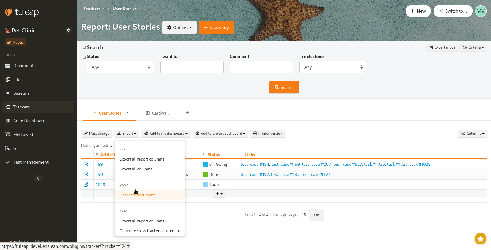
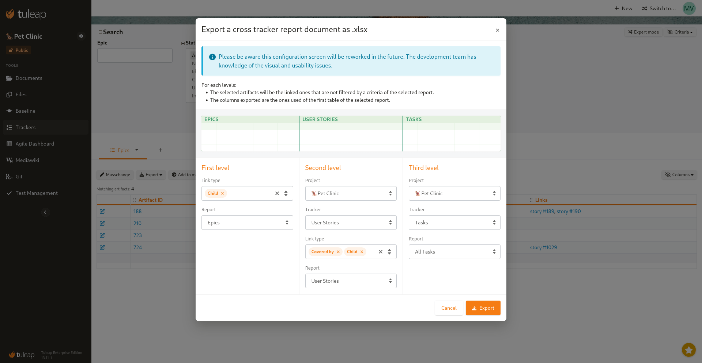

.. _plugin_document_generation:

Document Generation: docx and xlsx export
-----------------------------------------

.. attention::

    This module is part of :ref:`Tuleap Enterprise <tuleap-enterprise>`. It might
    not be available on your installation of Tuleap.

This plugin allows to generate MS Office documents (docx/xlsx) from tracker reports:

* Word (docx) document as a snapshot of a tracker content.
* Excel (xlsx) document for single or cross tracker reports.

	Document Generation exports

Word (docx) exports
===================

The generated document structure is the following:
* a title page
* the table of contents
* the list of criteria of the report
* the list of artifacts (one artifact per title level)

The title page contains general informations:

* the platforms logo
* report title
* who did the export
* when it was done
* a link toward the report

Then artifacts are exported with following strategy:

* Artifact title (if any) is one level title
* Each "fieldset" will get it's own title to delimitate a new subsection
* Fields that contains a value or list of values (string, dates, integer, float, computed fields, all lists) are rendered as a table of two columns "field name" and "field value"
* After the "fields table", each textarea fields are rendered as a dedicated subsection (sub heading of the fieldset)
* Artifact links, Cross References and Attachments (files) get their own table.

Text fields are transformed from their original source (text, markdown or HTML) to word format (OOXML) thanks to a custom tranformation process that tries to keep as much of the original formatting
intent. When there are titles in the original source, they are "translated". For instance, let's assume the text field "Description" has title "heading 4" in the docx. If the description is an HTML
field that contains "<h1>my title</h1>", this title will become "heading 5" in generated docx.

.. warning::

     Artifact links, Cross References and Attachments (files) contain references (hyperlinks) toward the platform that host the data. The links point toward the last available version, **not the version at the time of the snapshot**.

Excel (xlsx) exports
====================

.. warning::

     Known limitation: Excel (xlsx) reports generation will fail if the tracker reports selected as sources are made of more than **1** table renderer each.

The plugin exposes two XLSX exports:

* Export all report columns
* Generate cross trackers document

The first one is almost the equivalent of CSV's "Export all columns report" with two major differences:

* the output format is XLSX instead of CSV. This shouldn't make any diffrence if you open in a spreadsheet tool.
* behind the sceen, it uses a different generation strategy that doesn't have "timeout" constraints. So can be useful if CSV export ends up with a 502/timeout.

The second one allows to generate a spreadsheet with data that comes from multiple trackers.

	Configuration screen for cross tracker export

Cross tracker export allows to export data up to three level of tracker based on links between artifacts.

This can be used to generate traceability reports such as:

* Epics -> User Stories -> Tasks
* Risks -> Risks mitigations -> Requirements
* ...

It's possible to export any tracker (including trackers that comes from a different project). The final document
will contains the columns that are defined in the select "Report".

Please note that, in addition of the defined columns, in a "Report", Tuleap will also applies the defined search
filters. This can be used to further restrict the data to be exported.