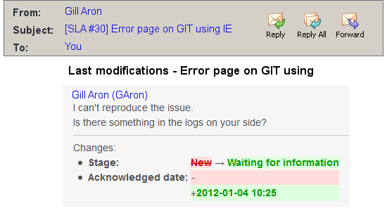

*******************
E-mail Notification
*******************

The Tuleap Tracker is equipped with a powerful and flexible
e-mail notification system. Unless otherwise instructed by the project
administrators or the users themselves, the e-mail notification system
follows simple default rules. Whenever an artifact is created or updated
- whether with an additional comment or a change in any of the
artifact fields - an e-mail message is sent to:

-  The artifact submitter (the person who initially submitted the
   artifact)

-  The artifact assignee (the person to whom the artifact is currently
   assigned if the option "Send notifications to selected people" of the
   field which refers to the assignee has been checked by the tracker
   admin)

-  All users who posted at least one comment to the artifact.

The e-mail message generated by the Tuleap Tracker first
shows the most recent changes that occurred on the artifact in case of
an update. It is then followed by a complete snapshot of the artifact.
Web pointers are also included in the message to quickly and easily
access the artifact form on Tuleap.

  Notification by email

.. _at_mention_notification:

Notification by @ mention
=========================

In :ref:`Tracker Artifact comments <artifact_comments>`, when you mention somebdy by their Tuleap username, they will also receive an e-mail notification.

This is a one-time notification, people who are notified by their username will not receive updates for new comments or changes to the artifact.

If notifications are disabled for the whole Tracker, people mentioned will NOT receive an e-mail notification. People who individually disabled notifications for the Tracker, or unsubscribed from the Artifact's notifications will also NOT receive any e-mail that way. Permissions also apply, and people who do not have permission to see the artifact will not receive an e-mail.
