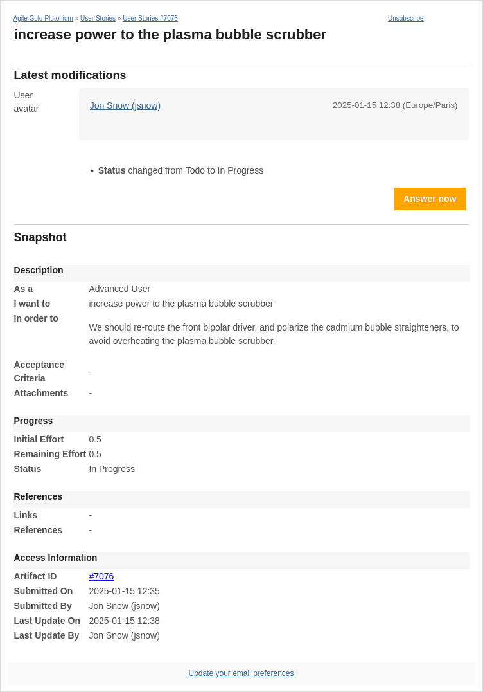
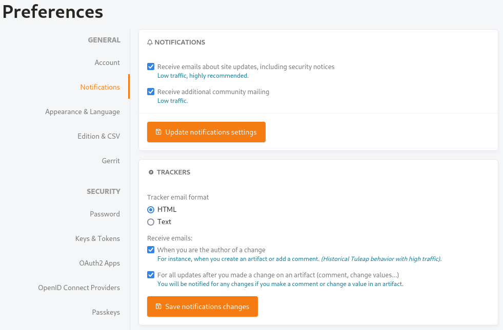
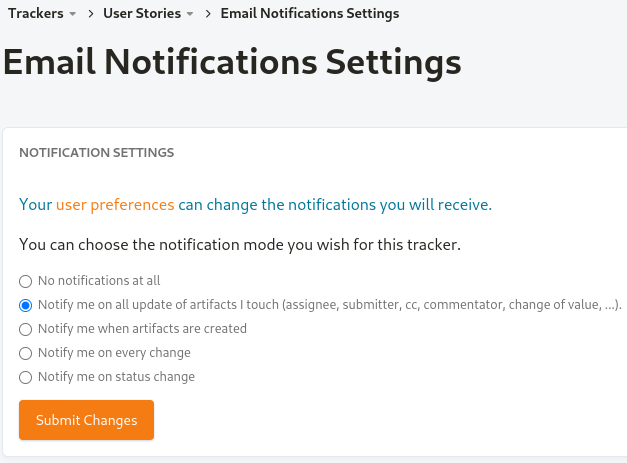

*******************
E-mail Notification
*******************

Tuleap can send e-mail notifications for artifact creations or updates. The e-mail message first shows the most recent changes that occurred on the artifact in case of an update. It is then followed by a complete snapshot of the artifact. Links are also included in the message to quickly and easily access the artifact on Tuleap.

elow, there is a "Snapshot" section that details each field of the User Story artifact that was udpated.

  E-mail notification for an Artifact update

Unless otherwise instructed by the project administrators or the users themselves, the e-mail notification system follows simple default rules. Whenever an artifact is created or updated - whether with an additional comment or a change in any of the artifact fields - an e-mail message is sent to:

1. The artifact submitter: the person who initially :ref:`submitted <artifact_submit>` the artifact.
2. The artifact assignee: the person to whom the artifact is currently :ref:`assigned <assignee_semantic>`. The "Send notifications to selected people" option of the field selected in the :ref:`Contributor / Assignee Semantic <assignee_semantic>` must be checked by the tracker administrator, otherwise e-mails will not be sent.
3. All users who have :ref:`posted at least one comment <artifact_comments>` to the artifact, or who have :ref:`changed any of the fields <artifact_update>`.
4. All users who are :ref:`mentioned with @ <at_mention_notification>` in the new comment.

User preferences
================

The default settings above can be very noisy and send a lot of e-mails, which is why users can choose to disable some of these rules. Click on your avatar image on the top-right corner of any Tuleap page. In the drop-down menu, click on "Preferences".

(Historical Tuleap behavior with high traffic).". The second is labeled "For all updates after you made a change on an artifact (comment, change values...)" with a help text "You will be notified for any changes if you make a comment or change a value in an artifact.".

  User preferences for Tracker e-mail notifications

In the "Trackers" section, if you uncheck the checkbox labeled "When you are the author of a change", you will no longer receive e-mails every time you create an artifact, post a comment or change any of the fields. If you uncheck the checkbox labeled "For all updates…", you will no longer receive e-mails for every change of every artifact you have ever changed or commented. This will stop e-mails from rule #3 above.

Those two checkboxes are opt-out, they are checked by default for everyone.

Per-tracker settings
====================

You can also fine-tune how you receive e-mail notifications for each Tracker. In the breadcrumbs menu, click on Trackers > "User Stories" (or the label of your tracker). In the drop-down menu, click on "My notifications".

  Per-tracker e-mail notification settings

On this page, you can choose among the following options:

1. **No notifications at all**. This will stop all e-mail notifications for you on this Tracker.
2. | **Notify me on all update of artifacts I touch (assignee, submitter, cc, commentator, change of value, ...)**. This is the default setting. It is modified by the "User preferences" described above. You will receive an e-mail for your own actions (or not, if disabled in user preferences).
   | You will also receive an e-mail (or not, if disabled in user preferences) for every change in artifacts where you :ref:`posted at least one comment <artifact_comments>` or :ref:`changed any of the fields <artifact_update>`.
   | Regardless of your user preferences, with this setting you will receive an e-mail for every change in artifacts that you :ref:`submitted <artifact_submit>` or where you are :ref:`Contributor / Assignee <assignee_semantic>` or where you are selected in a list field set up to send notifications ("CC" field).
3. **Notify me when artifacts are created**. With this setting, you will receive an e-mail for all :ref:`new submitted artifacts <artifact_submit>`.
4. **Notify me on every change**. With this setting, you will receive an e-mail for every change of every artifact in this Tracker.
5. **Notify me on status change**. With this setting, you will receive an e-mail with the same rules as option #2, but only when the artifact's :ref:`Status <status-semantic>` has changed.

.. _at_mention_notification:

Notification by @ mention
=========================

In :ref:`Tracker Artifact comments <artifact_comments>`, when you mention somebody by their Tuleap username, they will also receive an e-mail notification.

This is a one-time notification, people who are notified by their username will not receive updates for new comments or changes to the artifact.

If notifications are disabled for the whole Tracker, people mentioned will NOT receive an e-mail notification. People who individually disabled notifications for the Tracker, or unsubscribed from the Artifact's notifications will also NOT receive any e-mail that way. Permissions also apply, and people who do not have permission to see the artifact will not receive an e-mail.
