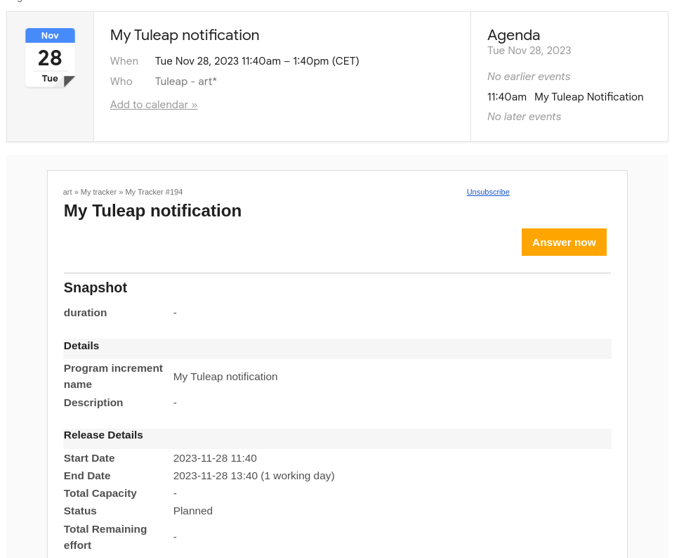

E-mail Notification
-------------------

The Tuleap Tracker is equipped with a powerful and flexible
e-mail notification system. Unless otherwise instructed by the project
administrators or the users themselves, the e-mail notification system
follows simple default rules. Whenever an artifact is created or updated
- whether with an additional follow-up comment or a change in any of the
artifact fields - an e-mail message is sent to:

-  The artifact submitter (the person who initially submitted the
   artifact)

-  The artifact assignee (the person to whom the artifact is currently
   assigned if the option "Send notifications to selected people" of the
   field which refers to the assignee has been checked by the tracker
   admin)

-  All users who posted at least one follow-up comment to the artifact.

The e-mail message generated by the Tuleap Tracker first
shows the most recent changes that occurred on the artifact in case of
an update. It is then followed by a complete snapshot of the artifact.
Web pointers are also included in the message to quickly and easily
access the artifact form on Tuleap.

.. figure:: ../../../images/screenshots/tracker/sc_emailnotification.png
   :align: center
   :alt: Notification by email
   :name: Notification by email

   Notification by email

Calendar Notifications
----------------------

Caldendar notifications can be linked to artifacts, activation of this option must be done in `Tracker > Adminstration > Notification` settings

   Tracker: Calendar notification