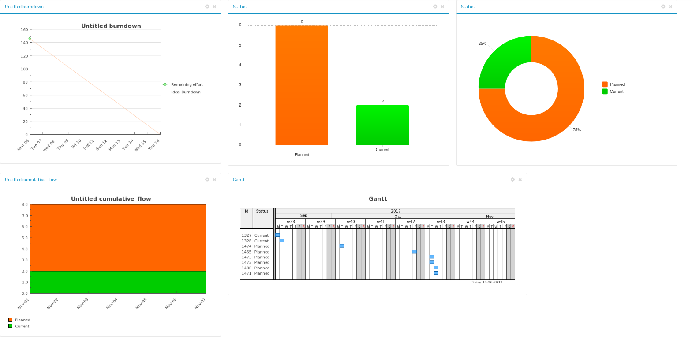

.. _search-artifacts:

Search for existing artifacts
~~~~~~~~~~~~~~~~~~~~~~~~~~~~~

Tuleap offers the ability to browse the artifact database
according to a variable set of criteria.

.. figure:: ../../../images/screenshots/tracker/sc_trackerbrowsing.png
   :align: center
   :alt: A Tracker browsing screen
   :name: A Tracker browsing screen

Selection Criteria
``````````````````

The upper part of the artifact browsing screen is devoted to the
selection criteria. `A Tracker browsing screen`_ shows the default set of selection criteria that
is available when a new tracker is created. You can select bugs by
Category (the module in which the bug occurred), Group (nature of the
bug like Crash, Documentation Typo, ...), Status (e.g. Open, Closed,
...) and Assignee (the person in charge of the bug). But you may also
add or remove criteria by using the "Toggle criteria" link.(for more
details, see `Tracker Report Management`_)

How selection criteria are filled out depend on their field type. The
Tracker Service currently has several types of fields used as search
criteria:

Select Box Field and Multiple Select Box Field
``````````````````````````````````````````````

A select box field can take its value in a set of predefined values. By
default, only one value can be selected at a time. If you want to select
multiple values at once, use the Advanced Search facility by clicking on
the + icon. A multi select box appears and allows the user to select
multiple values for the same field.

There might be 2 specific values in the list of choices: "Any" matches
any value in the list and "None" matches the items where no value has
been assigned yet.

Text Field
``````````

A Text field can contain any kind of text. There are two ways to query a
text field:

-  *Keyword search*: you can type a series of space separated keywords
   that will ALL be searched for in the text field (including as
   substring in words)

-  *Regular expression*: You can also specify a `MySQL Extended Regular
   Expression <https://dev.mysql.com/doc/refman/8.4/en/regexp.html>`_ as
   a matching criteria (mind the surrounding /.../ !)

   Examples:

   -  /^[Aa]ddition/ : matches any text field starting with either
      "addition"or "Addition"

   -  /foo\|bar\|dim/ : matches text fields containing the string "foo",
      "bar" or "dim"

Date Field
``````````

A date criteria follows the following pattern: YYYY-MM-DD where YYYY is
the year number, MM is the month number and DD is the day number.

Examples: 2015-03-21 is March 21st, 2015, 2017-12-05 is Dec 5th, 2017.

You can search an exact date (using = in the operator select box), all
dates before a certain date (using <) or all dates after (using >).

By cliking the + icon, you can use the advance search and search for
dates between two specific dates.

Integer Field
`````````````

An integer field can take positive or (possibly) negative values and has
no decimal part.

`Examples: 0, 1, +2, -100…`

There are several ways to query an integer field. Here are the values
you can specify in a integer query field:

-  *Single Integer*: if you type a single integer the field will be
   matched against this value (e.g. 610)

-  *Inequality*: if you use >, <, >= or =< followed by an integer the
   search will look for integer values which are greater, lesser,
   greater or equal, lesser or equal to the integer value (e.g. > 120 ,
   < -30)

-  *Range*: if you use the "integer1-integer2" notation the search
   engine will look for all values greater or equal to integer1 and
   lesser or equal to integer2 (e.g. 800 - 900 for integers between 800
   and 900, -45 - 12 for integers between -45 and +12)

-  *Regular expression*: `MySQL Extended Regular
   Expression <https://dev.mysql.com/doc/refman/8.4/en/regexp.html>`_ can
   also be used as a matching criteria (e.g. /^4.\*8$/ will look for all
   integer values starting with a "4", ending with an "8" with any
   number of digits in between.

Floating Point Number Field
```````````````````````````

A floating point number field can take positive or (possibly) negative
values, may have a decimal part or use the exponential notation for
large values.. .

`Examples: 0, 1.23, -2.456, 122.45E+12…`

There are several ways to query an floating point number field. Here are
the values you can specify in such a field:

-  *Single Number*: if you type a single number the field will be
   matched against this value (e.g. 2.35)

-  *Inequality*: if you use >, <, >= or =< followed by a number the
   search will look for all values which are greater, lesser, greater or
   equal, lesser or equal to the integer value (e.g. > 120.3 , <
   -3.3456E-2)

-  *Range*: if you use the "number1-number2" notation the search engine
   will look for all values greater or equal to integer1 and lesser or
   equal to integer2 (e.g. -1.2 - 4.5 for numbers greater than or equal
   to -1.2 and lesser than or equal to 4.5)

-  *Regular expression*: `MySQL Extended Regular
   Expression <https://dev.mysql.com/doc/refman/8.4/en/regexp.html>`_ can
   also be used as a matching criteria (e.g. /^4.\*8$/ will look for all
   values starting with a "4", ending with an "8" with any number of
   characters in between including the decimal point.

Comment Criterion
``````````````````

Starting Tuleap 9.18, it's possible to filter artifatcs by follow-up comments.
A new search option called ``comment`` is now always displayed.
It allows users to search artifacts that have at least one comment that contains the provided content.

.. attention::

 When searching in comments, you should be aware of some limitations:
  * Searches are done for words longer than 3 characters
  * Some words are not taken in account because they are too common (like ``the``, ``a``, ``please`` …)

Tracker Search Results
----------------------

Based on your selection of search criteria, Tuleap runs a
query against the tracker database, selects the matching artifacts, and
displays them right below the selection criteria. Columns displayed in
the artifact list are entirely configurable by the user. (see `Tracker Report Management`_).

Results are listed by chunks of N artifacts where N is user-definable.
If more than N artifacts are retrieved from the tracker database you are
invited to click on the navigation bar to display the next or previous
chunk of artifacts.

To access a given artifact from the list of results, simply click on the icon or on the id.

Artifact List Sorting
~~~~~~~~~~~~~~~~~~~~~

By default, artifacts are sorted by the chronological order of the
submission on the Tuleap.

The list of artifacts can be sorted by any of the columns displayed on
the screen by clicking on the column heading. Clicking twice on the same
heading toggles the sort order between ascending to descending. The
currently displayed sorting direction is shown by a small up or down
arrow next to the sort criteria right above the artifact list.

For more sophisticated sorting you can also use the multi-column sort.
In this mode sort criteria accumulates as you click on column headings.
So you can for instance click "Severity" first and "Assigned To" second
to see who in the team is assigned critical bugs and how many.At any
point in the multi-column sort process, a click on one of the sort
criteria displayed in the list (criteria 1 > criteria 2 > criteria 3...)
will bring you backward in the sort criteria list. Using this feature
you can easily test various sorting strategies.

Export Tracker Search Results
~~~~~~~~~~~~~~~~~~~~~~~~~~~~~

In the report "options" menu, "Export all report columns" and "Export
all columns" links allow to export all artifacts of your search result
into CSV format. Using this facility you can easily select the tracker
artifacts that you want to process with other tools outside
Tuleap.

CSV File Parsing
````````````````

The CSV format that is accepted as import input is accessible over the
CSV file submission screen. This page allows manual validation of the
tracker field names (shortname), indicating which fields are mandatory
in case of a new artifact submission. In addition, it gives you a sample
CSV file. As for the export feature, you can specify the separator used
in the CSV file you want to import as well as the date format (See :ref:`account-maintenance`).
If you already use the Tracker Artifact Export (see :ref:`project-data-export`) you will notice
that the format of the files to import and the exported files are
exactly the same. This means that if you changed your CSV separator for
exporting data, you must use the same to import those data. You can
refer to the export format especially for the date formats. The first
record in the CSV import file is always the header row containing all
the tracker field names that will be used in the following artifact records.

Depending on whether you want to import new artifacts or update the ones
that already exist in the tracker you need to provide different
information. Nevertheless, you can mix in one CSV file the submission of
new artifacts and the update of existing ones.

For the artifact creation you need to provide information on all fields
that are specified as mandatory in the CSV import format except the
Artifact ID which must not be specified. You may omit the submitter and
submission date. The artifact submitter is then automatically set to the
user importing the CSV file and the submission date will be the date of
the import.

For the artifact update you need to provide the artifact identifier of
the artifacts to update in the special column 'aid'. Beside this, you
only need to provide the fields you want to update. All fields not
specified in the CSV file will remain unchanged.

The parsing method checks several potential errors in the CSV file:

-  Omission of mandatory fields when submitting new artifacts

-  Not the same number of columns in the header row and an artifact row

-  Unknown tracker field name

-  Field values that do not correspond to the predefined field values of
   a (multi) select box field

-  Unknown artifact identifier

-  Wrong date value

All other potential errors have to be checked manually by looking at the
parse report table.

DOCX and XLSX export
````````````````````

In addition to csv it's also possible to export to docx and xlsx formats. See the :ref:`dedicated section <plugin_document_generation>`.

Graphical visualization
```````````````````````

You can also view graphical results of your search by adding a Charts
tab. There are four types of graphs supported : Pie, Bar and Gantt
charts, but also Burndown charts used in Scrum methodology. Like the
list of artifact (table renderer), the graphical view respond to the
selection criteria. For more details, see `Charts renderer`_.

Tracker Report Management
`````````````````````````

Tracker reports allow the definition of a specific layout of the
artifact search and browsing screen where one can choose the selection
criteria and the renderers, which present the search result.
Tuleap is proposing two kinds of renderers : "Table" and
"Charts". The "Table" renderer presents the list of matching artifacts
using columns. The "Charts" renderer gives a graphical visualization of
the results. The "Cardwall" renderer is an easy-to-understand view of
the results. Users may enjoy the ability to choose from several
graphical tracker renderers available in the renderer tabs section.
Depending on the project, they may also enjoy the ability to choose from
several tracker reports by using the upper pull-down menu of the
artifact browsing screen. If no project or user specific tracker report
has been defined, the Tuleap 'Default' report is the only
one available.

Any Tuleap user with access to the tracker can define his
own personal report, choosing his own search criteria and adding
renderers (tables, charts, cardwall). In this case the report is a
personal one and is only visible to this particular user. On the
contrary, tracker administrators have the ability to define project-wide
graphical reports that all users will be able to use.

Tracker Report Setting
~~~~~~~~~~~~~~~~~~~~~~

The current report is defined at the top left of the report page.
If several reports are available, a select box will allow to change
the current report.

For each report, if you are granted enough to do it, you can either
save, save as, change the visibility from public to private, set the
current as the default tracker report or delete it.

Be careful! When you are a tracker admin, updating a public report will
update the report for every other tracker user. Keep this in mind before
saving your modifications.

Renderer management
```````````````````

Adding a renderer
~~~~~~~~~~~~~~~~~

You can add as many renderers you want in any tracker report. Renderers
are ordered in tabs. Adding a renderer is easy: click on "Save" or "Save as".
Select the kind of
renderer you want to add (either table, charts or cardwall), give the
renderer a name and a description, and select the submit button.

.. NOTE::

    Save button for renderer is displayed only when you have changed your current report.

Table renderer
~~~~~~~~~~~~~~

Table renderer is displayed artifacts matching your search in a table.
Columns of the table are tracker fields and rows of the table are the
artifacts.

You can select the fields of the renderer (using the Toggle columns
link), reorder the fields using drag and drop, sort artifact list by
fields (by clicking on the field name in the table header), browse
artifact list selecting the number of displayed artifacts at once

It is possible to add aggregates functions on table renderer on specific
fields. For int, float, select box and multi select box fields, an icon
is displayed under each column.

Simply click on it to add one or several aggregate functions. Aggregates
functions available are:

-  **Count** (only for int, float, select box and multi select box
   fields)

-  **Count Group By** (only for int, float, select box and multi select
   box fields)

-  **Average** (only for int and float fields)

-  **Maximum** (only for int and float fields)

-  **Minimum** (only for int and float fields)

-  **Std Deviation** (only for int and float fields)

-  **Sum** (only for int and float fields)

You can easily add, remove and move columns you want to display on your
table as well was adding agregate functions at the bottom.

Charts renderer
~~~~~~~~~~~~~~~

Charts renderer allows to add charts in your report. Tuleap
provides four kind of graphs: pie, bar, gantt and burndown charts.

You can add as many graphs as you want in a charts renderer. To add a
graph, click "+ Add a chart" and select the type of chart you want in the drop down.

Available chart:
-  **Pie chart**

-  **Bar chart**

-  **Gantt chart**

-  **Burndown chart**

-  **Cardwall chart**



   A renderer with some charts

.. warning::

    If you're dealing with big projects and your dates spread
    on several years, don't display your Gantt chart by day. The chart
    will be too large. Please change the time scale to week, month or
    year.

Updating/removing a renderer
~~~~~~~~~~~~~~~~~~~~~~~~~~~~

Depending on your permissions, you will be able to update a renderer, by
clicking the down arrow next to the renderer name.

Available actions are title and description update, or renderer
deletion.

.. NOTE::

    Every renderer (either table or charts) can be displayed in your
    dashboard. To do it, select the link "add to my dashboard" or "add
    to project dashboard".
