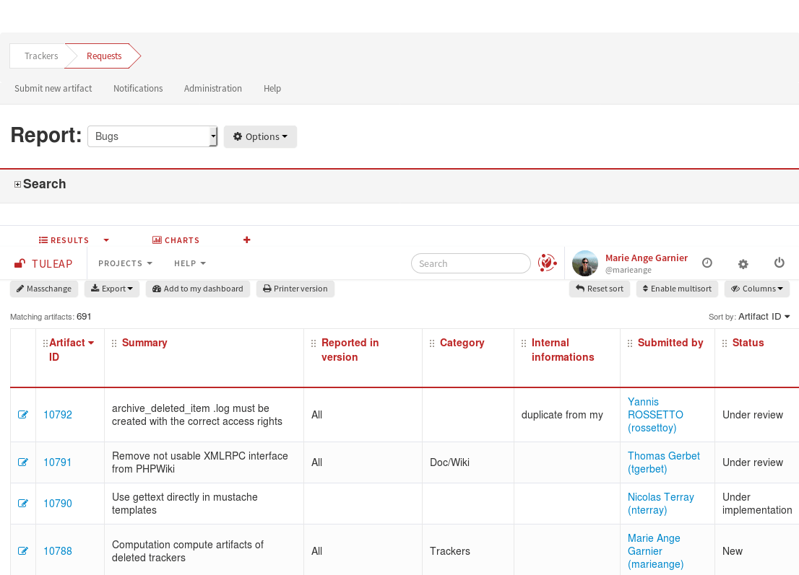
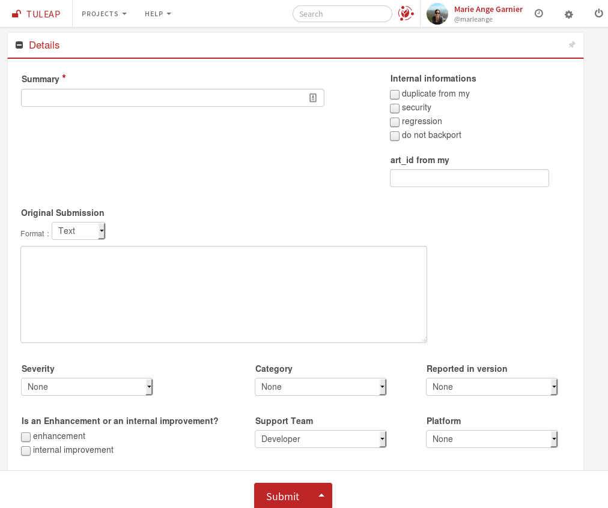

.. _artifact_submit:

Submit an artifact
~~~~~~~~~~~~~~~~~~

To submit a new artifact to a given project you must first access the
appropriate tracker of that project as indicated in the section above
(see :ref:`entering-service`).

When entering a given tracker you are presented with the artifact
selection and browsing screen (more about this facility in (see :ref:`search-artifacts`). For now
let's click on the "Submit new artifact" item (or whatever the artifact
name is) from the Tracker Menu Bar in the upper part of the welcome
screen (see `A Tracker browsing screen`_).

   A sample artifact submission screen (the artifact is of type "bug" here)

`A sample artifact submission screen`_ shows a sample submission screen from one of the Tuleap
public request tracker. Because of the Tuleap Tracker high level of
customizability no two submission screens look alike. Depending on the
project more or less fields may appear on the tracker submission form
and the name of artifact managed by the tracker may change as well.

When submitting a new artifact, make the Summary and the detailed
description as explicit as possible. Do not use a clueless summary like:
"Service X doesn't work" or "Blocking problem in Y". Explain
the exact nature of the artifact by giving an explicit Summary and
Description to the person in charge. A unique ID is automatically
assigned to the submitted artifact.

The values proposed by a field could depend upon other field value. If
javascript is activated in your browser, fields will be filtered
dynamically. Otherwise, Tuleap will ensure that the values
you submit are correct.

As explained above, artifact submission forms vary from one project to
another depending on the fields used by the tracker. The submission form
can also vary according to the permission level.
Depending whether you are a project member or an ordinary registered user the artifact fields
displayed on the screen may differ. As an example, on `A sample artifact submission screen`_, the bug
submitter using the form is probably a project member because giving
access to the "Assigned to" field to an ordinary registered user doesn't
make much sense.
It is very unlikely that users external to the project
team know enough about the project organization to correctly assign the
bug. That's the reason why artifact fields shown to users on the
submission form can be configured in the Tracker Administration module.

In any case don't forget to click on the "Submit" button when you are
finished !

.. NOTE::

    About to sumit a bug or a support request? Before you do that,
    make sure that others haven't yet submitted a similar artifact.
