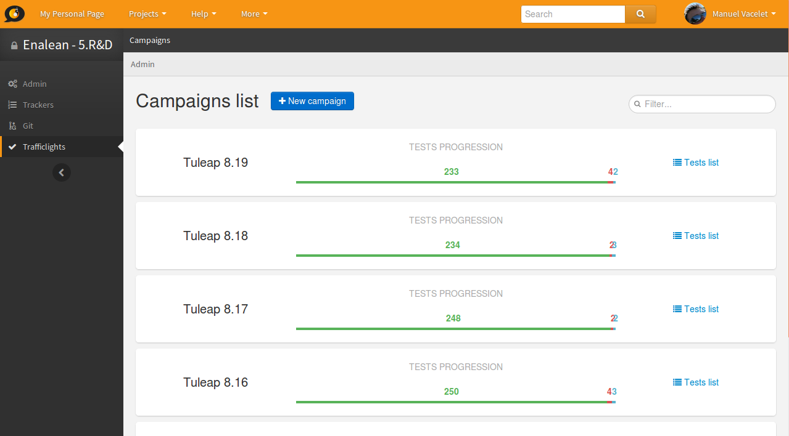
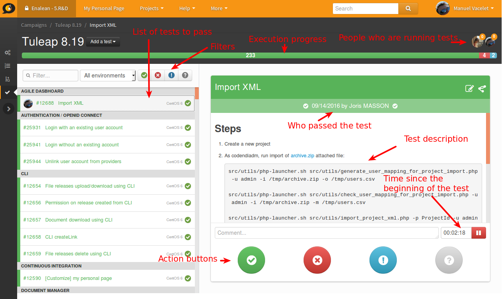
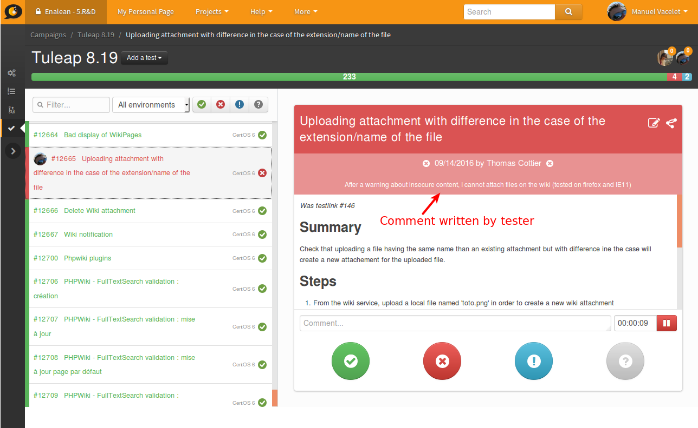
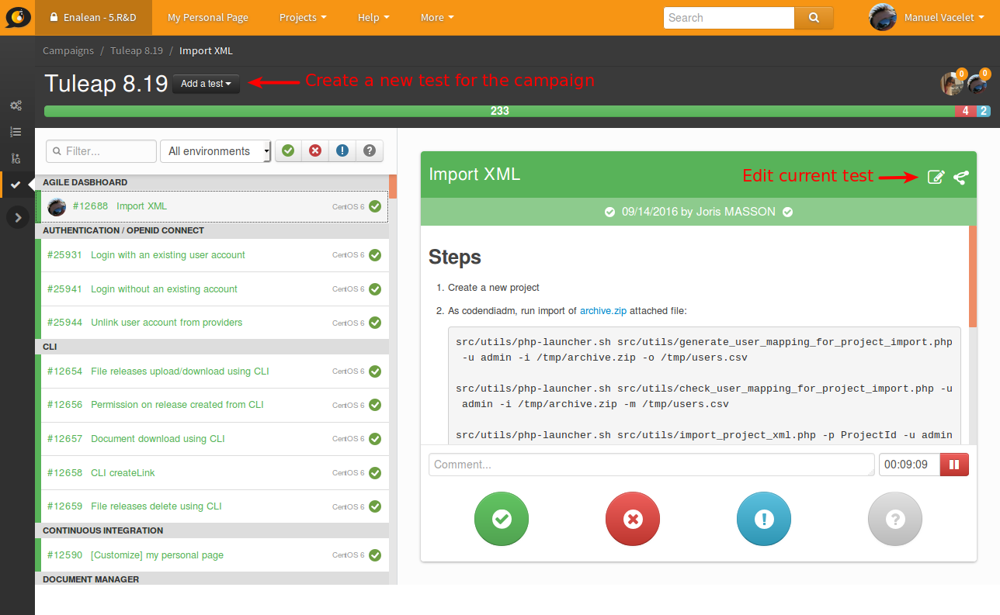
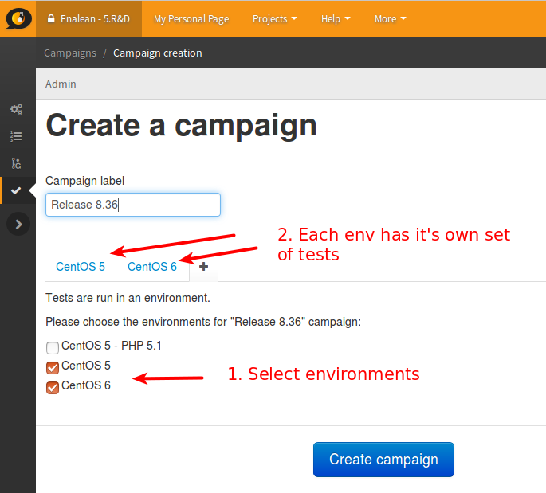
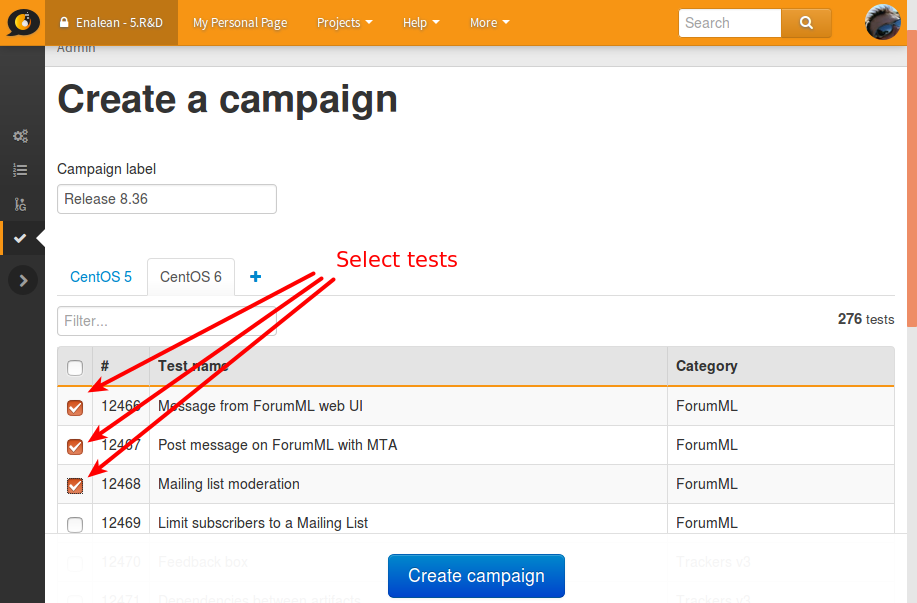

.. _testmgmt-trafficlights:

Test management with TrafficLights
==================================

.. attention::

  This module is part of :ref:`Tuleap Entreprise <tuleap-enterprise>`. It might
  not be available on your installation of Tuleap.

TrafficLights is the test management solution integrated into Tuleap. It's an
in-house development that aims to provide an simple and easy way to deal with
Test campaigns.

TrafficLights features:

* Create and maintain test case definition
* Create test campaigns as a collection of test cases
* Follow test execution (Not run, passed, failed, blocked)
* Realtime update for concurrent test execution by team

Overview
--------

There are main concepts in TrafficLights

* Test Case: it's the description of something to test. The definition is meant to be re-used
* Test Campaign: a collection of Test Case to run.
* Test Execution: it's the execution of one Test Case in the context of a Test Campaign
* Environment: a given Test Excecution can be ran in different contextes (Same test but different setup)

Test Case, Test Campaign and Test Execution are 3 different trackers. Environment is a property of "Test execution".

.. note::

    TrafficLights is stable and used since 1.5 year at Enalean for all Tuleap
    releases without any issues. However some parts are not nicely integrated
    inside TrafficLights any you might need to go into trackers to configure
    things.

Run a Test Campaign
-------------------

The welcome screen of TrafficLights lists all active Test Campaigns with a quick
overview of the overall progress and the ability to access the test list.

By hitting "Test list" you will see the list of tests proposed in the given campaign.

In the following figure, the user selected a test that "Passed".

Tests can have following states:

* Not run, this is the default
* Passed, the test was successful
* Failed, the test lead to an error
* Blocked, the test cannot be run

One can switch from one state to another (a test can be "Not run" then "Passed", re-switched to "Not run" because tester didn't get what was described to finish by "Faild").

Tuleap will record the time taken for each test. It works this way:

* It starts as soon as you load the test definition.
* It ends when you hit one of the action buttons.

Time is not yet used in the interface, it's only recorded for a futur usage. You
can see the value and make your own computation from the "Test Execution" tracker.

Example of test failure:

Modify or create tests
~~~~~~~~~~~~~~~~~~~~~~

You can create tests directly inside the "Test Case" tracker, it means that you
benefit of all tracker power for artifact creation:

* Create one after another
* Import from CSV
* Import via REST
* Import via XML

You can also directly create tests in campaigns, this is convenient if you don't
already have a base of tests or if you want to create test.

You can also edit the test directly from the interface.

The test you create or you edit are automatically updated in the test campaign
and will be re-usable in a following campaign.

Create a Test Campaign
----------------------

From the home page of the service, there is "New campaign" button that will open
the Campaign creation screen.

You need to give a name to your campaign and select which environment you want to
test. You need to select at least one environment and this will make a new tab
appear. When you click on the tab, you get the list of tests and select them.

A given Test Case can be selected for several environments. Once you have selected
all the Test Cases you want to run for a campaign, you can click on "Create campaign".

.. attention::

    As of today the campaing creation is a bit rustic, you need to select all the
    tests in all environments before hiting "Create campaign".

    Once the campaign is created it's possible to add test that were forgotten but
    it's a bit teadious. You will need to create artifacts by hand in trackers
    and link them properly.
