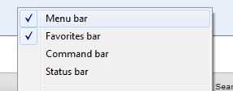
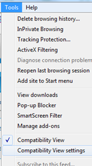
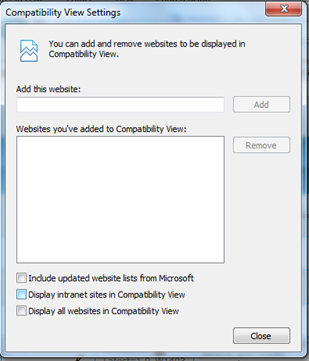
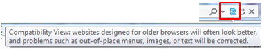

===============
Troubleshooting
===============

.. _user_supported_browsers:

Which browser should I use to browse Tuleap?
============================================

Tuleap is compatible with the following browsers:

* Internet Explorer ≥11
* Firefox
* Chrome

IE browser < 11 is deprecated and while most of Tuleap still work on it, latest
development don't. Please upgrade your browser or use an alternative.

IE browser should not be in compatibility mode. Tuleap will offer a bad user
experience if you are using the compatibility mode. Here are the steps to
configure Internet Explorer:

Configuring Internet Explorer
-----------------------------

.. NOTE:: instructions below are based on IE9. Please adapt them to your environment.

Why do I need to change my Internet Explorer configuration?
~~~~~~~~~~~~~~~~~~~~~~~~~~~~~~~~~~~~~~~~~~~~~~~~~~~~~~~~~~~

By default, the so-called "Compatibility view" is activated on
Internet Explorer (IE) for some intranet sites. If you are facing some
graphical issues with Tuleap, for example:

#. The "Browse" button is not well displayed in Trackers.
#. Artifact link: The buttons "Select artefact to link" and "Create a
   new artefact" are not well displayed in Trackers.
#. The multi select search is no more available in Trackers.
#. Text areas are too small.

The problem is that Tuleap is built more and more on "recent" technology and
this default IE setting prevents it to work properly.

We recommend you to disable the compatibility mode in your IE browser
as detailed in the following section, it should solve most of your
layout issues.

How can I change my Internet Explorer configuration?
~~~~~~~~~~~~~~~~~~~~~~~~~~~~~~~~~~~~~~~~~~~~~~~~~~~~

This is actually very simple.

#. Make sure you have the "Menu bar" (or "Command bar") activated: right
   click on the top of the Internet Explorer window and check "Menu
   bar":
   |image0|
#. Open the "Tools > Compatibility View Settings" menu of Internet
   Explorer:
   |image1|
#. Unselect the checkbox "Display intranet sites in Compatibility View":
   |image2|
   **NOTE:** if this checkbox is already unchecked, this means that you
   have to click the `toggle icon <#toggleCompat>`__ as described below
   in order to switch the "Compatibility view" off.

But what if I need to browse an "old web technology" intranet site?
~~~~~~~~~~~~~~~~~~~~~~~~~~~~~~~~~~~~~~~~~~~~~~~~~~~~~~~~~~~~~~~~~~~

Once you have changed this default setting, Internet Explorer displays
in the URL bar a new toggle icon which allows you to switch the
"Compatibility view" on & off:
|image3|

If you encounter an issue with "old" web applications using Internet
Explorer, try this toggle icon to check if it solves the problem...

