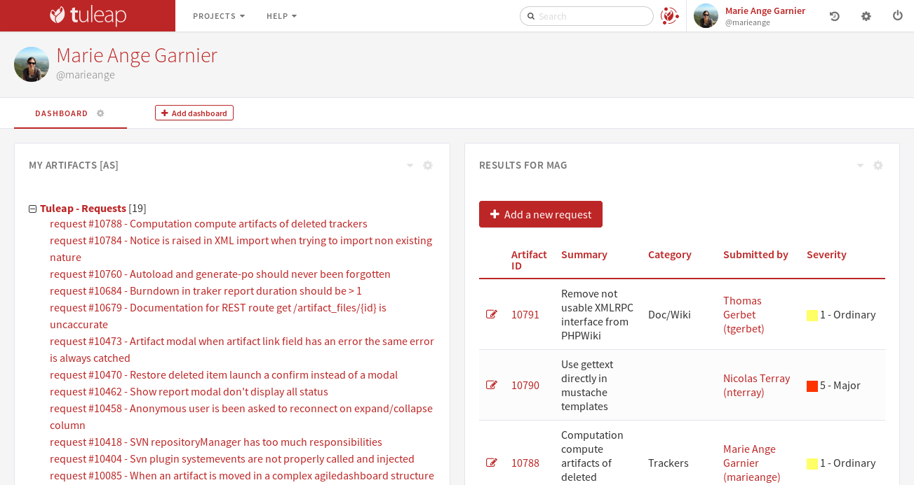

.. _my-personal-dashboard:

User Dashboard
==============

A sample user dashboard is available below. The page is split in several areas:

-  The header with your user name and avatar
-  A navigation bar to access to each dashboard. This is where you can add a new dashboard, and edit or delete a dashboard.
   You can also add widgets to the current dashboard.
-  The various information presented by widgets.

Tuleap allows you to personalize your dashboards. Your dashboard is personal, nobody except you can access it.
The content of the page is made of *widgets*. All widgets can be moved, collapsed or removed.
Some of them can provide an rss feed or be edited.

Widgets
-------

New widgets can be added through the dropdown entry “Add widget”. Here is an example of available widgets for the user dashboard:

-  **My Artifacts** lists artifacts you have submitted or assigned to
   you, by project.

-  **My Projects** lists the projects you belong to. Selecting any of
   these projects brings you to the corresponding Project Dashboard.

-  **Monitored File Packages** lists packages that you are currently
   monitoring, by project. To cancel any of the monitored items just
   click on the trash icon next to the item label.

-  **RSS Reader** allows you to include public rss (or atom) feeds into
   your personal page.

Some widgets have documentation to explain how to configure and use them:

- :ref:`Hudson/Jenkins <continuous-integration-with-Hudson/Jenkins>` permits to display many widgets for Continuous Integration.
- :ref:`Kanban <kanban>` add a Kanban in your personal dashboard.
- :ref:`Project Milestones <project-milestones>` displays a :ref:`Scrum Backlog <backlog>` in personal dashboard.
- :ref:`Timetracking <timetracking>` allows you to visualize your saved times with TimeTracking plugin.
- :ref:`Cross-Tracker Search <xts>` lets you query on artifacts through the entire platform.

.. toctree::
   :hidden:

   ../my-personal-dashboard/project-milestones
