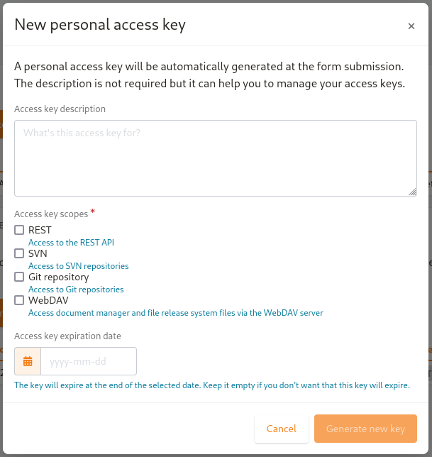

.. _account-maintenance:

Preferences
-----------

You provided a certain amount of demographic information to
Tuleap when you first registered on the Tuleap
site. This and other information can be modified at any time by
clicking on the "cog" image near your user name.

Most of the items on the "Preferences" page will look obvious to
you. However, we would like to draw your attention on some of them:

Keys & Tokens
`````````````

SSH keys
~~~~~~~~

This one has to do with the Git service. When you want to
clone a git repository you can either do it with you regular login/password
and ``https://...`` address or you might want to use the ssh protocol because
it makes things generally faster and easier. To use the ssh protocol, you will
have to upload your public ssh key and wait ~1 to 2 minutes for the key to
be deployed.

To generate a public key, run the program ``ssh-keygen`` on your machine.
Then look at the file ``~/.ssh/id_rsa.pub`` where the generated public key has been stored.
Read the ssh documentation for further information on sharing keys.


.. _access-keys:

Access Keys
~~~~~~~~~~~

Access Keys are a convenient way to deal with automated access for scripts or integrations. They can be used as an
authentication mean without having to leak your username and password. It's very important to understand that access keys
are not more secure (or less secure) than a username/password. Access Keys are "just" easier to revoke than passwords
when got leaked. They also are easier to rotate than passwords as part of a sane management of secrets.



You can generate as much access keys as you need. It's recommended to generate one per app/script/integration you want
to do (again, easier to revoke). You should give the access key a purpose otherwise you won't remember which key was generated
for what usage and you won't know the ones you can revoke and the ones you must keep.

Access Keys also have a scope:

  - REST API: The access key can be used to make any REST call to Tuleap API. Look at :ref:`rest-auth` to learn how to use it.
  - SVN: The access key can be used to do SVN operations (``checkout`` & ``commit``, according to your permissions).
  - Git: The access key can be used to do git operations over https (``clone`` & ``push``, according to your permissions).
    When doing git with an access key, you will have to use https basic authentication mode with your username.
  - WebDAV: The access key can be used to access document manager or file release system files via the WebDAV server.
    When accessing the WebDAV server with an access key, you will have to provide your username.

A scope restricts what you can do with an access key. An access key with 'git' scope won't be usable for REST API calls
for instance. As a matter of fact, it means that, at most, an access key can be used only to do git & rest operations.
It's not possible to login on the web interface with an access key for instance.

When you know that the access key should be used for a limited amount of time, you should be setting an expiration date
so Tuleap will clean keys for you.

Edition & CSV
`````````````

Tuleap provides you export and import
features (See :ref:`project-data-export` for details). The import/export format is CSV
format. Like CSV norm is not implemented by the same way in each
software, we allow you to change the CSV flavors, in order to fit
with your preferred software! The available separators are:

CSV separator
~~~~~~~~~~~~~

The available separators are:

   -  ``comma`` (,): the default separator.
   -  ``semicolon`` (;): used by default by the french version of Excel.
   -  ``tab`` (tab).

CSV date format
~~~~~~~~~~~~~~~

The available formats are:

   -  ``month/day/year``: the default format (generally used in United
      States).
   -  ``day/month/year``: used by default by the french version of Excel.

   This format will be used to generate the exported artifacts, and will
   also be used when importing. Then, don't forget to check your dates
   value before importing. They should be the same format as defined in
   your preferences.

Appearance and language
```````````````````````

.. _available-languages:

Languages
~~~~~~~~~

The following languages are currently supported with always up-to-date translations:

* English
* French

The following languages are also available but are contributed by the Tuleap community (translations might be inaccurate and incomplete):

* Brazilian Portugueze


Relative dates display
~~~~~~~~~~~~~~~~~~~~~~

In Tuleap, the dates can be displayed in several ways. You want to quickly know how much time has passed since the last update of your document?
No problem! Tuleap will display the relative date next to it. You don't really care? Let's only display the absolute date.
You prefer to read the relative date first? Here you go!


To configure it, go to your account preferences. In the appearance and language tab, you have the choice between four options:

- ``Relative date first``: highlight the relative date, the absolute date is displayed smaller
- ``Absolute date first``: highlight the absolute date, the relative date is displayed smaller
- ``Relative date only``: display only the relative date, the absolute date is displayed in a tooltip when hovered
- ``Absolute date only``: display only the absolute date, the relative date is displayed in a tooltip when hovered
