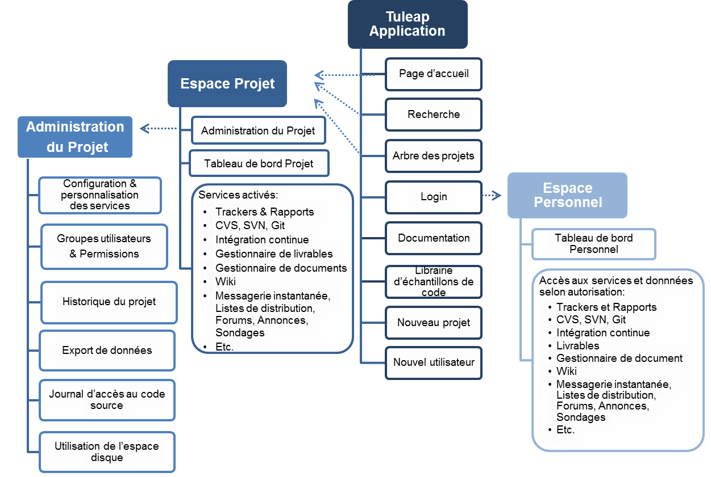

.. |SYSPRODUCTNAME| replace:: Tuleap

Vue d'ensemble de |SYSPRODUCTNAME|
====================================

Page d'accueil |SYSPRODUCTNAME|
-------------------------------

La Page d'accueil de Tuleap est la page générale d'accueil de la forge.
Elle permet aux nouveaux utilisateurs de se créer un compte, de
rejoindre un projet ou d'en crééer un nouveau. Elle permet également de
suivre l'activité sur la forge et les actualités des projets. Vous
pouvez personnaliser certains espaces tel que le logo par exemple.

.. figure:: ../images/screenshots/sc_homepage.png
   :align: center
   :alt: La page d'accueil de |SYSPRODUCTNAME|
   :name: La page d'accueil de |SYSPRODUCTNAME|

   La page d'accueil de |SYSPRODUCTNAME|

Menu principal
--------------

Le menu principal de |SYSPRODUCTNAME| est présent sur l'ensemble des
pages du site. Son contenu peut varier selon les pages visitées et
suivant les droits qui vous sont octroyés. En d'autres termes il dépend
du contexte. En voici deux exemples :

-  Si vous visitez le site en tant qu'utilisateur anonyme, la partie
   supérieure du menu vous invite à vous connecter au système ou bien à
   créer un compte si vous n'en avez pas. Si vous êtes connecté,
   d'autres entrées deviendront visibles dans le menu comme Se
   déconnecter, Mon compte, Ma page personnelle, etc…

-  De la même façon, si vous décidez de visiter un projet particulier,
   le menu situé en haut de la page vous présentera l'ensemble des
   services disponibles.

Dans le reste de cette section nous allons uniquement couvrir les
entrées du menu qui sont permanentes et indépendantes du contexte. Les
autres entrées liées aux projets seront décrites plus tard dans ce
document.



   Vue d'ensemble du site |SYSPRODUCTNAME|

Arbre des projets
``````````````````

L'arbre des projets est un important service de |SYSPRODUCTNAME| que
vous pouvez (ou devez !) utiliser pour déterminer si certains logiciels
développés sur le site peuvent présenter un intérêt pour vos propres
activités. L'arbre des projets est l'une des deux façons de chercher des
informations dans la base de projets existants. L'autre façon s'appuie
sur la fonction Recherche par mots-clés.

.. figure:: ../images/screenshots/sc_softwaremap.png
   :align: center
   :alt: Exemple de navigation dans l'arbre des projets
   :name: Exemple de navigation dans l'arbre des projets

   Exemple de navigation dans l'arbre des projets

Quand un projet est créé il est classé suivant 7 critères :

-  **Statut de développement** : le niveau de maturité du projet (alpha,
   bêta, stable,...)

-  **Environnement** : dans quel environnement tourne le logiciel (Web,
   Win32, X Window, mode texte,...)

-  **Audience** : La population d'utilisateurs visée (développeurs,
   utilisateurs finaux, administrateurs système,…)

-  **Licence** : la licence de distribution du logiciel. Dans la plupart
   des cas il s'agira de la licence d'échange de |SYSPRODUCTNAME| de
   SYS\_ORG\_NAME

-  **Système d'exploitation** : Le ou les systèmes d'exploitation sur
   lesquels le logiciel s'exécute

-  **Langages de programmation** : les langages de programmation
   utilisés dans le développement de ce projet.

-  **Domaine** : Le domaine d'application de votre projet qui varie
   suivant le domaine d'activité de l'entreprise.

Chaque critère peut recevoir jusqu'à trois valeurs pour un projet donné
(comme, par exemple, trois langages de programmation). Les valeurs sont
choisies parmi une liste prédéfinie par les administrateurs du site. Le
critère "Domaine" (ou "Topic" en anglais) reflète le domaine dont traite
votre projet et se présente sous la forme d'une hiérarchie de domaines
et de sous-domaines que l'équipe d'administration de |SYSPRODUCTNAME|
affine au fur et à mesure de l'enregistrement des projets.

En utilisant l'arbre des projets il est possible de visualiser les
projets répondants à certains critères. Les projets sont présentés avec
leurs nom, description, date de création, taux d'activité et d'autres
informations utiles. Les valeurs des sept critères du projet sont
affichées à la suite de la description. Notez qu'à côté de chaque valeur
d'un critère figure un lien hypertexte appelé [Filtre]. Cliquer sur l'un
de ces liens a pour effet de n'afficher que les projets qui
correspondent à cette valeur du critère. Les projets de type "modèles"
et les projets de test (voir :ref:`type-de-project`) ne sont pas listés dans l'arbre des
projets.

Un exemple d'affichage de l'arbre des projets est montré `Exemple de navigation dans l'arbre des projets`_. Dans cet
exemple, l'utilisatrice a d'abord ouvert le dossier Langages de
Programmation puis elle a sélectionné le langage C. Ceci a probablement
amené un grand nombre de projets et elle a donc appliqué deux filtres
supplémentaires : le premier spécifie que le Statut de développement
doit être Stable et le second impose que le logiciel fonctionne avec le
système d'exploitation SunOS/Solaris.

En appliquant ces multiples critères de sélection, l'utilisatrice réduit
le nombre de projets potentiellement intéressants à neuf et elle peut
donc les examiner un par un (seul le premier projet est montré sur `Exemple de navigation dans l'arbre des projets`_). 
Les filtres ont une autre propriété intéressante : ils sont
persistants. Cela signifie que si vous décidez d'explorer l'arbre des
projets en partant d'un autre angle (par exemple en ouvrant le dossier
Domaine en premier), les filtres sélectionnés continuent à s'appliquer.
Pour relâcher les contraintes imposées par les filtres il suffit de
cliquer sur le lien [Supprimer ce filtre] situé à côté du critère.

    **Tip**

    Si vous effectuez souvent le même parcours dans l'arbre des projets,
    vous pouvez enregistrer l'étape finale de ce parcours dans votre
    Page personnelle. Pour se faire, effectuez vos manipulations sur
    l'arbre comme expliqué ci-dessus puis cliquez sur le lien "Cette
    page en signet" dans le menu principal |SYSPRODUCTNAME|. Une
    nouvelle entrée apparaîtra alors dans votre page personnelle que
    vous pouvez éditez afin de lui donner une description plus parlante.

La boîte à outils
``````````````````

Un projet hébergé sur |SYSPRODUCTNAME| a la possibilité d'utiliser de
nombreux outils et services. Toutefois tous les logiciels ne nécessitent
pas un environnement aussi riche. Pour partager ou sauvegarder un court
échantillon de code comme une macro, une fonction, un script shell un
outil simple paraît plus adapté. C'est précisément le rôle de la boîte à
outils.

La boîte à outils est accessible depuis le menu principal de
|SYSPRODUCTNAME| sur la partie gauche ou la partie supérieure de
l'écran (voir `La page d'accueil de |SYSPRODUCTNAME|`_)

Navigation dans les échantillons
~~~~~~~~~~~~~~~~~~~~~~~~~~~~~~~~

La page d'accueil de la boîte à outils classifie les échantillons par
catégorie et par langages de programmation. Le nombre en regard du label
d'une catégorie indique le nombre d'échantillons présents dans la
catégorie.

Vous pouvez parcourir la collection d'échantillons de deux façons :

-  Parcourir les catégories ou la classification par langage de
   programmation

-  Utiliser la boîte de recherche par mots-clés située en bas à gauche
   ou en haut à droite de l'écran. La recherche s'effectue dans le titre
   et la description des échantillons.

Les échantillons correspondants sont affichés avec leur identifiant
unique (ID), leur titre, leur description ainsi que le nom de l'auteur.
Veuillez noter qu'en cliquant sur le nom de l'auteur, vous pouvez
immédiatement lui envoyer une suggestion ou une question par email.

.. figure:: ../images/screenshots/sc_codesnippetsearch.png
   :align: center
   :alt: Liste des échantillons de code dans la catégorie 'HTML Manipulation'
   :name: Liste des échantillons de code dans la catégorie 'HTML Manipulation'

   Liste des échantillons de code dans la catégorie 'HTML Manipulation'

Créer un échantillon
~~~~~~~~~~~~~~~~~~~~

Pour soumettre un nouvel échantillon, cliquez sur le bouton "Créer un
nouvel échantillon" dans le menu de la boîte à outils situé en haut de
la page. Remplissez les champs titre et description (tout pointeur Web -
ou URL - tapé dans le champ description sera automatiquement transformé
en hyperlien par |SYSPRODUCTNAME|), le type de l'échantillon, sa
catégorie et son langage de programmation. Si une catégorie ou un
langage de programmation venait à manquer, veuillez contacter l'équipe
|SYSPRODUCTNAME|.

Il est vivement recommandé de fournir également un numéro de version. Il
s'agit d'un champ de texte libre qui peut prendre n'importe quelle
valeur. Utiliser un nom ou un numéro de version est utile si vous pensez
soumettre de nouvelles versions ultérieurement. Nous vous recommandons
également de porter ce même numéro de version dans le code source de
l'échantillon pour que les utilisateurs puissent déterminer s'ils
disposent de la version la plus récente lors d'une prochaine visite à la
boîte à outils.

L'échantillon de code lui-même peut être soumis soit par la biais d'une
opération copier-coller dans la zone de texte prévue à cet effet ou en
téléchargeant un fichier. Dans la mesure du possible, il est préférable
d'utiliser la zone de texte car le code sera alors immédiatement visible
sur la page Web lors de la consultation de la boîte à outils par
d'autres utilisateurs.

Il existe cependant des cas où le téléchargement est obligatoire,
notamment pour les fichiers dont le format n'est pas directement lisible
pour un utilisateur. Un exemple typique est le cas où l'échantillon est
composé de plusieurs fichiers regroupés dans une archive tar ou zip. Il
peut aussi s'agir de fichiers propriétaires ou binaires émanant
d'applications spécialisées (par exemple le logiciel de simulation
LabView). Dans tous les cas, ne *jamais* poster de fichier binaire ou
byte-code pur résultant d'une compilation C, C++, Java,... car la boîte
à outils est avant tout faite pour partager et réutiliser des
échantillons de code utiles à tous.

Mettre un échantillon à jour
~~~~~~~~~~~~~~~~~~~~~~~~~~~~

Pour mettre à jour un échantillon avec une nouvelle version du code,
sélectionnez l'échantillon soit en parcourant les catégories soit en
effectuant une recherche par mots-clés. Cliquez sur l´échantillon
approprié, puis sur le lien "Soumettre un nouvelle version" en bas de
page. Fournissez une description des modifications, un nouveau numéro de
version et copier-coller ou télécharger le nouvel échantillon de code
correspondant.

    **Note**

    Veuillez noter que bien qu'il s'agisse du même échantillon,
    |SYSPRODUCTNAME| assigne un nouvel indentifiant à chaque nouvelle
    version. Ainsi pour référencer la nouvelle version d'un échantillon
    dans un paquet d'échantillons (voir la section concernant le
    regroupement d'échantillons plus loin) vous devrez supprimer
    l'ancienne version et insérer la nouvelle).

Détruire un échantillon
~~~~~~~~~~~~~~~~~~~~~~~

Procéder comme indiqué précédemment pour la sélection de l'échantillon.
Après avoir sélectionné l'échantillon voulu, utilisez l'icône en forme
de corbeille (|image4|) pour supprimer une ou plusieurs versions de
l'échantillon

Regrouper des échantillons
~~~~~~~~~~~~~~~~~~~~~~~~~~

Si vous avez soumis des échantillons qui ont un rapport entre eux il
peut être intéressant de les regrouper au sein d'un paquet
d'échantillons.

Pour créer un paquet d'échantillons, cliquez sur "Créer un paquet" dans
le menu situé en haut de la page. Fournissez un titre, une description,
un type, une catégorie et un numéro de version pour ce paquet. Après
avoir soumis le formulaire, une nouvelle fenêtre apparaît vous demandant
d'indiquer les identifiants uniques (ID) des échantillons à placer dans
le paquet. Veillez à avoir cette liste d'identifiants à portée de main
lors de la création d'un paquet.

Veuillez noter qu'il existe un indentifiant d'échantillon ainsi qu'un
identifiant de version d'échantillon. Si vous téléchargez une nouvelle
version d'un échantillon, l'identifiant de l'échantillon ne change pas,
contrairement à l'identifiant de la version de l'échantillon. Ainsi
lorsque vous créez des paquets d'échantillons, assurez-vous d'utiliser
l'identifiant de la nouvelle version.

Mettre à jour un paquet d'échantillons
~~~~~~~~~~~~~~~~~~~~~~~~~~~~~~~~~~~~~~

Comme un échantillon, un paquet peut être mis à jour. Pour se faire,
procédez comme pour un échantillon, Il faut tout d'abord le rechercher
dans la boîte à outils, le sélectionner et enfin, cliquer sur l'icône
d'édition. A partir de là vous pouvez ajouter ou supprimer des
échantillons. Si vous voulez mettre à jour le paquet en y intégrant une
nouvelle version d'un échantillon, détruisez d'abord l'ancienne version
puis ajoutez la nouvelle en utilisant son identifiant de version (ID)
propre (voir `Mettre un échantillon à jour`_).

Aide
`````

Index de l'aide
~~~~~~~~~~~~~~~

|SYSPRODUCTNAME| est livré avec un guide de l'utilisateur très complet
décrivant l'ensemble des outils et services. Un clic sur le lien "Index
de l'aide" dirige l'utilisateur vers la table des matières du guide de
l'utilisateur de |SYSPRODUCTNAME|. Ce même guide est utilisé sur
l'ensemble du site |SYSPRODUCTNAME| par les liens "Aide" apparaissant
dans quasiment tous les menus. Une version PDF de l'intégralité du guide
de l'utilisateur est disponible dans la section "Documentation Site".

Documentation Site
~~~~~~~~~~~~~~~~~~

Le lien "Documentation Site" est le point d'entrée vers l'ensemble de la
documentation relative à l'ensemble du site |SYSPRODUCTNAME|. Son
contenu est variable mais il comporte en général le guide utilisateur,
des présentations et d'autres documents importants maintenus par
l'équipe |SYSPRODUCTNAME|. Lisez-les attentivement.

Canaux développeurs
~~~~~~~~~~~~~~~~~~~

L'un des objectifs prioritaires du site |SYSPRODUCTNAME| est de
devenir le forum d'échange des développeurs logiciels quelle que soit
l'organisation à laquelle ils appartiennent.

C'est pour cette raison que |SYSPRODUCTNAME| propose une série de
listes de distribution (appelée Canaux Développeurs) auxquelles toute
personne, y compris un utilisateur non enregistré de |SYSPRODUCTNAME|,
peut souscrire. Chaque canal est dédié à un sujet particulier. La
création de nouveaux canaux est sous la responsabilité des
administrateurs du site |SYSPRODUCTNAME|.

Les Canaux Développeurs de |SYSPRODUCTNAME| présentent un certain
nombre de caractéristiques intéressantes :

-  Les opérations d'abonnement et le désabonnement au canal peuvent être
   effectués par l'utilisateur lui-même à travers l'interface Web de
   |SYSPRODUCTNAME|.

-  Tous les messages adressés au canal sont archivés et sont donc
   consultables à tout moment. (Dans le futur, il sera aussi possible
   d'effectuer des recherches par mots-clés).

-  Les abonnés peuvent demander à recevoir une version condensée des
   échanges plutôt que chaque message individuellement.

Forums de discussion |SYSPRODUCTNAME|
~~~~~~~~~~~~~~~~~~~~~~~~~~~~~~~~~~~~~~~

Les forums de discussion |SYSPRODUCTNAME| proposent une alternative au
Canaux Développeurs. Il s'agit de forums d'échange dont l'objectif est
d'améliorer la communication entre les utilisateurs de
|SYSPRODUCTNAME| et l'équipe en charge de l'administration du site. On
y trouve des forums où il est possible de demander de l'aide, d'envoyer
des suggestions, des demandes de nouvelles fonctionnalités ou de
nouvelles catégories pour l'arbre des projets par exemple, etc…

Ces forums sont entièrement basés web ce qui implique d'utiliser
l'interface web de |SYSPRODUCTNAME| pour lire ou poster un message.
Toutefois l'utilisateur a la possibilité de placer un forum sous
surveillance afin de recevoir par email tous les échanges qui ont lieu
sur le forum.

Contactez-nous
~~~~~~~~~~~~~~

En plus des forums de discussion, vous pouvez toujours utiliser le lien
"Contactez-nous" pour contacter l'équipe |SYSPRODUCTNAME|.

N'hésitez pas à faire usage de ce lien dès que vous en ressentez le
besoin. Nous sommes là pour vous aider.

La fonction de recherche
`````````````````````````

|SYSPRODUCTNAME| vous permet d'effectuer une recherche par mots-clés
sur quasiment toutes les informations disponibles sur le site. Lorsque
vous vous trouvez sur la page d'accueil de |SYSPRODUCTNAME| vous
pouvez rechercher des informations dans les ressources suivantes :

-  **Les projets logiciels** : les mots-clés sont recherchés dans le nom
   et les descriptions courte et longue des projets. Ce mécanisme de
   recherche est très complémentaire avec l'arbre des projets (voir `Arbre des projets`_).

-  **Boîte à outils** : vous pouvez effectuer une recherche par
   mots-clés dans les échantillons de code disponibles dans la boîte à
   outils de |SYSPRODUCTNAME| (voir `La boîte à outils`_). La recherche porte sur le nom
   et la description. Vous pouvez ainsi trouver facilement des
   échantillons de code qui répondent à vos besoins.

-  **Utilisateurs** : dans ce cas la recherche s'effectue dans la liste
   des utilisateurs du site sur la base de leur nom d'utilisateur, leur
   nom complet ou leur adresse email.

-  **Wiki**: Le Wiki est un outil collaboratif de rédaction (voir :ref:`wiki`).
   Vous pouvez effectuer une recherche en texte intégral dans les wikis.

-  **Cet outil de suivi** : si vous utilisez un outil de suivi de
   |SYSPRODUCTNAME|, l'entrée "Cet outil de suivi" apparaît dans la
   boîte de recherche, permettant ainsi d'effectuer une recherche par
   mots-clés dans les artefacts de cet outil de suivi.

Activité de la forge
---------------------

La page d'accueil donne une vue d'ensemble de l'activité de la forge à
travers plusieurs indicateurs :

-  **Statistiques Tuleap** : indique le nombre total de
   projets hébergés sur |SYSPRODUCTNAME| (à part ceux qui ont le
   statut privé ainsi que les projets modèles et les projets de test),
   le nombre d'utilisateurs enregistrés, le nombre total de
   téléchargements et le nombre de pages visitées depuis l'ouverture du
   site.

-  **Dernières annonces**: se sont les dernières actualités des projets
   hébergés sur la forge. Les membres de projets ont souhaité partager
   avec vous leur travail et vous tenir informé. N'hésitez pas à faire
   pareil!

-  **Dernières Versions** : donne une liste des versions de logiciels
   les plus récentes postées sur le site par les différents projets. Si
   vous souhaitez connaître les dernières versions disponibles vous
   pouvez visiter la page d'accueil régulièrement. |SYSPRODUCTNAME|
   vous offre aussi le moyen de surveiller l'apparition de nouvelles
   versions pour un projet donné. Pour ce faire vous devez vous rendre
   sur la page de Sommaire du Projet (ou page d'accueil) et sélectionner
   ensuite l'icône de surveillance (|image5|) placé à proximité du nom
   du paquet logiciel qui vous intéresse. Une fois le paquet sous
   surveillance, un email vous sera automatiquement envoyé dès que
   l'équipe de projet publie une nouvelle version.

-  **Derniers Projets** : les 10 derniers projets enregistrés. En
   affichant cette liste de façon régulière vous pouvez être tenu
   informé de la création de tout nouveau projet |SYSPRODUCTNAME|.

Nous vous recommandons vivement de visiter la page d'accueil de
|SYSPRODUCTNAME| de façon régulière. Ce faisant vous aurez un
excellent aperçu de ce qui se passe en matière de développement logiciel
chez SYS\_ORG\_NAME.

*En un mot comme en cent* : Faites de |SYSPRODUCTNAME| la page par
défaut de votre navigateur :-)

.. |image4| image:: ../images/icons/trash.png
.. |image5| image:: ../images/icons/mail16d.png
